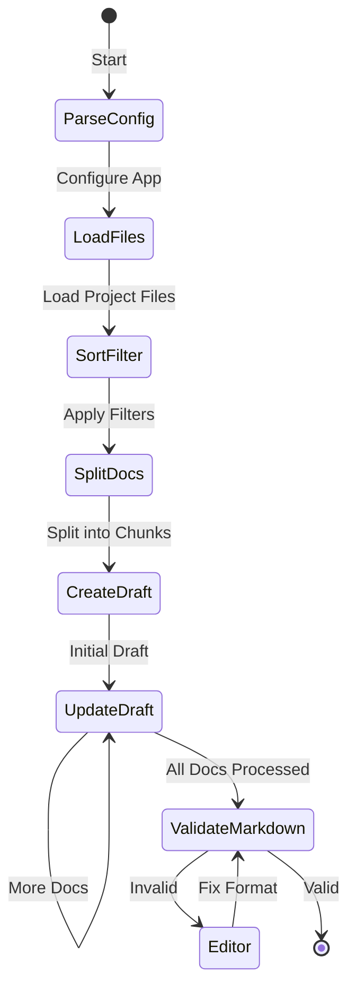

<div align="center">

# AI Create Project Security Design

[](https://github.com/xvnpw/ai-create-project-sec-design/actions/workflows/ci.yaml)
[](https://github.com/xvnpw/ai-create-project-sec-design/releases)
[](https://opensource.org/licenses/MIT)


🤖 **AI Create Project Security Design** is a powerful tool that leverages AI to automatically generate comprehensive security design documentation for your projects.

</div>

## Overview

AI Create Project Security Design is a Python-based tool that analyzes your project's codebase and generates detailed security documentation. It supports multiple project types and uses advanced language models to create insightful security design documents.

## Architecture

To help you understand how the application works, we've included application flow diagram.

### Application Flow



## Features

- 🔍 Intelligent code analysis
- 📝 Automated documentation generation
- 🔐 Security-focused design insights
- 🔄 Support for multiple project types (Python, Go, Generic)
- 🤖 Multiple LLM provider support
- 📊 Mermaid diagram validation
- 🎯 Customizable file filtering

## Prerequisites

- **Python 3.11**
- **Node.js**: Required for validating Mermaid diagrams in Markdown.
- **Poetry**: For managing Python dependencies.

## Installation

### From source

```bash
$ git clone git@github.com:xvnpw/ai-create-project-sec-design.git
$ cd ai-create-project-sec-design
$ ./build.sh # will install python and node dependencies
$ poetry run ai-create-project-sec-design/app.py
```

### Using Docker

#### In PowerShell (Windows):

```powershell
docker run -v c:\path\to\your\project:/target `
           -e OPENAI_API_KEY=$Env:OPENAI_API_KEY `
           ghcr.io/xvnpw/ai-create-project-sec-design:v1 `
           -v -t /target -o /target/security_design.md
```

#### In Bash (Linux/macOS):

```bash
docker run -v ~/path/to/your/project:/target \
           -e OPENAI_API_KEY=$OPENAI_API_KEY \
           ghcr.io/xvnpw/ai-create-project-sec-design:v1 \
           -v -t /target -o /target/security_design.md
```

## Configuration

The application accepts various command-line arguments to tailor its behavior.

### General Options

- `-h`, `--help`: Show help message and exit.
- `-v`, `--verbose`: Enable verbose logging.
- `-d`, `--debug`: Enable debug logging.

### Input/Output Options

- `-t`, `--target-dir`: **Required**. Target directory containing the repository.
- `-p`, `--project-type`: Type of project (`python`, `generic`, `go`). Default is `python`.
- `-o`, `--output-file`: Output file for the security design document. Default is `stdout`.
- `--exclude`: Comma-separated list of patterns to exclude from analysis (e.g., `LICENSE,**/tests/**`).
- `--exclude-mode`: How to handle the exclude patterns (`add` to add to default excludes, `override` to replace). Default is `add`.
- `--include`: Comma-separated list of patterns to include in the analysis.
- `--include-mode`: How to handle the include patterns (`add` to add to default includes, `override` to replace). Default is `add`.
- `--filter-keywords`: Comma-separated list of keywords. Only files containing these keywords will be analyzed.
- `--dry-run`: Perform a dry run. Prints configuration and list of files to analyze without making API calls.

### Agent Configuration

- `--agent-provider`: LLM provider for the agent (`openai`, `openrouter`, `anthropic`). Default is `openai`.
- `--agent-model`: Model name for the agent. Default is `gpt-4o`.
- `--agent-temperature`: Sampling temperature for the agent model. Default is `0`.
- `--agent-preamble-enabled`: Enable preamble in the output.
- `--agent-preamble`: Preamble text added to the beginning of the output.

### Editor Configuration

- `--editor-provider`: LLM provider for the editor (`openai`, `openrouter`, `anthropic`). Default is `openai`.
- `--editor-model`: Model name for the editor. Default is `gpt-4o`.
- `--editor-temperature`: Sampling temperature for the editor model. Default is `0`.
- `--editor-max-turns-count`: Maximum number of attempts the editor will try to fix markdown issues. Default is `3`.
- `--node-path`: Path to the Node.js binary. Attempts to auto-detect if not provided.

## Environment Variables

Set one of the following environment variables based on your chosen LLM provider:

- `OPENAI_API_KEY`
- `OPENROUTER_API_KEY`
- `ANTHROPIC_API_KEY`

## Usage Examples

### Basic Usage

Generate a security design document for a Python project:

```bash
poetry run python ai_create_project_sec_design/app.py \
    -t /path/to/your/project \
    -o security_design.md
```

### Exclude Specific Files or Directories

Exclude the `tests` directory and `LICENSE` file:

```bash
poetry run python ai_create_project_sec_design/app.py \
    -t /path/to/your/project \
    -o security_design.md \
    --exclude "LICENSE,**/tests/**"
```

### Use a Different LLM Provider and Model

Use Anthropic's Claude model:

```bash
poetry run python ai_create_project_sec_design/app.py \
    -t /path/to/your/project \
    -o security_design.md \
    --agent-provider anthropic \
    --agent-model claude-3-5-sonnet-20240620
```

### Dry Run Mode

See which files would be analyzed without making API calls:

```bash
poetry run python ai_create_project_sec_design/app.py \
    -t /path/to/your/project \
    --dry-run
```

## Troubleshooting

### Common Issues

#### Chunk Size Longer Than Specified

```
langchain_text_splitters.base - WARNING - Created a chunk of size 78862, which is longer than the specified 70000
```

This warning indicates that some document chunks exceed the context window size of the LLM. To resolve this, make sure `--files-chunk-size` is lower than `--files-context-window`.

Example:

```bash
poetry run python ai_create_project_sec_design/app.py \
    -t /path/to/your/project \
    --files-chunk-size 50000 \
    --files-context-window 70000
```

## Supported LLM Providers

- [OpenAI](https://platform.openai.com/) - Industry standard.
- [OpenRouter](https://openrouter.ai/) - Multi-model gateway.
- [Anthropic](https://www.anthropic.com/) - Claude models.

## Contributing

Contributions are welcome! Please open issues and pull requests. Ensure that you follow the existing code style and include tests for new features.

## License

This project is licensed under the [MIT License](LICENSE).
