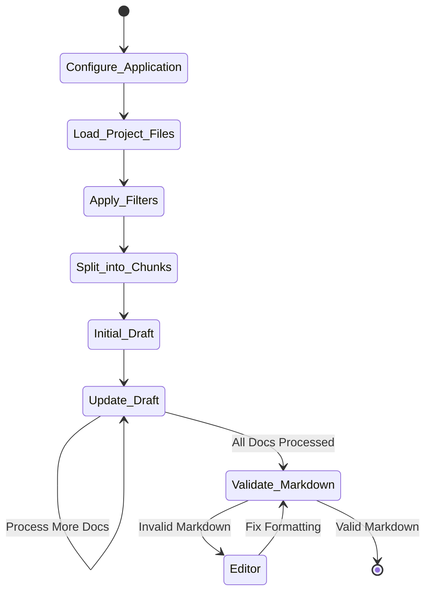
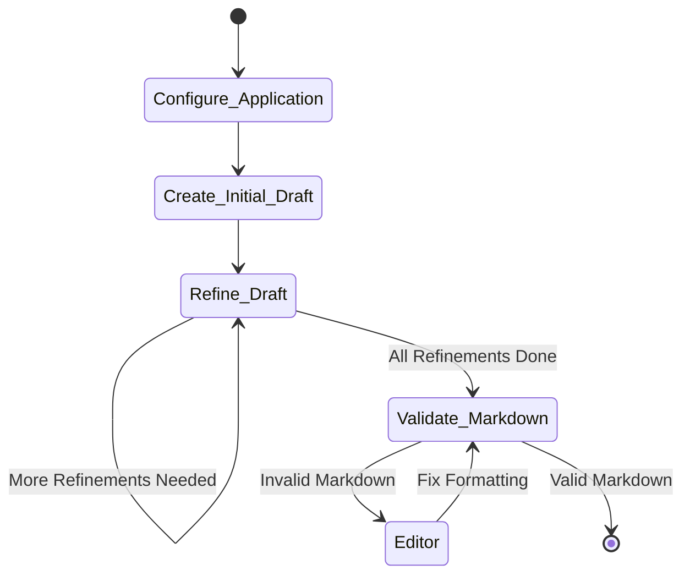

<div align="center">

  # AI Security Analyzer


  <a href="https://github.com/xvnpw/ai-security-analyzer">
    
  </a>

  [](https://github.com/xvnpw/ai-security-analyzer/actions/workflows/ci.yaml)
  [](https://github.com/xvnpw/ai-security-analyzer/releases)
  [](https://opensource.org/licenses/MIT)

   🤖 **AI Security Analyzer** is a powerful tool that leverages AI to automatically generate comprehensive security documentation for your projects, including security design and threat modeling.

  **🎥 Demo:**

  

</div>

## Overview

**AI Security Analyzer** is a Python-based tool that analyzes your project's codebase and automatically generates detailed security documentation. It supports multiple analysis types including security design documentation, threat modeling, attack surface analysis, threat scenarios, and attack tree. The tool supports multiple project types and utilizes advanced language models (LLMs) to create insightful security documentation tailored to your project's specific needs.

## Features

- 🔍 **Intelligent Code Analysis**: Automatically analyzes your project's codebase for security considerations.
- 📝 **Automated Documentation Generation**: Generates comprehensive security design, threat modeling, attack surface analysis, threat scenarios, and attack tree documents.
- 🔐 **Security-Focused Insights**: Provides detailed insights into potential security risks and design patterns.
- 🔄 **Multi-Project Support**: Supports Python, Go, Java, Android, and JavaScript project types.
- 🤖 **Multiple LLM Provider Support**: Compatible with OpenAI, OpenRouter, and Anthropic models.
- 📊 **Mermaid Diagram Validation**: Validates Mermaid diagrams in Markdown files.
- 🎛️ **Customizable File Filtering**: Allows inclusion/exclusion of files and directories based on patterns.
- 🌐 **Cross-Platform Compatibility**: Runs on Windows, macOS, and Linux.

## Prerequisites

- **Python 3.11**
- **Node.js**: Required for validating Mermaid diagrams in Markdown.
- **Poetry**: For managing Python dependencies.

## Installation

### From Source

Clone the repository and install dependencies using the provided script:

```bash
git clone git@github.com:xvnpw/ai-security-analyzer.git
cd ai-security-analyzer
./build.sh  # Installs Python and Node.js dependencies
poetry run python ai_security_analyzer/app.py --help
```

### Using Docker

You can run the application using Docker without installing Python or Node.js locally.

#### In PowerShell (Windows):

```powershell
docker run -v C:\path\to\your\project:/target `
           -e OPENAI_API_KEY=$Env:OPENAI_API_KEY `
           ghcr.io/xvnpw/ai-security-analyzer:latest `
           dir -v -t /target -o /target/security_design.md
```

#### In Bash (Linux/macOS):

```bash
docker run -v ~/path/to/your/project:/target \
           -e OPENAI_API_KEY=$OPENAI_API_KEY \
           ghcr.io/xvnpw/ai-security-analyzer:latest \
           dir -v -t /target -o /target/security_design.md
```

## Token Usage and Cost Management ⚠️

### Understanding Token Consumption

In `dir` mode this application may consume a significant number of tokens due to its workflow:
- Each file is processed and sent to LLM
- Multiple rounds of analysis for comprehensive documentation
- Additional tokens for markdown validation and fixes
- Large codebases can lead to substantial token usage

### Cost Control Best Practices 💰

1. **Always Start with Dry Run**
```bash
poetry run python ai_security_analyzer/app.py \
    dir \
    -t /path/to/your/project \
    --dry-run
```
This will show you:
- Total number of tokens to be processed
- List of files that will be analyzed
- No actual API calls will be made

2. **Optimize File Selection**
   - Use `--exclude` to skip non-essential files:
     ```bash
     --exclude "**/tests/**,**/docs/**,LICENSE,*.md"
     ```
   - Focus on security-relevant files with `--filter-keywords`:
     ```bash
     --filter-keywords "security,auth,crypto,password,secret,token"
     ```

### Recommendations

1. For `dir` mode start with `--dry-run` to assess token usage
2. Use file filtering options to reduce scope
3. Consider running on smaller, security-critical portions first
4. Test on smaller codebases before analyzing large projects
5. Keep track of your API usage limits and costs

## Architecture

To help you understand how the application works, we've included an application flow diagrams.

### Application Flow for `dir` mode



The application follows these high-level steps:

1. **Configure Application**: Parses command-line arguments and sets up the configuration.
2. **Load Project Files**: Loads files from the specified target directory, applying include/exclude rules.
3. **Apply Filters**: Sorts and filters documents based on specified keywords and patterns.
4. **Split into Chunks**: Splits documents into smaller chunks that fit within the LLM's context window.
5. **Create Initial Draft**: Uses the LLM to generate an initial security document based on the first batch of documents.
6. **Process More Docs**: Iteratively updates the draft by processing additional document batches.
7. **Validate Markdown**: Checks the generated markdown for syntax and Mermaid diagram correctness.
8. **Fix Formatting**: If validation fails, uses the editor LLM to fix markdown formatting issues.
9. **Completion**: Finalizes the security documentation.

### Application Flow for `github` mode



The application follows these high-level steps:

1. **Configure Application**: Parses command-line arguments and sets up the configuration.
2. **Create Initial Draft**: Uses the LLM to generate an initial security document based on the GitHub repository URL.
3. **Refine Draft**: Iteratively refines the draft to improve its quality (number of iterations configurable via `--refinement-count`).
4. **Validate Markdown**: Checks the generated markdown for syntax and Mermaid diagram correctness.
5. **Fix Formatting**: If validation fails, uses the editor LLM to fix markdown formatting issues.
6. **Completion**: Finalizes the security documentation.

## Configuration

The application accepts various command-line arguments to tailor its behavior.

### General Options

- `mode`: **Required**. Operation mode (`dir`, `github`, `file`):
  - `dir`: Analyze a local directory (will send all files from directory to LLM)
  - `github`: Analyze a GitHub repository (will use model knowledge base to generate documentation)
  - `file`: Analyze a single file
- `-h`, `--help`: Show help message and exit.
- `-v`, `--verbose`: Enable verbose logging.
- `-d`, `--debug`: Enable debug logging.

### Input/Output Options

- `-t`, `--target`: **Required**. Target based on mode:
  - For `dir` mode: Directory path to analyze
  - For `github` mode: GitHub repository URL (must start with 'https://github.com/')
  - For `file` mode: File path to analyze
- `-p`, `--project-type`: Type of project (`python`, `generic`, `go`, `java`, `android`, `javascript`). Default is `python`.
- `-o`, `--output-file`: Output file for the security documentation. Default is `stdout`.
- `--exclude`: Comma-separated list of patterns to exclude from analysis using python [glob patterns](https://docs.python.org/3/library/glob.html) (e.g., `LICENSE,**/tests/**`).
- `--exclude-mode`: How to handle the exclude patterns (`add` to add to default excludes, `override` to replace). Default is `add`.
- `--include`: Comma-separated list of patterns to include in the analysis using python [glob patterns](https://docs.python.org/3/library/glob.html) (e.g., `**/*.java`).
- `--include-mode`: How to handle the include patterns (`add` to add to default includes, `override` to replace). Default is `add`.
- `--filter-keywords`: Comma-separated list of keywords. Only files containing these keywords will be analyzed.
- `--dry-run`: Perform a dry run. Prints configuration and list of files to analyze without making API calls.

### Agent Configuration

- `--agent-provider`: LLM provider for the agent (`openai`, `openrouter`, `anthropic`). Default is `openai`.
- `--agent-model`: Model name for the agent. Default is `gpt-4o`.
- `--agent-temperature`: Sampling temperature for the agent model (between `0` and `1`). Default is `0`.
- `--agent-preamble-enabled`: Enable preamble in the output.
- `--agent-preamble`: Preamble text added to the beginning of the output.
- `--agent-prompt-type`: Prompt to use in agent (default: `sec-design`). Options are:
  - `sec-design`: Generate a security design document for the project.
  - `threat-modeling`: Perform threat modeling for the project.
  - `attack-surface`: Perform attack surface analysis for the project.
  - `threat-scenarios`: Perform threat scenarios analysis for the project using [Daniel Miessler's](https://danielmiessler.com/) [prompt](https://github.com/danielmiessler/fabric/blob/f5f50cc4c94a539ee56bc533e9b1194eb9aa424d/patterns/create_threat_scenarios/system.md).
  - `attack-tree`: Perform attack tree analysis for the project.
- `--files-context-window`: Maximum token size for LLM context window. Automatically determined if not set.
- `--files-chunk-size`: Chunk size in tokens for splitting files. Automatically determined if not set.

### Editor Configuration

- `--editor-provider`: LLM provider for the editor (`openai`, `openrouter`, `anthropic`). Default is `openai`.
- `--editor-model`: Model name for the editor. Default is `gpt-4o`.
- `--editor-temperature`: Sampling temperature for the editor model. Default is `0`.
- `--editor-max-turns-count`: Maximum number of attempts the editor will try to fix markdown issues. Default is `3`.
- `--node-path`: Path to the Node.js binary. Attempts to auto-detect if not provided.

## Environment Variables

Set one of the following environment variables based on your chosen LLM provider:

- `OPENAI_API_KEY`
- `OPENROUTER_API_KEY`
- `ANTHROPIC_API_KEY`

## Usage Examples

### Basic Usage

Generate a security design document for a Python project:

```bash
poetry run python ai_security_analyzer/app.py \
    dir \
    -t /path/to/your/project \
    -o security_design.md
```

### Excluding Specific Files or Directories

Exclude the `tests` directory and `LICENSE` file:

```bash
poetry run python ai_security_analyzer/app.py \
    dir \
    -t /path/to/your/project \
    -o security_design.md \
    --exclude "LICENSE,**/tests/**"
```

### Using a Different LLM Provider and Model

Use Anthropic's Claude model:

```bash
poetry run python ai_security_analyzer/app.py \
    dir \
    -t /path/to/your/project \
    -o security_design.md \
    --agent-provider anthropic \
    --agent-model claude-3-5-sonnet-20240620 \
    --editor-provider anthropic \
    --editor-model claude-3-5-sonnet-20240620
```

### Generate Threat Model

```bash
poetry run python ai_security_analyzer/app.py \
    dir \
    -t /path/to/your/project \
    -o threat_model.md \
    --agent-prompt-type threat-modeling
```

### Dry Run Mode

See which files would be analyzed without making API calls:

```bash
poetry run python ai_security_analyzer/app.py \
    dir \
    -t /path/to/your/project \
    --dry-run
```

**Sample Output:**

```
=========== dry-run ===========
All documents token count: 123456
List of chunked files to analyze:
src/main.py
src/utils.py
README.md
...
```

## Real World Examples

Check [examples](https://github.com/xvnpw/ai-security-analyzer/blob/main/examples/README.md) for real world examples, e.g. flask framework, requests library, etc.

## Supported Project Types

- Python
- Go
- Java
- Android
- JavaScript
- More to come...

In case you want to use a project type that is not supported, please use the `generic` project type with `--include`, `--include-mode`, `--exclude`, `--exclude-mode` options.

**Example:**

```bash
poetry run python ai_security_analyzer/app.py \
    dir \
    -t /path/to/your/project \
    -o security_design.md \
    --project-type generic \
    --include "**/*.java"
```

## Troubleshooting

### Common Issues

#### Chunk Size Longer Than Specified

You may encounter a warning like:

```
langchain_text_splitters.base - WARNING - Created a chunk of size 78862, which is longer than the specified 70000
```

This warning indicates that some document chunks exceed the LLM's context window size. To resolve this, ensure that `--files-chunk-size` is lower than `--files-context-window`.

**Example:**

```bash
poetry run python ai_security_analyzer/app.py \
    dir \
    -t /path/to/your/project \
    --files-chunk-size 50000 \
    --files-context-window 70000
```

#### Node.js Not Found

If you receive an error indicating that Node.js is not found:

```
FileNotFoundError: Node.js binary not found. Please install Node.js.
```

Ensure that Node.js is installed and added to your system's PATH, or provide the path using the `--node-path` option.

#### OpenAI API Key Not Set

If you get an error about `OPENAI_API_KEY`:

```
Error: OPENAI_API_KEY not set in environment variables.
```

Make sure you've set the `OPENAI_API_KEY` environment variable:

```bash
export OPENAI_API_KEY=your_openai_api_key
```

## Supported LLM Providers

- [OpenAI](https://platform.openai.com/) - Industry standard.
- [OpenRouter](https://openrouter.ai/) - Multi-model gateway.
- [Anthropic](https://www.anthropic.com/) - Claude models.

## Contributing

Contributions are welcome! Please open issues and pull requests. Ensure that you follow the existing code style and include tests for new features.

## License

This project is licensed under the [MIT License](LICENSE). You are free to use, modify, and distribute this software as per the terms of the license.
