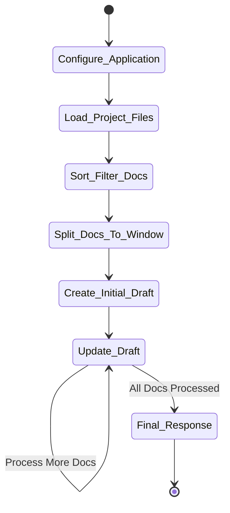
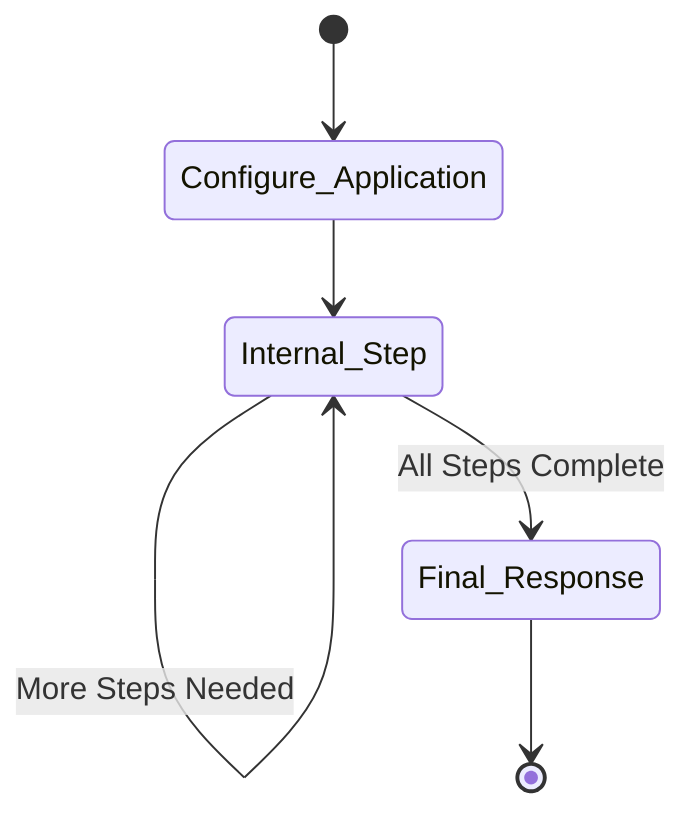
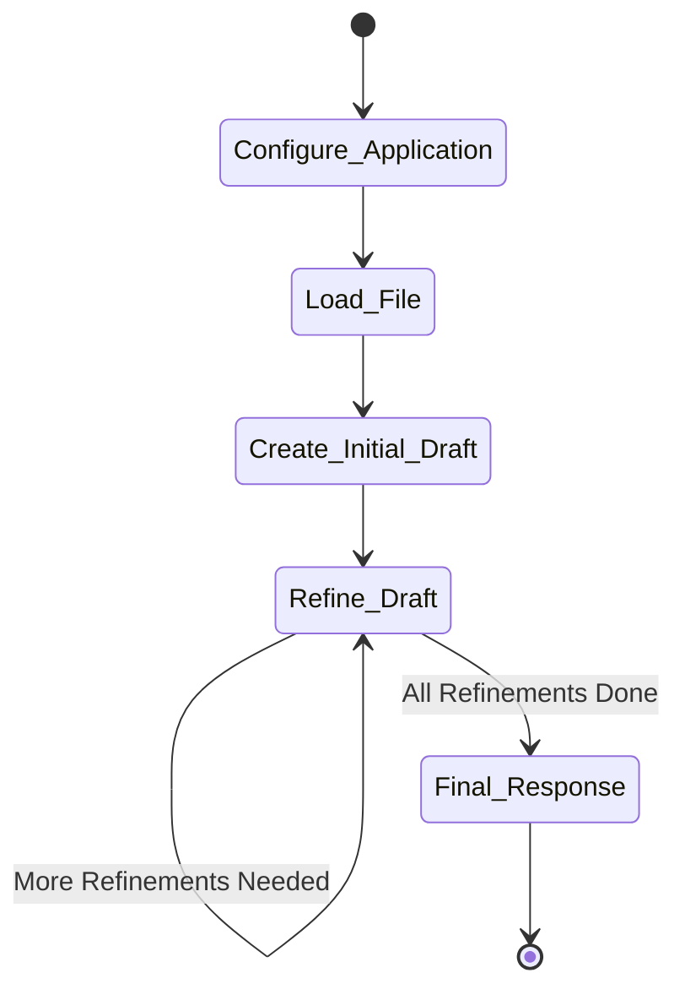
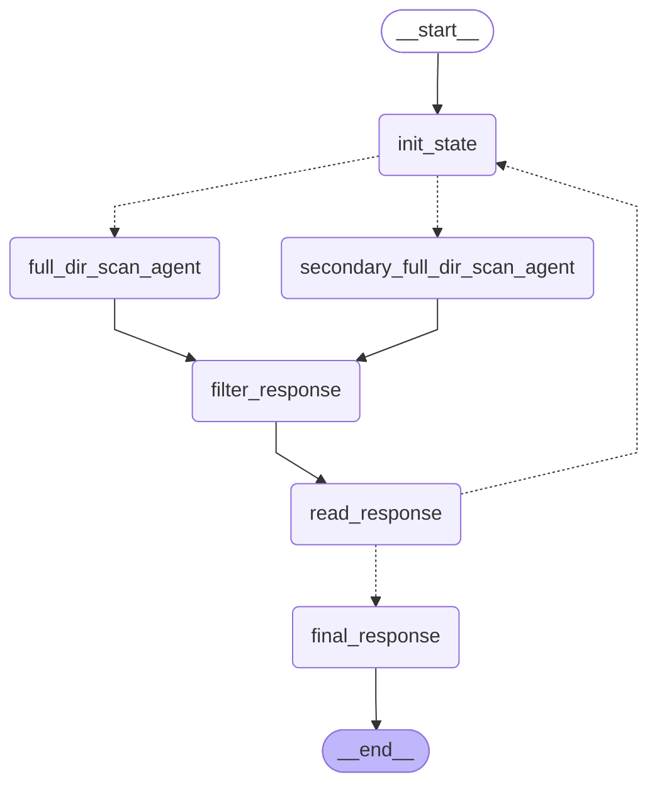

<div align="center">

  # AI Security Analyzer


  <a href="https://github.com/xvnpw/ai-security-analyzer">
    
  </a>

  [](https://github.com/xvnpw/ai-security-analyzer/actions/workflows/ci.yaml)
  [](https://github.com/xvnpw/ai-security-analyzer/releases)
  [](https://opensource.org/licenses/MIT)

   🤖 **AI Security Analyzer** is a powerful tool that leverages AI to automatically generate comprehensive security documentation for your projects, including security design, threat modeling, attack surface analysis, and more.

  **🎥 Demo:**

  

</div>

## Overview

**AI Security Analyzer** is a Python-based tool that analyzes your project's codebase and automatically generates detailed security documentation. It supports multiple analysis types:

- 🔒 Security Design Documentation
- 🎯 Threat Modeling
- 🔍 Attack Surface Analysis
- 🌳 Attack Tree Analysis
- 🛡️ Mitigation Strategies
- 🐛 Vulnerabilities

The tool supports multiple project types and utilizes advanced language models (LLMs) to create insightful security documentation tailored to your project's specific needs.

## Key Features

- 🔍 **Intelligent Analysis**: Automatically analyzes codebases for security considerations
- 📝 **Multiple Document Types**: Generates various security documentation types
- 🤖 **Multi-LLM Support**: Works with OpenAI, OpenRouter, Anthropic, and Google models
- 🔄 **Project Type Support**: Python, Go, Java, Android, JavaScript, and generic projects
- 🎛️ **Flexible Configuration**: Extensive file filtering and customization options
- 🌐 **Cross-Platform**: Runs on Windows, macOS, and Linux

## Prerequisites

- **Python 3.11**
- **Poetry**: For managing Python dependencies.

## Installation

### From Source

Clone the repository and install dependencies using the provided script:

```bash
git clone git@github.com:xvnpw/ai-security-analyzer.git
cd ai-security-analyzer
./build.sh  # Installs Python dependencies
poetry run python ai_security_analyzer/app.py --help
```

### Using Docker

You can run the application using Docker without installing Python locally.

#### In PowerShell (Windows):

```powershell
docker run -v C:\path\to\your\project:/target `
           -e OPENAI_API_KEY=$Env:OPENAI_API_KEY `
           ghcr.io/xvnpw/ai-security-analyzer:latest `
           dir -v -t /target -o /target/security_design.md
```

#### In Bash (Linux/macOS):

```bash
docker run -v ~/path/to/your/project:/target \
           -e OPENAI_API_KEY=$OPENAI_API_KEY \
           ghcr.io/xvnpw/ai-security-analyzer:latest \
           dir -v -t /target -o /target/security_design.md
```

## Recommended Models (as of January 2025)

🥇 Google - Gemini 2.0 Flash Thinking Experimental<br/>
🥈 OpenAI - o1 family models (at least o1-preview)<br/>
🥉 DeepSeek - DeepSeek R1 and other models (GPT-4o, Claude 3.5 Sonnet, etc.)

## Token Usage and Cost Management ⚠️

### Understanding Token Consumption

In `dir` mode, this application may consume a significant number of tokens due to its workflow:
- Each file is processed and sent to LLM
- Multiple rounds of analysis for comprehensive documentation
- Large codebases can lead to substantial token usage

### Cost Control Best Practices 💰

1. **Always Start with Dry Run**
```bash
poetry run python ai_security_analyzer/app.py \
    dir \
    -t /path/to/your/project \
    --dry-run
```
This will show you:
- Total number of tokens to be processed
- List of files that will be analyzed
- No actual API calls will be made

2. **Optimize File Selection**
   - Use `--exclude` to skip non-essential files:
     ```bash
     --exclude "**/tests/**,**/docs/**,LICENSE,*.md"
     ```
   - Focus on security-relevant files with `--filter-keywords`:
     ```bash
     --filter-keywords "security,auth,crypto,password,secret,token"
     ```

### Recommendations

1. For `dir` mode, start with `--dry-run` to assess token usage
2. Use file filtering options to reduce scope
3. Consider running on smaller, security-critical portions first
4. Test on smaller codebases before analyzing large projects
5. Keep track of your API usage limits and costs

## Architecture

To help you understand how the application works, we've included application flow diagrams.

### Application Flow for `dir` mode



The application follows these steps:

1. **Configure Application**: Parses command-line arguments and sets up the configuration.
2. **Load Project Files**: Loads files from the specified target directory, applying include/exclude rules.
3. **Sort Filter Docs**: Sorts and filters documents based on specified keywords and patterns.
4. **Split Docs To Window**: Splits documents into smaller chunks that fit within the LLM's context window.
5. **Create Initial Draft**: Uses the LLM to generate an initial security document based on the first batch of documents.
6. **Update Draft**: Iteratively updates the draft by processing additional document batches.
7. **Final Response**: Formats and returns the final security documentation.

### Application Flow for `github` mode



The application follows these steps:

1. **Configure Application**: Parses command-line arguments and sets up the configuration.
2. **Internal Steps**: Iteratively processes the repository through predefined steps.
3. **Final Response**: Formats and returns the final security documentation.

### Application Flow for `file` mode



The application follows these steps:

1. **Configure Application**: Parses command-line arguments and sets up the configuration.
2. **Load File**: Loads the specified file for analysis.
3. **Create Initial Draft**: Uses the LLM to generate an initial security document based on the file content.
4. **Refine Draft**: Iteratively refines the draft to improve its quality (number of iterations configurable via `--refinement-count`).
5. **Final Response**: Formats and returns the final security documentation.

## Configuration

The application accepts various command-line arguments to tailor its behavior.

### General Options

- `mode`: **Required**. Operation mode (`dir`, `github`, `file`):
  - `dir`: Analyze a local directory (will send all files from directory to LLM)
  - `github`: Analyze a GitHub repository (will use model knowledge base to generate documentation)
  - `file`: Analyze a single file
- `-h`, `--help`: Show help message and exit.
- `-v`, `--verbose`: Enable verbose logging.
- `-d`, `--debug`: Enable debug logging.

### Input/Output Options

- `-t`, `--target`: **Required**. Target based on mode:
  - For `dir` mode: Directory path to analyze
  - For `github` mode: GitHub repository URL (must start with 'https://github.com/')
  - For `file` mode: File path to analyze
- `-o`, `--output-file`: Output file for the security documentation. Default is `stdout`.
- `-p`, `--project-type`: **For `dir` mode only**. Type of project (`python`, `generic`, `go`, `java`, `android`, `javascript`). Default is `python`.
- `--exclude`: **For `dir` mode only**. Comma-separated list of patterns to exclude from analysis using python [glob patterns](https://docs.python.org/3/library/glob.html) (e.g., `LICENSE,**/tests/**`).
- `--exclude-mode`: **For `dir` mode only**. How to handle the exclude patterns (`add` to add to default excludes, `override` to replace). Default is `add`.
- `--include`: **For `dir` mode only**. Comma-separated list of patterns to include in the analysis using python [glob patterns](https://docs.python.org/3/library/glob.html) (e.g., `**/*.java`).
- `--include-mode`: **For `dir` mode only**. How to handle the include patterns (`add` to add to default includes, `override` to replace). Default is `add`.
- `--filter-keywords`: **For `dir` mode only**. Comma-separated list of keywords. Only files containing these keywords will be analyzed.
- `--dry-run`: **For `dir` mode only**. Perform a dry run. Prints configuration and list of files to analyze without making API calls.

### Agent Configuration

- `--agent-provider`: LLM provider for the agent (`openai`, `openrouter`, `anthropic`, `google`). Default is `openai`.
- `--agent-model`: Model name for the agent. Default is `gpt-4o`.
- `--agent-temperature`: Sampling temperature for the agent model (between `0` and `1`). Default is `0`.
- `--secondary-agent-provider`: LLM provider for the secondary agent (`openai`, `openrouter`, `anthropic`, `google`). Default is `None`.
- `--secondary-agent-model`: Model name for the secondary agent. Default is `None`.
- `--secondary-agent-temperature`: Sampling temperature for the secondary agent model (between `0` and `1`). Default is `None`.
- `--agent-preamble-enabled`: Enable preamble in the output.
- `--agent-preamble`: Preamble text added to the beginning of the output. Default is `##### (🤖 AI Generated)`.
- `--agent-prompt-type`: Prompt to use in agent (default: `sec-design`). Options are:
  - `sec-design`: Generate a security design document for the project.
  - `threat-modeling`: Perform threat modeling for the project.
  - `attack-surface`: Perform attack surface analysis for the project.
  - `attack-tree`: Perform attack tree analysis for the project.
  - `mitigations`: Perform mitigation strategies analysis for the project.
  - `vulnerabilities`: **For `dir` mode only** Perform vulnerabilities analysis for the project (read more about this mode in [vulnerabilities](#vulnerabilities)).
  - `vulnerabilities-workflow-1`: **For `dir` mode only** Perform vulnerabilities analysis for the project using vulnerabilities workflow 1 (read more about this mode in [vulnerabilities-workflow](#vulnerabilities-workflow)).
- `--deep-analysis`: **For `github` mode only**. Enable deep analysis. (for now only supported by gemini-2.0-flash-thinking-exp model)
- `--recursion-limit`: Graph recursion limit. Default is `35`.
- `--refinement-count`: **For `file` mode only**. Number of iterations to refine the generated documentation (default: `0`).
- `--files-context-window`: **For `dir` mode only**. Maximum token size for LLM context window. Automatically determined if not set.
- `--files-chunk-size`: **For `dir` mode only**. Chunk size in tokens for splitting files. Automatically determined if not set.
- `--reasoning-effort`: Reasoning effort for the agent (only for reasoning models, e.g., `o1`). Choices are `low`, `medium`, `high`. Default is `None`.

### Checkpointing Options

- `--resume`: Resume from last checkpoint if available.
- `--clear-checkpoints`: Clear existing checkpoints before starting.
- `--checkpoint-dir`: Directory to store checkpoints. Default is `.checkpoints`.

### Vulnerabilities Workflow Options

- `--vulnerabilities-iterations`: Number of iterations to perform for vulnerabilities workflow. Default is `3`.
- `--vulnerabilities-severity-threshold`: Severity threshold for vulnerabilities workflow (`low`, `medium`, `high`, `critical`). Default is `high`.
- `--vulnerabilities-threat-actor`: Threat actor for vulnerabilities workflow (`none`, `external_web`, `vscode_extension`, `vscode_extension_malicious_repo`). Default is `external_web`.
- `--vulnerabilities-output-dir`: Directory to store intermediate data for vulnerabilities workflow. Default is `vulnerabilities-workflow`.
- `--included-classes-of-vulnerabilities`: Comma-separated list of classes of vulnerabilities to include. Default is all classes. Cannot be used with `--excluded-classes-of-vulnerabilities`.
- `--excluded-classes-of-vulnerabilities`: Comma-separated list of classes of vulnerabilities to exclude. Default is empty. Cannot be used with `--included-classes-of-vulnerabilities`.

## Environment Variables

Set one of the following environment variables based on your chosen LLM provider:

- `OPENAI_API_KEY`
- `OPENROUTER_API_KEY`
- `ANTHROPIC_API_KEY`
- `GOOGLE_API_KEY`

## Usage Examples

### Basic Usage Examples

1. Generate a security design document for python project (default):
```bash
poetry run python ai_security_analyzer/app.py \
    dir \
    -t /path/to/your/project \
    -o security_design.md
```

2. Generate a threat model for python project:
```bash
poetry run python ai_security_analyzer/app.py \
    dir \
    -t /path/to/your/project \
    -o threat_model.md \
    --agent-prompt-type threat-modeling
```

3. Analyze a GitHub repository:
```bash
poetry run python ai_security_analyzer/app.py \
    github \
    -t https://github.com/user/repo \
    -o security_analysis.md
```

4. Analyze a single file:
```bash
poetry run python ai_security_analyzer/app.py \
    file \
    -t examples/FLASK-o1-preview.md \
    -o attack_tree.md \
    --agent-prompt-type attack-tree
```

### Advanced Configuration Examples

1. Custom file filtering with specific focus:
```bash
poetry run python ai_security_analyzer/app.py \
    dir \
    -t /path/to/your/project \
    -o security_design.md \
    -p generic \
    --exclude "**/tests/**,**/docs/**" \
    --include "**/*.py,**/*.java" \
    --filter-keywords "security,auth,crypto,password"
```
This example:
- Excludes test files, documentation, and LICENSE
- Only includes Python and Java source files
- Focuses on files containing security-related keywords

2. Using Anthropic's Claude model with custom temperature:
```bash
export ANTHROPIC_API_KEY=your_key_here
poetry run python ai_security_analyzer/app.py \
    dir \
    -t /path/to/your/project \
    -o security_design.md \
    --agent-provider anthropic \
    --agent-model claude-3-5-sonnet-20240620 \
    --agent-temperature 0.7 \
    --editor-provider anthropic \
    --editor-model claude-3-5-sonnet-20240620
```

3. Attack surface analysis with custom refinement count:
```bash
poetry run python ai_security_analyzer/app.py \
    file \
    -t examples/FLASK-o1-preview.md \
    -o attack_surface.md \
    --agent-prompt-type attack-surface \
    --refinement-count 3
```

4. Using Google's Gemini model:
```bash
export GOOGLE_API_KEY=your_key_here
poetry run python ai_security_analyzer/app.py \
    dir \
    -t /path/to/your/project \
    -o security_design.md \
    --agent-provider google \
    --agent-model gemini-2.0-flash-thinking-exp \
    --agent-temperature 0 \
    --editor-provider google \
    --editor-model gemini-2.0-flash-thinking-exp
```

### Project-Specific Examples

1. Java/Android project analysis:
```bash
poetry run python ai_security_analyzer/app.py \
    dir \
    -t /path/to/android/project \
    -o security_design.md \
    --project-type android \
    --exclude "**/build/**,**/.gradle/**" \
    --include "**/*.xml"
```

2. JavaScript/Node.js project:
```bash
poetry run python ai_security_analyzer/app.py \
    dir \
    -t /path/to/node/project \
    -o security_design.md \
    --project-type javascript \
    --exclude "**/node_modules/**" \
    --include "**/*.json" \
    --filter-keywords "auth,jwt,cookie,session"
```

### Performance Optimization Examples

1. Dry run with token estimation:
```bash
poetry run python ai_security_analyzer/app.py \
    dir \
    -t /path/to/your/project \
    --dry-run \
    --exclude "**/tests/**,**/docs/**" \
    --filter-keywords "security,auth"
```

2. Custom context window and chunk size:
```bash
poetry run python ai_security_analyzer/app.py \
    dir \
    -t /path/to/your/project \
    -o security_design.md \
    --files-context-window 70000 \
    --files-chunk-size 50000
```

3. Verbose logging and debugging:
```bash
poetry run python ai_security_analyzer/app.py \
    dir \
    -t /path/to/your/project \
    -o security_design.md \
    -v \
    -d
```

### Output Customization Examples

1. Custom preamble for generated content:
```bash
poetry run python ai_security_analyzer/app.py \
    dir \
    -t /path/to/your/project \
    -o security_design.md \
    --agent-preamble-enabled \
    --agent-preamble "# Security Analysis (AI Generated on $(date))"
```

2. Attack tree analysis with stdout output:
```bash
poetry run python ai_security_analyzer/app.py \
    dir \
    -t /path/to/your/project \
    --agent-prompt-type attack-tree
```

## Real World Examples

Check [examples](https://github.com/xvnpw/ai-security-analyzer/blob/main/examples/README.md) for real world examples, e.g. flask framework, requests library, etc.

## Supported Project Types - for `dir` mode only

- Python
- Go
- Java
- Android
- JavaScript
- More to come...

In case you want to use a project type that is not supported, please use the `generic` project type with `--include`, `--include-mode`, `--exclude`, `--exclude-mode` options.

**Example:**

```bash
poetry run python ai_security_analyzer/app.py \
    dir \
    -t /path/to/your/project \
    -o security_design.md \
    --project-type generic \
    --include "**/*.java"
```

## Deep Analysis in GitHub Mode

Enable **Deep Analysis** in **GitHub Mode** to perform an in-depth examination of specific attack surfaces, threats, or attack trees within a GitHub repository. Deep analysis is currently supported only by Gemini 2.0 Flash Thinking Experimental model.

### Enabling Deep Analysis

Use the `--deep-analysis` flag when running the tool in `github` mode:

```bash
poetry run python ai_security_analyzer/app.py \
    github \
    -t https://github.com/user/repo \
    -o output.md \
    --agent-prompt-type <prompt-type> \
    --deep-analysis
    --agent-provider google \
    --agent-model gemini-2.0-flash-thinking-exp \
    --agent-temperature 0
```

### Deep Analysis Output

Depending on the selected `--agent-prompt-type`, the deep analysis will generate:

- **attack-surface**:
  - Main analysis in `output.md`
  - Detailed analysis of each attack surface in `./attack_surfaces/*.md`

- **threat-modeling**:
  - Main analysis in `output.md`
  - Detailed analysis of each threat in `./threats/*.md`

- **attack-tree**:
  - Main analysis in `output.md`
  - Detailed analysis of each attack path in `./attack_tree_paths/*.md`

- **sec-design**:
  - Main analysis in `output.md`
  - Detailed security design analysis in `output-deep-analysis.md`

- **mitigations**:
  - Main analysis in `output.md`
  - Detailed analysis of each mitigation strategy in `./mitigation_strategies/*.md`

Each detailed analysis file provides comprehensive information about specific security aspects, including detailed descriptions, impact analysis, mitigation strategies, and implementation recommendations.

## Checkpointing

The application supports checkpointing to help recover from failures during long-running analyses.

### How Checkpointing Works

1. **Automatic Checkpoint Creation**
   - Checkpoints are automatically created during execution
   - Stored in SQLite database in the checkpoint directory (default: `.checkpoints`)
   - Each execution has a unique thread ID based on mode, target, and prompt type

2. **Recovery Process**
   - Use `--resume` to attempt recovery from last checkpoint
   - If checkpoint exists, execution continues from last successful state
   - If no checkpoint exists, starts from beginning

3. **Checkpoint Management**
   - Checkpoints are automatically cleared upon successful completion
   - Use `--clear-checkpoints` to manually clear existing checkpoints
   - Change checkpoint location with `--checkpoint-dir`

4. **Limitations**
   - Checkpoints are implemented using Langchain's checkpoint saver, which is not fully implemented yet. It might work incorrectly. Hope it will be fixed in future.

## Vulnerabilities

Vulnerabilities mode is experimental and cannot be completely trusted. It's recommended to use it with caution and verify the results. LLMs at current state of development are not able to find vulnerabilities in code. They are able to find potential vulnerabilities and suggest mitigations, but this is far from being reliable.

### Enabling Vulnerabilities Mode

Use the `--agent-prompt-type vulnerabilities` flag when running the tool in `dir` mode:

```bash
poetry run python ai_security_analyzer/app.py \
    dir \
    -t /path/to/your/project \
    --agent-prompt-type vulnerabilities
```

### Additional Options

For more control over the vulnerabilities analysis, you can use the following options:

- `--vulnerabilities-severity-threshold`: Severity threshold for vulnerabilities analysis (`low`, `medium`, `high`, `critical`). Default is `high`.
- `--vulnerabilities-threat-actor`: Threat actor for vulnerabilities analysis (`none`, `external_web`). Default is `external_web`.
- `--included-classes-of-vulnerabilities`: Comma-separated list of classes of vulnerabilities to include. Default is all classes. Cannot be used with `--excluded-classes-of-vulnerabilities`.
- `--excluded-classes-of-vulnerabilities`: Comma-separated list of classes of vulnerabilities to exclude. Default is empty. Cannot be used with `--included-classes-of-vulnerabilities`.

**Example:**

```bash
poetry run python ai_security_analyzer/app.py \
    dir \
    -t /path/to/your/project \
    --agent-prompt-type vulnerabilities \
    --included-classes-of-vulnerabilities "Remote Code Execution" \
    --vulnerabilities-severity-threshold medium \
    --vulnerabilities-threat-actor "none"
```

Explanation:
- `--included-classes-of-vulnerabilities "Remote Code Execution"` - only vulnerabilities of this class will be included in the analysis
- `--vulnerabilities-severity-threshold medium` - only vulnerabilities of medium, high or critical severity will be included in the analysis
- `--vulnerabilities-threat-actor "none"` - there will be no specific threat actor in the analysis

## Vulnerabilities Workflow

Vulnerabilities workflow is a more advanced mode that uses an optional secondary agent to perform vulnerabilities analysis.

### Enabling Vulnerabilities Workflow

Use the `--agent-prompt-type vulnerabilities-workflow-1` flag when running the tool in `dir` mode:

```bash
poetry run python ai_security_analyzer/app.py \
    dir \
    -v \
    -t ../django-unicorn \
    --agent-prompt-type vulnerabilities-workflow-1 \
    -o DIR-VULNERABILITIES-workflow-1-django-unicorn-rce.md \
    --agent-provider google \
    --agent-model gemini-2.0-flash-thinking-exp \
    --agent-temperature 0.7 \
    --vulnerabilities-iterations 2 \
    --exclude "**/.github/**,**/CODE_OF_CONDUCT.md,**/CONTRIBUTING.md,**/DEVELOPING.md" \
    --included-classes-of-vulnerabilities "Remote Code Execution" \
    --secondary-agent-provider openai \
    --secondary-agent-model o3-mini \
    --secondary-agent-temperature 1
```

Explanation:
- `-v` - verbose mode
- `-t ../django-unicorn` - target is django-unicorn project
- `--agent-prompt-type vulnerabilities-workflow-1` - use vulnerabilities workflow 1
- `-o DIR-VULNERABILITIES-workflow-1-django-unicorn-rce.md` - output file
- `--agent-provider google` - use google provider for primary agent
- `--agent-model gemini-2.0-flash-thinking-exp` - use gemini-2.0-flash-thinking-exp model for primary agent
- `--agent-temperature 0.7` - set temperature to 0.7 for primary agent
- `--vulnerabilities-iterations 2` - perform 2 iterations of vulnerabilities analysis - first will be performed by primary agent, second will be performed by secondary agent
- `--exclude "**/.github/**,**/CODE_OF_CONDUCT.md,**/CONTRIBUTING.md,**/DEVELOPING.md"` - exclude github, code of conduct, contributing, developing files
- `--included-classes-of-vulnerabilities "Remote Code Execution"` - only vulnerabilities of this class will be included in the analysis
- `--secondary-agent-provider openai` - use openai provider for secondary agent
- `--secondary-agent-model o3-mini` - use o3-mini model for secondary agent
- `--secondary-agent-temperature 1` - set temperature to 1 for secondary agent

### Vulnerabilities Workflow Flow



The workflow consists of the following nodes:

1. **init_state**: Initializes the workflow state for each iteration. It tracks the current iteration count and resets processing counters.
2. **full_dir_scan_agent**: Primary agent that performs the initial vulnerability scan of the project directory. This agent analyzes the codebase for potential security issues.
3. **secondary_full_dir_scan_agent**: Optional secondary agent that performs an additional vulnerability scan using a different model. This provides a different perspective on potential vulnerabilities.
4. **filter_response**: Filters the vulnerabilities found by either agent based on configured criteria:
   - Severity threshold
   - Included/excluded vulnerability classes
   - Threat actor context
   - Removes duplicates and invalid findings
5. **read_response**: Processes the filtered vulnerabilities and prepares them for the next iteration or final consolidation.
6. **final_response**: After all iterations are complete, this node consolidates all findings into a final report, removing any remaining duplicates and formatting the output as a comprehensive markdown document.

The workflow supports multiple iterations between primary and secondary agents to achieve more thorough analysis, with each iteration building upon and refining the previous findings.

## Troubleshooting

### Common Issues

#### Chunk Size Longer Than Specified

You may encounter a warning like:

```
langchain_text_splitters.base - WARNING - Created a chunk of size 78862, which is longer than the specified 70000
```

This warning indicates that some document chunks exceed the LLM's context window size. To resolve this, ensure that `--files-chunk-size` is lower than `--files-context-window`.

**Example:**

```bash
poetry run python ai_security_analyzer/app.py \
    dir \
    -t /path/to/your/project \
    --files-chunk-size 50000 \
    --files-context-window 70000
```

#### OpenAI API Key Not Set

If you get an error about `OPENAI_API_KEY`:

```
Error: OPENAI_API_KEY not set in environment variables.
```

Make sure you've set the `OPENAI_API_KEY` environment variable:

```bash
export OPENAI_API_KEY=your_openai_api_key
```

## Supported LLM Providers

- [OpenAI](https://platform.openai.com/) - Industry standard.
- [OpenRouter](https://openrouter.ai/) - Multi-model gateway.
- [Anthropic](https://www.anthropic.com/) - Claude models.
- [Google](https://ai.google.dev/) - Gemini models.

## Roadmap

- [x] ~~Check results from sec-docs and update prompts to get predictable results - especially for `--deep-analysis`~~
- [x] ~~Verify prompts with OpenAI o1, o1-pro, etc. models via API - need to get access to them first ☹️~~
- [x] ~~Add support for `--continue` that will continue in case of error - currently intermediate data is lost when error occurs~~
- [ ] Think about how to handle images in markdown - currently they are not supported (maybe https://github.com/microsoft/markitdown 🤔)
- [ ] Add support for structured output when it will be available in reasoning models - this way deep analysis will be supported by more models
- [x] ~~Probably drop markdown validation - it's not working as expected - models still cannot fix problems with markdown 😡~~
- [ ] Add `--input-context` option to add additional context to the analysis, e.g. existing mitigations, accepted risks, etc.

## Contributing

Contributions are welcome! Please open issues and pull requests. Ensure that you follow the existing code style and include tests for new features.

## License

This project is licensed under the [MIT License](LICENSE). You are free to use, modify, and distribute this software as per the terms of the license.
