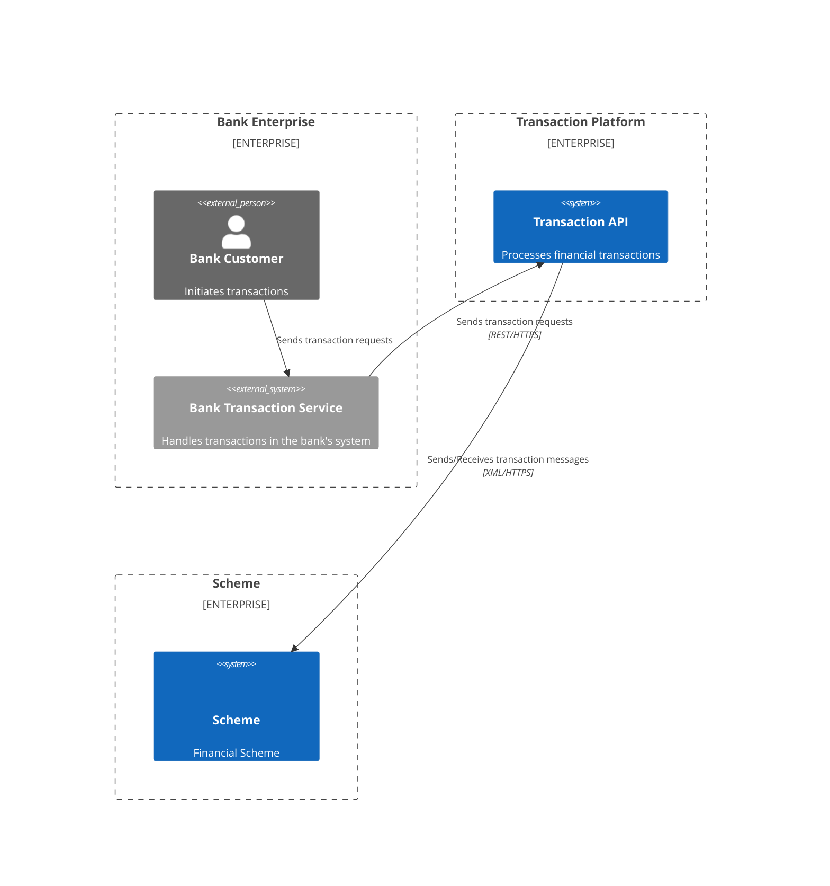

# Architecture - Transaction Platform

## BUSINESS POSTURE

The primary business goal is to provide a reliable and secure Transaction Platform that enables customers, specifically banks, to seamlessly process financial transactions with the scheme. This system is critical for enabling the core business function of money transfer and settlement.

The most important business risks that need to be addressed are:
- Transaction processing failures leading to financial losses and reputational damage.
- Security breaches resulting in unauthorized access to sensitive financial data and regulatory fines.
- System unavailability impacting business continuity and customer trust.
- Non-compliance with regulatory requirements and industry standards.

## SECURITY POSTURE

Existing security controls:
- security control: HTTPS is used for communication between Banks and API Gateway, and between Gateway and Scheme, ensuring data in transit encryption.
- security control: OAuth2 and Keycloak are used for bank authentication, providing secure access control to the API.
- security control: Authorization rules are in place to manage access control, ensuring banks only have access to authorized functionalities.
- security control: General input validation is implemented in API Gateway and additional more complex validation is implemented in particular microservices.
- security control: Rate limiting is implemented on the API Gateway to throttle requests and protect against denial-of-service attacks.
- security control: Comprehensive logging and monitoring is implemented for security events and anomalies detection.
- security control: Regular security scanning (SAST/DAST) and penetration testing is conducted to identify and remediate vulnerabilities.
- security control: Data encryption at rest is enabled for the database and queue to protect sensitive data.

Accepted risks:
- accepted risk: no mTLS between microservices - only network policies (Kubernetes) are used to segment the microservices.

Security requirements:
- security requirement: Confidentiality of transaction data and sensitive bank information must be maintained.
- security requirement: Integrity of transactions must be guaranteed to prevent data manipulation and fraud.
- security requirement: Availability of the Transaction API is crucial for uninterrupted business operations.
- security requirement: Strong authentication and authorization mechanisms are required to verify bank identities and control access.
- security requirement: Non-repudiation of transactions should be ensured for auditability and accountability.
- security requirement: Compliance with relevant financial regulations and security standards (e.g., PCI DSS, GDPR if applicable) must be achieved.

## DESIGN

C4 CONTEXT



| Name | Type | Description | Responsibilities | Security controls |
|------|------|-------------|------------------|------------------|
| Bank Customer | Person | Customer of the bank who initiates transactions. | Initiates financial transactions through the bank.  | Bank's security controls for customer authentication. |
| Bank | Enterprise | Customer of the Transaction API. | Sends transaction requests to the Transaction API. | HTTPS for communication, Bank's internal security controls. |
| Transaction API | System | Microservice to process financial transactions.   | Process transactions, interact with Scheme, manage data. | HTTPS, OAuth2, Authorization Rules, Input validation, Logging. |
| Scheme | System | External financial network.                       | Processes financial transactions in the scheme.    | Scheme's security controls. |
| Identity Provider | System | Authenticates banks accessing the API. | Provides authentication services using OAuth2.     | OAuth2, Access control, Security hardening. |
| Authorization Rules   | System | Manages access control for the Transaction API.   | Defines and enforces authorization policies.        | Access control lists, Role-based access control. |

C4 CONTAINER

```mermaid
C4Container
    Container_Boundary(cb1, "Transaction API System") {
        Container(api_gateway, "API Gateway", "Kong", "Entry point for bank requests, manages routing, authentication, and rate limiting", "API Gateway")
        Container(transaction_service, "Transaction API", "Python microservice", "Processes transaction logic, orchestrates data flow", "Microservice")
        Container(database, "Database", "Postgresql", "Stores transaction data and system state", "Database")
        Container(message_queue, "Message Queue", "RabbitMQ", "Asynchronously processes outbound messages to the Scheme", "Message Queue")
        Container(gateway_service, "Gateway", "Python microservice", "Translates messages to Scheme format and handles communication with Scheme", "Microservice")
    }

    Container(identity_provider, "Identity Provider", "Keycloak", "Provides OAuth2 authentication services", "Identity Provider")
    Container(authorization_rules, "Authorization Rules", "Rules Engine", "Provides authorization policies", "Authorization Rules")

    Rel(api_gateway, transaction_service, "Requests", "REST/HTTPS")
    Rel(transaction_service, database, "Stores/Retrieves data", "JDBC/SQL")
    Rel(transaction_service, message_queue, "Sends messages", "AMQP")
    Rel(message_queue, gateway_service, "Receives messages", "AMQP")
    Rel(gateway_service, scheme, "Sends/Receives transaction messages", "XML/HTTPS")
    Rel(api_gateway, identity_provider, "Authenticates bank", "OAuth2")
    Rel(api_gateway, authorization_rules, "Authorizes access", "")

    UpdateLayoutConfig($c4ShapeBoundaryInRow="true")
```

| Name                  | Type          | Description                                                                 | Responsibilities                                                                 | Security controls                                                                   |
|-----------------------|---------------|-----------------------------------------------------------------------------|---------------------------------------------------------------------------------|---------------------------------------------------------------------------------------|
| API Gateway           | Container     | Entry point for bank requests, manages routing, authentication, and rate limiting. | Handles bank requests, authentication, authorization, routing, rate limiting.      | HTTPS, OAuth2, Rate limiting, Web Application Firewall (WAF), Input validation.     |
| Transaction API       | Container     | Python microservice responsible for core transaction processing logic.      | Processes transaction requests, orchestrates data flow, interacts with other containers. | Input validation, Output encoding, Secure coding practices, Logging and monitoring. |
| Database              | Container     | Postgresql database to store transaction data and system state.              | Stores and retrieves transaction data, ensures data persistence.                 | Encryption at rest, Access control lists, Database firewall, Regular backups.         |
| Message Queue         | Container     | RabbitMQ message queue for asynchronous communication.                      | Queues messages for asynchronous processing, ensures message delivery.            | Access control lists, Encryption in transit, Message queue security hardening.        |
| Gateway Service       | Container     | Python microservice to translate messages to the Scheme format.              | Translates messages to XML/HTTPS for Scheme, handles Scheme communication.        | Input validation, Output encoding, Secure coding practices, HTTPS for Scheme communication. |
| Identity Provider     | Container     | Keycloak for OAuth2 based authentication.                                   | Provides bank authentication services using OAuth2.                               | OAuth2, Access control, Security hardening, Regular security updates.                |
| Authorization Rules   | Container     | Rules Engine for managing access control policies.                           | Defines and enforces authorization policies for the API.                          | Access control lists, Role-based access control, Policy management.                   |

C4 DEPLOYMENT

```mermaid
C4Deployment
    Deployment_Node(cloud, "Cloud Provider", "AWS"){
        Deployment_Node(vpc, "VPC", "Virtual Private Cloud"){
            Deployment_Node(public_subnet, "Public Subnet"){
                Container_Instance(api_gateway_instance, "API Gateway Instance", "Kong", "Load balanced API Gateway instances", api_gateway)
            }
            Deployment_Node(private_subnet, "Private Subnet"){
                Container_Instance(transaction_api_instance, "Transaction API Instance", "Transaction API", "Multiple instances of Transaction API for scalability and resilience", transaction_service)
                Container_Instance(gateway_service_instance, "Gateway Service Instance", "Gateway Service", "Multiple instances of Gateway Service for scalability and resilience", gateway_service)
                Database_Instance(database_instance, "Database Instance", "Postgresql", "Managed Postgresql instance", database)
                Message_Queue_Instance(message_queue_instance, "Message Queue Instance", "RabbitMQ", "Managed RabbitMQ cluster", message_queue)
            }
            Deployment_Node(management_subnet, "Management Subnet"){
                 Container_Instance(identity_provider_instance, "Identity Provider Instance", "Keycloak", "Identity Provider Instance", identity_provider)
                 Container_Instance(authorization_rules_instance, "Authorization Rules Instance", "Authorization Rules", "Authorization Rules Instance", authorization_rules)
            }
        }
    }

    Rel(api_gateway_instance, transaction_api_instance, "Requests")
    Rel(transaction_api_instance, database_instance, "Stores/Retrieves data")
    Rel(transaction_api_instance, message_queue_instance, "Sends messages")
    Rel(message_queue_instance, gateway_service_instance, "Receives messages")
    Rel(gateway_service_instance, scheme, "Sends/Receives transaction messages")
    Rel(api_gateway_instance, identity_provider_instance, "Authenticates bank")
    Rel(api_gateway_instance, authorization_rules_instance, "Authorizes access")


    UpdateLayoutConfig($c4ShapeBoundaryInRow="true")
```

| Name                         | Type              | Description                                                              | Responsibilities                                                                      | Security controls                                                                                |
|------------------------------|-------------------|--------------------------------------------------------------------------|--------------------------------------------------------------------------------------|----------------------------------------------------------------------------------------------------|
| Cloud Provider               | Deployment Node   | Cloud infrastructure provider (e.g., AWS, Azure, GCP).                  | Provides underlying infrastructure for the system.                                     | Cloud provider's security controls, physical security, infrastructure security.                  |
| VPC                          | Deployment Node   | Virtual Private Cloud for network isolation.                             | Provides isolated network environment for Transaction API components.               | Network segmentation, Network Access Control Lists (NACLs), Security Groups.                      |
| Public Subnet                | Deployment Node   | Public subnet for internet-facing components.                             | Hosts API Gateway instances accessible from the internet.                            | Internet Gateway, Load balancing, WAF, DDoS protection.                                         |
| API Gateway Instance         | Container Instance| Load balanced instances of Kong API Gateway.                             | Handles bank requests, authentication, routing, rate limiting.                         | HTTPS, OAuth2, Rate limiting, WAF, Regular security patching.                                   |
| Private Subnet               | Deployment Node   | Private subnet for backend components.                                   | Hosts Transaction API, Gateway Service, Database, and Message Queue instances.         | No direct internet access, Network segmentation, Security Groups.                                |
| Transaction API Instance     | Container Instance| Multiple instances of Transaction API microservice.                        | Processes transaction requests, core transaction logic.                             | Secure coding practices, Input validation, Output encoding, Regular security patching.             |
| Gateway Service Instance     | Container Instance| Multiple instances of Gateway Service microservice.                        | Translates messages to Scheme format, handles Scheme communication.                   | Secure coding practices, Input validation, Output encoding, Regular security patching.             |
| Database Instance            | Database Instance | Managed Postgresql database instance.                                    | Stores transaction data and system state.                                            | Encryption at rest, Access control lists, Database firewall, Regular backups, Database security hardening. |
| Message Queue Instance       | Message Queue Instance| Managed RabbitMQ cluster.                                              | Queues messages for asynchronous processing.                                         | Access control lists, Encryption in transit, Message queue security hardening, Regular security patching. |
| Management Subnet            | Deployment Node   | Subnet for management and security related components.                   | Hosts Identity Provider and Authorization Rules instances.                             | Network segmentation, Security Groups, Limited access.                                            |
| Identity Provider Instance   | Container Instance| Keycloak Identity Provider instance.                                     | Provides OAuth2 authentication services.                                             | OAuth2, Access control, Security hardening, Regular security updates and patching.                 |
| Authorization Rules Instance | Container Instance| Authorization Rules Engine instance.                                     | Provides authorization policies and enforcement.                                     | Access control lists, Role-based access control, Policy management, Security hardening.             |
| Scheme                       | External System   | External financial scheme network.                                       | Processes financial transactions within the scheme.                                  | Scheme's security controls.                                                                    |

RISK ASSESSMENT

Critical business process we are trying to protect is financial transactions processing. Any disruption or compromise to this process can have significant financial and reputational consequences.

Data we are trying to protect includes:
- Transaction details: Amount, sender, receiver, timestamp, transaction status.
- Bank information: Bank identifiers, account details, contact information.
- Potentially customer information: Depending on the transaction type and regulatory requirements, customer PII might be involved.

Data sensitivity is high. Transaction data is financial data and requires strict confidentiality, integrity, and availability. Bank information is also sensitive and needs to be protected. Customer PII, if involved, requires the highest level of protection due to privacy regulations.

QUESTIONS & ASSUMPTIONS

Questions:
- What specific financial scheme is the Transaction API interacting with? (e.g., SWIFT, SEPA, a specific card scheme) Understanding the scheme will help define specific security and compliance requirements.
- What are the detailed authorization rules? How are they managed and updated? Clarification on authorization logic is needed for secure access control design.
- What are the expected transaction volumes, peak loads, and latency requirements? This will influence scalability and performance considerations in the design.
- What are the data retention policies for transaction data? This will impact database sizing and compliance requirements.
- What are the disaster recovery and business continuity requirements? This will influence the deployment architecture and redundancy considerations.
- Are there any specific regulatory compliance requirements (e.g., PCI DSS, GDPR, local financial regulations)? Compliance requirements will dictate specific security controls and design choices.

Assumptions:
- BUSINESS POSTURE: Security and reliability are top priorities for the Transaction API due to the nature of financial transactions.
- SECURITY POSTURE: Existing security controls mentioned in the input are in place and functioning. Additional security controls will be implemented to enhance security posture.
- DESIGN: The system will be deployed in a cloud environment (e.g., AWS). Banks are external customers and require strong authentication and authorization. Communication with the Scheme is over XML/HTTPS. Microservices architecture is preferred for scalability and maintainability.