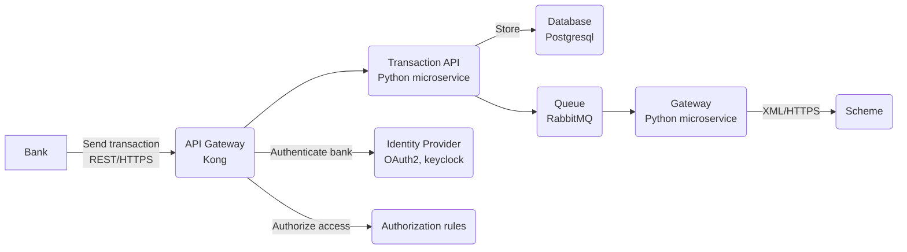

# Transaction API

## Overview

Transaction API is microservice that will be used to process transactions. Customers (e.g. banks) will call it to send and receive money from the scheme.

## Architecture

