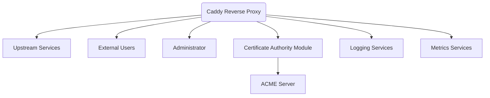
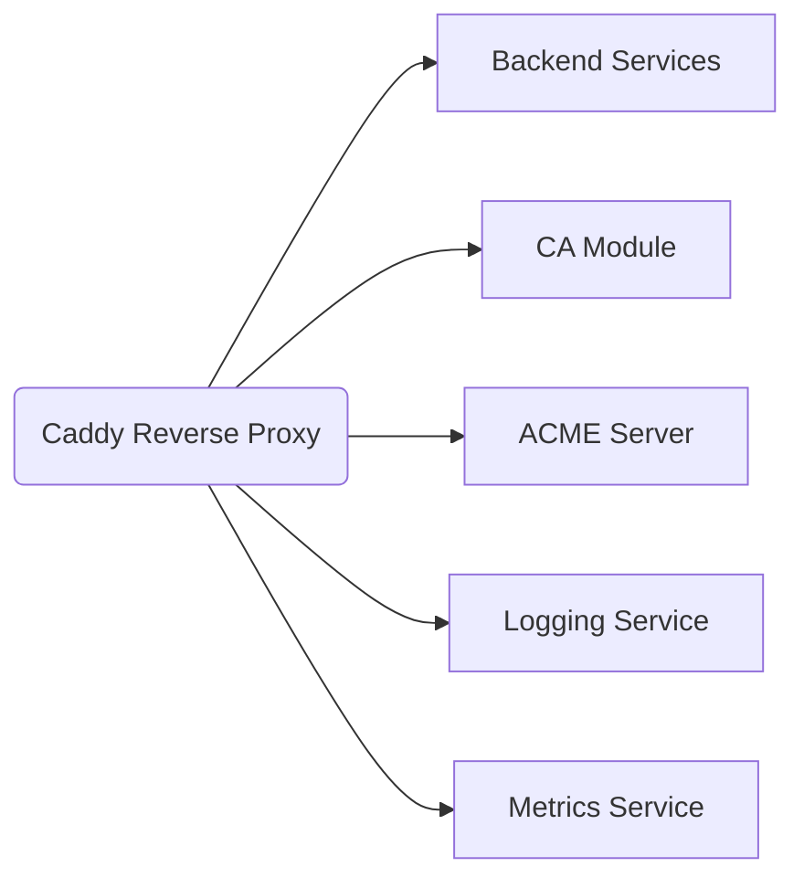
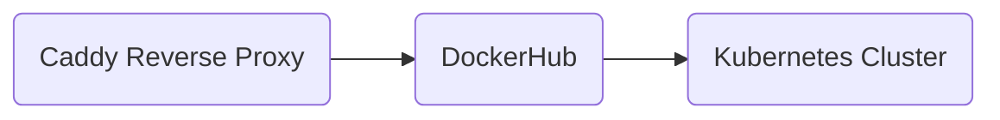
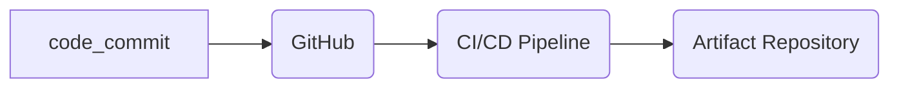

# Project Design Document - Caddy Server Reverse Proxy (Updated)

## Business Posture

**Business Priorities and Goals:**
1. Provide a flexible reverse proxy mechanism for distributing incoming client requests across multiple backend services.
2. Support dynamic, round-robin, and weight-based load balancing to ensure efficient resource utilization.
3. Facilitate easy integration with backend applications through minimal configuration efforts and compatibility with multiple protocols.
4. Offer internal certificate authority (CA) functionalities via PKI module for seamless internal certification management and ACME server support.

**Business Risks:**
1. Configuration errors or suboptimal proxy strategies could lead to service downtime or reduced performance.
2. Complex interaction with multiple backend services may introduce integration challenges.
3. Evolving security standards demand regular updates and compliance checks.
4. Improper certificate lifecycle management could lead to security vulnerabilities.

## Security Posture

**Existing Security Controls:**
- Security Control: Structured configuration and input handling in Caddyfile and Go structuring - Observed in `caddyfile.go` files for different modules.
- Security Control: Context map to retain request tracing across proxies and handlers - Implemented in `tracer.go`.
- Security Control: Response compression and transfer encoding to optimize client-server communications - Managed in `net/http/httputil`.
- Security Control: Graceful degradation and retries for fast failover and resilience during service outages.
- Security Control: Enforced safe operation mode for template execution preventing command execution - Managed using `template/escape` package.
- Security Control: PKI Management with functionalities to handle internal certificate authorities, root, and intermediate certificates - Implemented in `caddypki/*.go`.
- Security Control: ACME server handler to manage certificate issuing through ACME challenges - Implemented in `acmeserver/acmeserver.go`.
- Security Control: On-Demand TLS certificate management to handle certificate requests at handshake time - Implemented in `ondemand.go`.
- Security Control: PEM Loader to handle certificate loading without persistent storage - Implemented in `pemloader.go`.
- Security Control: Session Ticket Service for managing TLS session tickets to enable session resumption - Implemented in `sessiontickets.go`.

**Accepted Risks:**
- Accepted Risk: Third-party module reliance might result in varied update cycles and delayed security patches.

**Recommended Security Controls:**
- Recommended Control: Implementation of timeout and circuit-breaker mechanisms to manage long-standing or unresponsive backend connections.
- Recommended Control: Incorporating validation checks for upstream hosts to prevent common vulnerabilities such as host header attacks.
- Recommended Control: Employing rate-limiting mechanisms on client requests to prevent denial of service scenarios.

**Security Requirements:**
- Authentication: Usage of OAuth or similar token-based mechanics for secured proxy service requests with third-party systems.
- Authorization: Dynamic route mappings should authorize known host-protocol pairs.
- Input Validation: Confirm incoming requests conform to expected URI and parameter structures.
- Cryptography: Derivative of TLS for communicating with secure backends leveraging mutual TLS where applicable.

## Design

### C4 Context

**Elements of Context Diagram:**

| Name                  | Type                 | Description                                                   | Responsibilities                                     | Security Controls                                                                          |
|-----------------------|----------------------|---------------------------------------------------------------|-----------------------------------------------------|--------------------------------------------------------------------------------------------|
| Caddy Reverse Proxy   | Software Component   | Core of the proxy infrastructure for request balancing         | Distribute incoming requests to appropriate services | Ensures secure forwarding via TLS, resolves frontend to backend mapping.                   |
| Upstream Services     | External System      | Backend services catering responses to routed requests         | Serve dynamic content and application services      | Restricted exposure, traffic filtered and routed through proxy.                            |
| External Users        | User                 | Entities requesting service access through the proxy           | Interact with reverse proxy to access backend services | TLS secures outgoing connections from users to proxy.                                      |
| Administrator         | Internal User/System | Avails CLI/API for configuring Proxy and managing nodes        | Manage, deploy and scale service components          | Admin activities secured by strong authentication and event logging.                       |
| Certificate Authority Module | Internal System | Manages certificate lifecycles including root and intermediate authority | Issue, renew, and manage CA certificates             | Encrypted storage for keys and certificates, scheduled renewals with alerts.               |
| ACME Server           | Internal System      | Automates the certificate issuance using ACME protocol         | Handle ACME challenges and issue certificates        | Secure issuance process, client certificate validation through TLS.                        |
| Logging Services      | External System      | Aggregation and management of application logs                 | Record and persist log data for monitoring and analysis | Secure log transmission and storage. |
| Metrics Services      | External System      | Collection and representation of application metrics           | Provide insights and monitoring data                 | Secure metrics transmission and access controls. |

### C4 Container

**Elements of Container Diagram:**

| Name                  | Type                  | Description                                            | Responsibilities                                       | Security Controls                                                                        |
|-----------------------|-----------------------|--------------------------------------------------------|--------------------------------------------------------|-----------------------------------------------------------------------------------------|
| Caddy Reverse Proxy   | Software Application  | Manages request forwarding and server balancing        | Manage routing based on health, weight and site strategies | Implements fallback strategies and SSL certificate management                            |
| Backend Services      | Software Application  | Applications fulfilling user operations                | Provide application content and web services           | API key restrictions to control service access                                          |
| CA Module             | Internal System       | Manages internal CA certificates and policies          | Root/intermediate certificate management and issuance  | CA specific keys secure storage, event auditing for certificate operations               |
| ACME Server           | Internal Service      | Handles ACME requests for certificate automation       | Serve ACME directory endpoint and manage challenges    | Secured communication line with accurate logging and directory integrity verification   |
| Logging Service       | External Dependency   | Manages logs for monitoring and troubleshooting        | Collect and process logs, provide access for analytics | Secured log aggregation, minimum permissions for log access                             |
| Metrics Service       | External Dependency   | Collects and reports application telemetry data        | Facilitate system monitoring and performance reviews   | Data encryption during transit, secured metrics API access                              |

### Deployment

**Deployment Architecture Options:**
1. Run on physical hardware with a public static IP.
2. Containerized installation within fully managed environments like Kubernetes.

**Deployment Strategy:**

**Elements of Deployment Diagram:**

| Name                  | Type                  | Description                                            | Responsibilities                                     | Security Controls                                                                      |
|-----------------------|-----------------------|--------------------------------------------------------|-----------------------------------------------------|---------------------------------------------------------------------------------------|
| Caddy Reverse Proxy   | Containerized Instance| Managed instance deployed in hosting environment       | Handle HTTP/HTTPS traffic and health checks         | Container isolation rules and namespace segregation                                    |
| DockerHub             | Container Registry    | Supplies container images for deployment               | Stores and delivers proxy containers images         | Scanning and auto-updating to ensure updated, secure microservices                      |
| Kubernetes Cluster    | Container Orchestrator| Handles deployment lifecycle and scaling tasks         | Manage resource allocation and service availability | RBAC policies for user roles within cluster                                            |

### Build

**Build Process:**
- **Developer**: Submits code to VCS.
- **CI/CD Flow**: Initiated upon code commit, triggering automated pipelines.
- **Validation**: Builds execute tests, checks, static and dynamic analysis.
- **Artifact**: Successful builds dispatched to centralized repository.

**Build Security Controls:**
- Application of automated audits including SAST.
- Multi-stage builds limit exposure during Docker publication.
- Hardened CI configurations extend protection against supply chain attacks.

## Risk Assessment

- **Critical Business Processes**: Secure routing of client requests to provide uninterrupted content delivery to end-users, requiring robust failure and resilience management.
- **Data Protection Goals**: Encrypt user communication, whereas sensitive configuration variables should be encrypted in material stores.

## Questions & Assumptions

- **Questions**:
  1. Are user connections typically short-lived, or do they require session persistence?
  2. What is the throughput each backend can effectively handle, and how is it horizontally managed?
  3. Are there specific legal compliance (e.g., GDPR) considerations for logging and monitoring activities?

- **Assumptions**:
  - Backend services behind the proxy are secured independently with compliant measurement standards.
  - Failover strategies are configured properly to handle downtime scenarios, ensuring high availability.
  - Users will primarily access through public cloud services, suggesting incoming traffic from multiple regions.