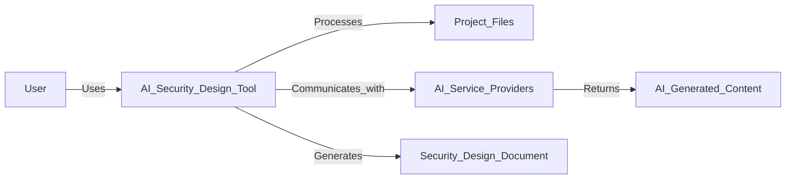
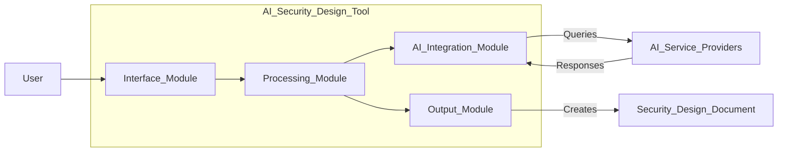
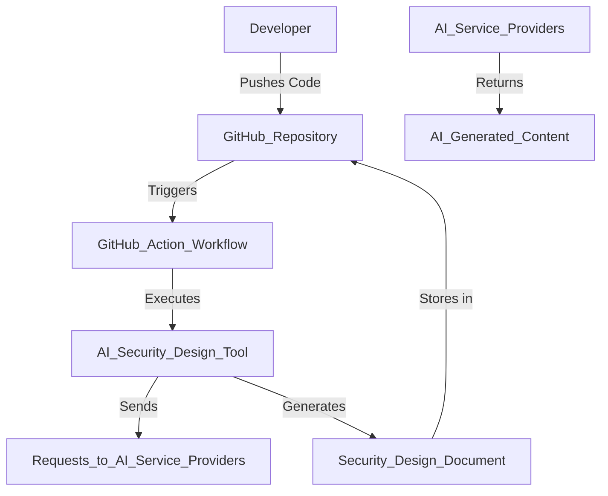
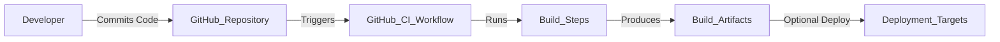

# BUSINESS POSTURE

The "AI Create Project Security Design" project aims to automate the creation of comprehensive security design documents using AI language models. The primary business priorities and goals are:

- **Efficiency**: Streamline the process of generating security design documents to save time and resources.
- **Consistency**: Ensure that all security designs adhere to industry standards and best practices.
- **Accessibility**: Make security design processes accessible to organizations lacking extensive security expertise.
- **Scalability**: Enable rapid generation of security designs for multiple or large-scale projects.

Key business risks that need to be addressed include:

- **Reliance on AI Accuracy**: Dependence on AI-generated content may result in oversight of critical security issues.
- **Compliance Risks**: Generated documents may not fully comply with specific regulatory requirements or industry standards.
- **Data Privacy Concerns**: Processing sensitive project data with AI services could expose confidential information.
- **Adoption Resistance**: Potential skepticism from stakeholders regarding the reliability of AI-generated security designs.

# SECURITY POSTURE

**Existing Security Controls:**

- **Security Control**: Utilization of Continuous Integration (CI) pipelines via GitHub Actions for automated testing and deployment (evident in `/app/README.md` and `/app/.github/workflows/ci.yaml`).
- **Security Control**: Implementation of code quality and security checks using tools such as `pytest` for testing, `mypy` for type checking, `ruff` for linting, and `bandit` for security scanning (configured in `/app/pyproject.toml`).
- **Security Control**: Management of dependencies with `poetry`, ensuring consistent and reproducible builds (as seen in `pyproject.toml` and `/app/build.sh`).
- **Security Control**: Exclusion of sensitive files and directories from processing to prevent unauthorized access (handled in `/app/ai_create_project_sec_design/loaders.py`).

**Accepted Risks:**

- **Accepted Risk**: Potential for AI models to produce incomplete or incorrect security designs due to limitations in training data or context understanding.
- **Accepted Risk**: Dependency on third-party services (AI providers) which may have their own vulnerabilities or change their API terms.

**Recommended Security Controls:**

- **Security Control**: Implement dependency vulnerability scanning using tools like `Safety` or `Dependabot` to detect and remediate vulnerable packages.
- **Security Control**: Enforce secure storage and rotation of API keys and secrets, possibly integrating with vault services (e.g., HashiCorp Vault).
- **Security Control**: Introduce manual review steps for AI-generated documents by security professionals to validate accuracy and compliance.
- **Security Control**: Employ network security measures such as firewalls and intrusion detection systems if deploying as a web service.

**Security Requirements:**

- **Authentication**: Secure handling and storage of API keys for AI service providers (`OPENAI_API_KEY`, `ANTHROPIC_API_KEY`, `OPENROUTER_API_KEY` in `/app/ai_create_project_sec_design/constants.py`).
- **Authorization**: Restrict tool usage to authorized users; implement role-based access controls if necessary.
- **Input Validation**: Validate and sanitize all user inputs and project files to prevent injection attacks and processing of malicious code.
- **Cryptography**: Use encryption for data in transit (TLS/HTTPS) when communicating with AI services and encrypt sensitive data at rest if stored locally.

# DESIGN

The "AI Create Project Security Design" tool is designed to process project files, interact with AI language models, and generate security design documents. The application is developed in Python and leverages several modules to achieve its functionality.

## C4 CONTEXT

### Context Diagram Elements

| Name                      | Type             | Description                                                   | Responsibilities                                   | Security Controls                                                      |
|---------------------------|------------------|---------------------------------------------------------------|----------------------------------------------------|------------------------------------------------------------------------|
| User                      | External Entity  | Individual utilizing the tool                                 | Initiate security design generation                | Authentication mechanisms to verify user identity                      |
| AI_Security_Design_Tool   | System           | The application processing files and generating documents     | Process inputs, interact with AI, output documents | Secure coding practices, handle exceptions, validate inputs            |
| Project_Files             | Data Store       | Files from the user's project repository                      | Provide context for AI models                      | Access controls, prevent unauthorized file access                      |
| AI_Service_Providers      | External System  | Third-party AI language model services                        | Provide AI-generated content                       | Secure API communication (TLS), API key protection                     |
| AI_Generated_Content      | Data Flow        | Content generated by AI services                              | Assist in document creation                        | Monitor for data leaks, validate AI outputs                            |
| Security_Design_Document  | Output           | The final security design document                            | Deliver comprehensive security design              | Sanitize outputs, ensure no sensitive data leakage                     |

## C4 CONTAINER

### Container Diagram Elements

| Name                    | Type       | Description                                              | Responsibilities                                | Security Controls                                                     |
|-------------------------|------------|----------------------------------------------------------|------------------------------------------------|-----------------------------------------------------------------------|
| Interface_Module        | Container  | Handles user interactions                                | Collect user inputs, display results            | Input validation, prevent XSS attacks                                |
| Processing_Module       | Container  | Core logic for processing project files                  | File parsing, data preparation                  | Use secure parsing libraries, exception handling                     |
| AI_Integration_Module   | Container  | Manages communication with AI services                   | Send requests, parse responses                  | Secure API calls, protect API keys and secrets                       |
| Output_Module           | Container  | Generates the final security design document             | Format and compile outputs                      | Output sanitization, prevent inclusion of sensitive data             |
| AI_Service_Providers    | External   | External AI language model services                      | Process AI requests                             | Encrypted communication, adherence to service terms and policies      |
| Security_Design_Document| Data Store | The generated security design document                   | Store and provide access to generated document  | Access controls, encryption at rest if necessary                     |

## DEPLOYMENT

**Possible Deployment Options:**

1. **Local Command-Line Tool**: Users install and run the tool locally on their machines.
2. **GitHub Action**: Integration with GitHub workflows to run automatically on code commits or pull requests.
3. **Web Application Service**: Hosted platform where users can upload projects and receive security designs.

**Selected Deployment Option**: GitHub Action Integration

### Deployment Diagram Elements

| Name                          | Type              | Description                                                   | Responsibilities                      | Security Controls                                                     |
|-------------------------------|-------------------|---------------------------------------------------------------|--------------------------------------|-----------------------------------------------------------------------|
| Developer                     | External Entity   | Individual contributing code                                  | Write and commit code                 | Use SSH keys, enable two-factor authentication                        |
| GitHub_Repository             | Repository        | Remote repository hosting the project code                    | Store code, trigger workflows         | Repository permissions, branch protection rules                       |
| GitHub_Action_Workflow        | CI/CD Pipeline    | Automated pipeline that runs on code changes                  | Execute tests and tools               | Secure secrets management, limit workflow permissions                 |
| AI_Security_Design_Tool       | Application       | The tool generating the security design document              | Process files, interact with AI       | Secure handling of secrets, up-to-date dependencies                   |
| AI_Service_Providers          | External Service  | Third-party AI services (e.g., OpenAI, Anthropic)             | Process AI requests                   | API key security, compliance with provider policies                   |
| Security_Design_Document      | Artifact          | The generated security design document                        | Provide documentation output          | Ensure no leakage of sensitive data, store securely in repository     |

## BUILD

The project utilizes `poetry` for dependency management and supports automated builds via GitHub Actions.

**Build Process Overview:**

1. **Code Commit**: Developer commits code changes to the repository.
2. **GitHub Actions**: Workflow is triggered on push events.
3. **Dependency Installation**: Install Python dependencies using `poetry`.
4. **Static Analysis and Testing**:
   - Run linters (`ruff`) for code style.
   - Perform type checking with `mypy`.
   - Execute security scans using `bandit`.
   - Run unit tests with `pytest`.
5. **Build Application**: Package the application for distribution.
6. **Publish Artifacts**: Optionally publish build artifacts or Docker images.

### Build Process Elements

| Name               | Type         | Description                                      | Responsibilities                           | Security Controls                                                 |
|--------------------|--------------|--------------------------------------------------|-------------------------------------------|-------------------------------------------------------------------|
| Developer          | External     | Writes and commits code                          | Code development                          | Adhere to coding standards, sign commits                          |
| GitHub_Repository  | Repository   | Stores code and triggers workflows               | Version control, trigger CI/CD            | Access controls, protected branches                               |
| GitHub_CI_Workflow | CI Pipeline  | Executes build and test processes automatically  | Automate testing and building             | Secure secrets, limit permissions                                 |
| Build_Steps        | Process      | Steps to build and test the application          | Install dependencies, run tests, package  | Use consistent environments, scan dependencies                    |
| Build_Artifacts    | Artifacts    | Compiled application or Docker images            | Provide deployable package                | Verify integrity, sign artifacts                                  |
| Deployment_Targets | Environment  | Servers or services where artifacts may be deployed | Host application (if applicable)       | Secure deployment pipelines, environment hardening                |

# RISK ASSESSMENT

**Critical Business Processes to Protect:**

- **Security Design Generation**: Ensuring the tool generates accurate and comprehensive security designs.
- **Data Integrity and Confidentiality**: Protecting sensitive project data during processing and transmission.
- **Service Availability**: Maintaining uptime of the tool, especially if provided as a service.

**Data to Protect and Sensitivity:**

- **Project Source Code**: May contain proprietary or confidential information.
- **API Keys and Credentials**: Sensitive information that grants access to external services.
- **Generated Security Documents**: Could reveal internal architecture and vulnerabilities if exposed.

# QUESTIONS & ASSUMPTIONS

**Questions:**

1. What measures are in place to secure API keys and prevent unauthorized access?
2. Are there policies for data retention and deletion, especially regarding sensitive project files?
3. How does the tool handle projects with large codebases that may exceed API limitations?
4. What fallback mechanisms exist if AI service providers are unavailable or return errors?
5. Is there a review process for AI-generated content before it's accepted or merged into the repository?

**Assumptions:**

- The tool is intended for use within controlled environments by trusted users.
- All communications with AI service providers are encrypted and secured.
- Users have the necessary permissions and rights to process the project files with third-party services.
- The AI models used comply with relevant data protection regulations and standards.
- The generated documents are reviewed by qualified personnel to ensure accuracy and compliance.