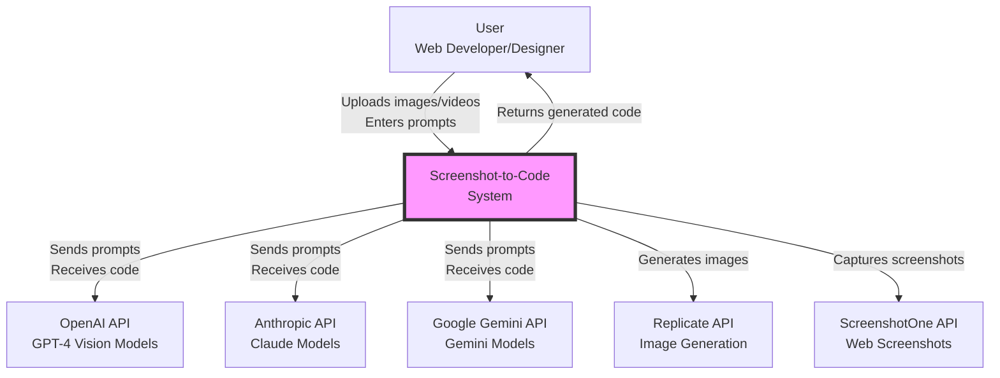
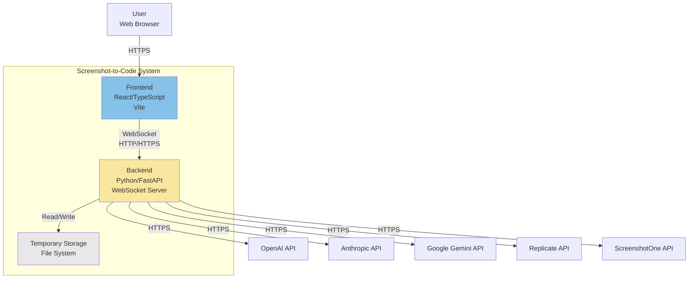
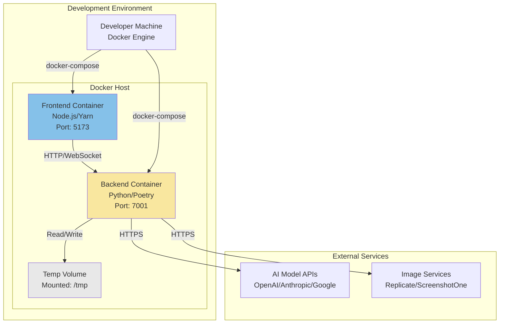
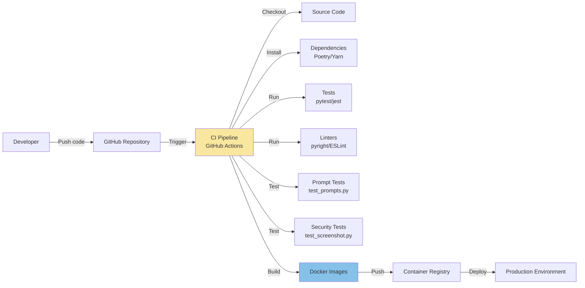

# BUSINESS POSTURE

The Screenshot-to-Code project is an AI-powered development tool designed to accelerate web application development by automatically converting visual designs into functional code. The business priorities focus on democratizing web development by enabling both technical and non-technical users to rapidly prototype and build web applications from screenshots, mockups, Figma designs, or video recordings.

The primary business goals include:
- Reducing time-to-market for web application development from days/weeks to minutes/hours
- Lowering the technical barrier for creating functional web prototypes
- Supporting multiple technology stacks to serve diverse developer communities
- Providing both open-source and commercial offerings to maximize market reach
- Enabling rapid iteration and experimentation in web design and development

The most important business risks that need to be addressed:
- Dependency on third-party AI services (OpenAI, Anthropic, Google) creating vendor lock-in and service availability risks
- Quality and accuracy of generated code affecting user trust and adoption
- API key management and cost control for AI model usage
- Competition from similar AI-powered code generation tools
- Intellectual property concerns regarding generated code ownership
- Scalability challenges as user base grows

# SECURITY POSTURE

## Existing Security Controls

- security control: API key validation for OpenAI, Anthropic, and Gemini services (implemented in `backend/routes/generate_code.py`)
- security control: Environment variable usage for sensitive configuration (implemented via `python-dotenv` in `backend/config.py`)
- security control: CORS middleware configuration restricting cross-origin requests (implemented in `backend/main.py`)
- security control: WebSocket error handling with specific error codes (implemented in `backend/routes/generate_code.py` and `backend/ws/constants.py` with custom code 4332)
- security control: Input validation for supported stacks and input modes (implemented in `backend/routes/generate_code.py`)
- security control: URL normalization and validation for screenshot functionality (implemented in `backend/routes/screenshot.py` with protocol validation)
- security control: Image size and dimension limits for Claude API (implemented in `backend/image_processing/utils.py`)
- security control: Rate limiting protection through third-party API providers' built-in limits
- security control: Video frame extraction limits to prevent excessive processing (implemented in `backend/video/utils.py` with TARGET_NUM_SCREENSHOTS=20)
- security control: URL protocol validation rejecting unsupported protocols like ftp:// and file:// (implemented in `backend/routes/screenshot.py`)

## Accepted Risks

- accepted risk: Storing API keys in browser for hosted version (user responsibility)
- accepted risk: Using permissive CORS settings (`allow_origins=["*"]`) for development flexibility
- accepted risk: No built-in authentication or authorization for the application
- accepted risk: Trusting third-party AI models with potentially sensitive design content
- accepted risk: No input sanitization for generated HTML/JavaScript code
- accepted risk: Mock mode available for testing which bypasses actual AI calls
- accepted risk: Debug mode enabled in video processing saving frames to temporary directory
- accepted risk: Temporary video files created during processing with potential disk space consumption

## Recommended Security Controls (High Priority)

- Implement authentication and authorization for production deployments
- Add rate limiting at application level to prevent abuse
- Implement input sanitization and output encoding for generated code
- Add Content Security Policy (CSP) headers for generated previews
- Implement audit logging for all code generation requests
- Add encryption for API keys stored in environment variables
- Implement webhook signature verification for any external integrations
- Add automated security scanning for generated code patterns
- Disable debug mode in production to prevent temporary file leakage
- Implement secure cleanup of temporary video and image files

## Security Requirements

### Authentication
- Implement user authentication for the hosted version
- Support API key-based authentication for programmatic access
- Implement session management with secure token handling
- Support Single Sign-On (SSO) for enterprise deployments

### Authorization
- Implement role-based access control (user, admin)
- Add project-level permissions for collaborative features
- Implement API rate limiting per user/organization
- Add quota management for AI model usage

### Input Validation
- Validate all user inputs against expected formats and ranges
- Sanitize file uploads (images, videos) for malicious content
- Validate URLs before screenshot capture (currently validates protocol)
- Implement maximum file size limits for uploads
- Validate WebSocket message formats and payloads
- Validate video frame count limits (currently limited to 20 frames)
- Validate image formats and dimensions before processing

### Cryptography
- Use HTTPS/WSS for all communications
- Encrypt API keys at rest using appropriate key management
- Implement secure random token generation for sessions
- Use cryptographic signatures for sensitive operations
- Implement certificate pinning for API communications

# DESIGN

## C4 CONTEXT

### Context Diagram Elements

| Name | Type | Description | Responsibilities | Security Controls |
|------|------|-------------|------------------|-------------------|
| User | Person | Web developers, designers, or non-technical users | Upload designs, review generated code, iterate on outputs | Browser-based security, HTTPS communication |
| Screenshot-to-Code System | Software System | Core application for code generation | Process inputs, orchestrate AI models, generate code | Input validation, API key management, rate limiting, WebSocket error handling |
| OpenAI API | External System | GPT-4 Vision and other OpenAI models | Generate code from visual inputs | API key authentication, TLS encryption |
| Anthropic API | External System | Claude family of models | Generate code from visual inputs with video support | API key authentication, TLS encryption, frame limit validation |
| Google Gemini API | External System | Gemini vision models | Generate code from visual inputs | API key authentication, TLS encryption |
| Replicate API | External System | Flux image generation service | Generate placeholder images | API token authentication, TLS encryption |
| ScreenshotOne API | External System | Website screenshot service | Capture screenshots of URLs | API key authentication, TLS encryption |

## C4 CONTAINER

### Container Diagram Elements

| Name | Type | Description | Responsibilities | Security Controls |
|------|------|-------------|------------------|-------------------|
| Frontend | Web Application | React-based single page application | User interface, code preview, variant selection, WebSocket client | Input validation, CSP headers, secure WebSocket connection |
| Backend | API/WebSocket Server | FastAPI Python application | AI orchestration, prompt assembly, image/video processing, WebSocket server | API key management, input validation, rate limiting, CORS configuration, URL protocol validation, frame extraction limits |
| Temporary Storage | File System | Local file system for temporary files | Store video frames during processing, debug image storage | File cleanup routines, access restrictions, disk quota management |
| User Web Browser | Client | Modern web browser | Render UI, execute JavaScript, maintain WebSocket connection | Same-origin policy, secure cookie handling |
| OpenAI API | External Service | AI model provider | Process prompts and generate code | API authentication, request/response encryption |
| Anthropic API | External Service | AI model provider | Process prompts and generate code from videos | API authentication, request/response encryption |
| Google Gemini API | External Service | AI model provider | Process prompts and generate code | API authentication, request/response encryption |
| Replicate API | External Service | Image generation service | Generate images from descriptions | Token authentication, request/response encryption |
| ScreenshotOne API | External Service | Screenshot capture service | Capture website screenshots | API key authentication, request/response encryption |

## DEPLOYMENT

The project supports multiple deployment architectures. The primary deployment model uses Docker containers for both frontend and backend components.

### Deployment Diagram Elements

| Name | Type | Description | Responsibilities | Security Controls |
|------|------|-------------|------------------|-------------------|
| Docker Host | Infrastructure | Docker runtime environment | Container orchestration, networking, volume management | Container isolation, network segmentation |
| Frontend Container | Docker Container | Containerized React application | Serve static assets, handle client requests | Container security scanning, non-root user |
| Backend Container | Docker Container | Containerized FastAPI application | Process API requests, manage WebSocket connections, video processing | Container security scanning, secrets management, temporary file cleanup |
| Temp Volume | Docker Volume | Temporary storage volume | Store video frames and debug images | Volume encryption, automatic cleanup, size limits |
| Developer Machine | Infrastructure | Local development environment | Run Docker, manage code, test application | Local firewall, encrypted storage |
| AI Model APIs | External Infrastructure | Cloud-hosted AI services | Process AI model requests | TLS encryption, API authentication |
| Image Services | External Infrastructure | Cloud-hosted image services | Generate/capture images | TLS encryption, API authentication |

## BUILD

### Build Process Elements

| Name | Type | Description | Responsibilities | Security Controls |
|------|------|-------------|------------------|-------------------|
| Developer | Person | Software developer | Write code, run tests, commit changes | SSH key authentication, signed commits |
| GitHub Repository | Source Control | Git repository hosting | Version control, code review, CI/CD triggers | Branch protection, code review requirements |
| CI Pipeline | Build System | Automated build and test pipeline | Build, test, package applications | Secrets management, build isolation |
| Source Code | Artifact | Application source files | Define application logic | Code scanning, dependency scanning |
| Dependencies | Artifact | Third-party libraries | Provide functionality | Vulnerability scanning, license compliance |
| Tests | Process | Automated test suite | Validate functionality | Test coverage requirements |
| Prompt Tests | Process | Prompt generation tests | Validate prompt assembly logic | Test all input modes and generation types |
| Security Tests | Process | Security validation tests | Validate URL normalization, input validation | Security test coverage |
| Linters | Process | Code quality tools | Enforce coding standards | Security linting rules |
| Docker Images | Artifact | Container images | Package applications | Image scanning, signing |
| Container Registry | Infrastructure | Docker image storage | Store and distribute images | Access control, vulnerability scanning |
| Production Environment | Infrastructure | Production deployment | Run applications | Runtime security, monitoring |

# RISK ASSESSMENT

## Critical Business Processes

The critical business processes we are trying to protect include:
- Code generation pipeline ensuring accurate transformation from visual inputs to functional code
- API key management and secure storage for third-party AI services
- User data privacy including uploaded images, videos, and generated code
- Service availability and reliability for both open-source and hosted versions
- Intellectual property protection for proprietary prompt engineering and algorithms
- Video processing pipeline with frame extraction and temporary file management

## Data Sensitivity

The data we are trying to protect and their sensitivity levels:

- **High Sensitivity**:
  - API keys for AI services (OpenAI, Anthropic, Google, Replicate)
  - User authentication credentials (future implementation)
  - Proprietary prompt templates and engineering techniques
  - User-uploaded videos containing potentially proprietary UI designs

- **Medium Sensitivity**:
  - User-uploaded images and videos (may contain proprietary designs)
  - Generated code outputs (may contain business logic)
  - Usage patterns and analytics data
  - WebSocket session data
  - Temporary video frames extracted during processing
  - URL inputs for screenshot capture

- **Low Sensitivity**:
  - Public documentation and examples
  - Open-source code base
  - General application logs
  - Static assets and templates
  - Test fixtures and mock data

# QUESTIONS & ASSUMPTIONS

## Questions

### Business Posture
- What is the intended pricing model for the hosted version?
- Are there plans for enterprise features like team collaboration?
- What are the SLA requirements for the hosted service?
- How will the open-source and commercial versions differentiate?
- What is the expected video upload size and processing frequency?

### Security Posture
- Is there a requirement for compliance with specific standards (SOC2, GDPR)?
- Should the system support on-premises deployment for sensitive environments?
- What is the data retention policy for uploaded images, videos, and generated code?
- Are there plans to implement user authentication and multi-tenancy?
- Should temporary video frames be encrypted during processing?
- What is the acceptable risk level for debug mode in production?

### Design
- Will the system need to scale horizontally for high load?
- Are there plans for a distributed architecture with multiple backend instances?
- Should generated code be stored persistently or only in-memory?
- Is there a need for a caching layer for AI model responses?
- Should video processing be moved to a separate worker service?
- What is the maximum acceptable video file size and duration?

## Assumptions

### Business Posture
- The primary target audience is web developers and designers
- The hosted version will operate on a subscription or credit-based model
- Open-source version is intended for individual use and testing
- Business model relies on API cost optimization and efficient model usage
- Video processing is a core differentiator from competitors

### Security Posture
- Users are responsible for securing their own API keys
- The application trusts the security of third-party AI providers
- Generated code is not validated for security vulnerabilities
- Current deployment assumes a trusted network environment
- Temporary files are automatically cleaned up by the operating system
- Debug mode is acceptable for development but not production
- URL validation prevents SSRF attacks through protocol restrictions

### Design
- Single-instance deployment is sufficient for current load
- WebSocket connections are reliable and stable
- AI model APIs have sufficient rate limits and availability
- Docker is the preferred deployment method
- Frontend and backend can be scaled independently if needed
- Video processing happens synchronously within request handling
- Maximum of 20 frames per video is sufficient for code generation
- Temporary storage has sufficient space for video processing
