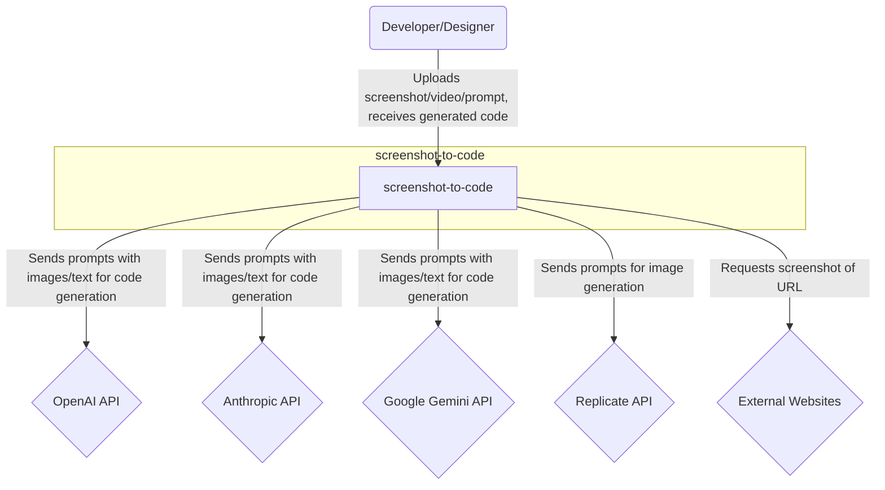
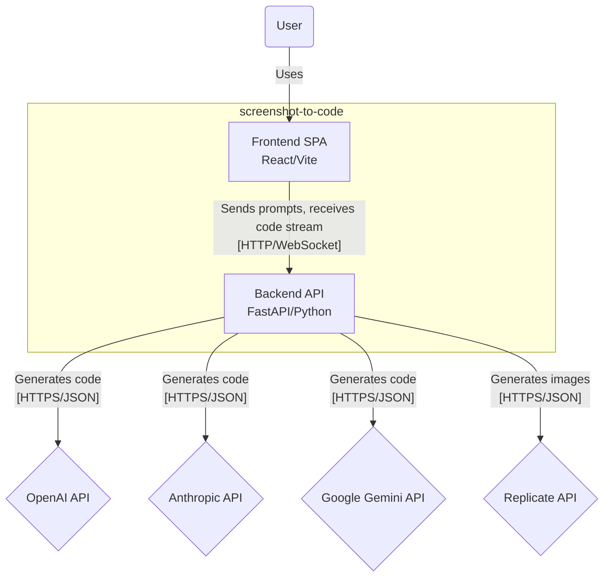
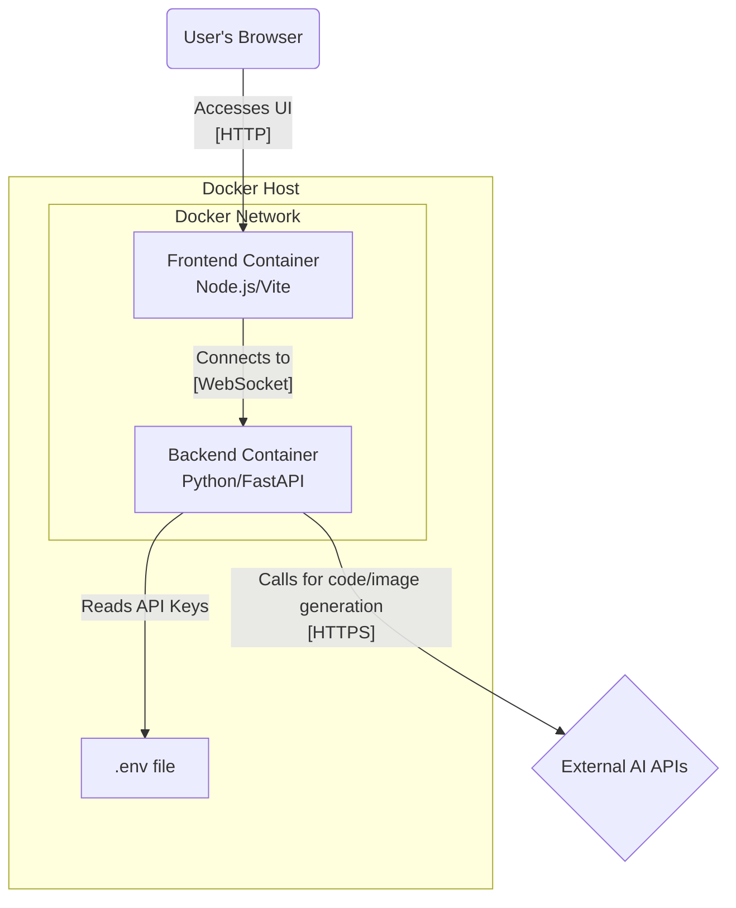

# BUSINESS POSTURE

The "screenshot-to-code" project provides a tool that leverages generative AI to convert visual artifacts like screenshots, mockups, Figma designs, and even screen recordings into clean, functional front-end code. The primary business goal is to significantly accelerate the web development process, allowing developers and designers to quickly turn visual ideas into working prototypes or production-ready code. It supports various modern web technology stacks (e.g., React, Vue, Tailwind CSS) and multiple leading AI models (e.g., OpenAI's GPT-4o, Anthropic's Claude series). A key feature is the ability to not only generate new code but also to import existing codebases and apply AI-driven updates based on new visual or textual instructions.

The project operates on a dual model: a freely available, open-source version that users can self-host, and a paid, hosted version available at `screenshottocode.com`. The open-source version fosters a community, drives adoption, and serves as a lead generation funnel for the paid product. The paid version provides a convenient, managed solution for users who prefer not to handle their own infrastructure and API keys.

Key business priorities include:
- High-quality code generation: The accuracy and quality of the generated code are paramount to user satisfaction and adoption.
- User experience: The tool must be fast and interactive. The design documents emphasize a non-blocking UI where users can see results progressively, which is a key differentiator.
- Support for multiple technologies: Supporting a wide range of popular frameworks and AI models increases the tool's addressable market.
- Flexibility: The tool supports various input formats (image, text, video) and workflows (creation from scratch, updating existing code).

Most important business risks:
- Dependency on third-party AI models: The business is heavily reliant on the performance, cost, and availability of external AI services from providers like OpenAI and Anthropic. Sudden price increases or model degradation could significantly impact profitability and user satisfaction.
- Quality and accuracy of AI output: The core value proposition depends on the AI's ability to generate accurate code. Inconsistent or low-quality results will lead to user churn.
- Competition: The field of AI-powered development tools is rapidly evolving. New competitors or features integrated directly into IDEs or design tools could threaten the project's market position.
- Security of user data and API keys: A security breach, especially one involving user-provided API keys or proprietary design screenshots and videos, could cause significant reputational damage.

# SECURITY POSTURE

Existing security controls and accepted risks for the project are identified below.

security control: Secrets management for the self-hosted version is handled via a `.env` file on the backend, preventing API keys from being hardcoded in source code. This is described in `README.md`.
security control: For the hosted version, API keys are stored exclusively in the user's browser (local storage), never on the project's servers, reducing the risk of a server-side breach exposing user credentials. This is described in `Troubleshooting.md`.
security control: The backend uses dependency management with version locking via `poetry` (`pyproject.toml`, `poetry.lock`), which helps mitigate supply chain attacks by ensuring reproducible builds with known dependency versions.
security control: The frontend uses dependency management with version locking via `yarn` (`yarn.lock`), providing similar supply chain security benefits for frontend components.
security control: The project includes a testing suite for both the backend (`pytest`) and frontend, as detailed in `TESTING.md`, `CLAUDE.md`, and backend test files, which helps ensure code quality and reduce the likelihood of bugs that could have security implications.
security control: The backend API normalizes URLs submitted for screenshotting. This acts as a basic defense against some forms of Server-Side Request Forgery (SSRF) by raising a `ValueError` for unsupported protocols like `ftp://` and `file://`. This is implemented in `backend/routes/screenshot.py` and tested in `backend/tests/test_screenshot.py`. However, it explicitly allows requests to `localhost` and local IP addresses, which remains a significant SSRF risk.
security control: The backend application runs in isolated Docker containers, as defined in `docker-compose.yml` and the Dockerfiles, limiting its potential impact on the host system.
security control: The video processing logic uses the `tempfile` module to handle uploaded video data, which is a secure way to manage temporary files on the filesystem. This is implemented in `backend/video/utils.py`.

accepted risk: The self-hosted version requires users to manage their own API keys. The risk of key exposure is transferred to the user, who is responsible for securing their `.env` file and environment.
accepted risk: The generated code relies on external CDNs for frameworks like Tailwind, React, and Vue. This introduces a third-party dependency risk, but it is a standard and widely accepted practice in web development.
accepted risk: The application is vulnerable to prompt injection attacks, where a user might craft a screenshot or text prompt to manipulate the behavior of the backend LLM. Given the nature of the service, this risk is accepted as difficult to mitigate without harming functionality.
accepted risk: The screenshot functionality is vulnerable to Server-Side Request Forgery (SSRF) attacks targeting internal network resources, as the URL normalization explicitly permits requests to `localhost` and IP addresses. This is considered an accepted risk for the self-hosted version, where the user is assumed to be operating in a trusted environment.

Recommended Security Controls:
- Implement a Content Security Policy (CSP) on the frontend to mitigate Cross-Site Scripting (XSS) risks.
- Add automated security scanning to the development lifecycle, such as Static Application Security Testing (SAST) for the Python and JavaScript code, and Software Composition Analysis (SCA) to check for vulnerabilities in dependencies (e.g., `safety` for Python, `yarn audit` for frontend).
- Implement stricter rate limiting on the backend API endpoints to prevent abuse and denial-of-service attacks.
- For the hosted version, implement a strict denylist for the screenshot feature to block requests to localhost, private IP ranges (RFC 1918), and cloud provider metadata endpoints (e.g., 169.254.169.254) to mitigate SSRF vulnerabilities.

Security Requirements:
- Authentication: For the self-hosted version, there is no authentication; the tool is intended for local, single-user operation. The paid hosted version implies user authentication, but details are not provided in the project files.
- Authorization: There is no authorization model. Any user with network access to the application can use all its features.
- Input Validation: The backend must validate that all inputs (images, videos, text prompts, configuration settings) conform to expected formats and constraints. Images are processed to meet size and dimension constraints. Videos are decoded and split into a maximum of 20 frames, as seen in `backend/video/utils.py`. URLs for the screenshot feature are normalized and checked for valid protocols. The complex `history` object sent during updates must be validated for correct structure.
- Cryptography: All communication with external third-party APIs (OpenAI, Anthropic, Replicate) must use TLS 1.2 or higher. API keys and other secrets must not be stored in plaintext in the source code.

# DESIGN

This document describes the design of the "screenshot-to-code" application, a tool that converts visual designs into code using AI. The system is composed of a frontend single-page application and a backend service that orchestrates calls to various large language models (LLMs).

## C4 CONTEXT

The C4 Context diagram shows the "screenshot-to-code" system as a single box, interacting with its users and the external systems it depends on.



| Name | Type | Description | Responsibilities | Security controls |
| --- | --- | --- | --- | --- |
| Developer/Designer | Person | The user of the application who wants to convert a visual design into code. | Provides visual input (screenshot, video, Figma design) or a text prompt. Interacts with the generated code and provides feedback for updates. Imports existing code for modification. | None. User is responsible for securing their own workstation and API keys for the self-hosted version. |
| screenshot-to-code | Software System | The core application that provides the screenshot-to-code functionality. | Manages the user interface, orchestrates calls to AI models, processes video by extracting keyframes, streams results back to the user, and handles the code generation and update lifecycle for new or imported code. | Manages user API keys securely (client-side storage or via `.env` file). Uses TLS for all external communication. Performs basic input validation. |
| OpenAI API | External System | Provides GPT models for code generation and DALL-E 3 for image generation. | Processes prompts containing images and text, and returns generated code or images. | API key-based authentication. All communication is over TLS. |
| Anthropic API | External System | Provides Claude models for code generation. | Processes prompts containing images, videos (as a series of frames), and text, and returns generated code. | API key-based authentication. All communication is over TLS. |
| Google Gemini API | External System | Provides Gemini models for code generation. | Processes prompts containing images and text, and returns generated code. | API key-based authentication. All communication is over TLS. |
| Replicate API | External System | Provides the Flux Schnell model for image generation. | Processes text prompts and returns generated images. | API key-based authentication. All communication is over TLS. |
| External Websites | External System | Public websites that the user may want to capture a screenshot of. | Serves web page content to the screenshot service. | N/A (system acts as a client). |

## C4 CONTAINER

The C4 Container diagram shows the high-level architecture of the `screenshot-to-code` system, which is composed of a frontend Single-Page Application (SPA) and a backend API.



| Name | Type | Description | Responsibilities | Security controls |
| --- | --- | --- | --- | --- |
| User | Person | The developer or designer using the application via their web browser. | Interacts with the UI to provide inputs and view generated code. | None. |
| Frontend SPA | Container (JavaScript in Browser) | A React/Vite single-page application that provides the user interface. | Renders the UI, manages user inputs (screenshots, videos, prompts, imported code), establishes a WebSocket connection to the backend, and displays the streamed code results. | Stores user-provided API keys in browser local storage for the hosted version. |
| Backend API | Container (Python/FastAPI) | A backend service that handles the core logic of code generation. | Accepts requests from the frontend via WebSocket, decodes and processes video files into frames, assembles prompts based on input type and history, calls external AI services, streams responses back, and optionally generates images to replace placeholders. | Manages API keys via environment variables. Normalizes and validates inputs (e.g., URLs, history objects). Uses TLS for all outbound API calls. Uses secure temp files for video processing. |
| OpenAI API | External System | External AI service for code and image generation. | See Context diagram. | API key authentication. |
| Anthropic API | External System | External AI service for code generation. | See Context diagram. | API key authentication. |
| Google Gemini API | External System | External AI service for code generation. | See Context diagram. | API key authentication. |
| Replicate API | External System | External AI service for image generation. | See Context diagram. | API key authentication. |

## DEPLOYMENT

The project is designed to be deployed using Docker. The `docker-compose.yml` file defines a multi-container setup for local development and self-hosting. A similar container-based architecture is likely used for the hosted production version, probably on a cloud platform like AWS, GCP, or Azure using a container orchestration service (e.g., Kubernetes, ECS).

The detailed deployment described here is for the self-hosted Docker Compose setup.



| Name | Type | Description | Responsibilities | Security controls |
| --- | --- | --- | --- | --- |
| User's Browser | Software System | The client application used by the end-user to access the tool. | Renders the frontend SPA. | Standard browser security model (sandboxing, same-origin policy). |
| Docker Host | Node | The machine (e.g., developer laptop, server) running the Docker daemon and containers. | Provides the execution environment for the application containers. | The host's security posture (firewall, access controls) is critical. |
| Frontend Container | Container (Docker) | A Docker container running the Node.js development server for the React frontend. | Serves the static assets (HTML, CSS, JS) of the single-page application to the user's browser. | Runs as a non-root user if configured. Exposes only the necessary port (5173). |
| Backend Container | Container (Docker) | A Docker container running the FastAPI backend server with Uvicorn. | Exposes the WebSocket endpoint, processes requests, and communicates with external AI services. | Runs as a non-root user if configured. Reads secrets from a volume-mounted `.env` file, not from container environment variables directly in the compose file, which is slightly more secure. |
| .env file | File | A file on the Docker host that stores secrets like API keys. | Stores `OPENAI_API_KEY` and `ANTHROPIC_API_KEY`. | File permissions on the host must be restricted to prevent unauthorized access to secrets. |
| External AI APIs | External System | Represents all third-party AI services (OpenAI, Anthropic, etc.). | Provides the core AI capabilities for the application. | Communication is secured via HTTPS and API key authentication. |

## BUILD

The project does not include a CI/CD pipeline configuration in the provided files. The build process is a series of manual steps a developer would perform on their local machine. The process relies on standard tooling for Python and Node.js ecosystems.

```mermaid
graph TD
    A(Developer) -- "1. Clones repo" --> B(Local Machine)
    subgraph "Local Machine"
        C(Source Code)
        D(Backend Build)
        E(Frontend Build)
    end

    A -- "2. Runs commands" --> D
    A -- "3. Runs commands" --> E

    subgraph "Backend Build"
        D1["poetry install"]
        D2["poetry run pyright"]
        D3["poetry run pytest"]
    end

    subgraph "Frontend Build"
        E1["yarn install"]
        E2["yarn test"]
    end

    C --> D1
    C --> E1
    D1 --> D2 --> D3
    E1 --> E2

    D3 --> F(Build Artifacts)
    E2 --> F

    subgraph "Build Artifacts"
       G[Runnable Application\n(via `yarn dev` & `poetry run uvicorn`)]
       H[Docker Images\n(via `docker-compose build`)]
    end
```

The build process is as follows:
1.  Developer Setup: A developer clones the git repository to their local machine.
2.  Backend Build & Test:
    -   Dependencies are installed using `poetry install` based on `pyproject.toml` and `poetry.lock`. This ensures a consistent set of dependencies.
    -   Static type checking is performed using `poetry run pyright`.
    -   Unit and integration tests are run using `poetry run pytest`.
3.  Frontend Build & Test:
    -   Dependencies are installed using `yarn` based on `package.json` and `yarn.lock`.
    -   Tests are executed using `yarn test`.
4.  Artifact Generation:
    -   For local development, the "artifacts" are the runnable application source code, launched with `poetry run uvicorn` for the backend and `yarn dev` for the frontend.
    -   For deployment, the developer runs `docker-compose up --build` which uses the `backend/Dockerfile` and `frontend/Dockerfile` to create container images that serve as the deployable artifacts.

Security controls in the build process are currently minimal and rely on developer discipline. The use of lock files (`poetry.lock`, `yarn.lock`) is the primary automated security control, providing supply chain integrity. There are no automated SAST, DAST, or dependency vulnerability scanning steps defined.

# RISK ASSESSMENT

- What are critical business process we are trying to protect?
The most critical business process is the core functionality of the application: the high-fidelity conversion of user-provided visual inputs (screenshots, videos) into functional, high-quality code. This process includes the entire pipeline from user input, prompt engineering, LLM interaction, and streaming the results back to the user. A failure or degradation in this process directly impacts the product's value. A secondary critical process for the hosted version is the secure handling of user subscriptions and payments, though this is not detailed in the provided files.

- What data we are trying to protect and what is their sensitivity?
The primary data to protect are:
1.  User API Keys (OpenAI, Anthropic, etc.): This is highly sensitive data. If compromised, it could lead to financial loss for the user through fraudulent use of their AI credits. The current design mitigates this by storing them client-side or in `.env` files, avoiding server-side storage.
2.  User-Uploaded Content (Screenshots, Videos): This data can be highly sensitive. It may contain proprietary user interface designs, unreleased product mockups, or even personally identifiable information (PII). This data is sent to third-party AI providers, and its confidentiality relies on their security and privacy policies.
3.  Generated Code: This is the intellectual property of the user. Its confidentiality is important.
4.  User Account Information (for the hosted version): This would include email addresses, payment information, and other personal data, which is highly sensitive and subject to data protection regulations like GDPR and CCPA.

# QUESTIONS & ASSUMPTIONS

Questions:
- What are the specific security controls for the paid, hosted version (`screenshottocode.com`)? The provided files focus on the open-source, self-hosted version. Details on user authentication, session management, payment processing (PCI DSS compliance), and data storage are needed.
- Is there a formal CI/CD pipeline, or are builds and deployments manual? The documentation implies a manual process.
- What are the incident response and logging/monitoring strategies, particularly for the hosted version?
- How are the Docker base images (`python:3.12.3-slim-bullseye`, `node:22-bullseye-slim`) scanned for vulnerabilities?
- What is the security review process for third-party libraries like `moviepy` and its dependencies, which handle complex file parsing?
- Is the `DEBUG` flag in `backend/video/utils.py` ever enabled in production environments? If so, what are the controls around accessing the temporary files it creates?

Assumptions:
- The target user for the self-hosted version is a developer who understands the security implications of managing API keys and running services on their local machine or server, including the SSRF risk from the screenshot feature.
- The project assumes that the third-party AI APIs (OpenAI, Anthropic, etc.) are trusted, secure endpoints and that data sent to them is handled according to their respective privacy policies.
- The user is responsible for the content they upload and must ensure it does not contain sensitive data they are not authorized to share with third-party AI services.
- The current design prioritizes functionality and user experience, with a baseline level of security. It is assumed that a more robust security posture would be required for the commercial hosted version.
- The threat of prompt injection is a known and accepted risk, as is common with applications that build directly on top of LLMs.
