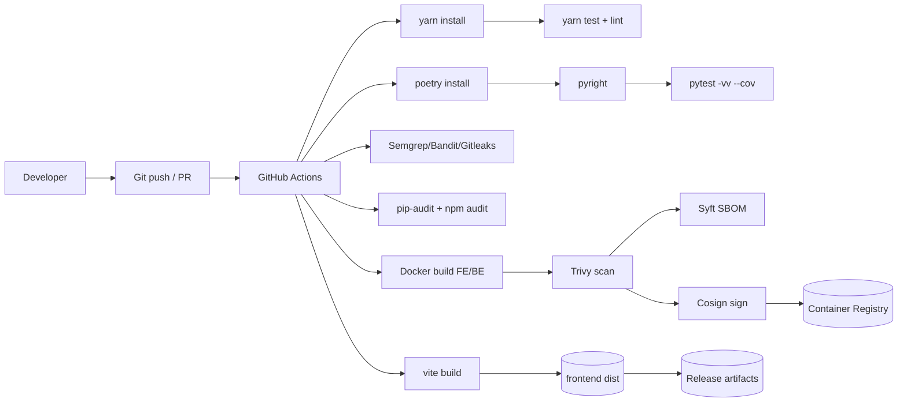

# DESIGN DOCUMENT — screenshot-to-code

## BUSINESS POSTURE

The project aims to convert screenshots, mockups, and Figma designs (and optionally short videos) into clean, functional code using AI. It is an open-source tool with a paid hosted version. Core value drivers:

- Accelerate UI prototyping and iteration by generating working code rapidly.
- Improve developer/designer workflows by supporting multiple stacks (HTML+Tailwind, React, Vue, Bootstrap, Ionic, SVG).
- Provide side-by-side multi-variant outputs to enhance quality and speed to first interaction.

Primary stakeholders and goals:

- OSS self-hosters: easy local setup, maximum flexibility, minimal friction.
- Hosted-version users: convenience, reliability, predictable cost and performance.

Key business priorities:

- Time-to-first-result and perceived responsiveness (non-blocking variant streaming).
- Quality and fidelity of generated code.
- Cost control for model usage (model selection, cancellation of variants in-progress).
- Reliability and debuggability (prompt logging, tests and evaluation harness).

Most important business risks to address:

- Abuse/misuse costs in hosted environment (no auth/rate limiting in OSS code).
- Leakage of sensitive data or API keys (prompt and code logging, user-supplied API keys).
- Supply chain and dependency vulnerabilities (Python/Node dependencies, Docker images).
- Data egress to untrusted endpoints (user-provided base URL, open CORS).
- Arbitrary file access in evaluation endpoints (folder path parameters).

Risk appetite: The OSS project optimizes for developer convenience and rapid iteration, accepting higher risk in default configuration. The paid hosted version must adopt stricter controls to protect cost, user data, and platform integrity.

---

## SECURITY POSTURE

Existing security controls and accepted risks observed in the repository.

Existing security controls

- security control: Strict enumeration/validation of stack and input mode
  - Where: backend/routes/generate_code.py ParameterExtractionStage.extract_and_validate; uses typing.Literal (prompts.types.Stack, custom_types.InputMode) to constrain values
- security control: Model selection through explicit allow-list enum
  - Where: backend/llm.py (Llm enum and MODEL_PROVIDER maps); backend/routes/generate_code.py ModelSelectionStage
- security control: Disable client-specified OpenAI base URL in production
  - Where: backend/routes/generate_code.py ParameterExtractionStage (checks IS_PROD)
- security control: Per-variant error handling and messaging (Auth/Quota/NotFound)
  - Where: backend/routes/generate_code.py ParallelGenerationStage._stream_openai_with_error_handling
- security control: Non-blocking variant processing and event isolation
  - Where: backend/routes/generate_code.py ParallelGenerationStage._process_variant_completion; messages: setCode, variantComplete, variantError
- security control: Claude image size/dimension processing before upload
  - Where: backend/image_processing/utils.py (limit size and dimensions)
- security control: URL normalization and protocol allow-list for screenshots
  - Where: backend/routes/screenshot.py normalize_url with tests in backend/tests/test_screenshot.py
- security control: Test coverage for critical utilities and prompt composition
  - Where: backend/tests (prompts, model selection, URL normalization)
- security control: Consistent WebSocket error handling and close codes
  - Where: backend/routes/generate_code.py WebSocketCommunicator; backend/ws/constants.py (4332)
- security control: Mock mode for development to avoid model spend
  - Where: backend/config.py SHOULD_MOCK_AI_RESPONSE; backend/mock_llm.py

Accepted risks

- accepted risk: CORS is allow-all by default for ease of local development
  - Where: backend/main.py CORSMiddleware allow_origins ["*"]
- accepted risk: Evaluation endpoints accept arbitrary folder paths and read HTML files
  - Where: backend/routes/evals.py (folder, folder1, folder2, folderi query params)
- accepted risk: Prompt and completion logging to filesystem for debugging
  - Where: backend/fs_logging/core.py write_logs (LOGS_PATH default cwd)
- accepted risk: Clients can supply API keys to backend via WebSocket parameters
  - Where: backend/routes/generate_code.py ParameterExtractionStage._get_from_settings_dialog_or_env
- accepted risk: No authentication or authorization built-in; all endpoints open
- accepted risk: No rate limiting or quota enforcement
- accepted risk: No egress restrictions by default (except base URL block in prod for OpenAI)

Recommended high-priority security controls (not yet implemented)

- Enforce authentication and authorization (OIDC/JWT sessions) for hosted use; protect /generate-code, /api/screenshot, eval routes.
- Rate limiting/throttling and quotas per user/IP for WebSocket generation and screenshot endpoint.
- Restrict CORS in production to configured origins only.
- Disable evaluation endpoints in production (feature flag) or gate them to admin role; sanitize/whitelist folders instead of arbitrary paths.
- Secrets management: eliminate client-supplied API keys in hosted; use server-managed provider keys in a KMS/secret store with strict scoping and rotation.
- Logging hygiene: redact/suppress prompt contents and completions in production; structured logs with secret scrubbing.
- Egress controls: only allow outbound to vetted provider domains (OpenAI, Anthropic, Google GenAI, Replicate, ScreenshotOne) via network policy/proxy.
- Input validation hard limits: payload size caps for images/video, history item count, max frames per video, max variants, and max tokens per request.
- Content safety and abuse prevention: per-user spend caps, anomaly detection on usage patterns.
- Supply chain controls: CI SAST (Semgrep/Bandit), dependency and container scans (pip-audit, npm audit, Trivy), SBOM, signed images (Cosign), Dependabot/Renovate.

Security requirements for this project

- Authentication: Required for hosted environment; bearer JWT or session cookie with CSRF protections. WebSocket upgrades must include auth token verification server-side.
- Authorization: Role-based access control. Evals and admin features restricted to admin role. Generation endpoints limited by plan/quota.
- Input validation: Pydantic models for REST and WebSocket params; strict type checks; max lengths; allow-list stacks/models; image/video size caps; URL validation to http/https with deny-lists (localhost/metadata) for screenshot captures if provider allows.
- Cryptography: TLS 1.2+ end-to-end (HTTPS/WSS). Secrets stored only in server-side secret store; at-rest encryption for any persisted logs or artifacts that may include user data. Avoid logging secrets. Consider encrypting run logs or disabling them in prod.

---

## DESIGN

High-level description

- Frontend: React/Vite SPA. Establishes a WebSocket to backend for streaming code generation events and renders variants progressively. Provides UI to configure stack/model, upload screenshot/video, and manage update history.
- Backend: FastAPI app exposing:
  - WebSocket /generate-code: pipeline-based middleware architecture to extract params, assemble prompts, select models, generate variants in parallel (OpenAI/Anthropic/Gemini), optionally generate images (DALL·E 3 / Flux Schnell via Replicate), and stream results.
  - REST endpoints: /api/screenshot (proxy to screenshotone.com), /evals APIs to run and view model evaluations, / root status.
- External services: OpenAI, Anthropic, Google GenAI, Replicate, ScreenshotOne. Optional OpenAI base URL (proxy) is disallowed when IS_PROD=true.
- Filesystem: optional run_logs for prompt/completion logs; evals_data for evaluation inputs/outputs; debug artifacts directory when enabled.

Non-blocking variants

- Implemented: per-variant streaming, independent completion handling, variantComplete/variantError messages, variantCount broadcast.
- Not yet implemented in code: explicit per-variant cancellation via client messages (documented in design-docs/commits-and-variants.md but not present in routes).

### C4 CONTEXT

```mermaid
graph TD
  U[Designer/Developer (User)] -->|Uploads screenshot/video, edits| STC[screenshot-to-code System]
  STC -->|SPA| FE[React/Vite Frontend (Browser)]
  FE -->|WebSocket/HTTP| BE[FastAPI Backend]
  BE -->|LLM API calls| OA[OpenAI API]
  BE -->|LLM API calls| AN[Anthropic API]
  BE -->|LLM API calls| GG[Google GenAI]
  BE -->|Image gen| RP[Replicate (Flux Schnell)]
  BE -->|Website capture| SO[ScreenshotOne API]
  FE -->|CDN assets| CDN[CDNs (Tailwind, Fonts, Icons)]
  BE -->|Logs/Artifacts| FS[Local Filesystem (run_logs, evals_data)]
```

Context elements

| Name | Type | Description | Responsibilities | Security controls |
|---|---|---|---|---|
| Designer/Developer (User) | Persona | End user providing inputs and consuming generated code | Provide screenshots/videos/text, review variants, iterate | Authn to hosted service; quota limits |
| screenshot-to-code System | System | The overall product boundary | Convert inputs to code via LLMs; present results | Central authn/authz, telemetry, rate limits |
| React/Vite Frontend (Browser) | Application | SPA UI running in user’s browser | WebSocket client; uploads; displays variants | Strict CORS; secure WS; input size caps client-side |
| FastAPI Backend | Application | API and orchestration layer | Prompt assembly, model selection, streaming, image gen, evals | Input validation; egress allow-lists; secrets mgmt; logging hygiene |
| OpenAI API | External System | LLM and image generation | Code generation and image generation (DALL·E 3) | API key scoping; TLS |
| Anthropic API | External System | LLM (Claude) | Code generation; video-to-app flows | API key scoping; TLS; image constraints |
| Google GenAI | External System | LLM (Gemini) | Alternative model path | API key scoping; TLS |
| Replicate | External System | Flux Schnell image generation | Optional alt image generation | API token scoping; TLS |
| ScreenshotOne API | External System | Website screenshot capture | Capture target URLs as images | URL allow/deny-lists; provider-side SSRF protections |
| CDNs | External System | Tailwind/Fonts/Icons | Asset delivery | HTTPS only; SRI (recommended) |
| Local Filesystem | Data Store | run_logs/evals outputs | Debug logs, evaluation artifacts | Disable in prod or encrypt; least-privilege FS |

### C4 CONTAINER

```mermaid
graph TD
  subgraph Browser
    FE[React/Vite SPA]
  end

  subgraph Backend (FastAPI)
    WS[WebSocket /generate-code]
    API1[/api/screenshot/]
    API2[/evals + utils/]
    PIPE[Pipeline Middleware: Param Extraction -> Status -> Prompt Creation -> Code Generation -> Post-Processing]
    IMG[Image Generation Module]
    PROMPTS[Prompt Builder (image/text/imported/video)]
    MODELS[Model Clients (OpenAI, Anthropic, Google)]
    LOGS[FS Logging]
  end

  FE -->|WS JSON| WS
  WS --> PIPE
  PIPE --> PROMPTS
  PIPE --> MODELS
  PIPE --> IMG
  PIPE --> LOGS

  MODELS --> OA[OpenAI]
  MODELS --> AN[Anthropic]
  MODELS --> GG[Google GenAI]
  IMG --> RP[Replicate]
  API1 --> SO[ScreenshotOne]

  FE -->|HTTP| API1
  FE -->|HTTP| API2
```

Container elements

| Name | Type | Description | Responsibilities | Security controls |
|---|---|---|---|---|
| React/Vite SPA | Container | Frontend | WebSocket client; variant UI; history UX | Auth token storage; CSP; limit origins; client-side size checks |
| WebSocket /generate-code | Interface | Streaming code generation endpoint | Receives params, streams variant chunks, completion events | Auth on upgrade; per-connection rate limit; message schema validation |
| Pipeline Middleware | Module | Orchestration chain | Param extraction, status, prompt creation, generation, post-process | Input validation; error isolation; feature flags by env |
| Prompt Builder | Module | Build model-specific messages | Assemble image/text/imported/video prompts | Enforce content caps; redact secret data |
| Model Clients | Module | OpenAI/Anthropic/Gemini clients | Stream code, handle provider errors | Allow-listed models; timeouts; retries; egress control |
| Image Generation Module | Module | DALL·E 3 or Replicate | Replace placeholder images | Size caps; timeouts; output validation |
| FS Logging | Store | run_logs | Debug prompt/completion logs | Disable in prod; redact; encrypt-at-rest |
| /api/screenshot | Interface | Screenshot capture via provider | Normalize URL, call provider | URL validation; deny-list SSRF; per-IP rate limit |
| /evals and utilities | Interface | Offline evaluation UX | Run batch evals, read/write eval files | Disabled in prod or admin-only; path allow-list |

### DEPLOYMENT

Supported deployment options

- Local development
  - Frontend: yarn dev (Vite) on 5173
  - Backend: uvicorn reload on 7001
- Single VM/host via Docker Compose (recommended for self-hosters)
  - Optional reverse proxy (Nginx) for TLS/WAF and to terminate HTTPS/WSS
- Kubernetes
  - Ingress controller for TLS and WSS
  - Secrets via cloud KMS, PodSecurity standards, NetworkPolicies

Chosen deployment to detail: Single host with Docker Compose + Nginx reverse proxy + TLS

```mermaid
graph TD
  U[User Browser] -->|HTTPS/WSS| NX[Nginx Reverse Proxy (TLS, CORS, Rate Limit)]
  NX -->|HTTP :5173| FE[frontend container (Vite preview/build)]
  NX -->|HTTP :7001| BE[backend container (FastAPI/uvicorn)]
  BE -->|HTTPS| OA[OpenAI]
  BE -->|HTTPS| AN[Anthropic]
  BE -->|HTTPS| GG[Google GenAI]
  BE -->|HTTPS| RP[Replicate]
  BE -->|HTTPS| SO[ScreenshotOne]
  BE -->|POSIX IO| VOL[(Volume: run_logs, evals_data)]
```

Deployment elements

| Name | Type | Description | Responsibilities | Security controls |
|---|---|---|---|---|
| Nginx Reverse Proxy | Gateway | Front door | TLS, WSS, routing, basic rate limit, CORS | Let’s Encrypt, TLS hardening, IP throttling |
| frontend container | Container | UI hosting | Serve SPA | CSP; CORS to backend host only |
| backend container | Container | API/WebSocket | FastAPI/uvicorn; orchestrates providers | AuthN/Z; input validation; egress allow-lists; secrets via env/secret store |
| Volume | Storage | Local persistent data | run_logs, evals_data | Encrypt or restrict; least privilege; disable in prod |
| Provider APIs | External | LLMs/Image/Screenshot | Model inferences and screenshots | API key scoping; TLS pinning (optionally via proxy) |

Production hardening notes

- Run frontend in production build (vite preview or static behind Nginx), not yarn dev.
- Restrict CORS to allowed origins at both Nginx and FastAPI layers.
- Set IS_PROD=true to disable client base URL override and other dev features.
- Disable eval endpoints or gate with admin auth in production.
- Ensure resource limits on containers; add NetworkPolicies (or Nginx egress restrictions) to only provider domains.

### BUILD

Build, test and publish pipeline (recommended)

- Trigger: pull requests and main branch pushes.
- Steps:
  - Checkout; set up Node and Python.
  - Frontend: yarn install; unit tests (yarn test), lint, build (vite build).
  - Backend: poetry install; pyright; pytest (with coverage); bandit; ruff/flake8 (optional).
  - SAST: Semgrep on repo; secret scanning (gitleaks/trufflehog).
  - Dependency scan: npm audit, pip-audit, Safety.
  - Docker: build backend and frontend images; SBOM (syft), scan (Trivy).
  - Sign images (Cosign) and push to GHCR/ECR.
  - Artifacts: build outputs, coverage reports, SBOMs.
  - Manual approval for deploy; then rollout.



Build process security controls

- Enforce branch protection and required checks (tests, scans) before merge.
- SAST and secret scanning on every PR.
- Dependency and container image scanning with fixed gates.
- SBOM generation and signed images with provenance (SLSA level goals).
- Minimal base images and pinned versions; reproducible builds.

---

## RISK ASSESSMENT

What critical business processes are we protecting?

- Monetized hosted generation pipeline (cost control, stability).
- User workflow inputs/outputs (screenshots/videos; generated code).
- Provider API usage integrity (prevent leaked keys, abuse and model misuse).
- Evaluation harness integrity (prevent arbitrary file access and exfiltration).

What data are we protecting and its sensitivity?

- User-provided media: screenshots and potentially videos of apps/sites (may contain sensitive data) — Sensitive.
- Prompt history and generated code (may reveal proprietary UI/business logic) — Sensitive.
- API keys (OpenAI/Anthropic/Gemini/Replicate) — Highly sensitive secrets.
- Logs and evaluation artifacts (may include inputs/outputs) — Sensitive in production contexts.

---

## QUESTIONS & ASSUMPTIONS

Questions

- Hosted version: Should client-supplied API keys be accepted, or only server-held keys with per-user billing?
- Are evaluation endpoints required in the hosted service, or can they be fully disabled or admin-only?
- What are acceptable CORS origins for production? Is a multi-tenant domain used?
- Do we need content safety filters or ToS enforcement for uploaded media and generated content?
- Are there expected hard limits (file size, image count, video duration) and per-user quotas?
- Should prompt/completion logging be disabled entirely in hosted prod, or stored with encryption and redaction for support/debugging?
- Is cancellation of in-flight variants a required capability on the roadmap (documented but not yet implemented in backend)?
- Any compliance targets (SOC 2, ISO 27001) for the hosted environment?

Assumptions

- OSS users accept default dev posture (open CORS, no auth, eval endpoints enabled) on trusted local/dev machines.
- Hosted service is multi-tenant and must enforce AuthN/Z, quotas, and strict egress and logging policies.
- TLS is terminated at a trusted reverse proxy or cloud LB; WSS is required for WebSocket.
- Provider keys in hosted env are centrally managed by the service, not user-supplied.
- File logging and evaluation artifacts are disabled or tightly controlled in hosted prod.
- Future roadmap includes variant cancellation and continued prompt/eval improvements.
