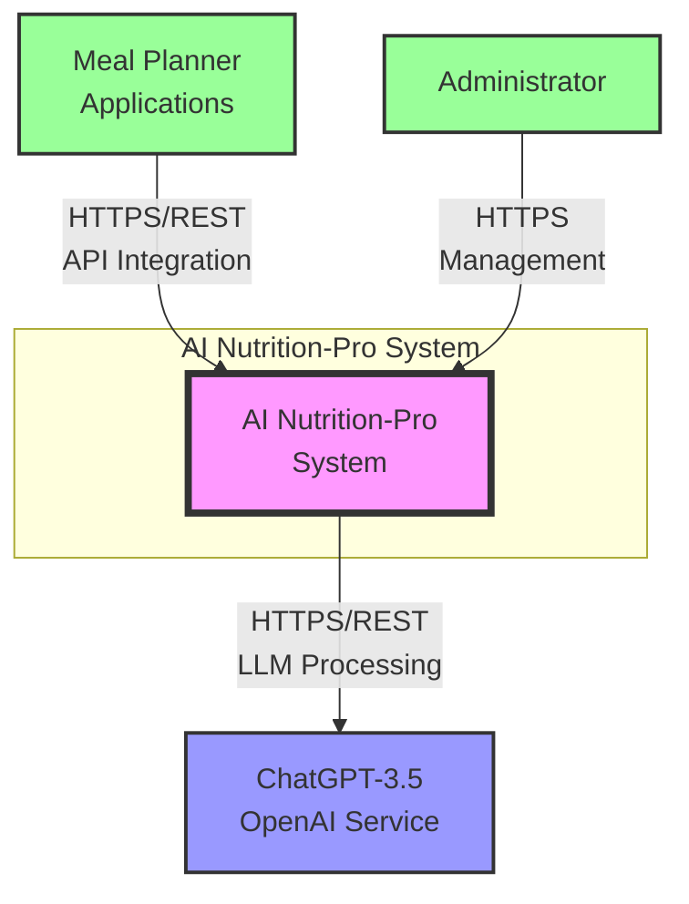
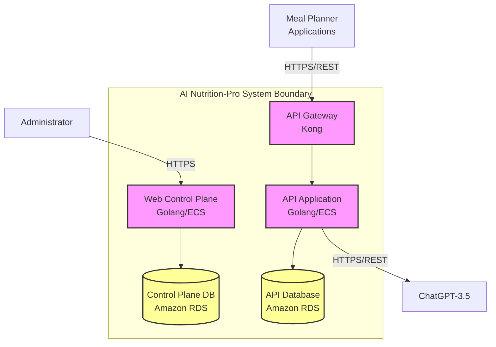
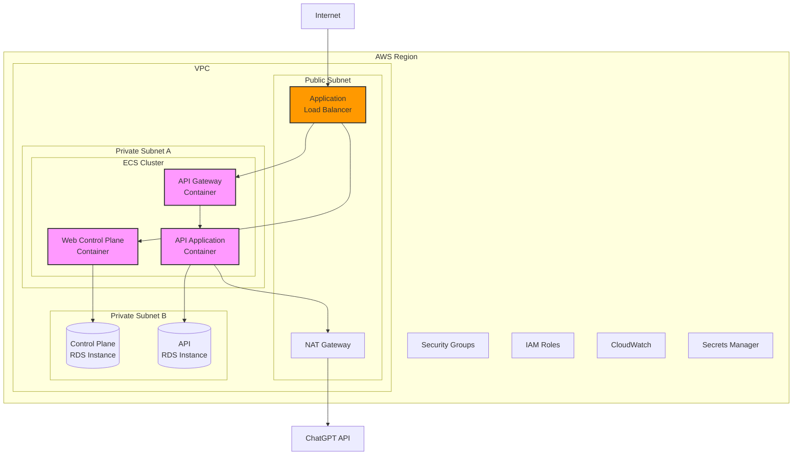

# BUSINESS POSTURE

## Business Priorities and Goals

The AI Nutrition-Pro application is designed to enhance meal planning applications by providing AI-powered content generation capabilities for dietitians. The primary business goals include:

1. Provide seamless integration with multiple meal planning applications through REST API
2. Deliver high-quality, AI-generated nutritional content using LLM technology (ChatGPT-3.5)
3. Enable dietitians to upload content samples and receive personalized AI-generated diet introductions
4. Support multi-tenant architecture with proper client onboarding and management
5. Ensure scalable service delivery through cloud-native architecture
6. Monetize the service through billing and subscription management

## Business Risks

Based on the identified priorities and goals, the following business risks need to be addressed:

1. Data breach risk - Exposure of dietitians' proprietary content samples and generated nutritional advice could damage reputation and lead to legal liability
2. Service availability risk - Downtime could impact multiple meal planning applications and their end users
3. Compliance risk - Health and nutrition advice must comply with regulatory requirements and industry standards
4. Vendor dependency risk - Heavy reliance on OpenAI's ChatGPT service creates single point of failure
5. Quality control risk - AI-generated content may produce inaccurate or potentially harmful nutritional advice
6. Financial risk - Incorrect billing or unauthorized usage could lead to revenue loss

# SECURITY POSTURE

## Existing Security Controls

security control: API key-based authentication for Meal Planner applications - implemented at API Gateway layer
security control: Authorization through ACL rules - implemented at API Gateway (Kong) for action-level access control
security control: TLS encryption for external communications - implemented between Meal Planner applications and API Gateway
security control: TLS encryption for database connections - implemented between application containers and RDS instances
security control: Rate limiting - implemented at API Gateway to prevent abuse and DoS attacks
security control: Input filtering - implemented at API Gateway to validate and sanitize incoming requests
security control: Container-based deployment - implemented using AWS ECS for isolation and security boundaries
security control: Managed database service - implemented using Amazon RDS with built-in security features

## Accepted Risks

accepted risk: Trust in third-party LLM provider (OpenAI) for data processing
accepted risk: Potential for AI-generated content inaccuracies
accepted risk: Single authentication factor (API keys only) for external applications
accepted risk: No mention of data encryption at rest for databases
accepted risk: No explicit backup and disaster recovery strategy documented

## Recommended Security Controls

1. Implement mutual TLS (mTLS) for API Gateway to Meal Planner application connections
2. Add API key rotation mechanism and expiration policies
3. Implement comprehensive logging and security monitoring with SIEM integration
4. Add data encryption at rest for RDS databases
5. Implement Web Application Firewall (WAF) in front of API Gateway
6. Add container image scanning in build pipeline
7. Implement secret management solution (e.g., AWS Secrets Manager) for API keys and database credentials
8. Add data loss prevention (DLP) controls for sensitive nutritional data
9. Implement backup and disaster recovery procedures
10. Add health checks and circuit breakers for ChatGPT API dependency

## Security Requirements

### Authentication
- Multi-factor authentication for administrators accessing Web Control Plane
- API key management with secure generation, storage, and rotation
- Service-to-service authentication between internal components
- Session management with appropriate timeouts for Web Control Plane

### Authorization
- Role-based access control (RBAC) for administrators, app managers, and onboarding managers
- Tenant isolation ensuring meal planners can only access their own data
- Principle of least privilege for database access
- API-level authorization for different operations (read, write, delete)

### Input Validation
- Validate all API inputs against defined schemas
- Sanitize user-uploaded content samples before storage
- Validate and sanitize prompts before sending to ChatGPT
- File type and size restrictions for content uploads
- SQL injection prevention for database queries

### Cryptography
- TLS 1.3 for all external communications
- Encryption at rest for sensitive data in databases
- Secure storage of API keys and credentials
- Cryptographic hashing for sensitive data where appropriate
- Secure random number generation for API key creation

# DESIGN

## C4 CONTEXT

### C4 Context Elements

| Name | Type | Description | Responsibilities | Security Controls |
|------|------|-------------|-----------------|-------------------|
| AI Nutrition-Pro System | Software System | Core system providing AI-powered nutritional content generation services | - Accept and store dietitian content samples - Generate AI-powered nutritional content - Manage client applications and billing - Provide administrative interfaces | - API Gateway for authentication and rate limiting - TLS encryption for all communications - Input validation and filtering - Multi-tenant data isolation |
| Meal Planner Applications | External System | Third-party applications used by dietitians to create meal plans | - Upload dietitian content samples - Request AI-generated content - Integrate generated content into meal plans | - API key authentication - TLS encrypted communication - Rate limiting compliance |
| Administrator | Person | System administrator responsible for AI Nutrition-Pro operations | - Configure system settings - Manage application onboarding - Monitor system health - Resolve operational issues | - Authenticated access to control plane - Role-based permissions - Audit logging of actions |
| ChatGPT-3.5 OpenAI Service | External System | Large Language Model service provided by OpenAI | - Process prompts with dietitian samples - Generate nutritional content - Provide AI capabilities | - API key authentication - TLS encrypted communication - Rate limiting on OpenAI side |

## C4 CONTAINER

### C4 Container Elements

| Name | Type | Description | Responsibilities | Security Controls |
|------|------|-------------|-----------------|-------------------|
| API Gateway | Container/Kong | Kong-based API gateway for external access management | - Authenticate API clients - Filter and validate inputs - Enforce rate limiting - Route requests to backend | - API key validation - ACL-based authorization - Rate limiting rules - Input filtering - TLS termination |
| Web Control Plane | Container/Web App | Golang web application deployed on AWS ECS | - Provide admin interface - Manage client onboarding - Handle billing operations - System configuration | - User authentication - RBAC authorization - Session management - TLS encryption - Container isolation |
| Control Plane Database | Database/RDS | Amazon RDS instance for control plane data | - Store tenant information - Store billing data - Store system configuration - Store user accounts | - TLS encrypted connections - AWS RDS security features - Access control lists - Automated backups |
| API Application | Container/API | Golang API service deployed on AWS ECS | - Process content generation requests - Manage dietitian samples - Interface with ChatGPT - Handle business logic | - Request validation - Tenant isolation - TLS encryption - Container isolation - Secure API key storage |
| API Database | Database/RDS | Amazon RDS instance for API application data | - Store dietitian content samples - Store LLM requests/responses - Store processing metadata | - TLS encrypted connections - AWS RDS security features - Access control lists - Data isolation per tenant |

## DEPLOYMENT

### Deployment Options

1. AWS Cloud Native Deployment (Selected) - Using AWS ECS, RDS, and managed services
2. Kubernetes Deployment - Using EKS or self-managed Kubernetes
3. Hybrid Cloud Deployment - Split between on-premises and cloud
4. Multi-cloud Deployment - Distributed across multiple cloud providers

### Selected Deployment Architecture: AWS Cloud Native

### Deployment Elements

| Name | Type | Description | Responsibilities | Security Controls |
|------|------|-------------|-----------------|-------------------|
| Application Load Balancer | Infrastructure/ALB | AWS ALB for traffic distribution | - Distribute incoming traffic - SSL/TLS termination - Health checking - Request routing | - SSL/TLS certificates - Security group rules - WAF integration - Access logging |
| ECS Cluster | Infrastructure/Compute | AWS ECS cluster for container orchestration | - Container orchestration - Auto-scaling - Service discovery - Task management | - IAM task roles - Security groups - VPC isolation - Container runtime security |
| NAT Gateway | Infrastructure/Network | Managed NAT for outbound internet access | - Enable outbound internet access - Prevent inbound connections - IP address management | - Egress-only internet access - CloudWatch monitoring - Flow logs |
| RDS Instances | Infrastructure/Database | Managed PostgreSQL databases | - Data persistence - Automated backups - High availability - Encryption | - Encryption at rest - TLS in transit - Security groups - Automated backups - Multi-AZ deployment |
| Security Groups | Infrastructure/Security | Virtual firewalls for resources | - Network access control - Port restrictions - Protocol filtering | - Least privilege rules - Ingress/egress control - Regular audits |
| IAM Roles | Infrastructure/Security | AWS identity and access management | - Service authentication - Permission management - Cross-service access | - Principle of least privilege - MFA for admin roles - Regular rotation |
| Secrets Manager | Infrastructure/Security | Secure credential storage | - API key storage - Database credentials - Certificate management | - Encryption at rest - Automatic rotation - Access audit logs |

## BUILD

### Build Process

```mermaid
graph LR
    DEV[Developer] -->|Push Code| GIT[GitHub Repository]
    GIT -->|Webhook| GHA[GitHub Actions]

    subgraph "CI/CD Pipeline"
        GHA --> LINT[Linting]
        LINT --> SAST[SAST Scanning]
        SAST --> TEST[Unit Tests]
        TEST --> BUILD[Docker Build]
        BUILD --> SCAN[Container Scan]
        SCAN --> SIGN[Image Signing]
    end

    SIGN --> ECR[AWS ECR]
    ECR --> ECS[ECS Deployment]

    style GHA fill:#f90,stroke:#333,stroke-width:2px
    style SAST fill:#9f9,stroke:#333,stroke-width:2px
    style SCAN fill:#9f9,stroke:#333,stroke-width:2px
```

### Build Security Controls

1. Source Code Management
   - Git branch protection rules
   - Mandatory code reviews via pull requests
   - Signed commits requirement
   - Secret scanning in repositories

2. Build Automation
   - GitHub Actions for CI/CD pipeline
   - Isolated build environments
   - Build artifact versioning
   - Audit logs for all build activities

3. Security Checks
   - Static Application Security Testing (SAST) using tools like Gosec for Golang
   - Dependency vulnerability scanning using Dependabot
   - Container image scanning using Trivy or AWS ECR scanning
   - License compliance checking

4. Supply Chain Security
   - Software Bill of Materials (SBOM) generation
   - Container image signing with Cosign
   - Verification of third-party dependencies
   - Private container registry (AWS ECR)

5. Deployment Controls
   - Automated deployment to staging environment
   - Manual approval for production deployment
   - Blue-green deployment strategy
   - Rollback capabilities

# RISK ASSESSMENT

## Critical Business Processes to Protect

1. Content Generation Pipeline - The core value proposition requiring high availability and accuracy
2. Client Onboarding Process - Critical for business growth and revenue generation
3. Billing and Subscription Management - Direct impact on revenue and financial operations
4. API Service Delivery - Maintaining SLA commitments to integrated meal planning applications
5. Data Processing and Storage - Protecting intellectual property and maintaining trust

## Data Sensitivity and Protection Requirements

### High Sensitivity Data
- Dietitian content samples (intellectual property)
- API keys and authentication credentials
- Customer billing information
- System configuration and security settings

### Medium Sensitivity Data
- Generated nutritional content
- LLM request/response logs
- Tenant configuration data
- Usage metrics and analytics

### Low Sensitivity Data
- System performance metrics
- Non-personal usage statistics
- Public documentation

# QUESTIONS & ASSUMPTIONS

## Questions

1. What is the expected scale of operations (number of tenants, requests per second)?
2. Are there specific compliance requirements (HIPAA, GDPR, etc.) for handling nutrition/health data?
3. What is the disaster recovery time objective (RTO) and recovery point objective (RPO)?
4. Is there a need for multi-region deployment for high availability?
5. What is the data retention policy for dietitian samples and generated content?
6. Are there any specific security certifications required (SOC2, ISO 27001)?
7. What is the incident response procedure for security breaches?
8. How are API keys currently generated and what is their lifecycle management?

## Assumptions

### Business Posture Assumptions
- The service operates in a B2B model with meal planning applications as primary customers
- Revenue model is subscription-based with usage-based billing
- Service availability of 99.9% is acceptable for the business
- The business can tolerate dependency on a single LLM provider initially

### Security Posture Assumptions
- Current API key authentication is sufficient for MVP but will need enhancement
- Data residency is limited to a single AWS region
- No current regulatory compliance requirements beyond standard data protection
- Administrators are trusted internal employees with appropriate background checks
- Container images are built from official base images

### Design Assumptions
- AWS is the chosen cloud provider for all infrastructure
- PostgreSQL is used for both RDS instances
- Kong is properly configured with security best practices
- ECS tasks run in Fargate mode for serverless container execution
- Network segmentation follows AWS VPC best practices
- Monitoring and logging are handled through CloudWatch
