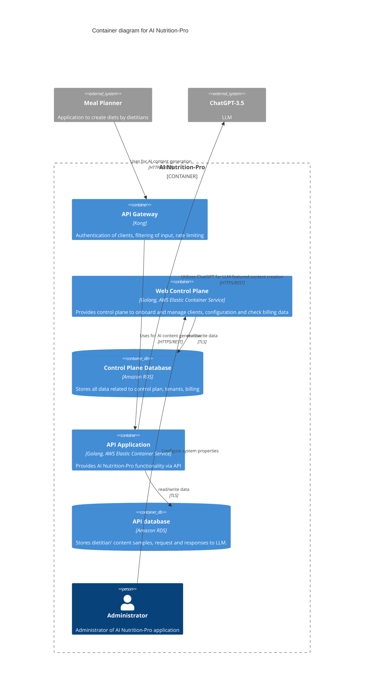

# BUSINESS POSTURE

The AI Nutrition-Pro application aims to empower dietitians by integrating AI-powered content generation into their existing Meal Planner applications. The primary business goals are:

1.  **Enhance Dietitian Productivity**: By automating the creation of content such as diet introductions, the application reduces manual effort for dietitians.
2.  **Integrate with Existing Ecosystems**: Provide a robust API for seamless integration with various Meal Planner applications, expanding reach and utility.
3.  **Monetization of AI Services**: Establish a scalable platform for offering AI content generation services, including client onboarding and billing management.
4.  **Leverage Advanced AI Capabilities**: Utilize state-of-the-art LLMs like ChatGPT-3.5 to deliver high-quality, relevant content.

Most important business risks that need to be addressed include:

1.  **Data Privacy and Confidentiality**: Handling of dietitian content samples, which may contain sensitive professional information or, if misused, client data. Unauthorized access or leakage of this data could lead to significant reputational and legal damage.
2.  **AI Content Quality and Reliability**: The accuracy, appropriateness, and ethical implications of AI-generated content. Poor quality or inappropriate content could undermine the trust of dietitians and their clients.
3.  **Cost Management of LLM Usage**: Uncontrolled or inefficient use of external LLM services (e.g., ChatGPT-3.5) could lead to unexpectedly high operational costs.
4.  **System Availability and Performance**: Ensuring the AI Nutrition-Pro application and its integrations are highly available and performant to support continuous operation of connected Meal Planner applications.
5.  **Regulatory Compliance**: Adherence to data protection regulations (e.g., GDPR, HIPAA if client data is processed) based on the nature of the content samples and LLM interactions.

# SECURITY POSTURE

## Existing Security Controls

*   security control: Authentication with Meal Planner applications - each has individual API key. (Described in "Security" section, point 1)
*   security control: Authorization of Meal Planner applications - API Gateway has ACL rules that allow or deny certain actions. (Described in "Security" section, point 2)
*   security control: Encrypted network traffic between Meal Planner applications and API Gateway using TLS. (Described in "Security" section, point 3)
*   security control: API Gateway (Kong) provides client authentication. (Described in "AI Nutrition-Pro container context systems and persons" table, "API Gateway" row, "Responsibilities" column)
*   security control: API Gateway (Kong) provides filtering of input. (Described in "AI Nutrition-Pro container context systems and persons" table, "API Gateway" row, "Responsibilities" column)
*   security control: API Gateway (Kong) provides rate limiting. (Described in "AI Nutrition-Pro container context systems and persons" table, "API Gateway" row, "Responsibilities" column)
*   security control: Encrypted network traffic between Web Control Plane and Control Plane Database using TLS. (Implied by "Rel(app_control_plane, control_plan_db, "read/write data", "TLS")" in the C4Container diagram)
*   security control: Encrypted network traffic between API Application and API database using TLS. (Implied by "Rel(backend_api, api_db, "read/write data", "TLS")" in the C4Container diagram)

## Accepted Risks

No explicit accepted risks were mentioned in the provided documentation.

## Recommended Security Controls

1.  **Application-Level Input Validation and Sanitization**: Beyond API Gateway filtering, implement robust input validation within the `API Application` for all data received, especially before processing by the LLM. This mitigates injection attacks (e.g., prompt injection) and ensures data integrity.
2.  **Output Sanitization**: Implement measures to sanitize and validate content received from the LLM before returning it to the `Meal Planner application` to prevent potential malicious or malformed content from being propagated.
3.  **Secrets Management**: Securely manage API keys for `Meal Planner applications` and any credentials for external services (e.g., ChatGPT-3.5 API keys) using a dedicated secrets management solution (e.g., AWS Secrets Manager, HashiCorp Vault).
4.  **Data Encryption at Rest**: Ensure all sensitive data stored in `Control Plane Database` and `API database` (e.g., dietitian content samples, LLM requests/responses) is encrypted at rest using industry-standard encryption.
5.  **Least Privilege Access**: Implement the principle of least privilege for all internal services and databases. Each component (e.g., `Web Control Plane`, `API Application`) should only have the minimum necessary permissions to perform its functions.
6.  **Comprehensive Logging and Monitoring**: Implement centralized logging for all application components and infrastructure, coupled with real-time monitoring and alerting for security-related events (e.g., failed authentication attempts, unusual API access patterns, LLM errors).
7.  **Secure Software Development Lifecycle (SSDLC)**: Integrate security practices throughout the development lifecycle, including:
    *   **Static Application Security Testing (SAST)**: Automated code analysis during development and CI/CD.
    *   **Dynamic Application Security Testing (DAST)**: Automated scanning of the running application.
    *   **Dependency Scanning**: Regularly check for known vulnerabilities in third-party libraries and dependencies.
    *   **Container Image Scanning**: Scan Docker images for vulnerabilities before deployment.
8.  **Runtime Protection**: Implement runtime security for containers (e.g., AWS Fargate's security features, host-level security agents) to detect and prevent unauthorized activities.

## Security Requirements

### Authentication

*   SR-AUTH-001: All external system interactions with the AI Nutrition-Pro API Gateway must be authenticated using unique API keys.
*   SR-AUTH-002: Internal services (e.g., `Web Control Plane`, `API Application`) must use secure authentication mechanisms (e.g., IAM roles, service accounts) to access databases and other internal resources.
*   SR-AUTH-003: The `Administrator` accessing the `Web Control Plane` must authenticate using strong credentials and multi-factor authentication (MFA).

### Authorization

*   SR-AUTHZ-001: The API Gateway must enforce Access Control List (ACL) rules to authorize `Meal Planner applications` for specific actions and resources.
*   SR-AUTHZ-002: The `Web Control Plane` must implement role-based access control (RBAC) for `Administrator` and other management roles to manage clients, configurations, and billing data.
*   SR-AUTHZ-003: Internal services must operate with the principle of least privilege, only having permissions necessary for their designated functions.

### Input Validation

*   SR-IV-001: The API Gateway must perform initial filtering of all incoming requests to mitigate common web vulnerabilities.
*   SR-IV-002: The `API Application` must perform comprehensive server-side input validation on all data received from `Meal Planner applications` (especially dietitian content samples and LLM prompts) to prevent injection attacks (e.g., prompt injection, SQL injection) and ensure data integrity.
*   SR-IV-003: The `Web Control Plane` must validate all input provided by `Administrators` for configuration and management tasks.

### Cryptography

*   SR-CRYPTO-001: All network traffic between external systems (`Meal Planner application`, `ChatGPT-3.5`) and internal components (`API Gateway`, `API Application`) must be encrypted using TLS 1.2 or higher.
*   SR-CRYPTO-002: All network traffic between internal components (e.g., `Web Control Plane` to `Control Plane Database`, `API Application` to `API database`) must be encrypted using TLS 1.2 or higher.
*   SR-CRYPTO-003: All sensitive data stored in `Control Plane Database` and `API database` (e.g., API keys, dietitian content samples, LLM requests/responses, billing data) must be encrypted at rest using industry-standard encryption algorithms (e.g., AES-256).
*   SR-CRYPTO-004: API keys and other secrets must be stored and managed securely using cryptographic best practices and dedicated secrets management solutions.

# DESIGN

## C4 CONTEXT

```mermaid
C4Context
    title Context diagram for AI Nutrition-Pro

    Person(admin, "Administrator", "Administrator of AI Nutrition-Pro application")
    Person(dietitian, "Dietitian", "Professional who creates diets for clients")

    System_Boundary(ai_nutrition_pro, "AI Nutrition-Pro System") {
        System(api_gateway, "API Gateway", "Entry point for external systems")
        System(app_control_plane, "Web Control Plane", "Manages clients and configurations")
        System(backend_api, "API Application", "Provides AI content generation")
    }

    System_Ext(mealApp, "Meal Planner Application", "Application used by dietitians to create diets")
    System_Ext(chatgpt, "ChatGPT-3.5", "OpenAI Large Language Model")

    Rel(dietitian, mealApp, "Uses to create diets and access AI features")
    Rel(mealApp, ai_nutrition_pro, "Uses for AI content generation", "HTTPS/REST")
    Rel(ai_nutrition_pro, chatgpt, "Utilizes for LLM-featured content creation", "HTTPS/REST")
    Rel(admin, ai_nutrition_pro, "Configures and manages system properties")
```

### C4 CONTEXT elements description

| Name | Type | Description | Responsibilities | Security controls |
| --- | --- | --- | --- | --- |
| AI Nutrition-Pro System | System | The core system providing AI content generation and client management. | - Orchestrates AI content generation <br/> - Manages client onboarding and billing <br/> - Provides API for external integration | security control: API Gateway for authentication, authorization, filtering, rate limiting. <br/> security control: Encrypted network traffic (TLS) for all external interactions. |
| Administrator | Person | An internal user responsible for the operational management of the AI Nutrition-Pro system. | - Manage server configuration <br/> - Resolve system problems <br/> - Oversee client onboarding and billing | SR-AUTH-003: Strong credentials and MFA for access. <br/> SR-AUTHZ-002: Role-based access control (RBAC). <br/> SR-IV-003: Input validation for configuration tasks. |
| Dietitian | Person | A professional user who creates diet plans and utilizes the AI Nutrition-Pro system indirectly through a Meal Planner application. | - Creates diet plans <br/> - Provides content samples for AI generation <br/> - Fetches AI-generated content | N/A (Interacts via Meal Planner application) |
| Meal Planner Application | External system, web application | An external application used by dietitians to create diets. It integrates with AI Nutrition-Pro to leverage AI capabilities. | - Uploads samples of dietitians' content to AI Nutrition-Pro <br/> - Fetches AI generated results from AI Nutrition-Pro | security control: Authentication via individual API keys. <br/> security control: Encrypted network traffic (TLS) with AI Nutrition-Pro. <br/> SR-AUTHZ-001: API Gateway ACL rules for authorization. |
| ChatGPT-3.5 | External system, API | OpenAI's Large Language Model used by AI Nutrition-Pro for generating textual content. | - Generates content based on provided prompts and samples | SR-CRYPTO-001: Encrypted network traffic (TLS) with AI Nutrition-Pro. |

## C4 CONTAINER



### C4 CONTAINER elements description

| Name | Type | Description | Responsibilities | Security controls |
| --- | --- | --- | --- | --- |
| API Gateway | Internal system, API Gateway (Kong) | The entry point for all external API requests into AI Nutrition-Pro. | - Authentication of clients (Meal Planner applications) <br/> - Filtering of input <br/> - Rate limiting <br/> - Routing requests to `API Application` | security control: Authentication with API keys. <br/> security control: ACL-based authorization. <br/> security control: Input filtering. <br/> security control: Rate limiting. <br/> security control: Encrypted network traffic (TLS) for external and internal communication. |
| Web Control Plane | Internal system, Web application (Golang, AWS ECS) | Provides a web interface for `Administrators` to manage clients, configurations, and billing. | - Onboard and manage clients <br/> - Configure system properties <br/> - Check billing data | security control: Encrypted network traffic (TLS) with `Control Plane Database`. <br/> SR-AUTH-003: Strong authentication for administrators. <br/> SR-AUTHZ-002: RBAC for administrative functions. <br/> SR-IV-003: Input validation for configuration. |
| Control Plane Database | Internal database, Amazon RDS | Stores all operational data related to the control plane, including tenant information, configurations, and billing details. | - Storing data for `Web Control Plane` | security control: Encrypted network traffic (TLS) with `Web Control Plane`. <br/> SR-CRYPTO-003: Data encryption at rest (recommended). <br/> SR-AUTHZ-003: Least privilege access for `Web Control Plane`. |
| API Application | Internal system, API application (Golang, AWS ECS) | The core application responsible for processing AI content generation requests and interacting with the LLM. | - Provides AI Nutrition-Pro functionality via API <br/> - Processes dietitian content samples <br/> - Interacts with `ChatGPT-3.5` <br/> - Stores LLM requests and responses | security control: Encrypted network traffic (TLS) with `API database` and `ChatGPT-3.5`. <br/> SR-IV-002: Comprehensive application-level input validation. <br/> SR-CRYPTO-001: Encrypted network traffic (TLS) with ChatGPT-3.5. <br/> Recommended: SR-CRYPTO-004: Secure secrets management for LLM API keys. |
| API database | Internal database, Amazon RDS | Stores data specific to the API functionality, including dietitian content samples, LLM requests, and LLM responses. | - Storing data for `API Application` | security control: Encrypted network traffic (TLS) with `API Application`. <br/> SR-CRYPTO-003: Data encryption at rest (recommended). <br/> SR-AUTHZ-003: Least privilege access for `API Application`. |
| Administrator | Internal Person | Administrator of AI Nutrition-Pro application. | - Manage server configuration <br/> - Resolve problems <br/> - Oversee client onboarding and billing | SR-AUTH-003: Strong credentials and MFA for access. <br/> SR-AUTHZ-002: Role-based access control (RBAC). <br/> SR-IV-003: Input validation for configuration tasks. |
| Meal Planner | External system, web application | One of many Meal Planner applications that can be integrated with AI Nutrition-Pro. | - uploads samples of dietitians' content to AI Nutrition-Pro <br/> - fetches AI generated results from AI Nutrition-Pro | security control: Authentication with individual API key. <br/> security control: Encrypted network traffic (TLS) with API Gateway. |
| ChatGPT-3.5 | External system, API | OpenAI product, an LLM solution. | - Generates content based on provided samples | SR-CRYPTO-001: Encrypted network traffic (TLS) with API Application. |

## DEPLOYMENT

The AI Nutrition-Pro application will be deployed into AWS Elastic Container Service (ECS) using Fargate launch type for serverless container management, leveraging Amazon RDS for managed database services. This provides scalability, high availability, and reduced operational overhead.

### Deployment Architecture

The primary deployment architecture will be based on AWS ECS Fargate, with separate clusters or services for the control plane and the API application to ensure isolation and independent scaling.

```mermaid
C4Deployment
    title Deployment of AI Nutrition-Pro to AWS

    Deployment_Node(aws_region, "AWS Region (e.g., eu-west-1)", "Amazon Web Services cloud region") {
        Deployment_Node(vpc, "Virtual Private Cloud (VPC)", "Isolated network environment") {

            Deployment_Node(public_subnet, "Public Subnet", "Accessible from the internet") {
                Deployment_Node(nat_gateway, "NAT Gateway", "Enables outbound internet access for private subnets")
                Deployment_Node(api_gateway_instance, "Kong API Gateway", "EC2 instance or Fargate service")
            }

            Deployment_Node(private_app_subnet_1, "Private App Subnet (AZ1)", "No direct internet access") {
                Deployment_Node(ecs_cluster_app, "ECS Cluster (App)", "Fargate services for API Application") {
                    Deployment_Node(backend_api_service, "API Application Service", "Golang Docker Container")
                }
                Deployment_Node(ecs_cluster_control, "ECS Cluster (Control)", "Fargate services for Web Control Plane") {
                    Deployment_Node(app_control_plane_service, "Web Control Plane Service", "Golang Docker Container")
                }
            }

            Deployment_Node(private_db_subnet_1, "Private DB Subnet (AZ1)", "Database instances") {
                Deployment_Node(api_db_rds, "API Database", "Amazon RDS (PostgreSQL)")
                Deployment_Node(control_plan_db_rds, "Control Plane Database", "Amazon RDS (PostgreSQL)")
            }

            Deployment_Node(private_app_subnet_2, "Private App Subnet (AZ2)", "No direct internet access") {
                Deployment_Node(ecs_cluster_app_az2, "ECS Cluster (App)", "Fargate services for API Application") {
                    Deployment_Node(backend_api_service_az2, "API Application Service", "Golang Docker Container")
                }
                Deployment_Node(ecs_cluster_control_az2, "ECS Cluster (Control)", "Fargate services for Web Control Plane") {
                    Deployment_Node(app_control_plane_service_az2, "Web Control Plane Service", "Golang Docker Container")
                }
            }

            Deployment_Node(private_db_subnet_2, "Private DB Subnet (AZ2)", "Database instances") {
                Deployment_Node(api_db_rds_az2, "API Database Replica", "Amazon RDS (PostgreSQL) Read Replica")
                Deployment_Node(control_plan_db_rds_az2, "Control Plane Database Replica", "Amazon RDS (PostgreSQL) Read Replica")
            }

        }
        Deployment_Node(elb, "Application Load Balancer (ALB)", "Distributes traffic")
        Deployment_Node(secrets_manager, "AWS Secrets Manager", "Securely stores secrets")
        Deployment_Node(cloudwatch, "Amazon CloudWatch", "Monitoring and logging")
        Deployment_Node(iam, "AWS IAM", "Access management")
    }

    Rel(MealApp, elb, "Connects to", "HTTPS")
    Rel(elb, api_gateway_instance, "Forwards traffic to", "HTTPS")
    Rel(api_gateway_instance, backend_api_service, "Routes API requests to", "HTTPS")
    Rel(api_gateway_instance, app_control_plane_service, "Routes control plane requests to", "HTTPS")
    Rel(app_control_plane_service, control_plan_db_rds, "Reads/Writes data", "TLS")
    Rel(backend_api_service, api_db_rds, "Reads/Writes data", "TLS")
    Rel(backend_api_service, chatgpt, "Makes API calls to", "HTTPS")
    Rel(app_control_plane_service, secrets_manager, "Retrieves secrets from", "HTTPS")
    Rel(backend_api_service, secrets_manager, "Retrieves secrets from", "HTTPS")
    Rel(aws_region, cloudwatch, "Sends logs and metrics to")
    Rel(aws_region, iam, "Manages access permissions")
```

### DEPLOYMENT elements description

| Name | Type | Description | Responsibilities | Security controls |
| --- | --- | --- | --- | --- |
| AWS Region | Deployment Node | A geographical area where AWS hosts its services. | Provides physical infrastructure for all deployed components. | N/A (Inherits AWS foundational security) |
| Virtual Private Cloud (VPC) | Deployment Node | A logically isolated section of the AWS Cloud where resources are launched. | Provides a private, secure network environment for application components. | Network ACLs, Security Groups for traffic filtering. |
| Public Subnet | Deployment Node | Subnets within the VPC that have direct access to the internet via an Internet Gateway. | Hosts public-facing components like the ALB and potentially the API Gateway. | Network ACLs, Security Groups, strict inbound rules. |
| NAT Gateway | Deployment Node | A network address translation service that allows instances in private subnets to connect to the internet or other AWS services, but prevents the internet from initiating connections with those instances. | Enables outbound internet access for `API Application` to communicate with `ChatGPT-3.5`. | N/A (Secure by design for outbound traffic) |
| Kong API Gateway | Deployment Node (EC2/Fargate) | The Kong API Gateway instance(s) that handle all incoming external requests. | - Client authentication <br/> - Request filtering <br/> - Rate limiting <br/> - Routing to backend services | security control: Authentication with API keys. <br/> security control: ACL-based authorization. <br/> security control: Input filtering and rate limiting. <br/> security control: TLS termination and re-encryption. |
| Private App Subnet | Deployment Node | Subnets within the VPC that do not have direct internet access. | Hosts the ECS Fargate services for `Web Control Plane` and `API Application`. | Network ACLs, Security Groups, no direct inbound internet access. |
| ECS Cluster (App/Control) | Deployment Node (Fargate) | An Amazon Elastic Container Service cluster utilizing Fargate launch type. | Manages and orchestrates `API Application` and `Web Control Plane` containers. | AWS Fargate isolation, container image scanning (build phase), runtime protection. |
| API Application Service | Deployment Node (Golang Docker Container) | The running instances of the `API Application` container. | Processes AI content generation requests, interacts with `API Database` and `ChatGPT-3.5`. | SR-IV-002: Application-level input validation. <br/> SR-CRYPTO-002: TLS for database communication. <br/> SR-AUTHZ-003: Least privilege IAM roles. |
| Web Control Plane Service | Deployment Node (Golang Docker Container) | The running instances of the `Web Control Plane` container. | Provides administrative interface for client management and configuration. | SR-AUTH-003: Strong authentication for administrators. <br/> SR-AUTHZ-002: RBAC. <br/> SR-CRYPTO-002: TLS for database communication. |
| Private DB Subnet | Deployment Node | Subnets within the VPC specifically for database instances. | Hosts the Amazon RDS instances for `API Database` and `Control Plane Database`. | Network ACLs, Security Groups, strict inbound rules from private app subnets only. |
| API Database | Deployment Node (Amazon RDS) | A managed relational database service for the `API Application`. | Stores dietitian content samples, LLM requests, and responses. | SR-CRYPTO-003: Data encryption at rest. <br/> SR-CRYPTO-002: TLS for communication. <br/> SR-AUTHZ-003: Least privilege access via IAM roles/database users. |
| Control Plane Database | Deployment Node (Amazon RDS) | A managed relational database service for the `Web Control Plane`. | Stores tenant information, configurations, and billing data. | SR-CRYPTO-003: Data encryption at rest. <br/> SR-CRYPTO-002: TLS for communication. <br/> SR-AUTHZ-003: Least privilege access via IAM roles/database users. |
| Application Load Balancer (ALB) | Deployment Node | Distributes incoming application traffic across multiple targets. | Provides a single entry point for `Meal Planner applications`, handles TLS termination and health checks. | security control: TLS termination. <br/> Configured with WAF (recommended). |
| AWS Secrets Manager | Deployment Node | A service that helps protect access to applications, services, and IT resources by securely storing and rotating credentials. | Securely stores API keys for `Meal Planner applications` and `ChatGPT-3.5`. | SR-CRYPTO-004: Secure storage and retrieval of secrets. <br/> IAM policies for least privilege access. |
| Amazon CloudWatch | Deployment Node | A monitoring and observability service. | Collects logs and metrics from all deployed components for monitoring and alerting. | Centralized logging, security event monitoring. |
| AWS IAM | Deployment Node | A web service that helps securely control access to AWS resources. | Manages user and service permissions across the AWS environment. | Principle of least privilege, MFA for root/admin users. |

## BUILD

The build process for AI Nutrition-Pro emphasizes automation and security checks throughout the CI/CD pipeline. This ensures that only secure, validated artifacts are deployed to production environments.

### Build Process Diagram

```mermaid
graph TD
    A[Developer] --> B(Code Commit);
    B --> C{Git Repository};
    C --> D(CI/CD Pipeline Trigger);

    subgraph CI/CD Pipeline (GitHub Actions / Jenkins)
        D --> E[Build Container Image];
        E --> F{Static Application Security Testing (SAST)};
        F --> G{Dependency Scanning};
        G --> H{Container Image Scanning};
        H --> I[Automated Tests (Unit/Integration)];
        I --> J{Linter / Code Quality Checks};
        J --> K[Publish Build Artifacts];
    end

    K --> L[Artifact Repository (e.g., ECR)];
    L --> M[Deployment to Target Environment];

    style A fill:#f9f,stroke:#333,stroke-width:2px
    style C fill:#ccf,stroke:#333,stroke-width:2px
    style L fill:#bcf,stroke:#333,stroke-width:2px
    style M fill:#fcc,stroke:#333,stroke-width:2px
```

### BUILD process description

1.  **Developer**: The developer writes code for the `Web Control Plane` or `API Application` (Golang services).
2.  **Code Commit**: The developer commits their changes to a version control system.
3.  **Git Repository**: The code is stored in a secure Git repository (e.g., GitHub, GitLab, AWS CodeCommit).
4.  **CI/CD Pipeline Trigger**: A push to a specific branch (e.g., `main` or `develop`) triggers the automated CI/CD pipeline.
5.  **Build Container Image**: The Golang application code is compiled, and a Docker image is built for the respective service (`Web Control Plane` or `API Application`).
6.  **Static Application Security Testing (SAST)**: Automated tools scan the source code for common security vulnerabilities (e.g., OWASP Top 10, CWEs). Issues are reported, and the build can fail if critical vulnerabilities are found.
7.  **Dependency Scanning**: Tools analyze the project's dependencies (e.g., Golang modules) for known vulnerabilities using public vulnerability databases.
8.  **Container Image Scanning**: The newly built Docker image is scanned for operating system and library vulnerabilities. The build fails if high-severity vulnerabilities are detected.
9.  **Automated Tests**: Unit and integration tests are executed to ensure the functionality of the code.
10. **Linter / Code Quality Checks**: Code quality tools (linters) are run to enforce coding standards and identify potential issues.
11. **Publish Build Artifacts**: If all previous steps pass, the validated Docker image is tagged and pushed to an immutable Artifact Repository.
12. **Artifact Repository (e.g., ECR)**: A secure container registry (e.g., Amazon Elastic Container Registry) stores the build artifacts, ensuring version control and integrity.
13. **Deployment to Target Environment**: The validated and scanned container image is then pulled from the Artifact Repository and deployed to the AWS ECS Fargate environment (as described in the Deployment section).

Security controls during the build process:

*   **Supply Chain Security**: Dependency scanning and container image scanning protect against vulnerabilities introduced via third-party libraries or base images.
*   **Build Automation**: The entire process is automated to minimize human error and ensure consistency.
*   **Security Checks**: SAST, dependency scanning, and container image scanning are integrated as mandatory gates in the pipeline, failing the build if critical issues are found.
*   **Immutable Artifacts**: Once an image is built and scanned, it is immutable, ensuring that the deployed artifact is exactly what was tested.
*   **Secure Environment**: The CI/CD environment itself is secured with appropriate access controls and isolation.

# RISK ASSESSMENT

## Critical Business Processes to Protect

1.  **AI Content Generation**: The core functionality of generating diet-related content using LLMs for `Meal Planner applications`. This directly impacts the value proposition and the service offered to dietitians.
2.  **Client Onboarding and Management**: The process of registering `Meal Planner applications` as clients, managing their configurations, API keys, and billing. This is crucial for business operations and revenue generation.
3.  **Data Ingestion and Storage**: The secure handling of dietitian content samples and LLM requests/responses. Loss or corruption of this data would severely impact content quality and service reliability.
4.  **API Integration**: The seamless and secure interaction between `Meal Planner applications` and the AI Nutrition-Pro API. Any disruption affects external users directly.

## Data to Protect and Their Sensitivity

1.  **Dietitian Content Samples**:
    *   **Sensitivity**: High. This data represents proprietary professional content from dietitians. It could contain unique methodologies, specific dietary advice, or even indirectly hint at client information if not properly anonymized by the `Meal Planner application` before submission. Unauthorized access could lead to intellectual property theft or reputational damage.
    *   **Location**: Stored in `API database`. Transmitted between `Meal Planner application` -> `API Gateway` -> `API Application`.
2.  **LLM Requests and Responses**:
    *   **Sensitivity**: High. These include the prompts sent to `ChatGPT-3.5` (which contain dietitian content samples) and the generated responses. If prompts inadvertently contain Personally Identifiable Information (PII) or Protected Health Information (PHI) about clients (which should be prevented at the `Meal Planner application` level), then this data becomes extremely sensitive. Even without PII, the combination of input and output represents the core AI-generated value.
    *   **Location**: Transmitted between `API Application` -> `ChatGPT-3.5`. Stored in `API database`.
3.  **Client API Keys**:
    *   **Sensitivity**: High. These keys grant access to the AI Nutrition-Pro API. Compromise could lead to unauthorized usage, data exfiltration, or denial of service through excessive requests.
    *   **Location**: Stored in `Control Plane Database` (for management), configured in `API Gateway`. Transmitted by `Meal Planner applications`.
4.  **Tenant/Client Configuration Data**:
    *   **Sensitivity**: Medium. Includes settings, preferences, and possibly usage quotas for each `Meal Planner application`. Compromise could lead to service disruption or unauthorized changes.
    *   **Location**: Stored in `Control Plane Database`. Managed by `Web Control Plane`.
5.  **Billing Data**:
    *   **Sensitivity**: Medium-High. Contains information related to service consumption and payment. Compromise could lead to financial fraud or privacy breaches.
    *   **Location**: Stored in `Control Plane Database`. Managed by `Web Control Plane`.
6.  **Administrator Credentials**:
    *   **Sensitivity**: Critical. Credentials for `Administrators` to access the `Web Control Plane` and potentially underlying infrastructure. Compromise grants full control over the system.
    *   **Location**: Managed by `Web Control Plane` (authentication system), stored in secure identity store.

# QUESTIONS & ASSUMPTIONS

## Questions

1.  What is the exact nature of "dietitians' content samples"? Does it contain any Personally Identifiable Information (PII) or Protected Health Information (PHI) about end-clients, or is it strictly professional content from the dietitian? What are the mechanisms to ensure PII/PHI is not submitted to the LLM?
2.  What are the Service Level Agreement (SLA) requirements for LLM response times and overall API availability for `Meal Planner applications`?
3.  How is the cost and usage of `ChatGPT-3.5` monitored and controlled to prevent unexpected expenses? Are there spending limits or alerts in place?
4.  What are the data retention policies for dietitian content samples and LLM requests/responses stored in the `API database`?
5.  What is the strategy for handling potential "prompt injection" or other adversarial attacks on the LLM via the `API Application`?
6.  Are there specific compliance requirements (e.g., HIPAA, GDPR, SOC 2) that the AI Nutrition-Pro application needs to adhere to, especially concerning data privacy?
7.  How are API keys for `Meal Planner applications` generated, rotated, and revoked? Is there an automated process for this?
8.  What is the plan for disaster recovery and business continuity for the entire AI Nutrition-Pro system?

## Assumptions

### BUSINESS POSTURE

*   The primary users of the AI Nutrition-Pro API are professional dietitians interacting through third-party `Meal Planner applications`.
*   The business model relies on API usage, implying the need for robust billing and client management capabilities.
*   There is a strong emphasis on maintaining trust with dietitians regarding the quality and security of AI-generated content.

### SECURITY POSTURE

*   AWS cloud native security services will be utilized where appropriate (e.g., IAM, Security Groups, KMS, Secrets Manager).
*   All data stored in Amazon RDS databases will leverage AWS native encryption at rest.
*   All network communication, both internal and external, will enforce TLS 1.2 or higher.
*   API keys for `Meal Planner applications` are considered sensitive and will be securely managed.
*   The `Meal Planner applications` are responsible for anonymizing or scrubbing any sensitive client PII/PHI before sending content samples to AI Nutrition-Pro.

### DESIGN

*   The `API Gateway` (Kong) is deployed within the AWS VPC and manages external traffic routing to internal services.
*   Both `Web Control Plane` and `API Application` services are deployed as Docker containers on AWS ECS Fargate, providing managed infrastructure and container orchestration.
*   Amazon RDS (PostgreSQL) is used for both `Control Plane Database` and `API database`, configured for high availability across multiple Availability Zones.
*   The system is designed for multi-tenancy, with `Meal Planner applications` being treated as tenants managed by the `Web Control Plane`.
*   Outbound internet access for the `API Application` (to `ChatGPT-3.5`) is routed through a NAT Gateway for security.
*   CI/CD pipeline includes automated security checks as described in the BUILD section.
