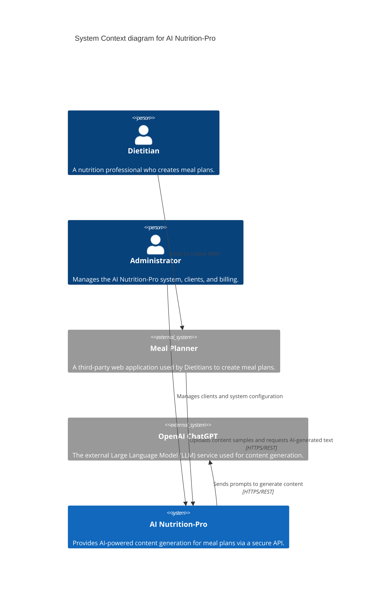
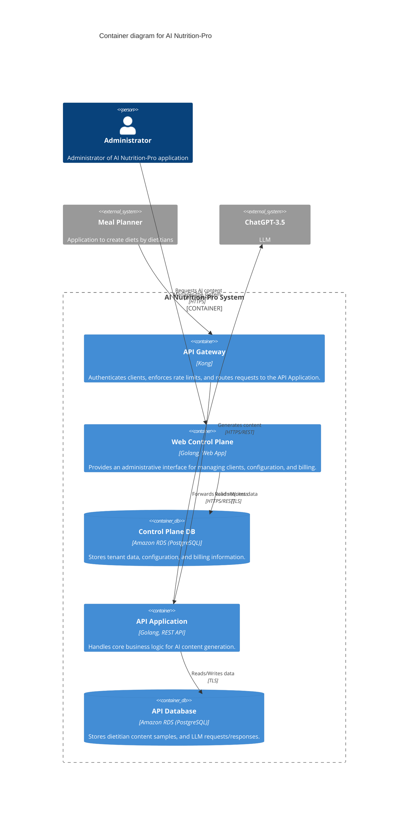
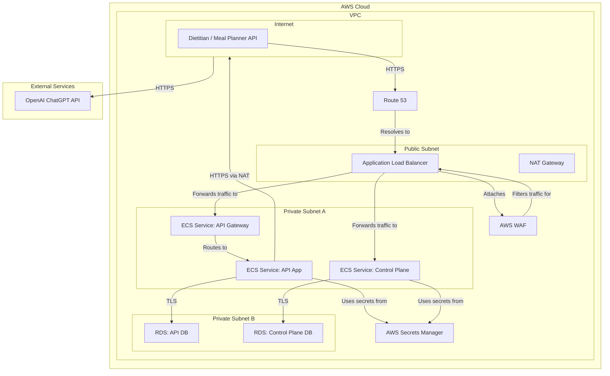
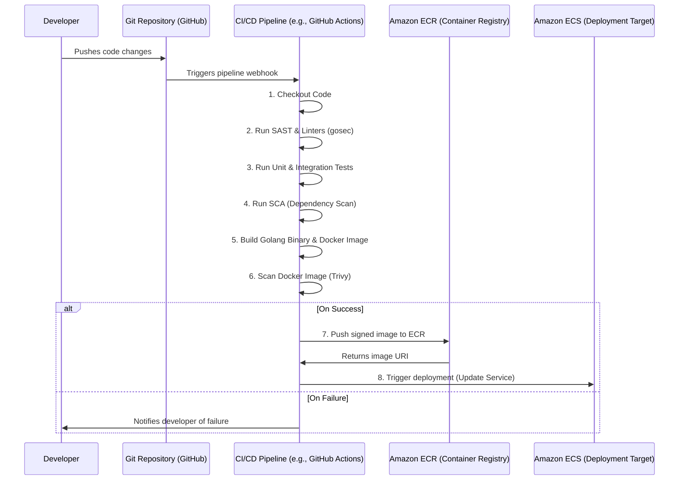

# BUSINESS POSTURE

The AI Nutrition-Pro project aims to provide a B2B API service that integrates with third-party Meal Planner applications. The core business goal is to leverage Large Language Models (LLMs) to automatically generate high-quality, context-aware content, such as diet introductions and meal descriptions, based on content samples provided by dietitians. This saves dietitians significant time, enhances the value of the Meal Planner applications, and creates a new revenue stream for the company.

Business priorities include establishing a reliable and scalable API service, ensuring easy integration for partners, guaranteeing the security and confidentiality of partner data, and maintaining high-quality content generation.

Key business risks that need to be addressed are:
- Reputational Damage: Poor quality, inaccurate, or harmful AI-generated content could damage the brand of both AI Nutrition-Pro and its client applications.
- Service Unavailability: Downtime of the API or the underlying LLM provider would directly impact client operations, leading to customer dissatisfaction and potential churn.
- Data Breach: The leakage of proprietary dietitian content samples or client configuration data would result in a severe loss of client trust, legal liabilities, and competitive disadvantage.
- Vendor Dependency: Over-reliance on a single LLM provider (OpenAI) creates risks related to price increases, API changes, or service degradation.

# SECURITY POSTURE

This section outlines the current and recommended security controls for the AI Nutrition-Pro project.

## Existing Controls and Accepted Risks

- security control: Authentication of client applications is performed at the API Gateway using unique, per-client API keys. This is described in the initial architecture document.
- security control: Authorization is handled via Access Control Lists (ACLs) within the API Gateway, restricting client access to specific API endpoints and actions. This is described in the initial architecture document.
- security control: All external network traffic between client applications and the API Gateway is encrypted using TLS. This is described in the initial architecture document.
- accepted risk: The project currently lacks a dedicated Web Application Firewall (WAF), relying on the more limited filtering capabilities of the API Gateway.
- accepted risk: Initial processes for API key lifecycle management (issuance, rotation, revocation) are manual.
- accepted risk: Centralized, security-oriented logging and monitoring are not yet formally implemented.

## Recommended Security Controls

- Implement a Web Application Firewall (e.g., AWS WAF) in front of the API Gateway to provide protection against common web-based attacks like SQL injection and cross-site scripting, even if the backend is not directly vulnerable.
- Implement robust input validation within the API Application to specifically mitigate prompt injection attacks against the LLM.
- Enable encryption at rest for both the Control Plane Database and the API Database using a service like AWS Key Management Service (KMS).
- Establish a secure CI/CD pipeline that includes Static Application Security Testing (SAST) and Software Composition Analysis (SCA) to identify vulnerabilities in code and dependencies before deployment.
- Implement strict, least-privilege IAM roles for all AWS services, ensuring that ECS tasks and other resources only have the permissions they absolutely require.
- Store all secrets, especially the API key for ChatGPT and database credentials, in a dedicated secrets management service like AWS Secrets Manager.

## Security Requirements

### Authentication
- All API requests from client Meal Planner applications must be authenticated using a unique, non-shared API key transmitted in a secure header.
- Administrative access to the Web Control Plane must be protected by strong credentials and Multi-Factor Authentication (MFA).
- All internal service-to-service communication must be authenticated, preferably using IAM roles (e.g., ECS task roles).

### Authorization
- The API Gateway must enforce authorization rules, ensuring a client can only access data and perform actions within their own tenant scope.
- The Web Control Plane must implement Role-Based Access Control (RBAC) to separate administrative duties (e.g., system configuration vs. billing management).
- IAM roles for internal components must follow the principle of least privilege. For example, the API Application should have read/write access to the API database but not the Control Plane Database.

### Input Validation
- All data received at the API Gateway must be validated for correct type, format, and length.
- The API Application must perform rigorous sanitization and validation on any data that will be used to construct a prompt for the LLM to prevent prompt injection attacks.
- The API Application should validate or sanitize the output received from the LLM before returning it to the client to prevent the injection of malicious or malformed content into the Meal Planner application.

### Cryptography
- All data in transit must be encrypted using TLS 1.2 or higher. This includes external traffic from clients and internal traffic between services and databases.
- All sensitive data at rest must be encrypted. This includes all data in the Control Plane Database (client info, billing) and the API Database (content samples, LLM logs), as well as backups.
- Secret credentials, such as the OpenAI API key and database connection strings, must be stored encrypted in a secrets manager and retrieved at runtime.

# DESIGN

This section provides the detailed design of the AI Nutrition-Pro system.

## C4 CONTEXT

The C4 Context diagram shows the AI Nutrition-Pro system as a single unit and its interactions with users and external systems. The primary user is the Dietitian, who interacts with our system via a partner Meal Planner application. The Administrator manages the system directly.

| Name | Type | Description | Responsibilities | Security controls |
| --- | --- | --- | --- | --- |
| Dietitian | Person | The end-user of the integrated system. A professional who creates diet and meal plans for their clients. | Creates meal plans; Provides content samples that serve as the basis for AI generation. | N/A (Handled by Meal Planner) |
| Administrator | Person | An internal user responsible for the operation of the AI Nutrition-Pro service. | Onboards new Meal Planner clients; Manages system configuration; Monitors service health; Manages billing. | Multi-Factor Authentication (MFA); Role-Based Access Control (RBAC). |
| Meal Planner | External System | A third-party software-as-a-service application that integrates with AI Nutrition-Pro. | Manages dietitian accounts; Provides the user interface for diet creation; Integrates with the AI Nutrition-Pro API. | N/A (External System) |
| OpenAI ChatGPT | External System | The commercial LLM API provided by OpenAI. | Processes prompts containing content samples and instructions; Returns generated text. | N/A (External System) |
| AI Nutrition-Pro | System | The project being designed. It acts as a secure bridge between Meal Planners and the LLM. | Authenticates and authorizes clients; Manages client data securely; Generates prompts and orchestrates calls to the LLM; Logs usage for billing. | API Key Authentication; TLS Encryption; Input Validation; Rate Limiting. |

## C4 CONTAINER

The C4 Container diagram zooms into the AI Nutrition-Pro system, showing the high-level technical components (containers) and their interactions.

| Name | Type | Description | Responsibilities | Security controls |
| --- | --- | --- | --- | --- |
| API Gateway | Container | Kong API Gateway. The single entry point for all client API traffic. | Authenticates clients via API keys; Enforces rate limiting and usage quotas; Routes traffic to the API Application. | API Key validation; ACL enforcement for authorization; TLS termination. |
| Web Control Plane | Container | A Golang web application providing a UI for administrators. | Onboard and manage clients; Configure system properties; View billing and usage data. | User authentication with MFA; Role-Based Access Control (RBAC); CSRF protection. |
| Control Plane DB | Container | An Amazon RDS for PostgreSQL database instance. | Stores all data related to clients (tenants), system configuration, and billing metadata. | Encryption at rest; Encryption in transit (TLS); Access control via IAM and database roles. |
| API Application | Container | A Golang REST API application that contains the core business logic. | Processes requests from the API Gateway; Retrieves content samples from the API DB; Constructs prompts and calls the ChatGPT API; Stores results. | Input validation (for prompt injection); Tenant data isolation logic. |
| API Database | Container | An Amazon RDS for PostgreSQL database instance. | Stores proprietary dietitian content samples; Caches LLM requests and responses for performance and auditing. | Encryption at rest; Encryption in transit (TLS); Access control via IAM and database roles; Strict schema to isolate tenant data. |

## DEPLOYMENT

The system will be deployed entirely within Amazon Web Services (AWS) for scalability and managed services. The proposed architecture uses a Virtual Private Cloud (VPC) with public and private subnets to create a secure network boundary. Services are deployed using AWS Fargate to minimize operational overhead.

Possible deployment solutions include Kubernetes (EKS), virtual machines (EC2), or serverless (Lambda). We have chosen AWS Fargate (ECS) as it provides a good balance of control and operational simplicity for containerized applications.

| Name | Type | Description | Responsibilities | Security controls |
| --- | --- | --- | --- | --- |
| AWS WAF | AWS Service | Web Application Firewall attached to the Application Load Balancer. | Filters malicious traffic like SQL injection and XSS based on defined rulesets. | OWASP Top 10 protection; IP-based blocklists. |
| Application Load Balancer | AWS Service | Distributes incoming traffic across ECS services in private subnets. | TLS termination; Routing requests to the appropriate service (API Gateway or Control Plane). | Integrates with AWS Certificate Manager for TLS; Security group rules. |
| ECS Service | AWS Service | AWS Fargate services running the application Docker containers. | Hosts the API Gateway, API Application, and Web Control Plane containers; Auto-scales based on load. | Runs in private subnets; Least-privilege IAM Task Roles; Security groups. |
| NAT Gateway | AWS Service | Provides outbound internet access for services in private subnets. | Allows the API Application to connect to the external ChatGPT API without exposing it to inbound traffic. | Resides in public subnet; Not directly accessible from the internet. |
| Amazon RDS | AWS Service | Managed relational database instances. | Provides durable, secure, and scalable storage for the API and Control Plane databases. | Runs in private subnets; Encryption at rest and in transit; Security groups; IAM DB authentication. |
| AWS Secrets Manager | AWS Service | A secure service for storing and retrieving secrets. | Manages the OpenAI API key and database credentials, preventing them from being hardcoded. | Fine-grained IAM access control; Automatic secret rotation capabilities. |

## BUILD

The build and release process is automated via a CI/CD pipeline, likely implemented using GitHub Actions or AWS CodePipeline. The process emphasizes security checks at each stage to ensure the integrity and security of the deployed artifacts.

The build process includes the following key security controls:
- Source Code Management: Code is stored in a Git repository with branch protection rules to enforce code reviews before merging to the main branch.
- SAST Scanning: Static Application Security Testing tools (e.g., `gosec` for Golang) are integrated into the pipeline to automatically scan code for common security flaws.
- SCA Scanning: Software Composition Analysis tools scan third-party dependencies for known vulnerabilities (CVEs).
- Image Scanning: The final Docker container image is scanned for vulnerabilities in the base image and system libraries before being pushed to the registry.
- Image Signing: Container images are signed to ensure their integrity and prove they originated from the trusted CI/CD pipeline.
- Secure Deployment: The pipeline uses IAM roles with the minimum necessary permissions to push images to ECR and update the ECS service. No long-lived credentials are used.

# RISK ASSESSMENT

## What are critical business process we are trying to protect?
- Client Onboarding and Management: The process of signing up new Meal Planner clients, configuring their access, and managing their lifecycle.
- AI Content Generation: The core service function of accepting a request, interacting with the LLM, and returning generated content. This process is critical to service delivery.
- Client Billing: The process of accurately tracking API usage and billing clients. Integrity and availability are paramount for revenue collection.
- Data Confidentiality: Protecting the proprietary content samples provided by clients is a critical process for maintaining client trust and avoiding legal liability.

## What data we are trying to protect and what is their sensitivity?
- Dietitian Content Samples (High Sensitivity): This is the intellectual property of the clients. A breach would cause direct competitive and reputational harm to them and destroy trust in the AI Nutrition-Pro service.
- LLM Prompts and Responses (High Sensitivity): This data is derived from client IP and represents the core operational data of the service. Its exposure could reveal client strategies.
- Client Configuration and Billing Data (High Sensitivity): Contains client business information, service configurations, and financial data. A breach would have direct reputational and financial consequences.
- API Keys (Critical Sensitivity): Compromise of client API keys would allow an attacker to impersonate a client. Compromise of the internal OpenAI API key would allow an attacker to abuse the LLM service at the company's expense.

# QUESTIONS & ASSUMPTIONS

## Questions
- What are the specific multi-tenancy requirements? How must tenant data be isolated at the database level (e.g., separate schemas, row-level security)?
- Are there any data residency requirements (e.g., GDPR) that dictate where client data can be stored and processed?
- What are the service level agreements (SLAs) for API uptime and response time that will be offered to clients?
- Is there a formal incident response plan in case of a security breach or major service outage?
- Who is responsible for the lifecycle management (issuance, rotation, revocation) of client API keys?

## Assumptions
- The business has a moderate risk appetite, prioritizing growth and feature velocity while establishing foundational security controls.
- The initial deployment will target a single AWS region. A multi-region disaster recovery strategy is not in the initial scope.
- The "Administrator" role is a single, highly privileged role for the initial launch. This role will be broken down using RBAC as the team grows.
- Tenant data can be co-located within the same database instances, provided there is strong logical separation enforced by the application layer.
- The project will leverage AWS-native security and monitoring services (e.g., WAF, GuardDuty, CloudTrail) to accelerate development and reduce operational burden.
