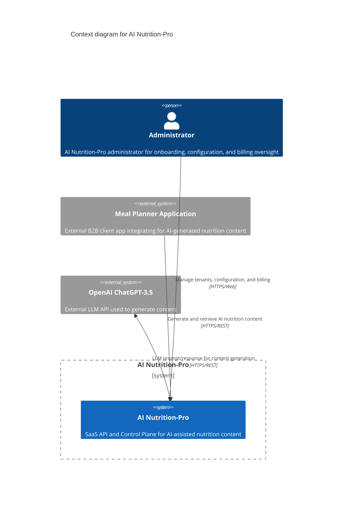
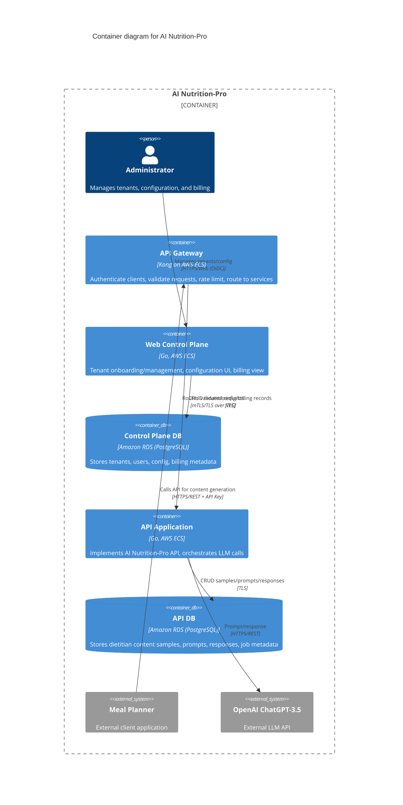
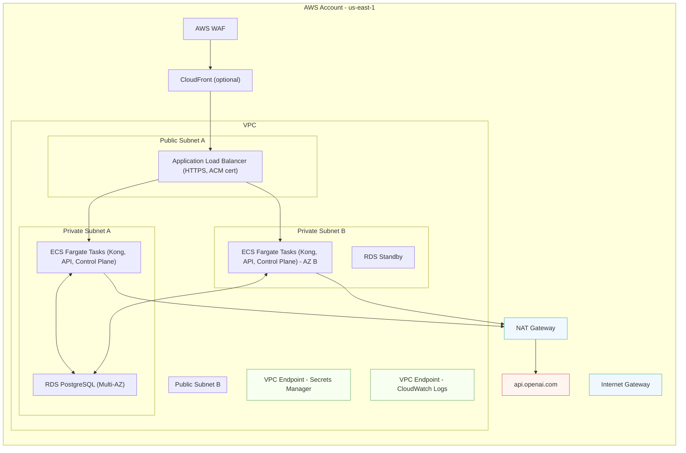
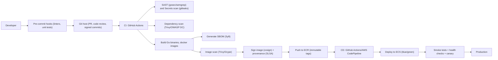

# BUSINESS POSTURE

AI Nutrition-Pro is a B2B SaaS that provides AI-assisted nutrition content generation for Meal Planner applications. The primary goals are:
- Enable fast, accurate generation of nutrition content using LLMs.
- Provide a multi-tenant control plane to onboard and manage clients, enforce configuration, and monitor billing/usage.
- Offer a stable, secure API surface for partner integrations at scale.

Business priorities:
- Time-to-market: rapid onboarding of Meal Planner partners.
- Reliability and availability of API and control plane.
- Cost efficiency while scaling (startup posture, moderate risk appetite).
- Protection of tenant data and compliance readiness for potential health-related data.

Top business risks to address:
- Data privacy leakage to external LLM provider, leading to loss of trust or regulatory exposure.
- Service downtime impacting partner SLAs and revenue.
- Abuse, overuse, or fraudulent API usage leading to unexpected costs.
- Tenant misconfiguration or segregation failures causing cross-tenant data exposure.
- Supply chain compromise in software delivery leading to incident and reputational damage.

# SECURITY POSTURE

Existing security controls and accepted risks sourced from the FILE and expanded with clear placement:

- security control: Client authentication via individual API keys
  - Implemented at API Gateway (Kong) using key-auth plugin per tenant/app.
  - Described under Security point 1 in FILE.
- security control: Authorization via ACL rules
  - Implemented at API Gateway (Kong ACL/route-level policies) to allow/deny actions per client.
  - Described under Security point 2 in FILE.
- security control: Encrypted network traffic with TLS
  - Implemented between Meal Planner applications and API Gateway, and between services to databases (TLS).
  - Described under Security point 3 in FILE.

Additional security controls inferred from architecture and recommended as high priority:

- security control: RBAC with OIDC for Web Control Plane
  - Integrate with an external IdP (Okta/Auth0/AWS Cognito). Roles: Administrator, Onboarding Manager, Tenant Manager.
- security control: Fine-grained authorization in API Application
  - Enforce tenant scoping at the service and data layers; apply least privilege per endpoint.
- security control: Input validation and schema enforcement
  - Validate all inbound JSON against OpenAPI/JSON Schema at Kong or API layer; limit request size, fields, and content type.
- security control: Output handling and safety
  - Apply content moderation and allowlist/denylist checks on LLM outputs; prevent prompt injection propagation.
- security control: Data encryption at rest with KMS
  - RDS instances encrypted with AWS KMS CMK; enable Transparent Data Encryption equivalents where applicable.
- security control: Secrets management
  - Store all API keys, DB creds, and OpenAI credentials in AWS Secrets Manager; retrieve at runtime with IAM roles.
- security control: Network segmentation
  - Private subnets for ECS tasks and RDS; security groups for least privilege; no public RDS exposure.
- security control: Egress controls
  - NAT gateway egress restricted via network firewall or egress gateway policies; only allow api.openai.com and required endpoints.
- security control: WAF and rate limiting
  - AWS WAF in front of ALB/CloudFront for common exploits; Kong per-tenant rate limiting and spike arrest.
- security control: Observability and audit logging
  - Centralize logs to CloudWatch; immutable storage to S3 with retention; audit trails for admin actions and tenant changes.
- security control: Key management and rotation
  - Rotate client API keys; rotate OpenAI API keys; rotate DB creds via Secrets Manager; short-lived task credentials via IAM roles.
- security control: Dependency and container scanning
  - CI pipeline enforces SAST, SCA, container image scanning; block on critical findings.
- security control: Artifact signing and provenance
  - Sign containers with cosign; produce SBOM (Syft) and attestations (SLSA provenance).
- security control: DLP and redaction to LLM
  - Redact PII and sensitive fields before sending prompts to OpenAI where feasible; configurable per tenant.
- security control: Data retention and deletion policies
  - Configurable retention for stored prompts/responses; tenant-controlled deletion; backups encrypted and lifecycle-managed.
- security control: Multi-AZ RDS and backups
  - Automated backups; PITR; tested restores; RTO/RPO targets documented.
- security control: Incident response playbooks
  - Runbooks for API outage, key compromise, data exfiltration via LLM, and elevated error rates.

Accepted risks (current assumptions that need explicit business approval):

- accepted risk: Use of external LLM provider (OpenAI) may process or store prompts/responses per their policies.
  - Mitigation: DLP/redaction, tenant disclosures, data handling controls; but residual risk remains.
- accepted risk: API key authentication for B2B clients
  - Mitigation: Per-tenant keys, rotation, IP allowlists, rate limits; consider migration path to mTLS/JWT in future.
- accepted risk: Storage of prompts and LLM responses in API database
  - Mitigation: Encryption, retention limits, access controls; ensure tenant consent and ability to opt out.
- accepted risk: Outbound internet dependency for LLM calls may impact availability and latency
  - Mitigation: Retries, circuit breakers, fallbacks; status-based routing; but external dependency remains.

Security requirements for this project:

- Authentication
  - B2B client-to-API: API keys at Kong initially; evaluate JWT with shared JWKS per tenant or mTLS for higher assurance.
  - Admin/control plane: OIDC with MFA enforced at IdP; session management with short-lived cookies and CSRF protection.
- Authorization
  - Kong ACL per tenant and API scope; backend service enforces per-tenant resource access and role-based checks.
  - Database-level: ensure tenant_id scoping on all queries; apply row-level filters in DAL.
- Input validation
  - Strict OpenAPI contract validation; length and type checks; reject unknown fields; sanitize content.
  - Rate limits and request size limits at Kong; body and field-level constraints in API layer.
- Cryptography
  - TLS 1.2+ everywhere; ACM certificates on ALB/Kong; re-encrypt TLS to backend.
  - RDS encrypted with KMS CMK; backups and snapshots encrypted.
  - Hash API keys at rest (HMAC-SHA256 with per-tenant salt); do not store plaintext keys.
  - Secrets in Secrets Manager; access via IAM roles for ECS tasks.
- Logging and monitoring
  - Structured logs with tenant_id; centralized metrics and traces; alarms on auth failures, spikes, and LLM errors.
- Privacy and data handling
  - Configurable redaction before LLM; tenant-level toggles; DPA and ToS alignment; data residency considerations if required.

# DESIGN

## C4 CONTEXT

Context elements

| Name | Type | Description | Responsibilities | Security controls |
| --- | --- | --- | --- | --- |
| Administrator | Person | Internal admin managing platform | Onboard tenants; manage configuration; review billing and usage; respond to incidents | security control: OIDC SSO with MFA; security control: RBAC; security control: audit logging |
| Meal Planner Application | External system | B2B client integrating via REST API | Upload content samples; request AI-generated content; consume results | security control: API key auth; security control: per-tenant rate limits; security control: TLS 1.2+ |
| OpenAI ChatGPT-3.5 | External system | Third-party LLM provider | Process prompts and return generated content | security control: TLS to provider; security control: outbound egress control; accepted risk: third-party data processing |
| AI Nutrition-Pro | System | Core SaaS (API and control plane) | Authenticate/authorize clients; orchestrate LLM calls; store prompts/responses; manage tenants | security control: input validation; security control: data encryption at rest; security control: logging and monitoring |

## C4 CONTAINER

Container elements

| Name | Type | Description | Responsibilities | Security controls |
| --- | --- | --- | --- | --- |
| API Gateway | Container | Kong on ECS | Client authn/authz; request filtering; routing; rate limiting | security control: API key auth; security control: ACL per route; security control: OpenAPI/schema validation; security control: rate limiting; security control: WAF integration upstream |
| Web Control Plane | Container | Go service on ECS | Admin UI and APIs for tenant lifecycle, config, billing views | security control: OIDC with RBAC; security control: CSRF protection; security control: input validation; security control: audit logging |
| Control Plane DB | Container (DB) | RDS PostgreSQL | Persist tenant, user, config, billing metadata | security control: KMS encryption; security control: TLS in-transit; security control: least-privilege DB roles; security control: backups and PITR |
| API Application | Container | Go service on ECS | Core business logic, LLM orchestration, persistence | security control: service-level authZ; security control: tenant isolation in data layer; security control: output moderation; security control: secrets via IAM/Secrets Manager |
| API DB | Container (DB) | RDS PostgreSQL | Store samples, prompts, responses, job states | security control: KMS encryption; security control: row-level access via tenant_id; security control: retention policies; security control: backups and PITR |
| Meal Planner | External system | B2B client app | Integrates and consumes API | security control: API key storage hygiene (contractual); security control: TLS |
| OpenAI ChatGPT-3.5 | External system | LLM API | Generate content | security control: TLS; security control: outbound allowlist; accepted risk: third-party processing |
| Administrator | Person | Internal operator | Tenant/config operations | security control: MFA SSO; security control: least privilege |

## DEPLOYMENT

Possible deployment architectures:
- AWS ECS on Fargate behind ALB with AWS WAF (recommended).
- AWS EKS with Ingress and service mesh.
- Serverless (API Gateway + Lambda) for API and control plane; RDS Proxy for DB.
- Hybrid edge with CloudFront in front of ALB for global performance.

Chosen model to describe in detail: AWS ECS on Fargate behind ALB and WAF, with RDS Multi-AZ and controlled egress to OpenAI.

Deployment elements

| Name | Type | Description | Responsibilities | Security controls |
| --- | --- | --- | --- | --- |
| AWS WAF | Network security | Managed web ACLs | Block common exploits, abusive patterns | security control: OWASP rules; security control: IP allowlists per tenant (optional) |
| CloudFront (optional) | CDN | Edge distribution for API/UI | TLS termination at edge, caching static assets | security control: Origin Access; security control: TLS 1.2+ |
| ALB | Load balancer | HTTPS ingress to ECS | TLS termination and pass-through to Kong; health checks | security control: ACM-managed certs; security control: TLS policies |
| ECS Fargate Tasks | Compute | Containers for Kong, API, Control Plane | Run workloads across AZs | security control: IAM task roles; security control: SG least privilege; security control: no public IPs |
| RDS PostgreSQL | Database | Multi-AZ managed DB | Persistent storage | security control: KMS encryption; security control: TLS; security control: backups/PITR |
| NAT Gateway | Network | Controlled egress | Outbound to OpenAI and updates | security control: egress allowlist via NACL/NGFW; flow logs |
| VPC Endpoints | Network | Private access to AWS services | Secrets retrieval, logging | security control: endpoint policies |
| CloudWatch Logs | Observability | Centralized logging | Store logs/metrics/alarms | security control: retention policies; security control: access controls |
| Secrets Manager | Secrets | Manage credentials and API keys | Secure secret storage/rotation | security control: KMS encryption; security control: rotation |
| OpenAI API | External | LLM provider | Content generation | security control: TLS; accepted risk: third-party processing |

## BUILD

Secure build, scan, sign, and deploy pipeline (example using GitHub Actions and AWS):

Build and supply chain security controls:
- security control: Enforce branch protection, mandatory reviews, signed commits and tags.
- security control: Pre-commit hooks and CI SAST (gosec/semgrep), linting, and unit tests as gates.
- security control: Secrets scanning (gitleaks), forbid plaintext secrets in repo.
- security control: Dependency/SBOM generation and vulnerability scanning; fail on critical CVEs.
- security control: Container image scanning; minimal base images; non-root users.
- security control: Image signing with cosign; store attestations and SBOM; verify signatures in admission (deployment step).
- security control: Reproducible builds and pinned versions; vendored dependencies where feasible.
- security control: Least-privilege OIDC/GitHub to AWS role for CI; no long-lived AWS keys in CI.
- security control: Blue/green or canary deployments with automatic rollback on health alarms.
- security control: Infrastructure as Code scanning (tfsec/Checkov) if IaC is used.

# RISK ASSESSMENT

Critical business processes to protect:
- Tenant onboarding and configuration management in the control plane.
- API-driven content generation workflows for partner Meal Planner applications.
- Secure storage and retrieval of dietitian content samples, prompts, and LLM responses.
- Billing/usage tracking integrity.

Data to protect and sensitivity:
- Tenant metadata, configuration, and API keys (highly sensitive).
- Dietitian content samples and generated outputs (moderate to high; may contain personal preferences and potentially sensitive nutrition/health-related information).
- Admin user data and audit logs (moderate to high).
- Operational metadata: usage, prompts, responses (moderate; risk increases if prompts include PII).
- Database credentials, OpenAI API credentials, and other secrets (critical).

# QUESTIONS & ASSUMPTIONS

Questions:
1. Do tenants require data residency guarantees or regional isolation?
2. Are any regulatory frameworks in scope (HIPAA, GDPR, CPRA)? Will PHI ever be processed?
3. Should clients be offered a choice to opt out of storing prompts/responses?
4. Do partners prefer API key auth only, or can we move to JWT/mTLS for higher assurance?
5. What are target SLOs, RTO, and RPO for API and control plane?
6. Are billing and usage tracked internally or via an external provider?
7. Are there content moderation requirements or blacklists/allowlists for LLM outputs?
8. What is the expected peak TPS and size of request payloads?
9. Is CloudFront required for latency improvement globally, or is regional ALB sufficient?
10. Will there be a sandbox mode with synthetic data for partner testing?

Assumptions:
- Startup posture with moderate risk appetite; cost efficiency prioritized but not at expense of core security controls.
- Multi-tenant architecture with strict logical isolation via tenant_id scoping.
- OpenAI ChatGPT-3.5 is the initial LLM provider; outbound internet egress is permitted from private subnets via NAT.
- AWS ECS on Fargate is the target runtime for API Gateway (Kong), API Application, and Web Control Plane.
- RDS PostgreSQL is used for both control plane and API data, each in separate instances or databases with separate credentials.
- TLS 1.2+ enforced end-to-end; ACM for certificates; secrets in AWS Secrets Manager.
- Prompts and responses are stored by default for traceability and improvement unless tenant opts out; retention is configurable.
- CI/CD uses GitHub Actions with OIDC to assume roles in AWS; images stored in ECR; deployments via ECS blue/green.
