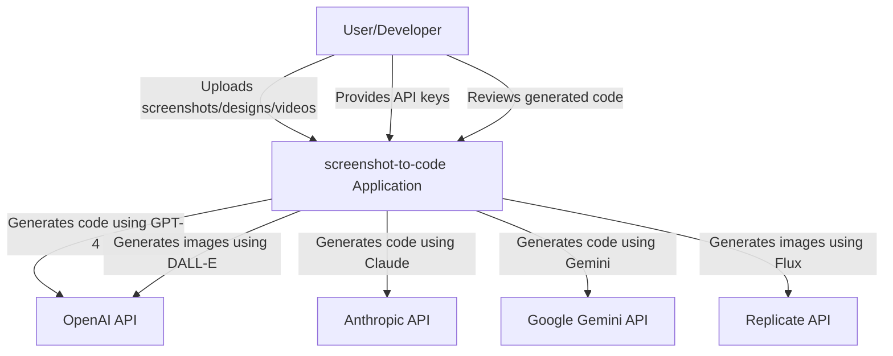
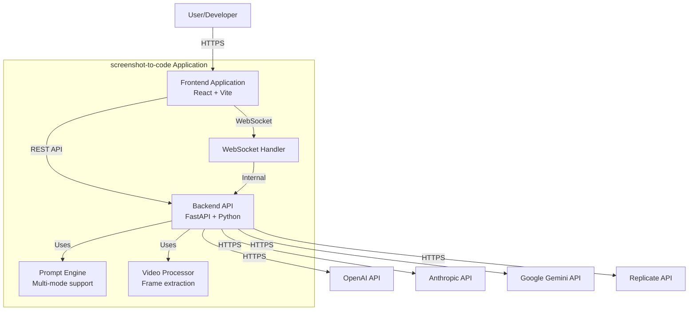
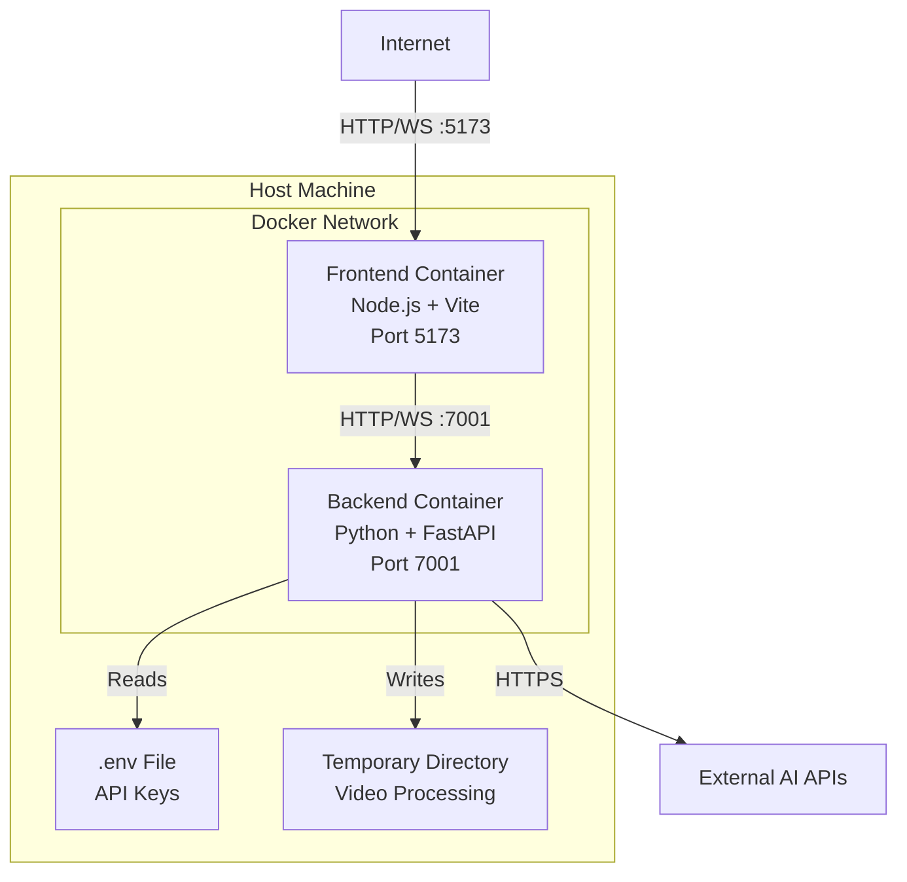
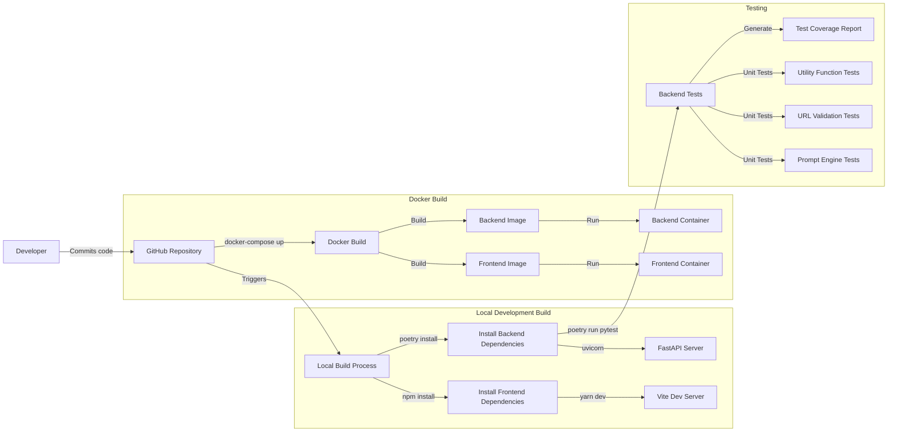

# DESIGN DOCUMENT: screenshot-to-code

## BUSINESS POSTURE

### Business Priorities and Goals

The screenshot-to-code project aims to:

1. **Democratize Web Development**: Enable users without coding expertise to generate functional web applications from visual designs
2. **Accelerate Development Cycles**: Reduce time-to-prototype by automating the conversion of designs to code
3. **Support Multiple Frameworks**: Provide flexibility by supporting various tech stacks (HTML/Tailwind, React, Vue, Bootstrap, etc.)
4. **Leverage AI Innovation**: Utilize cutting-edge AI models (Claude, GPT-4, Gemini) to deliver high-quality code generation
5. **Offer Flexible Deployment**: Provide both self-hosted (open source) and hosted SaaS options

### Business Risks

1. **API Cost Management**: Heavy reliance on third-party AI APIs (OpenAI, Anthropic, Google) creates variable operational costs
2. **API Key Security**: User-provided API keys must be handled securely to prevent unauthorized access
3. **Quality Consistency**: Generated code quality depends on AI model performance, which may vary
4. **Vendor Lock-in**: Dependence on specific AI providers (OpenAI, Anthropic) creates business continuity risks
5. **Data Privacy**: Processing user screenshots and generated code requires careful handling of potentially sensitive information
6. **Resource Constraints**: Image generation and parallel variant processing can consume significant computational resources

## SECURITY POSTURE

### Existing Security Controls

- **security control**: API keys stored in environment variables (backend/.env) - described in README.md
- **security control**: CORS middleware configured in FastAPI backend - implemented in backend/main.py
- **security control**: WebSocket connection management with proper closure handling - implemented in backend/routes/generate_code.py
- **security control**: Input validation for stack types and input modes - implemented in backend/routes/generate_code.py
- **security control**: HTTPS enforced for external API calls (OpenAI, Anthropic, Replicate) - implemented throughout backend
- **security control**: Frontend environment variable isolation (VITE_*) - described in frontend setup
- **security control**: Docker containerization providing process isolation - described in docker-compose.yml
- **security control**: URL normalization and validation for screenshot functionality - implemented in backend/routes/screenshot.py (normalize_url function)
- **security control**: Protocol validation rejecting unsupported protocols (ftp, file) - implemented in backend/routes/screenshot.py
- **security control**: Video frame extraction limits (max 20 frames) to prevent resource exhaustion - implemented in backend/video/utils.py
- **security control**: Video processing using temporary files with automatic cleanup - implemented in backend/video/utils.py
- **security control**: Custom WebSocket error codes for application-specific errors - defined in backend/ws/constants.py
- **security control**: Test coverage for prompt assembly and URL validation - implemented in backend/tests/

### Accepted Risks

- **accepted risk**: User-provided API keys transmitted over WebSocket connection
- **accepted risk**: No authentication or authorization on the backend API endpoints
- **accepted risk**: Generated code not scanned for malicious content
- **accepted risk**: No rate limiting on API endpoints
- **accepted risk**: Uploaded images not validated for file type or content (beyond basic MIME type detection)
- **accepted risk**: Debug mode can write sensitive information to local filesystem
- **accepted risk**: Video frames saved to temporary directory during debug mode may contain sensitive content
- **accepted risk**: No validation of video file size before processing

### Recommended Security Controls

1. **security control**: Implement API authentication (JWT or API key-based) for backend endpoints
2. **security control**: Add rate limiting to prevent abuse of code generation endpoints
3. **security control**: Implement input sanitization for uploaded images and user prompts
4. **security control**: Add Content Security Policy (CSP) headers to frontend
5. **security control**: Implement secure API key storage (encrypted at rest) for hosted version
6. **security control**: Add request size limits to prevent DoS attacks
7. **security control**: Implement audit logging for all API requests
8. **security control**: Add HTTPS requirement enforcement for production deployments
9. **security control**: Implement video file size validation before processing
10. **security control**: Add virus scanning for uploaded images and videos
11. **security control**: Implement secure cleanup of temporary video files even on errors
12. **security control**: Add validation for image dimensions and file sizes in prompts

### Security Requirements

#### Authentication

- **requirement**: Backend should support optional authentication for production deployments
- **requirement**: API keys should be encrypted when stored (for hosted SaaS version)
- **requirement**: Session management should be implemented for multi-request workflows

#### Authorization

- **requirement**: Access control should be implemented to separate user workspaces
- **requirement**: Rate limits should be enforced per user/API key
- **requirement**: Administrative endpoints should require elevated privileges

#### Input Validation

- **requirement**: All user inputs (images, text prompts, code) must be validated for type and size
- **requirement**: Image uploads must be validated for allowed file types (PNG, JPEG)
- **requirement**: Image size limits must be enforced (currently 5MB for Claude, 7990px max dimension)
- **requirement**: WebSocket messages must validate message type and payload structure
- **requirement**: URL inputs must be normalized and validated (implemented in routes/screenshot.py)
- **requirement**: URLs must only support http and https protocols (implemented in routes/screenshot.py)
- **requirement**: Video files must be validated for supported MIME types
- **requirement**: Video processing must enforce maximum frame extraction limits (20 frames max)
- **requirement**: Prompt history must validate images arrays structure
- **requirement**: Base64 encoded data URLs must be validated for proper format

#### Cryptography

- **requirement**: API keys in transit must use TLS encryption
- **requirement**: Sensitive configuration data should be encrypted at rest
- **requirement**: Generated code should be transmitted over secure WebSocket connections (WSS in production)

## DESIGN

### C4 CONTEXT

### C4 CONTEXT - Element Descriptions

| Name | Type | Description | Responsibilities | Security Controls |
|------|------|-------------|-----------------|-------------------|
| User/Developer | Person | End user who wants to convert designs to code | Provides screenshots/videos, configures settings, reviews generated code | None (external actor) |
| screenshot-to-code Application | Software System | Web application that converts screenshots to functional code | Accept user inputs, orchestrate AI generation, manage variants, generate images, process videos | CORS, input validation, WebSocket security, API key management, URL validation, video frame limits |
| OpenAI API | External System | OpenAI's GPT-4 and DALL-E APIs | Generate code from prompts, generate placeholder images | API key authentication, HTTPS, rate limiting (provider-side) |
| Anthropic API | External System | Anthropic's Claude API | Generate code from prompts with vision capabilities | API key authentication, HTTPS, rate limiting (provider-side) |
| Google Gemini API | External System | Google's Gemini multimodal API | Generate code from prompts with vision capabilities | API key authentication, HTTPS, rate limiting (provider-side) |
| Replicate API | External System | Replicate's Flux image generation API | Generate placeholder images for designs | API key authentication, HTTPS, rate limiting (provider-side) |

### C4 CONTAINER

### C4 CONTAINER - Element Descriptions

| Name | Type | Description | Responsibilities | Security Controls |
|------|------|-------------|-----------------|-------------------|
| Frontend Application | Web Application | React-based SPA with Vite build system | UI rendering, user input handling, WebSocket client, code preview | CSP headers (recommended), input validation, secure WebSocket connection |
| Backend API | API Application | FastAPI Python application | REST endpoints, request orchestration, AI model integration | CORS, input validation, API key validation, error handling, URL normalization |
| WebSocket Handler | WebSocket Server | Real-time communication handler | Stream code generation, manage variants, send status updates | Connection validation, message type validation, error handling, custom error codes |
| Prompt Engine | Component | Multi-modal prompt assembly system | Create prompts for image/text/video modes, manage conversation history, handle imported code | Input validation, image structure validation, history validation |
| Video Processor | Component | Video frame extraction component | Split videos into frames, limit frame count, temporary file management | Frame limit enforcement (20 max), temporary file cleanup, MIME type validation |
| OpenAI API | External API | Third-party AI service | Code generation, image generation | API key authentication, HTTPS |
| Anthropic API | External API | Third-party AI service | Code generation with Claude models | API key authentication, HTTPS |
| Google Gemini API | External API | Third-party AI service | Code generation with Gemini models | API key authentication, HTTPS |
| Replicate API | External API | Third-party image generation service | Flux-based image generation | API key authentication, HTTPS |

### DEPLOYMENT

The project supports multiple deployment architectures:

1. **Local Development**: Docker Compose for local testing
2. **Self-Hosted Production**: Manual deployment on user infrastructure
3. **Hosted SaaS**: Commercial deployment (screenshottocode.com)

We will describe the **Docker Compose deployment** as it represents the reference architecture:

### DEPLOYMENT - Element Descriptions

| Name | Type | Description | Responsibilities | Security Controls |
|------|------|-------------|-----------------|-------------------|
| Frontend Container | Docker Container | Node.js environment running Vite dev server | Serve frontend assets, handle hot reload, proxy WebSocket | Container isolation, network segregation |
| Backend Container | Docker Container | Python environment running FastAPI with uvicorn | Process API requests, manage AI integrations, handle WebSockets, process videos | Container isolation, environment variable isolation, network segregation |
| .env File | Configuration File | Environment variables for API keys | Store sensitive configuration | File system permissions, not committed to git |
| Temporary Directory | File System | Temporary storage for video processing | Store extracted video frames during processing | Automatic cleanup, isolated from other processes |
| Docker Network | Virtual Network | Internal Docker bridge network | Enable container-to-container communication | Network isolation from host |
| Host Machine | Physical/Virtual Server | Server running Docker | Host containers, manage resources | OS-level security, firewall rules, access controls |
| External AI APIs | External Services | OpenAI, Anthropic, Google, Replicate | Provide AI services | HTTPS, API key authentication |

### BUILD

### BUILD - Security Controls

| Name | Type | Description | Responsibilities | Security Controls |
|------|------|-------------|-----------------|-------------------|
| GitHub Repository | Source Control | Central code repository | Version control, collaboration | Branch protection, access controls, audit logs |
| Local Build Process | Build Tool | Developer machine build | Dependency installation, local testing | Developer machine security, dependency scanning (recommended) |
| Frontend Dependencies | npm/yarn | JavaScript package dependencies | Install React, Vite, Tailwind, etc. | package-lock.json, yarn.lock for dependency pinning |
| Backend Dependencies | Poetry | Python package dependencies | Install FastAPI, AI SDKs, moviepy, PIL, etc. | poetry.lock for dependency pinning, virtual environment isolation |
| Docker Build | Container Build | Container image creation | Create reproducible deployment artifacts | Base image verification, layer caching, minimal base images |
| Backend Tests | pytest | Automated test suite | Validate functionality, ensure code quality | Test isolation, mock external services, type checking |
| Prompt Engine Tests | pytest | Prompt assembly tests | Validate multi-modal prompt creation, history handling | Structural matching, mock system prompts |
| URL Validation Tests | pytest | URL normalization tests | Validate URL parsing, protocol filtering | Test various URL formats, invalid protocols |
| Utility Function Tests | pytest | Helper function tests | Validate prompt formatting, summary generation | Truncation testing, content validation |

### BUILD - Process Description

**Development Build:**
1. Developer clones repository from GitHub
2. Frontend: Runs `yarn install` to install dependencies (security control: yarn.lock pins versions)
3. Backend: Runs `poetry install` to install dependencies in isolated virtualenv (security control: poetry.lock pins versions)
4. Frontend: Starts Vite dev server on port 5173
5. Backend: Starts uvicorn server on port 7001
6. No formal security scanning in development (recommended: add pre-commit hooks)

**Docker Build:**
1. Developer runs `docker-compose up --build`
2. Docker reads Dockerfile for frontend and backend
3. Frontend image: Based on node:22-bullseye-slim, installs yarn dependencies
4. Backend image: Based on python:3.12.3-slim-bullseye, installs Poetry and dependencies
5. Images are cached locally (security control: container isolation)
6. Containers start with environment variables from .env file

**Testing:**
1. Backend tests run via `poetry run pytest` (described in TESTING.md)
2. Tests validate:
   - URL normalization and protocol filtering (test_screenshot.py)
   - Prompt assembly for image/text/video modes (test_prompts.py)
   - Image support in conversation history (test_prompts_additional.py)
   - Prompt summary formatting and display (test_prompt_summary.py)
3. Test structure uses typed dictionaries for type safety
4. Tests employ special markers for flexible assertions (ANY, CONTAINS)
5. Test coverage can be generated with `--cov` flag
6. No frontend tests currently implemented (recommended: add vitest tests)

**Security Considerations:**
- Dependencies are pinned via lock files (yarn.lock, poetry.lock)
- No SAST scanning currently implemented (recommended: add CodeQL or Semgrep)
- No dependency vulnerability scanning (recommended: add Dependabot or Snyk)
- No container image scanning (recommended: add Trivy or Grype)
- Secrets managed via .env file (not committed to repository)
- Video processing library (moviepy) is mocked in tests to avoid test dependencies

## RISK ASSESSMENT

### Critical Business Processes

1. **Code Generation Workflow**: Users submit screenshots/videos → AI generates code → Users receive functional code
   - Impact if compromised: Service unavailable, poor code quality, user data exposure
   
2. **API Key Management**: Users provide/store API keys → System authenticates with AI providers
   - Impact if compromised: Unauthorized API usage, financial loss, service disruption

3. **Image Processing Pipeline**: Image upload → Validation → Processing → AI analysis
   - Impact if compromised: Malicious content injection, service degradation, data leakage

4. **Video Processing Pipeline**: Video upload → Frame extraction → AI analysis
   - Impact if compromised: Resource exhaustion, sensitive data exposure, service disruption

5. **Variant Generation System**: Parallel code generation across multiple AI models
   - Impact if compromised: Inconsistent results, resource exhaustion, cost overruns

### Data Sensitivity

**Data Being Protected:**

1. **User API Keys** (HIGH sensitivity)
   - OpenAI, Anthropic, Google Gemini API keys
   - Stored in: Environment variables, potentially WebSocket messages
   - Risk: Financial impact, unauthorized access to AI services

2. **User Screenshots/Designs** (MEDIUM sensitivity)
   - May contain proprietary designs, confidential information
   - Transmitted: Via WebSocket/HTTP to backend, then to AI APIs
   - Stored: Temporarily in memory during processing
   - Risk: Intellectual property theft, privacy violations

3. **User Videos** (MEDIUM-HIGH sensitivity)
   - May contain proprietary designs, product demonstrations, confidential information
   - Transmitted: Via WebSocket/HTTP to backend
   - Stored: Temporarily as files during frame extraction, frames saved to temp directory in debug mode
   - Risk: Intellectual property theft, privacy violations, resource exhaustion

4. **Generated Code** (MEDIUM sensitivity)
   - May contain business logic, proprietary algorithms
   - Transmitted: Via WebSocket to frontend
   - Stored: Temporarily in logs (debug mode), frontend browser storage
   - Risk: Exposure of business logic, security vulnerabilities in generated code

5. **Prompt History** (LOW-MEDIUM sensitivity)
   - Contains user instructions, update history, reference images
   - Stored: Frontend state management (Zustand), passed through WebSocket
   - Risk: Exposure of user intent, design patterns, reference materials

6. **Debug Logs** (MEDIUM sensitivity)
   - Contains prompts, completions, generated code, video frames
   - Stored: Local filesystem when DEBUG_DIR is configured, temporary directories for video frames
   - Risk: Exposure of API keys, user data, system internals, proprietary content

**Data Classification:**
- **Confidential**: API keys, proprietary screenshots, proprietary videos
- **Internal**: Generated code, debug logs, video frames
- **Public**: Project documentation, open-source code

## QUESTIONS & ASSUMPTIONS

### Questions

1. **BUSINESS POSTURE**: What is the target SLA for the hosted version? This would inform infrastructure resilience requirements.

2. **BUSINESS POSTURE**: Are there specific compliance requirements (SOC 2, GDPR, HIPAA) for the hosted SaaS version?

3. **SECURITY POSTURE**: How are API keys handled in the hosted version - are they encrypted at rest?

4. **SECURITY POSTURE**: Is there a plan to implement user authentication and workspace isolation?

5. **SECURITY POSTURE**: What is the data retention policy for generated code and uploaded images/videos?

6. **SECURITY POSTURE**: Should video frames be encrypted when saved to temporary directories during debug mode?

7. **SECURITY POSTURE**: What is the maximum allowed video file size and duration?

8. **DESIGN**: Are there plans to support custom AI model endpoints (e.g., Azure OpenAI, AWS Bedrock)?

9. **DESIGN**: How is horizontal scaling handled for the hosted version under high load?

10. **DESIGN**: What monitoring and alerting systems are in place for the production deployment?

11. **DESIGN**: Should the video processing support additional video formats beyond those detected by mimetypes?

12. **DESIGN**: Is there a plan to add support for additional input modes beyond image/text/video?

### Assumptions

**BUSINESS POSTURE:**
- **Assumption**: The open-source version prioritizes ease of setup over security hardening
- **Assumption**: The hosted version (screenshottocode.com) has additional security controls not present in the open-source codebase
- **Assumption**: Cost optimization for AI API usage is a primary business concern
- **Assumption**: Multi-variant generation is a differentiating feature worth the additional API costs
- **Assumption**: Video processing is an optional feature used less frequently than image/text modes

**SECURITY POSTURE:**
- **Assumption**: Users of the self-hosted version are responsible for securing their own API keys
- **Assumption**: Debug mode is only used in development environments, not production
- **Assumption**: Generated code is trusted and not scanned for malicious content
- **Assumption**: WebSocket connections are over WSS (secure) in production deployments
- **Assumption**: The frontend runs on HTTPS in production deployments
- **Assumption**: Temporary video files are automatically cleaned up by the OS temporary directory mechanisms
- **Assumption**: The 20-frame limit for video processing is sufficient to prevent resource exhaustion
- **Assumption**: URL validation preventing ftp and file protocols is sufficient for security

**DESIGN:**
- **Assumption**: The system is designed for single-user or low-concurrency workloads in self-hosted mode
- **Assumption**: The hosted version uses a separate authentication and workspace isolation layer
- **Assumption**: Image generation is optional and can be disabled for cost savings
- **Assumption**: The WebSocket connection remains open for the duration of code generation
- **Assumption**: Variant count (NUM_VARIANTS=4) is configurable but defaults to 4 for all deployments
- **Assumption**: Frontend and backend are deployed on the same domain/origin in production to simplify CORS
- **Assumption**: Video frame extraction quality (JPEG format) is acceptable for AI analysis
- **Assumption**: The moviepy library is the appropriate choice for video processing
- **Assumption**: Test suite provides adequate coverage for prompt assembly and URL validation logic
- **Assumption**: Type checking with typed dictionaries is sufficient for test data validation