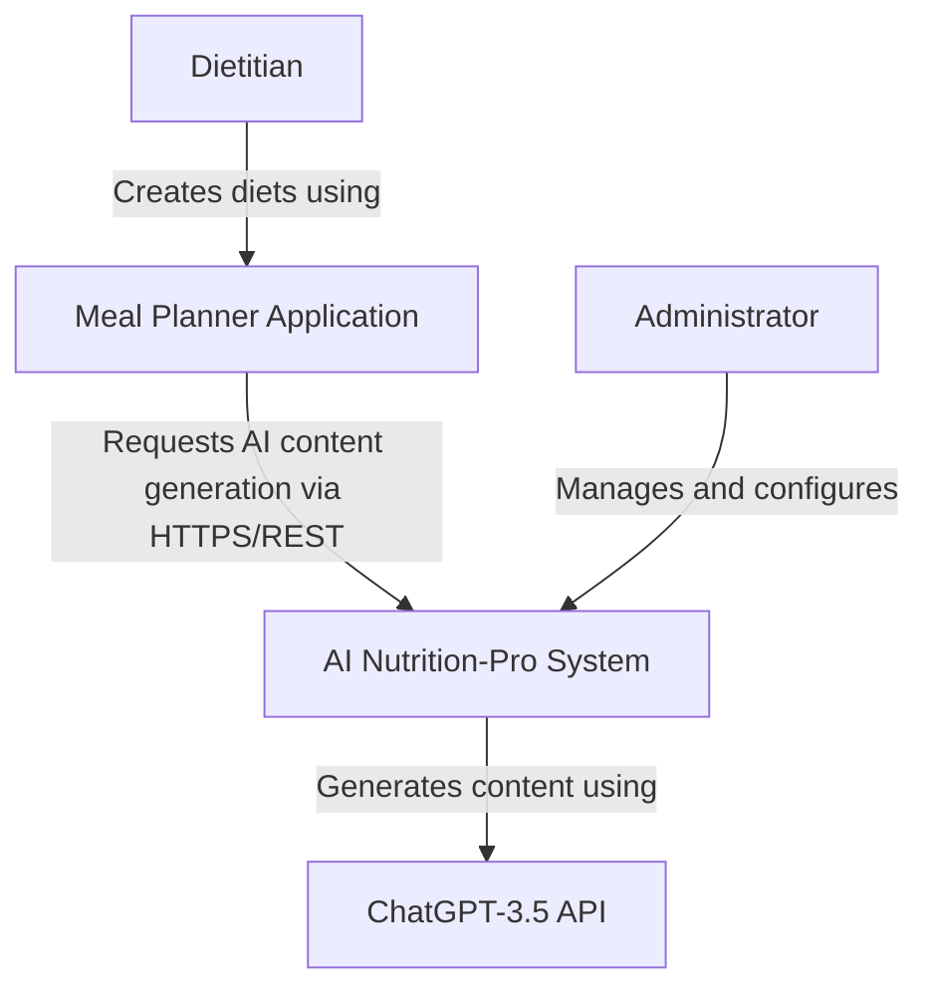
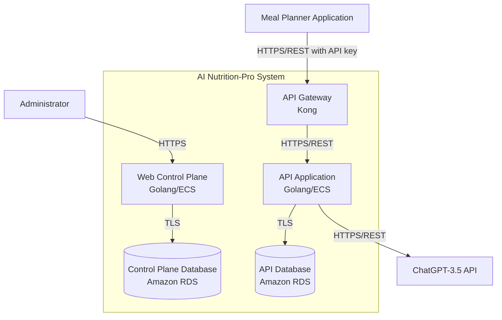
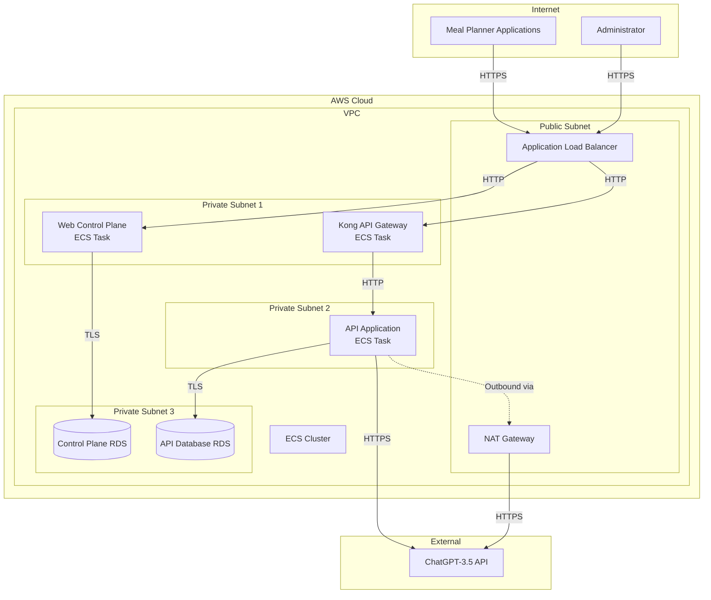

# BUSINESS POSTURE

Business priorities and goals:
- Provide AI-powered content generation capabilities to dietitians through integration with meal planning applications
- Enable scalable onboarding and management of multiple client applications
- Monetize the service through usage-based billing
- Deliver high-quality, personalized nutrition content by leveraging LLM technology
- Maintain service availability and performance through rate limiting and proper infrastructure

Business risks:
- Risk of service disruption impacting multiple client meal planning applications and their end users
- Risk of unauthorized access leading to API key theft and fraudulent usage, resulting in financial losses
- Risk of poor quality AI-generated content damaging reputation with dietitians and end users
- Risk of excessive costs from uncontrolled LLM API usage
- Risk of data privacy violations if dietitian content samples or client data are exposed
- Risk of vendor lock-in with OpenAI ChatGPT service
- Risk of non-compliance with healthcare data regulations depending on the sensitivity of nutrition data

# SECURITY POSTURE

Existing security controls:
- security control: API key authentication for Meal Planner applications implemented in API Gateway
- security control: Access Control List (ACL) rules in API Gateway for authorization
- security control: TLS encryption for network traffic between Meal Planner applications and API Gateway
- security control: Rate limiting implemented in API Gateway to prevent abuse
- security control: Input filtering at API Gateway level
- security control: TLS encryption for database connections (Control Plane Database and API Database)
- security control: Use of AWS Elastic Container Service for container orchestration
- security control: Use of Amazon RDS for managed database services

Accepted risks:
- accepted risk: Reliance on third-party LLM service (ChatGPT-3.5) for core functionality
- accepted risk: Potential exposure of dietitian content samples to OpenAI through API calls

Recommended security controls:
- security control: Implement secrets management solution (AWS Secrets Manager or HashiCorp Vault) for API keys and database credentials
- security control: Enable database encryption at rest for both RDS instances
- security control: Implement comprehensive logging and monitoring with AWS CloudWatch or similar SIEM solution
- security control: Deploy Web Application Firewall (WAF) in front of API Gateway
- security control: Implement network segmentation using VPC and security groups
- security control: Enable MFA for administrator accounts
- security control: Implement automated backup and disaster recovery procedures
- security control: Add API request signing in addition to API keys for enhanced authentication
- security control: Implement data loss prevention (DLP) controls to scan content before sending to external LLM
- security control: Enable AWS GuardDuty for threat detection
- security control: Implement container image scanning in the build pipeline
- security control: Enable AWS Config for compliance monitoring

Security requirements:

Authentication:
- All external API access must use API key authentication
- Administrator access to Web Control Plane must require strong authentication
- Service-to-service communication should use mutual TLS where possible
- API keys must be rotated periodically
- Failed authentication attempts must be logged and monitored

Authorization:
- API Gateway must enforce ACL rules for all client applications
- Role-based access control (RBAC) should be implemented for Web Control Plane users
- Principle of least privilege must be applied to all service accounts and IAM roles
- Authorization decisions must be logged

Input validation:
- All API inputs must be validated against defined schemas
- Input size limits must be enforced to prevent DoS attacks
- Special characters and SQL injection patterns must be filtered
- Content submitted to LLM must be sanitized to prevent prompt injection attacks
- File uploads (if any) must be scanned for malware

Cryptography:
- All data in transit must be encrypted using TLS 1.2 or higher
- All data at rest in databases must be encrypted using AES-256 or equivalent
- API keys and secrets must be stored encrypted
- Cryptographic keys must be managed through AWS KMS or equivalent
- Sensitive data in logs must be masked or encrypted

# DESIGN

## C4 CONTEXT

| Name | Type | Description | Responsibilities | Security controls |
|------|------|-------------|-----------------|-------------------|
| Dietitian | Person | End user who creates personalized diet plans | Creates diet content, uploads samples, reviews AI-generated content | security control: Authentication through Meal Planner Application |
| Meal Planner Application | External System | Third-party web application used by dietitians | Integrates with AI Nutrition-Pro, uploads dietitian content samples, retrieves AI-generated content | security control: API key authentication, security control: TLS encryption, security control: Rate limiting |
| AI Nutrition-Pro System | System | Core application providing AI-powered nutrition content generation | Processes content samples, generates AI content, manages client onboarding, handles billing | security control: API Gateway authentication, security control: Input validation, security control: Network encryption, security control: Database encryption |
| ChatGPT-3.5 API | External System | OpenAI's Large Language Model service | Generates nutrition content based on provided samples and prompts | security control: HTTPS communication, security control: API authentication with OpenAI |
| Administrator | Person | System administrator | Configures system, manages clients, monitors system health, resolves issues | security control: Strong authentication for Web Control Plane, security control: Audit logging |

## C4 CONTAINER

| Name | Type | Description | Responsibilities | Security controls |
|------|------|-------------|-----------------|-------------------|
| API Gateway | Container - API Gateway | Kong API Gateway | Authenticates API requests, enforces rate limits, filters malicious input, routes requests to backend | security control: API key authentication, security control: ACL authorization, security control: Rate limiting, security control: Input filtering, security control: TLS termination |
| Web Control Plane | Container - Web Application | Golang application running on AWS ECS | Manages client onboarding, system configuration, billing data, administrator functions | security control: Administrator authentication, security control: RBAC, security control: Audit logging, security control: TLS encryption, security control: Secure session management |
| Control Plane Database | Container - Database | Amazon RDS instance | Stores tenant data, billing information, configuration settings | security control: Encryption at rest, security control: Encryption in transit (TLS), security control: Database access controls, security control: Automated backups, security control: Network isolation |
| API Application | Container - Application | Golang application running on AWS ECS | Processes AI content generation requests, manages dietitian samples, orchestrates LLM interactions | security control: Input validation, security control: Output encoding, security control: Secure API communication, security control: Error handling without information disclosure, security control: TLS encryption |
| API Database | Container - Database | Amazon RDS instance | Stores dietitian content samples, LLM requests and responses, usage metrics | security control: Encryption at rest, security control: Encryption in transit (TLS), security control: Database access controls, security control: Automated backups, security control: Network isolation, security control: Data retention policies |

## DEPLOYMENT

Possible deployment solutions:
1. AWS ECS with Application Load Balancer (selected for detailed description)
2. AWS EKS (Kubernetes) for more complex orchestration
3. AWS Lambda for serverless architecture
4. Multi-region deployment for high availability

Selected deployment architecture: AWS ECS with Application Load Balancer

| Name | Type | Description | Responsibilities | Security controls |
|------|------|-------------|-----------------|-------------------|
| Application Load Balancer | Infrastructure - Load Balancer | AWS ALB in public subnet | Routes incoming HTTPS traffic to appropriate containers, TLS termination, health checks | security control: TLS 1.2+ enforcement, security control: Security groups, security control: AWS WAF integration, security control: Access logging |
| VPC | Infrastructure - Network | AWS Virtual Private Cloud | Provides network isolation for all resources | security control: Network segmentation, security control: Security groups, security control: Network ACLs, security control: VPC Flow Logs |
| Public Subnet | Infrastructure - Network | Subnet with internet gateway access | Hosts internet-facing resources | security control: Security groups, security control: Network ACLs, security control: Limited resource exposure |
| Private Subnet 1, 2, 3 | Infrastructure - Network | Subnets without direct internet access | Hosts application containers and databases | security control: No direct internet access, security control: Security groups, security control: Network ACLs, security control: Access only through NAT Gateway for outbound |
| NAT Gateway | Infrastructure - Network | Managed NAT service | Enables outbound internet access for private subnet resources | security control: Controlled outbound access, security control: Elastic IP assignment |
| ECS Cluster | Infrastructure - Container Orchestration | AWS ECS cluster | Manages container lifecycle, scaling, and placement | security control: IAM roles for tasks, security control: Task isolation, security control: Container image scanning, security control: Secrets management integration |
| Kong API Gateway ECS Task | Container Instance | Kong running as ECS task | Runtime instance of API Gateway | security control: Container security best practices, security control: Resource limits, security control: Least privilege IAM role, security control: Immutable infrastructure |
| Web Control Plane ECS Task | Container Instance | Golang application as ECS task | Runtime instance of Control Plane | security control: Container security best practices, security control: Resource limits, security control: Least privilege IAM role, security control: Immutable infrastructure |
| API Application ECS Task | Container Instance | Golang application as ECS task | Runtime instance of API Application | security control: Container security best practices, security control: Resource limits, security control: Least privilege IAM role, security control: Immutable infrastructure |
| Control Plane RDS | Database Instance | Amazon RDS Multi-AZ deployment | Managed database instance | security control: Encryption at rest, security control: Automated backups, security control: Multi-AZ for HA, security control: Security groups, security control: Private subnet placement |
| API Database RDS | Database Instance | Amazon RDS Multi-AZ deployment | Managed database instance | security control: Encryption at rest, security control: Automated backups, security control: Multi-AZ for HA, security control: Security groups, security control: Private subnet placement |

## BUILD

```mermaid
graph LR
    Developer[Developer] -->|Commits code| GitHub[GitHub Repository]
    GitHub -->|Triggers| Actions[GitHub Actions]
    
    subgraph CI/CD Pipeline
        Actions -->|Checkout code| Build[Build Stage]
        Build -->|Run tests| Test[Test Stage]
        Test -->|SAST scan| SAST[SAST Scanner<br/>e.g., SonarQube]
        SAST -->|Dependency check| DepCheck[Dependency Scanner<br/>e.g., Snyk]
        DepCheck -->|Build image| Docker[Docker Build]
        Docker -->|Scan image| ImageScan[Container Scanner<br/>e.g., Trivy]
        ImageScan -->|Push| ECR[Amazon ECR]
    end
    
    ECR -->|Deploy| ECS[AWS ECS]
```

Build process description:

The build process follows a secure CI/CD pipeline using GitHub Actions:

1. Developer commits code to GitHub repository
2. GitHub Actions workflow is triggered automatically on push or pull request
3. Build stage compiles the Golang applications
4. Test stage executes unit tests and integration tests
5. SAST scanner performs static analysis to identify security vulnerabilities in code
6. Dependency scanner checks for known vulnerabilities in third-party libraries
7. Docker build creates container images with minimal base images
8. Container scanner analyzes images for vulnerabilities and misconfigurations
9. Signed images are pushed to Amazon ECR with immutable tags
10. ECS deployment pulls images from ECR for deployment

Security controls in build process:
- security control: Source code version control in GitHub with branch protection
- security control: Automated builds on every commit to prevent manual errors
- security control: SAST scanning using tools like SonarQube or Semgrep to detect code vulnerabilities
- security control: Dependency scanning using Snyk or Dependabot to identify vulnerable libraries
- security control: Container image scanning using Trivy or Clair before deployment
- security control: Use of minimal base images (e.g., distroless or Alpine) to reduce attack surface
- security control: Image signing and verification to ensure integrity
- security control: Secrets management using GitHub Secrets, not hardcoded in code
- security control: Immutable image tags to prevent tag overwriting
- security control: Build artifacts stored in private Amazon ECR repository
- security control: Least privilege IAM roles for CI/CD pipeline
- security control: Build logs retained for audit purposes
- security control: Code review requirements before merging to main branch
- security control: Automated testing including security test cases

# RISK ASSESSMENT

Critical business processes being protected:
- AI-powered nutrition content generation for dietitians
- Client onboarding and API key management
- Usage-based billing and revenue collection
- System configuration and administrative functions
- Integration with multiple meal planning applications

Data being protected and sensitivity:
- API keys and authentication credentials (HIGH sensitivity) - unauthorized access could lead to fraudulent usage and financial loss
- Dietitian content samples (MEDIUM to HIGH sensitivity) - proprietary content that could contain personally identifiable information or business-sensitive nutrition strategies
- LLM requests and responses (MEDIUM sensitivity) - could reveal business logic and usage patterns
- Billing and usage data (HIGH sensitivity) - financial information requiring confidentiality and integrity
- System configuration data (MEDIUM sensitivity) - could be exploited if exposed to attackers
- Administrator credentials (HIGH sensitivity) - could lead to complete system compromise
- Database connection strings and secrets (HIGH sensitivity) - could allow unauthorized database access
- Client tenant information (MEDIUM sensitivity) - business relationship data requiring protection

# QUESTIONS & ASSUMPTIONS

Questions:
- What specific healthcare regulations apply to this system (HIPAA, GDPR, etc.)?
- Are there any data residency requirements for storing dietitian content or client data?
- What is the expected scale in terms of number of clients and API requests per second?
- What is the acceptable Recovery Time Objective (RTO) and Recovery Point Objective (RPO)?
- Are there any specific compliance certifications required (SOC 2, ISO 27001)?
- What is the data retention policy for LLM requests/responses and dietitian samples?
- Is there a requirement for audit logging of all administrative actions?
- What level of customer support is provided and how are security incidents handled?
- Are there plans to support multiple LLM providers beyond ChatGPT-3.5?
- What is the process for API key rotation and revocation?
- Is there a requirement for end-user (dietitian) consent before their content is sent to external LLM?
- What monitoring and alerting systems are in place for security events?

Assumptions:

BUSINESS POSTURE:
- The application is targeting small to medium-sized meal planning application providers
- Revenue model is based on API usage (pay-per-use or subscription tiers)
- Business continuity is important but brief service interruptions are acceptable
- The system is in production with active paying customers
- Growth is expected with more client integrations planned

SECURITY POSTURE:
- AWS security best practices are followed for infrastructure
- The organization has moderate security maturity with room for improvement
- Compliance with basic data protection regulations is required
- Security monitoring is basic and needs enhancement
- No formal security incident response plan is currently documented
- Container images are rebuilt regularly but no formal patch management process exists
- Backup and disaster recovery procedures are in place but not fully tested

DESIGN:
- The system is deployed in a single AWS region
- High availability within a region is achieved through Multi-AZ RDS and ECS service distribution
- Network architecture follows standard AWS VPC best practices
- The application uses stateless containers for easy scaling
- Database schema changes are managed through migration scripts
- API versioning is implemented to support backward compatibility
- The system uses synchronous communication with ChatGPT API
- Logging is sent to AWS CloudWatch but log retention and analysis could be improved
- The Golang applications follow secure coding practices but lack formal security code review