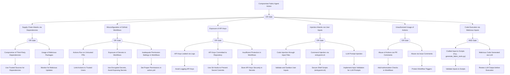

```mermaid
graph TD
    A[Compromise Fabric Agent Action] --> B{{"OR Gate"}}

    %% Primary Attack Vectors
    B --> C("Supply Chain Attacks via Dependencies")
    B --> D("Misconfiguration of GitHub Workflows")
    B --> E("Exposure of API Keys")
    B --> F("Injection Attacks via User Inputs")
    B --> G("Unauthorized Usage of Actions")
    B --> H("Code Execution via Malicious Inputs")

    %% Expand C: Supply Chain Attacks via Dependencies
    C --> C1{{"OR Gate"}}
    C1 --> C1a["Compromise of Third-Party Dependencies"]
    C1 --> C1b["Usage of Malicious Packages"]

    %% Expand D: Misconfiguration of GitHub Workflows
    D --> D1{{"OR Gate"}}
    D1 --> D1a["Actions Run on Untrusted PRs"]
    D1 --> D1b["Exposure of Secrets in Workflows"]
    D1 --> D1c["Inadequate Permission Settings in Workflows"]

    %% Expand E: Exposure of API Keys
    E --> E1{{"OR Gate"}}
    E1 --> E1a["API Keys Leaked via Logs"]
    E1 --> E1b["API Keys Committed to Repository"]
    E1 --> E1c["Insufficient Protection in Workflows"]

    %% Expand F: Injection Attacks via User Inputs
    F --> F1{{"OR Gate"}}
    F1 --> F1a["Code Injection through Input Files"]
    F1 --> F1b["Command Injection via entrypoint.sh"]
    F1 --> F1c["LLM Prompt Injection"]

    %% Expand G: Unauthorized Usage of Actions
    G --> G1{{"OR Gate"}}
    G1 --> G1a["Abuse of Actions via PR Comments"]
    G1 --> G1b["Abuse via Issue Comments"]

    %% Expand H: Code Execution via Malicious Inputs
    H --> H1{{"AND Gate"}}
    H1 --> H1a["Crafted Input to Scripts (e.g., generate_fabric_tools.py)"]
    H1 --> H1b["Malicious Code Generated via LLM"]

    %% Mitigations for E (Exposure of API Keys)
    E1a --> M_E1a["Avoid Logging API Keys"]
    E1b --> M_E1b["Use Git Hooks to Prevent Secret Commits"]
    E1c --> M_E1c["Store API Keys Securely in Secrets"]

    %% Mitigations for D (Misconfiguration of GitHub Workflows)
    D1a --> M_D1a["Limit Actions to Trusted Users"]
    D1b --> M_D1b["Use Encrypted Secrets, Avoid Exposing Secrets"]
    D1c --> M_D1c["Set Proper Permissions in action.yml"]

    %% Mitigations for F (Injection Attacks)
    F1a --> M_F1a["Validate and Sanitize User Inputs"]
    F1b --> M_F1b["Secure Shell Scripts (entrypoint.sh)"]
    F1c --> M_F1c["Implement Input Validation for LLM Prompts"]

    %% Mitigations for G (Unauthorized Usage)
    G1a --> M_G1a["Add Authorization Checks in Workflows"]
    G1b --> M_G1b["Protect Workflow Triggers"]

    %% Mitigations for H (Code Execution via Malicious Inputs)
    H1a --> M_H1a["Validate Inputs to Scripts"]
    H1b --> M_H1b["Review LLM Output before Execution"]

    %% Mitigations for C (Supply Chain Attacks)
    C1a --> M_C1a["Use Trusted Sources for Dependencies"]
    C1b --> M_C1b["Monitor for Malicious Updates"]
```
