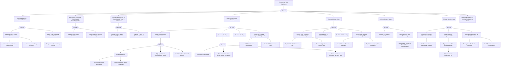

```mermaid
graph TD
    A[Compromise Flask Application] --> B{{OR Gate}}

    B --> C("Obtain Unauthorized Access")
    B --> D["Execute Arbitrary Code"]
    B --> E("Perform Denial of Service")
    B --> F("Exfiltrate Sensitive Data")
    B --> AP("Exploit Vulnerable Dependencies")
    B --> AW("Host Header Injection via Misconfigured SERVER_NAME")
    %% New addition: Proxy Header Injection via Misconfigured ProxyFix Middleware
    B --> BR("Proxy Header Injection via Misconfigured ProxyFix Middleware")
    %% New addition: Privilege Escalation via Running Application as Root
    B --> BS("Privilege Escalation via Running Application as Root")


    %% Exploit Vulnerable Dependencies
    AP --> AQ{{OR Gate}}
    AQ --> AR("Use Vulnerable Package Version")
    AQ --> AS("Supply Chain Attack via Dependencies")
    AR --> AT[Known Vulnerabilities in Dependencies]
    AR --> AU[Outdated Dependency Versions]
    AS --> AV[Compromised Dependency Package]

    %% Host Header Injection via Misconfigured SERVER_NAME
    AW --> AX{{OR Gate}}
    AX --> AY[Bypass Host Header Validation]
    AX --> AZ[Cache Poisoning via Host Header Injection]

    %% Proxy Header Injection via Misconfigured ProxyFix Middleware
    BR --> BT{{OR Gate}}
    BT --> BU[Spoofed Client IP via X-Forwarded-For Header]
    BT --> BV[Improper Trust of X-Forwarded Headers]
    %% These can lead to various attacks like bypassing IP based restrictions.

    C --> G{{OR Gate}}
    G --> H["Bypass Authentication Mechanism"]
    G --> I["Session Hijacking"]
    G --> J["Credential Stuffing"]
    %% New addition: CSRF Attack
    G --> T["Cross-Site Request Forgery (CSRF) Attack"]

    %% Bypass Authentication Mechanism
    H --> K{{OR Gate}}
    K --> L["Brute-force Attack"]
    K --> M["SQL Injection via Authentication Inputs"]
    K --> N["Exploiting Weak Password Policies"]
    L --> O[No Account Lockout Mechanism]
    L --> P[Use of Common or Default Credentials]

    %% Session Hijacking
    I --> Q{{OR Gate}}
    Q --> R[Predictable Session IDs]
    Q --> S[Session Cookies Not Marked Secure or HttpOnly]
    %% New addition: Use of Default or Hardcoded SECRET_KEY
    Q --> U[Use of Default or Hardcoded SECRET_KEY]

    %% CSRF Attack
    T --> V[No CSRF Protection Implemented]
    T --> W[Lack of CSRF Tokens in Forms]

    D --> U1{{OR Gate}}
    U1 --> U1A["Remote Code Execution via Unvalidated Inputs"]
    U1 --> V1("Deserialization of Untrusted Data")
    U1 --> W1("File Upload Vulnerability")
    U1 --> Z["Server-Side Template Injection (SSTI)"]

    U1A --> X[Exploit Upload of Malicious Files]
    U1A --> Y[Command Injection in Celery Tasks]

    Z --> AA[Inject Malicious Code via Templates]
    Z --> AB[Exploit Insecure Template Rendering]

    E --> AC{{OR Gate}}
    AC --> AD[Resource Exhaustion Attack]
    AC --> AE("Abusing Celery Task Processing")
    AE --> AF[Submit Large Number of Tasks Without Authentication]

    F --> AG{{OR Gate}}
    AG --> AH[Access Task Results Without Authorization]
    AG --> AI[Read Sensitive Configuration Files]
    AG --> AJ[Information Disclosure via Error Messages]

    AH --> AK[No Authorization on /tasks/result/<id> Endpoint]
    AI --> AL("Exploit Insecure File Access Methods")
    AL --> AM[Path Traversal in send_static_file]

    AJ --> AN[Debug Mode Enabled in Production]
    AJ --> AO[Leak Sensitive Information in Tracebacks]
```
