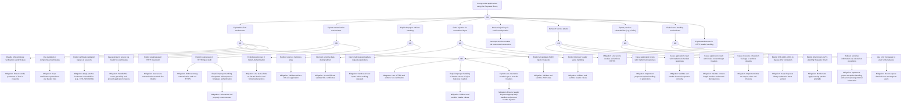

```mermaid
graph TD
    A[Compromise applications using the Requests library] --> B{{OR}}
    B --> C("Exploit SSL/TLS weaknesses")
    B --> D("Exploit authentication mechanisms")
    B --> E("Exploit improper redirect handling")
    B --> F("Code injection via unsanitized input")
    B --> G("Session hijacking via cookie manipulation")
    B --> H("Denial of Service attacks")
    B --> I("Exploit previous vulnerabilities (e.g., CVEs)")
    B --> J("Exploit error handling mechanisms")
    B --> K("Exploit weaknesses in HTTP header handling")

    C --> C1{{OR}}
    C1 --> K1["Man-in-the-middle attack on unencrypted HTTP"]
    C1 --> L["Disable SSL certificate verification (verify=False)"]
    C1 --> M["Use outdated or compromised certificates"]
    C1 --> N["Exploit certificate validation bypass in sessions"]
    C1 --> O["Cause denial of service via invalid SSL certificates"]

    K1 --> K1M["Mitigation: Use HTTPS and enforce SSL verification"]
    L --> L1["Mitigation: Ensure 'verify' parameter is True in requests"]
    M --> M1["Mitigation: Keep certificates updated and use trusted CAs"]
    N --> N1["Mitigation: Apply patches for known vulnerabilities (e.g., CVE-2023-32681)"]
    O --> O1["Mitigation: Handle SSL errors gracefully and prevent application crashes"]

    D --> D1{{OR}}
    D1 --> P["Exploit weaknesses in HTTP Basic Auth"]
    D1 --> Q("Exploit weaknesses in HTTP Digest Auth")
    D1 --> R["Exploit weaknesses in OAuth Authentication"]

    P --> P1["Mitigation: Use secure authentication methods like OAuth2"]
    Q --> Q1["Mitigation: Enforce strong authentication and use HTTPS"]
    Q --> Q2["Exploit improper handling of repeated 401 responses to bypass authentication"]
    Q2 --> Q2M["Mitigation: Limit retries and properly reset counters"]
    R --> R1["Mitigation: Use state-of-the-art OAuth libraries and follow best practices"]

    E --> E1{{OR}}
    E1 --> S["Redirect users to malicious sites"]
    E1 --> T["Intercept sensitive data during redirect"]

    S --> S1["Mitigation: Validate redirect URLs in application"]
    T --> T1["Mitigation: Use HSTS and validate SSL certificates"]

    F --> F1{{OR}}
    F1 --> V["Inject malicious payload via request parameters"]
    F1 --> W["Exploit unvalidated JSON input in requests"]
    F1 --> F2["Exploit improper header value handling"]

    V --> V1["Mitigation: Sanitize all user inputs before making requests"]
    W --> W1["Mitigation: Validate and sanitize JSON data"]
    F2 --> F2M["Mitigation: Validate and sanitize header values"]

    G --> X["Intercept session cookies via unsecured connections"]
    X --> X1["Mitigation: Use secure cookies and enforce HTTPS"]

    H --> H1{{OR}}
    H1 --> Y("Cause application crash with malformed responses")
    H1 --> H2["Cause application crash with malformed chunked responses"]
    H1 --> H3["Cause application crash with invalid content-length headers"]
    H1 --> H4["Cause resource exhaustion via large or endless streams"]

    Y --> Y1["Mitigation: Implement proper exception handling in application"]
    H2 --> H2M["Mitigation: Validate and handle chunked responses correctly"]
    H3 --> H3M["Mitigation: Validate content-length headers and handle discrepancies"]
    H4 --> H4M["Mitigation: Implement limits on request sizes and timeouts"]

    I --> Z{{OR}}
    Z --> AA["Exploit CVE-2023-32681 to bypass SSL verification"]
    Z --> AB["Exploit other known CVEs affecting Requests library"]

    AA --> AA1["Mitigation: Keep Requests library updated to latest version"]
    AB --> AB1["Mitigation: Monitor and apply security patches promptly"]

    J --> J1{{OR}}
    J1 --> J2["Retrieve sensitive information via unhandled exceptions"]
    J1 --> J3["Use error messages to plan further attacks"]
    J2 --> J2M["Mitigation: Implement proper exception handling and avoid exposing internal information"]
    J3 --> J3M["Mitigation: Do not expose detailed error messages to users"]

    K --> K1{{OR}}
    K1 --> K2["Exploit improper handling of header values to inject malicious headers"]
    K1 --> K3["Exploit case-insensitive header keys to override headers"]
    K2 --> K2M["Mitigation: Validate and sanitize header values"]
    K3 --> K3M["Mitigation: Ensure header keys are appropriately handled and prevent header injection"]
```
