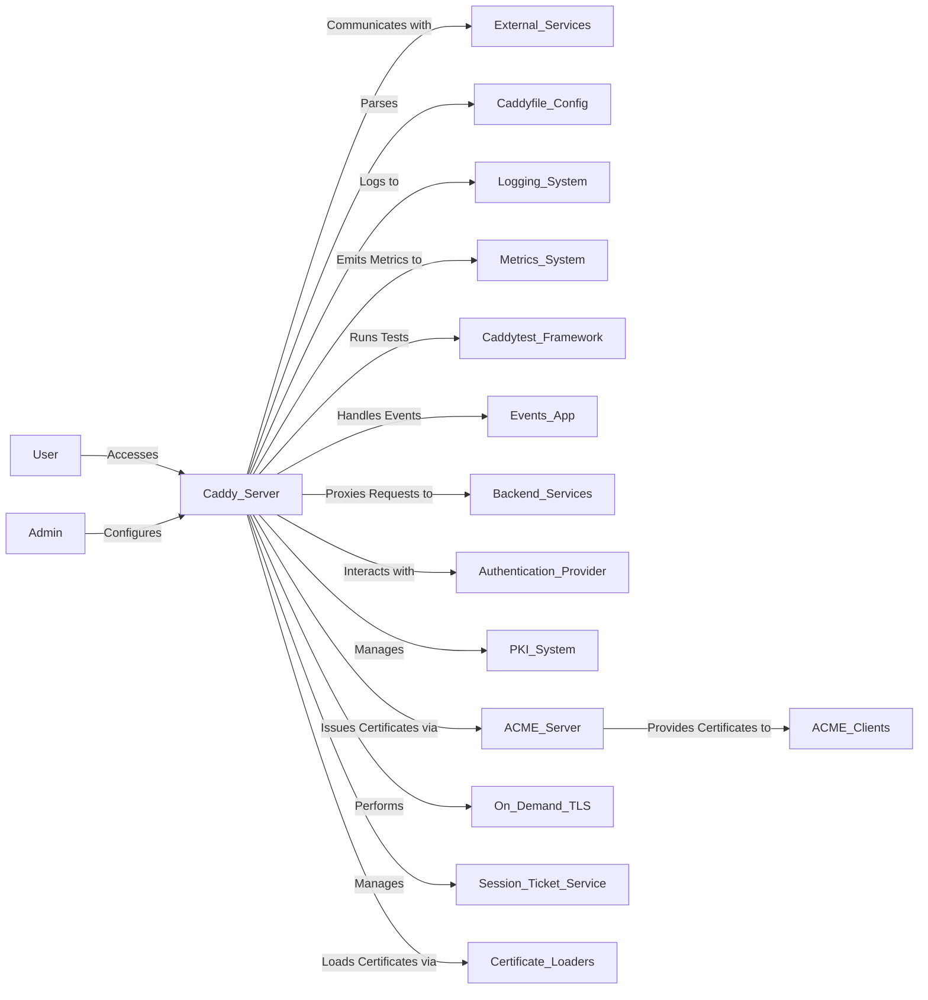
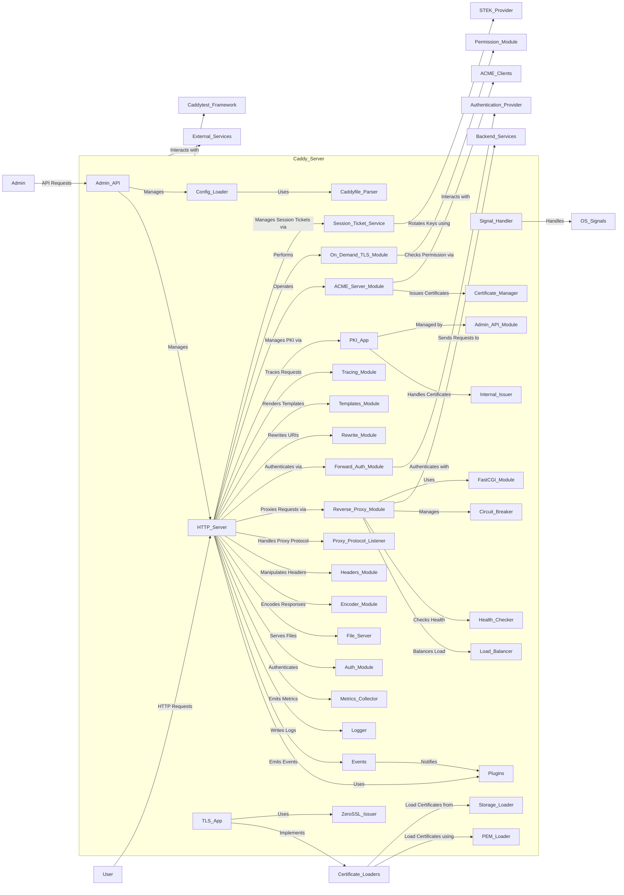

# Design Document

## BUSINESS POSTURE

The project involves the development of the Caddy web server, an extensible server platform known for its ease of use and strong security features. Caddy uses TLS by default and automates HTTPS setup, making it a popular choice for serving websites securely.

### Business Priorities and Goals:

- Simplify Web Server Configuration: Provide an easy-to-use web server that simplifies the setup and management of secure websites.
- Automate HTTPS: Enable automatic HTTPS configuration using Let's Encrypt and ZeroSSL.
- Ensure Security: Offer secure defaults and robust security features to protect user data and server integrity.
- Support Extensibility: Provide a modular architecture that allows developers to extend functionality with plugins.
- Implement Event-Driven Architecture: Introduce an events system to enhance modularity and extensibility.
- Enhance Configuration Flexibility: Improve the Caddyfile configuration adapter to support advanced HTTP configurations.
- Maintain High Performance and Reliability: Deliver a production-ready server capable of handling high traffic efficiently.
- Enhance Observability: Implement logging and metrics collection to monitor server performance and detect security incidents.
- Implement Reverse Proxy Functionality: Integrate a reverse proxy module to allow Caddy to proxy requests to backend servers, enabling load balancing, request routing, and backend server management.
- Enhance Reverse Proxy Capabilities: Improve reverse proxy functionalities by adding advanced selection policies, upstream configurations, and streaming support.
- Introduce FastCGI Support: Implement FastCGI transport to support dynamic content generation through PHP and other languages.
- Implement Forward Authentication Mechanism: Provide a forward authentication module to integrate with external authentication providers.
- Add URL Rewriting Capabilities: Introduce a rewrite module to manipulate request URIs for flexible request routing.
- Enable Template Rendering: Implement a template module to allow dynamic content rendering within the server.
- Integrate Tracing Capabilities: Add tracing support to enable distributed tracing for monitoring and debugging purposes.
- Expose Admin API for PKI Management: Provide an admin API for managing the Public Key Infrastructure (PKI) within the server.
- Implement Internal Certificate Authority (CA): Develop a PKI app within Caddy to manage internal certificates.
- Provide ACME Server Functionality: Implement an ACME server to allow issuance of certificates via the ACME protocol.
- Enable Caddy to Act as a Certificate Authority: Allow Caddy to issue certificates to internal or external clients.
- Implement On-Demand TLS: Enable dynamic certificate issuance during TLS handshakes for domains without preloaded certificates.
- Enhance Certificate Loading Mechanisms: Provide methods to load certificates from PEM data and storage backends.
- Improve Session Ticket Key Management: Implement services to manage TLS session ticket keys, including rotation and synchronization.
- Support Multiple Certificate Issuers: Introduce support for additional certificate authorities like ZeroSSL.
- Implement Distributed Session Ticket Key (STEK) Management: Provide mechanisms to synchronize session ticket keys across distributed environments or clusters to enable secure session resumption.

### Most Important Business Risks:

- Security Vulnerabilities: Potential for security breaches due to software vulnerabilities or misconfigurations.
- Configuration Complexity: Increased complexity in configuration parsing could introduce bugs or security issues.
- Event Handling Complexity: Introducing an event system may add complexity and potential for unforeseen interactions between modules.
- Reliance on External Services: Dependence on external certificate authorities (Let's Encrypt, ZeroSSL) may introduce risks if these services are unavailable.
- Compliance and Legal Risks: Failure to comply with legal and regulatory requirements could result in penalties.
- Community Engagement: Risk of decreased community support, affecting project sustainability and improvement.
- Competitive Market: Other web servers may offer similar features, impacting adoption and market share.
- Performance Overhead: Extensive logging, metrics collection, and new modules may introduce performance overhead affecting server efficiency.
- Sensitive Data Exposure: Logs and traces may contain sensitive data if not properly sanitized.
- Security Vulnerabilities in Reverse Proxy: Potential for security breaches if the reverse proxy module is not properly secured.
- Misconfiguration Risks in Reverse Proxy: Incorrect configuration of the reverse proxy could lead to exposure of backend servers or unauthorized access.
- Performance Overhead in Reverse Proxy: The reverse proxy module might introduce latency or become a bottleneck if not optimized.
- Complexity in Request Routing and Rewriting: Complex routing and rewriting rules might introduce bugs or unexpected behaviors affecting reliability.
- Security Risks in FastCGI Module: Potential for code injection or execution vulnerabilities if FastCGI is not properly secured.
- Authentication Bypass in Forward Auth Module: Risk of unauthorized access if the forward authentication mechanism is misconfigured.
- Template Injection Vulnerabilities: Template rendering could lead to code execution if user inputs are not properly sanitized.
- Tracing Data Leakage: Tracing information may expose sensitive data or system internals.
- PKI Mismanagement: Improper handling of PKI could compromise certificate security.
- Certificate Issuance Risks: Misissuance of certificates could compromise security; acting as a CA introduces additional compliance and security responsibilities.
- Code Complexity in PKI and ACME Server: Implementing a PKI and ACME server adds complexity, potentially introducing bugs or security flaws.
- Key Management Risks: Improper handling of cryptographic keys could lead to key compromise.
- Trust Chain Misconfigurations: Incorrect configuration of trust stores could lead to untrusted certificates or Man-in-the-Middle attacks.
- On-Demand TLS Abuse: Enabling on-demand TLS without proper authorization checks could allow attackers to obtain unauthorized certificates.
- Certificate Management Complexity: Multiple certificate loading mechanisms and issuers may increase the risk of misconfiguration and security vulnerabilities.
- Session Ticket Key Mismanagement: Improper rotation or exposure of session ticket keys could compromise TLS session security.
- Dependency on External Issuers: Relying on external entities like ZeroSSL may introduce risks if those services become unavailable or are compromised.
- Synchronization Challenges in Distributed STEK: Failure to properly synchronize session ticket keys across nodes could lead to inconsistent user experiences and security gaps.

## SECURITY POSTURE

### Existing Security Controls:

- Security control: Automatic HTTPS configuration using Let's Encrypt and ZeroSSL (Implemented via `certmagic` library in `caddycmd/commandfuncs.go`, `caddycmd/main.go`).
- Security control: Enforced TLS configurations with support for modern protocols (Configured in `caddycmd/commandfuncs.go`, `caddycmd/commands.go`).
- Security control: Secure parsing of the Caddyfile to prevent injection attacks (Handled in `caddyconfig/caddyfile.go`, `caddyhttp/caddyhttp.go`).
- Security control: Modular architecture for HTTP configuration, allowing safe extensions and customization (Outlined in `caddyhttp/app.go`, `caddyhttp/server.go`).
- Security control: PKI application for internal certificate authority management, enhancing secure internal communications (Implemented in `caddypki/pki.go`, `caddypki/ca.go`, `caddypki/certificates.go`).
- Security control: Secure handling of TLS automation policies, enabling fine-grained control over certificate issuance (Implemented in `caddytls/automation.go`).
- Security control: Input validation and safe parsing of configuration files to prevent injection attacks (Handled in `caddyconfig/caddyfile.go`, `caddyconfig/jsonconfig.go`).
- Security control: Graceful shutdown upon receiving OS signals to prevent data corruption (Implemented in `caddycmd/sigtrap.go`, `caddycmd/main.go`).
- Security control: Thread-safe usage pooling to prevent concurrency issues (Implemented in `caddylib/usagepool.go`).
- Security control: Secure handling of configuration and data directories (Implemented in `caddycmd/storage.go` by setting proper paths and permissions).
- Security control: Integration tests covering security-critical features like ACME server, reverse proxy, automatic HTTPS, etc. (Implemented in `caddytest/integration` tests).
- Security control: Controlled event propagation to prevent unauthorized access or modification of events (Implemented in `modules/caddyevents/app.go`).
- Security control: Validation of event handlers to prevent execution of untrusted code (Implemented in `modules/caddyevents/app.go`).
- Security control: HTTP to HTTPS redirects to enforce secure connections (Implemented in `caddyhttp/autohttps.go`, `caddyhttp/httpredirectlistener.go`).
- Security control: Context-based access control for server shutdown and configuration reload (Implemented in `caddyhttp/app.go`, `caddyhttp/server.go`).
- Security control: Comprehensive Access Logging for auditing and incident response (Implemented in `modules/caddyhttp/logging.go`).
- Security control: Metrics collection for monitoring server performance and detecting anomalies (Implemented in `modules/caddyhttp/metrics.go`, `modules/caddyhttp/metrics_test.go`).
- Security control: Request matchers for filtering and handling requests based on specific criteria (Implemented in `modules/caddyhttp/matchers.go`, `modules/caddyhttp/matchers_test.go`).
- Security control: Response matchers for handling responses based on criteria (Implemented in `modules/caddyhttp/responsematchers.go`, `modules/caddyhttp/responsematchers_test.go`).
- Security control: Error handling mechanisms to manage errors securely (Implemented in `modules/caddyhttp/staticerror.go`).
- Security control: HTTP Basic Authentication via `caddyauth` module, enabling user authentication with secure password handling (Implemented in `caddyhttp/caddyauth/basicauth.go`, `caddyhttp/caddyauth/caddyauth.go`, `caddyhttp/caddyauth/command.go`).
- Security control: Secure password hashing using bcrypt algorithm to protect user credentials (Implemented in `caddyhttp/caddyauth/hashes.go`).
- Security control: Safe handling of user input in authentication processes to prevent injection attacks (Implemented in `caddyhttp/caddyauth/basicauth.go`).
- Security control: File server with protection against directory traversal and file hiding capabilities to prevent unauthorized access to sensitive files (Implemented in `caddyhttp/fileserver/staticfiles.go`, `caddyhttp/fileserver/matcher.go`).
- Security control: Validation and sanitization of request paths in the file server to prevent directory traversal attacks (Implemented in `caddyhttp/fileserver/staticfiles.go`, `caddyhttp/fileserver/matcher.go`).
- Security control: Manipulation of HTTP headers to enforce security policies (Implemented in `caddyhttp/headers/headers.go`, `caddyhttp/headers/caddyfile.go`).
- Security control: Support for PROXY protocol to securely obtain client's real IP address while preventing IP spoofing (Implemented in `caddyhttp/proxyprotocol/module.go`, `caddyhttp/proxyprotocol/listenerwrapper.go`).
- Security control: Secure encoding and compression of HTTP responses with safe defaults to mitigate known attacks like BREACH and CRIME (Implemented in `caddyhttp/encode/encode.go`, `caddyhttp/encode/gzip/gzip.go`, `caddyhttp/encode/zstd/zstd.go`, `caddyhttp/encode/brotli/brotli_precompressed.go`).
- Security control: Handling of HTTP request and response interception to modify or replace responses securely (Implemented in `caddyhttp/intercept/intercept.go`).
- Security control: Safe handling of reverse proxy requests to prevent request smuggling and SSRF attacks (Implemented in `modules/caddyhttp/reverseproxy/reverseproxy.go`, `modules/caddyhttp/reverseproxy/httpproxy.go`).
- Security control: Reverse proxy module validates and sanitizes backend responses to prevent injection attacks (Implemented in `modules/caddyhttp/reverseproxy/reverseproxy.go`).
- Security control: Circuit breaker functionality to prevent overloading backends and mitigate attack impact (Implemented in `modules/caddyhttp/reverseproxy/reverseproxy.go`, `modules/caddyhttp/reverseproxy/command.go`).
- Security control: Load balancing algorithms to distribute traffic evenly and prevent single point of failure (Implemented in `modules/caddyhttp/reverseproxy/selectionpolicies.go`).
- Security control: Active and passive health checks for upstream servers to detect and bypass unhealthy backends (Implemented in `modules/caddyhttp/reverseproxy/healthchecks.go`).
- Security control: Support for PROXY protocol in reverse proxy to preserve client IP information (Implemented in `modules/caddyhttp/reverseproxy/httptransport.go`, `modules/caddyhttp/reverseproxy/httpproxy.go`).
- Security control: Timeout configurations for upstream connections to prevent resource exhaustion (Implemented in `modules/caddyhttp/reverseproxy/httptransport.go`).
- Security control: Secure defaults for TLS configurations when proxying to HTTPS backends (Implemented in `modules/caddyhttp/reverseproxy/httptransport.go`, `modules/caddyhttp/reverseproxy/tlsconfig.go`).
- Security control: Rate limiting and request buffering to mitigate DoS attacks (Implemented in `modules/caddyhttp/reverseproxy/reverseproxy.go`).
- Security control: Input validation and sanitization for proxy configuration to prevent misconfigurations (Implemented in `modules/caddyhttp/reverseproxy/caddyfile.go`).
- Security control: Prevention of header injection by removing hop-by-hop headers in proxy requests (Implemented in `modules/caddyhttp/reverseproxy/reverseproxy.go`).
- Security control: Support for HTTP/2 and HTTP/3 to upstream servers with secure protocols (Implemented in `modules/caddyhttp/reverseproxy/httptransport.go`).
- Security control: FastCGI module with input validation to prevent code injection and execution vulnerabilities (Implemented in `modules/caddyhttp/reverseproxy/fastcgi`).
- Security control: Forward Authentication module with secure integration to external auth providers (Implemented in `modules/caddyhttp/reverseproxy/forwardauth`).
- Security control: Rewrite module with safe manipulation of request URIs to prevent open redirect and injection attacks (Implemented in `modules/caddyhttp/rewrite`).
- Security control: Templates module with sandboxed execution to prevent template injection and code execution (Implemented in `modules/caddyhttp/templates`, `modules/caddyhttp/templates/tplcontext.go`).
- Security control: Tracing module with controlled data collection to prevent leakage of sensitive information (Implemented in `modules/caddyhttp/tracing`).
- Security control: Admin API for PKI management with access controls to prevent unauthorized modifications (Implemented in `modules/caddypki/adminapi.go`).
- Security control: Internal Certificate Authority (CA) for managing internal certificates and enabling secure internal communications (Implemented in `modules/caddypki/pki.go`, `modules/caddypki/ca.go`, `modules/caddypki/certificates.go`).
- Security control: ACME Server implementation to allow clients to obtain certificates via the ACME protocol (Implemented in `modules/caddypki/acmeserver/acmeserver.go`, `modules/caddypki/acmeserver/challenges.go`, `modules/caddypki/acmeserver/policy.go`).
- Security control: Secure handling of cryptographic keys and certificates within the PKI system (Implemented in `modules/caddypki/crypto.go`, `modules/caddypki/maintain.go`).
- Security control: Secure ACME Issuer for certificate issuance with proper validation and security checks (Implemented in `modules/caddytls/acmeissuer.go`).
- Security control: Automation policies for TLS, enabling fine-grained control over certificate management and issuance (Implemented in `modules/caddytls/automation.go`).
- Security control: Certificate Pools and Trust Store management to securely handle trusted CA certificates (Implemented in `modules/caddytls/capools.go`).
- Security control: Internal Issuer module to issue certificates using the internal CA with secure defaults (Implemented in `modules/caddytls/internalissuer.go`).
- Security control: Connection policies for TLS handshakes, allowing for secure configuration of TLS parameters (Implemented in `modules/caddytls/connpolicy.go`).
- Security control: Matchers for TLS handshake to enforce security policies based on client hello (Implemented in `modules/caddytls/matchers.go`).
- Security control: On-Demand TLS with permission checks to prevent unauthorized certificate issuance (Implemented in `modules/caddytls/ondemand.go`, module `tls.permission.http`).
- Security control: PEM Loader for secure in-memory loading of certificates from PEM data (Implemented in `modules/caddytls/pemloader.go`, module `tls.certificates.load_pem`).
- Security control: Session Ticket Service for managing TLS session ticket keys with rotation and synchronization (Implemented in `modules/caddytls/sessiontickets.go`, `modules/caddytls/standardstek/`, `modules/caddytls/distributedstek/`).
- Security control: Support for ZeroSSL as a certificate issuer with secure API integration (Implemented in `modules/caddytls/zerosslissuer.go`, module `tls.issuance.zerossl`).
- Security control: Storage Loader for securely loading certificates from configured storage backends (Implemented in `modules/caddytls/storageloader.go`, module `tls.certificates.load_storage`).

### Accepted Risks:

- Accepted risk: Dependency on external certificate authorities may lead to service disruptions if these authorities experience outages.
- Accepted risk: Users may introduce insecure configurations or plugins, potentially compromising security.
- Accepted risk: Complexity of Caddyfile parsing may introduce parsing errors if not thoroughly tested.
- Accepted risk: Event-driven architecture may introduce hard-to-trace bugs due to asynchronous event handling.
- Accepted risk: Logs may contain sensitive information if not properly sanitized.
- Accepted risk: HTTP Basic Authentication may be susceptible to brute-force attacks if not properly secured with rate limiting.
- Accepted risk: Reverse proxy module may introduce additional attack surface if not properly secured.
- Accepted risk: Misconfiguration of reverse proxy settings could lead to exposure of backend servers.
- Accepted risk: Use of FastCGI may introduce security risks if PHP or other interpreters are not properly secured.
- Accepted risk: Templates may inadvertently expose sensitive data if improperly used.
- Accepted risk: Tracing data may include sensitive information if not properly sanitized or secured.
- Accepted risk: Forward Authentication relies on external providers, which may have their own security vulnerabilities.
- Accepted risk: Operating an internal CA introduces compliance requirements and legal responsibilities.
- Accepted risk: ACME server could be abused if not properly secured, leading to unauthorized certificate issuance.
- Accepted risk: Key management complexity could lead to inadvertent key exposure or misuse.
- Accepted risk: On-Demand TLS may be misused if proper permission checks are not enforced, leading to unauthorized certificate issuance.
- Accepted risk: Managing multiple certificate loaders and issuers increases complexity, which could lead to misconfigurations and security vulnerabilities.
- Accepted risk: Session ticket key rotation mechanisms add complexity and may introduce vulnerabilities if not properly implemented.
- Accepted risk: Dependence on external issuers like ZeroSSL could impact service availability if the issuer experiences downtime.

### Recommended Security Controls:

- Security control: Implement rate limiting or IP blocking for authentication attempts to prevent brute-force attacks on HTTP Basic Authentication.
- Security control: Encourage the use of stronger authentication mechanisms like OAuth2 or JWT tokens for enhanced security.
- Security control: Regular security audits and penetration testing to identify and address vulnerabilities.
- Security control: Enhance input validation mechanisms in authentication and file handling modules to prevent injection and directory traversal attacks.
- Security control: Provide detailed logging and monitoring for authentication activities to detect and respond to unauthorized access attempts.
- Security control: Implement access controls for HTTP header manipulation to prevent unauthorized modifications.
- Security control: Regularly update and patch compression libraries to mitigate vulnerabilities in encoding modules.
- Security control: Educate users on secure configuration practices to reduce the risk of introducing insecure configurations.
- Security control: Implement HTTP request smuggling and SSRF prevention techniques in reverse proxy module.
- Security control: Enforce strict timeout and resource limits on reverse proxy connections to prevent resource exhaustion attacks.
- Security control: Provide detailed documentation and examples for secure reverse proxy configurations.
- Security control: Implement input validation and sanitization in FastCGI module to prevent code injection attacks.
- Security control: Ensure that only trusted templates are used in the Templates module to prevent template injection.
- Security control: Implement access control and authentication mechanisms for the Admin API to prevent unauthorized access.
- Security control: Limit the amount of data collected by the Tracing module and ensure that sensitive information is not exposed.
- Security control: Implement strict access controls and authentication for the ACME server to prevent unauthorized certificate issuance.
- Security control: Secure key management practices for the internal CA, including proper storage and rotation of cryptographic keys.
- Security control: Regular audits and compliance checks for operating an internal CA to ensure adherence to industry standards and regulations.
- Security control: Provide detailed documentation and guidelines on operating the internal CA and ACME server securely.
- Security control: Enforce strict permission checks for On-Demand TLS, using secure and authenticated mechanisms to verify authorization (Implemented in `modules/caddytls/ondemand.go`).
- Security control: Implement rate limiting on On-Demand TLS requests to prevent abuse and denial-of-service attacks.
- Security control: Secure storage and rotation of session ticket keys, ensuring keys are not exposed and are rotated according to best practices (Implemented in `modules/caddytls/sessiontickets.go`).
- Security control: Regular auditing and monitoring of certificate management processes to detect anomalies or misconfigurations.
- Security control: Establish fallback mechanisms or alternative issuers in case external issuers like ZeroSSL are unavailable.

### Security Requirements:

- **Authentication:**

  - Implement HTTP Basic Authentication with secure password storage using bcrypt hashing (Implemented in `caddyhttp/caddyauth/basicauth.go`, `caddyhttp/caddyauth/hashes.go`).
  - Secure admin endpoints with TLS mutual authentication (Configured via `caddyhttp/admin.go`).
  - Secure configuration loading with optional TLS client authentication (Handled in `caddyconfig/httploader.go`).
  - Integrate Forward Authentication with secure protocols and validated inputs (Implemented in `modules/caddyhttp/reverseproxy/forwardauth`).
  - Enforce authentication mechanisms for accessing the ACME server and PKI management APIs to prevent unauthorized access (Implemented in `modules/caddypki/acmeserver/acmeserver.go`, `modules/caddypki/adminapi.go`).
  - Implement secure methods for authenticating permission requests in On-Demand TLS, ensuring only authorized domains are issued certificates (Implemented in `modules/caddytls/ondemand.go`).
  - Secure API keys and credentials for ZeroSSL integration, ensuring they are stored securely and accessed only by authorized components (Implemented in `modules/caddytls/zerosslissuer.go`).

- **Authorization:**

  - Fine-grained access control for API endpoints and event subscriptions (Managed through `caddyhttp/app.go` and event handler restrictions in `caddyevents/app.go`).
  - Access controls for reverse proxy configurations to prevent unauthorized changes (Implemented in `modules/caddyhttp/reverseproxy/caddyfile.go`).
  - Ensure proper authorization checks in the Admin API for PKI management (Implemented in `modules/caddypki/adminapi.go`).
  - Implement authorization mechanisms for certificate issuance processes to ensure only authorized entities can request certificates (Implemented in `modules/caddypki/acmeserver/policy.go`).
  - Enforce fine-grained authorization checks in On-Demand TLS to ensure certificates are only issued for authorized domains (Implemented in `modules/caddytls/ondemand.go`).

- **Input Validation:**

  - Ensure all user inputs and configurations are validated to prevent malicious data processing (Handled in `caddyconfig/caddyfile.go`, `caddyhttp/caddyhttp.go`).
  - Validate authentication inputs to prevent injection attacks (Implemented in `caddyhttp/caddyauth/basicauth.go`).
  - Validate and sanitize request paths in the file server to prevent directory traversal (Implemented in `caddyhttp/fileserver/staticfiles.go`, `caddyhttp/fileserver/matcher.go`).
  - Use robust request matchers to validate and filter incoming requests (Implemented in `modules/caddyhttp/matchers.go`).
  - Validate reverse proxy configurations to prevent misconfigurations (Implemented in `modules/caddyhttp/reverseproxy/caddyfile.go`).
  - Implement strict input validation in FastCGI module to prevent code injection (Implemented in `modules/caddyhttp/reverseproxy/fastcgi`).
  - Sanitize inputs in the Rewrite and Templates modules to prevent injection attacks (Implemented in `modules/caddyhttp/rewrite`, `modules/caddyhttp/templates`).
  - Validate all inputs to the ACME server and PKI management APIs to prevent misuse and injection attacks (Implemented in `modules/caddypki/acmeserver/acmeserver.go`, `modules/caddypki/adminapi.go`).
  - Validate all inputs in permission checks for On-Demand TLS to prevent injection attacks and unauthorized access (Implemented in `modules/caddytls/ondemand.go`).

- **Cryptography:**

  - Use strong cryptographic standards and protocols (TLS 1.2 or higher, as specified in `caddyhttp/app.go` and `caddytls/config.go`).
  - Secure password hashing using bcrypt algorithm for authentication (Implemented in `caddyhttp/caddyauth/hashes.go`).
  - Secure TLS configurations for upstream connections in reverse proxy (Implemented in `modules/caddyhttp/reverseproxy/httptransport.go`).
  - Ensure secure generation and storage of certificates in PKI management (Implemented in `modules/caddypki/adminapi.go`).
  - Implement secure key generation, storage, and rotation practices within the internal CA and ACME server (Implemented in `modules/caddypki/ca.go`, `modules/caddypki/crypto.go`).
  - Use strong cryptographic methods for session ticket key generation and rotation to enhance forward secrecy (Implemented in `modules/caddytls/sessiontickets.go`).

## DESIGN

### C4 CONTEXT

#### Elements of Context Diagram:

| Name                        | Type     | Description                                                | Responsibilities                                              | Security Controls                                                                                                                                                                                                |
|-----------------------------|----------|------------------------------------------------------------|----------------------------------------------------------------|--------------------------------------------------------------------------------------------------------------------------------------------------------------------------------------------------------------------|
| User                        | Person   | End-user accessing web services                            | Consume web content                                            | N/A                                                                                                                                                                                                              |
| Admin                       | Person   | Administrator managing Caddy configurations                | Configure and manage server                                    | Authentication, Authorization                                                                                                                                                                                   |
| Caddy_Server                | System   | The Caddy web server                                       | Serve web content, manage configurations, handle events, proxy requests, render templates, handle authentication, manage PKI, act as ACME server, perform on-demand TLS, manage session tickets | Automatic HTTPS, Secure Defaults, Authentication, Authorization, Event Security, Logging, Metrics, Reverse Proxy Security Controls, Input Validation, PKI Security Controls, On-Demand TLS Security Controls, Session Ticket Security Controls |
| External_Services           | System   | Certificate authorities and dependency services            | Provide TLS certificates and external services                 | Secure Communication (TLS)                                                                                                                                                                                      |
| Caddyfile_Config            | Artifact | User-provided configuration files in Caddyfile format      | Define server behavior and settings                            | Input Validation, Safe Parsing                                                                                                                                                                                  |
| Logging_System              | System   | System for logging and auditing                            | Store and manage logs                                          | Log Sanitization, Access Control                                                                                                                                                                                |
| Metrics_System              | System   | System for metrics collection and monitoring               | Collect and display metrics data                               | Access Control                                                                                                                                                                                                  |
| Caddytest_Framework         | System   | Testing framework for Caddy server                         | Provide testing utilities and integration tests                | Secure Testing Practices                                                                                                                                                                                        |
| Events_App                  | System   | Event management system within Caddy                       | Handle event emission and subscription                         | Controlled Event Propagation, Handler Validation                                                                                                                                                                |
| Backend_Services            | System   | Upstream backend servers                                   | Serve application content                                      | Secure Communication, Authentication, Authorization                                                                                                                                                             |
| Authentication_Provider     | System   | External authentication providers                         | Authenticate users                                             | Secure Communication, Input Validation                                                                                                                                                                          |
| PKI_System                  | System   | Public Key Infrastructure management within Caddy          | Manage certificates and keys                                   | Access Control, Secure Storage                                                                                                                                                                                  |
| ACME_Server                 | System   | ACME server within Caddy                                   | Issue certificates via ACME protocol                           | Authentication, Authorization, Secure Configuration                                                                                                                                                             |
| ACME_Clients                | System   | Clients requesting certificates via ACME                   | Obtain TLS certificates                                        | Authentication, Authorization                                                                                                                                                                                   |
| On_Demand_TLS               | System   | Mechanism for dynamic certificate issuance during TLS handshake | Issue certificates on-the-fly for requested domains             | Permission Checks, Rate Limiting, Authorization                                                                                                                                                                 |
| Session_Ticket_Service      | System   | Service managing TLS session ticket keys                   | Rotate and synchronize session ticket keys                     | Secure Key Management, Forward Secrecy                                                                                                                                                                          |
| Certificate_Loaders         | System   | Modules for loading certificates from different sources    | Load certificates from PEM data or storage backends            | Secure Loading Mechanisms, Input Validation                                                                                                                                                                     |

### C4 CONTAINER

#### Elements of Container Diagram:

| Name                      | Type      | Description                                                | Responsibilities                                              | Security Controls                                                                                                                                                                                                |
|---------------------------|-----------|------------------------------------------------------------|----------------------------------------------------------------|--------------------------------------------------------------------------------------------------------------------------------------------------------------------------------------------------------------------|
| Admin_API                 | Container | API endpoint for server administration                     | Accept configurations, manage server settings                 | Authentication, Input Validation                                                                                                                                                                                 |
| HTTP_Server               | Container | Handles HTTP and HTTPS requests                            | Serve web content, handle requests, emit events, authenticate users, render templates, trace requests, perform on-demand TLS | Automatic HTTPS, Cryptography, Authentication, Authorization, Input Validation, Logging, Metrics, On-Demand TLS Security Controls                                                                                 |
| Config_Loader             | Container | Loads and parses configurations                            | Fetch and parse configuration files, apply settings           | Secure Configuration Loading, Input Validation                                                                                                                                                                   |
| Caddyfile_Parser          | Component | Parses Caddyfile configurations                            | Transform Caddyfile into internal config structures           | Sandbox Parsing, Input Sanitization                                                                                                                                                                              |
| PKI_App                   | Container | Manages internal CA and certificate issuance               | Provide internal certificates for secure communications       | Secure Key Management, Access Control, Compliance                                                                                                                                                                |
| TLS_App                   | Container | Handles TLS configuration and automation policies          | Manage TLS certificates and settings                          | Secure Defaults, Automated Renewal                                                                                                                                                                               |
| Signal_Handler            | Container | Handles OS signals                                         | Graceful shutdown, resource cleanup                           | Data Integrity, Graceful Shutdown                                                                                                                                                                                |
| Plugins                   | Container | Modular components extending server functionality          | Provide additional features, handle events                    | Isolation, Code Integrity                                                                                                                                                                                        |
| Events                    | Container | Event management system                                    | Manage event emission and subscription                        | Controlled Event Propagation, Handler Validation                                                                                                                                                                |
| Logger                    | Container | Handles logging of server activities                       | Log access and error information                              | Log Sanitization, Access Control                                                                                                                                                                                 |
| Metrics_Collector         | Container | Collects metrics from server components                    | Monitor performance and health metrics                        | Access Control                                                                                                                                                                                                  |
| Auth_Module               | Container | Handles authentication mechanisms                          | Authenticate users, manage credentials                        | Secure Password Storage, Input Validation, Rate Limiting                                                                                                                                                         |
| File_Server               | Container | Serves static files to clients                             | Handle file requests, manage file system access               | Directory Traversal Protection, File Hiding, Input Sanitization                                                                                                                                                  |
| Encoder_Module            | Container | Encodes HTTP responses                                     | Compress responses using safe algorithms                      | Mitigation of Compression Attacks                                                                                                                                                                                |
| Headers_Module            | Container | Manipulates HTTP headers                                   | Add or modify headers for security policies                   | Input Validation, Access Control                                                                                                                                                                                 |
| Proxy_Protocol_Listener   | Container | Handles PROXY protocol connections                         | Obtain client real IP, prevent IP spoofing                    | Input Validation, Access Control                                                                                                                                                                                 |
| Reverse_Proxy_Module      | Container | Proxies requests to backend services                       | Forward requests, manage load balancing, health checks, circuit breaker | Input Validation, Secure Defaults, Authentication, Authorization, Logging, Rate Limiting                                                                                                                         |
| Load_Balancer             | Component | Balances load across multiple backend servers              | Distribute requests based on algorithms                       | Input Validation, Prevent Overload                                                                                                                                                                               |
| Health_Checker            | Component | Performs health checks on backend services                 | Detect and bypass unhealthy backends                          | Input Validation, Prevent Resource Exhaustion                                                                                                                                                                    |
| Circuit_Breaker           | Component | Monitors backend health and prevents overload              | Disable failing backends temporarily                          | Input Validation, Stability                                                                                                                                                                                      |
| FastCGI_Module            | Container | Handles FastCGI protocol for dynamic content               | Serve dynamic content via FastCGI                             | Input Validation, Secure Execution Environment                                                                                                                                                                  |
| Forward_Auth_Module       | Container | Integrates with external auth providers                    | Authenticate requests via external services                   | Input Validation, Secure Communication                                                                                                                                                                           |
| Rewrite_Module            | Container | Rewrites request URIs                                      | Manipulate URIs for flexible routing                          | Input Validation, Prevent Open Redirects                                                                                                                                                                         |
| Templates_Module          | Container | Renders templates for dynamic content                      | Generate dynamic responses using templates                    | Input Validation, Template Sanitization                                                                                                                                                                          |
| Tracing_Module            | Container | Implements distributed tracing                             | Trace and monitor requests across services                    | Access Control, Data Sanitization                                                                                                                                                                                |
| Admin_API_Module          | Container | API for PKI management                                     | Expose PKI operations via API                                 | Authentication, Authorization                                                                                                                                                                                   |
| ACME_Server_Module        | Container | ACME server within Caddy                                   | Issue certificates via ACME protocol                          | Authentication, Authorization, Input Validation                                                                                                                                                                 |
| Internal_Issuer           | Container | Issues certificates using internal CA                      | Generate certificates for internal use                        | Secure Key Management, Compliance                                                                                                                                                                                |
| Certificate_Manager       | Component | Manages certificate issuance and renewal                   | Handle certificate requests and automation                    | Access Control, Input Validation                                                                                                                                                                                 |
| On_Demand_TLS_Module      | Container | Manages on-demand TLS certificate issuance                 | Issue certificates during TLS handshake, perform permission checks | Authorization, Input Validation, Rate Limiting                                                                                                                                                                   |
| Permission_Module         | Component | Checks permissions for on-demand certificate issuance      | Verify if a domain is authorized for certificate issuance     | Secure Communication, Authentication                                                                                                                                                                            |
| Session_Ticket_Service    | Container | Manages TLS session ticket keys                            | Rotate and synchronize session ticket keys                    | Secure Key Management, Forward Secrecy                                                                                                                                                                           |
| STEK_Provider             | Component | Provides session ticket ephemeral keys                     | Generate and distribute session ticket keys                   | Secure Key Generation, Synchronization                                                                                                                                                                           |
| Certificate_Loaders       | Container | Loads certificates from different sources                  | Provide certificates to the TLS subsystem                     | Input Validation, Secure Loading                                                                                                                                                                                 |
| PEM_Loader                | Component | Loads certificates from PEM data                           | Parse and provide certificates from in-memory data            | Input Validation, Secure Parsing                                                                                                                                                                                 |
| Storage_Loader            | Component | Loads certificates from storage backends                   | Retrieve certificates from configured storage                 | Secure Storage Access, Input Validation                                                                                                                                                                          |
| ZeroSSL_Issuer            | Component | Interfaces with ZeroSSL for certificate issuance           | Obtain certificates from ZeroSSL using API                    | Secure API Integration, Authentication                                                                                                                                                                           |
| External_Services         | System    | External systems like certificate authorities              | Issue TLS certificates                                        | Secure API Access                                                                                                                                                                                               |
| Backend_Services          | System    | Upstream backend servers                                   | Serve application content                                     | Secure Communication, Authentication, Authorization                                                                                                                                                             |
| Authentication_Provider   | System    | External authentication providers                         | Authenticate users                                            | Secure Communication, Input Validation                                                                                                                                                                          |
| ACME_Clients              | System    | Clients requesting certificates via ACME                   | Obtain TLS certificates                                       | Authentication, Authorization                                                                                                                                                                                   |
| OS_Signals                | System    | Operating system signals                                   | Indicate events like shutdown or interrupt                    | N/A                                                                                                                                                                                                              |
| Caddytest_Framework       | System    | Testing framework used during development                  | Validate server functionality and security                    | Secure Testing Practices                                                                                                                                                                                        |

### DEPLOYMENT

Caddy can be deployed in various environments. Here, we describe a typical deployment on a Linux server, including configuration loading from the Caddyfile, utilization of the events system, logging, metrics collection, reverse proxy functionality, FastCGI, PKI management, ACME server, On-Demand TLS, Session Ticket Management, and other modules.

```mermaid
graph TD
    Developer -->|Writes| Caddyfile_Config
    Admin -->|Deploys| Server
    User -->|HTTP/HTTPS| Caddy_Process
    Server -->|Runs| Caddy_Process
    Caddy_Process -->|Parses| Caddyfile_Config
    Caddy_Process -->|Obtains Certificates from| Certificate_Authority
    Caddy_Process -->|Handles| OS_Signals
    Caddy_Process -->|Emits and Subscribes to| Events_App
    Caddy_Process -->|Logs to| Logging_System
    Caddy_Process -->|Emits Metrics to| Metrics_System
    Caddy_Process -->|Runs Tests with| Caddytest_Framework
    Caddy_Process -->|Proxies Requests to| Backend_Services
    Caddy_Process -->|Communicates with| Authentication_Provider
    Caddy_Process -->|Handles FastCGI Requests with| FastCGI_Application
    Caddy_Process -->|Renders Templates| Templates_Module
    Caddy_Process -->|Operates| ACME_Server
    Caddy_Process -->|Manages| PKI_System
    Caddy_Process -->|Issues Certificates to| ACME_Clients
    Caddy_Process -->|Performs Tracing| Tracing_System
    Caddy_Process -->|Performs| On_Demand_TLS
    Caddy_Process -->|Manages Session Tickets via| Session_Ticket_Service
    Caddy_Process -->|Loads Certificates via| Certificate_Loaders
```

#### Elements of Deployment Diagram:

| Name                    | Type            | Description                                      | Responsibilities                                             | Security Controls                                                                                                                                                                                                |
|-------------------------|-----------------|--------------------------------------------------|--------------------------------------------------------------|--------------------------------------------------------------------------------------------------------------------------------------------------------------------------------------------------------------------|
| Server                  | Node            | Physical or virtual machine running Linux        | Host the Caddy process                                       | OS Hardening, Firewall                                                                                                                                                                                           |
| Caddy_Process           | Container       | The Caddy server process                         | Serve content, manage requests, proxy requests, load configs, handle events, logging, metrics, FastCGI, templates, tracing, PKI management, ACME server, On-Demand TLS, Session Ticket Management | Run as Non-Root, Secure Config Loading, Event Security, Log Sanitization, Reverse Proxy Security Controls, Input Validation, PKI Security Controls, On-Demand TLS Security Controls, Session Ticket Security Controls |
| Admin                   | Person          | Administrator deploying the server               | Deploy and manage server                                     | Secure Access (SSH Keys), RBAC                                                                                                                                                                                   |
| Certificate_Authority   | External System | Let's Encrypt, ZeroSSL, or internal CA           | Issue TLS certificates                                       | Secure API Access                                                                                                                                                                                               |
| Caddyfile_Config        | Artifact        | Configuration file in Caddyfile format           | Define server behavior and settings                          | Input Validation, Safe Parsing                                                                                                                                                                                  |
| OS_Signals              | System          | Operating system signals                         | Indicate events like shutdown or interrupt                   | N/A                                                                                                                                                                                                              |
| Events_App              | System          | Event management system within Caddy             | Handle event emission and subscription                       | Controlled Event Propagation, Handler Validation                                                                                                                                                                |
| Logging_System          | System          | System for logging and auditing                  | Store and manage logs                                        | Log Sanitization, Access Control                                                                                                                                                                                |
| Metrics_System          | System          | System for metrics collection and monitoring     | Collect and display metrics data                             | Access Control                                                                                                                                                                                                  |
| Caddytest_Framework     | Tool            | Testing tool used during deployment              | Verify server functionality and security                     | Secure Testing Practices                                                                                                                                                                                        |
| Developer               | Person          | Developer writing configurations and tests       | Create Caddyfile and tests                                   | Code Quality, Peer Review                                                                                                                                                                                       |
| User                    | Person          | End-user accessing web services                  | Consume web content                                          | N/A                                                                                                                                                                                                              |
| Backend_Services        | System          | Upstream backend servers                         | Serve application content                                    | Secure Communication, Authentication, Authorization                                                                                                                                                             |
| Authentication_Provider | System          | External authentication providers                | Authenticate users                                           | Secure Communication, Input Validation                                                                                                                                                                          |
| FastCGI_Application     | System          | FastCGI application servers (e.g., PHP-FPM)      | Execute dynamic scripts                                      | Secure Execution Environment                                                                                                                                                                                    |
| Templates_Module        | Container       | Renders templates for dynamic content            | Generate dynamic responses using templates                   | Input Validation, Template Sanitization                                                                                                                                                                          |
| ACME_Server             | Container       | ACME server within Caddy                         | Issue certificates via ACME protocol                         | Authentication, Authorization, Input Validation                                                                                                                                                                 |
| ACME_Clients            | System          | Clients requesting certificates via ACME         | Obtain TLS certificates                                      | Authentication, Authorization                                                                                                                                                                                   |
| PKI_System              | Container       | Internal PKI management within Caddy             | Manage certificates and keys                                 | Secure Key Management, Access Control                                                                                                                                                                           |
| Tracing_System          | System          | Tracing infrastructure for distributed tracing   | Collect trace data                                           | Access Control, Data Sanitization                                                                                                                                                                               |
| Session_Ticket_Service  | Container       | Manages TLS session ticket keys                  | Rotate and manage session tickets                            | Secure Key Management, Forward Secrecy                                                                                                                                                                           |
| Certificate_Loaders     | Container       | Loads certificates from different sources        | Provide certificates to the TLS subsystem                    | Input Validation, Secure Loading                                                                                                                                                                                 |

### BUILD

The build process uses Continuous Integration (CI) workflows defined in the `.github/workflows` directory. GitHub Actions are used to automate testing, building, and releasing.

**Build Process Overview:**

1. **Code Commit:** Developers push code changes to the repository.
2. **CI Trigger:** GitHub Actions are triggered on push or pull requests (Defined in `ci.yml`, `cross-build.yml`, `lint.yml`).
3. **Environment Setup:** The CI environment sets up the required Go version and dependencies.
4. **Static Analysis and Linting:** Code quality checks using `golangci-lint` (Configured in `lint.yml`).
5. **Building:** The code is compiled into binaries for different platforms (Managed in `cross-build.yml`).
6. **Testing:** Automated tests are run to ensure code integrity, including integration tests and unit tests in various modules.
7. **Fuzz Testing:** Fuzz tests are performed to find edge-case bugs.
8. **Releasing:** On tagging a release, artifacts are built and published (Defined in `release.yml`).

**Build Process Diagram:**

**Security Controls in Build Process:**

- Security control: Use of Go modules ensures dependency management and integrity (`go.mod`, `go.sum` files).
- Security control: Automated linting and static code analysis to detect vulnerabilities early.
- Security control: Integration and unit tests for critical components to ensure security and functionality.
- Security control: Fuzz testing to find security issues and bugs.
- Security control: Access controls on CI/CD pipelines to prevent unauthorized changes.
- Security control: Signing release artifacts to verify the integrity of distributed binaries.

### Build Elements:

| Name               | Type    | Description                              | Responsibilities                       | Security Controls                   |
|--------------------|---------|------------------------------------------|---------------------------------------|-------------------------------------|
| Developer          | Person  | Writes and updates the codebase          | Code development                      | Code Reviews, Access Control        |
| GitHub_Repository  | System  | Hosts the codebase                       | Version control                       | Repository Permissions              |
| GitHub_Actions     | Service | Automates CI/CD workflows                | Build, Test, Release                  | Secure Tokens, Workflow Permissions |
| CI_Pipeline        | Process | Defines steps for building and testing   | Ensure code quality and functionality | Isolation, Secrets Management       |
| Artifacts          | Output  | Compiled binaries and release packages   | Ready for deployment                  | Artifact Signing                    |
| Deployment_Targets | System  | Servers or environments where Caddy runs | Host the application                  | Secure Deployment Practices         |

## RISK ASSESSMENT

**Critical Business Processes to Protect:**

- Web Content Delivery: Ensure uninterrupted and secure delivery of web content to users.
- Configuration Integrity: Maintain the integrity and confidentiality of configuration files and data, including Caddyfile parsing.
- TLS Certificate Management: Maintain the integrity and confidentiality of TLS certificates and keys.
- Authentication Processes: Secure handling of user authentication and credential management.
- Event Handling: Ensure that the event system is secure and cannot be abused to manipulate server behavior.
- Administrative Access: Protect admin interfaces and configuration endpoints from unauthorized access and potential tampering.
- Logging and Monitoring: Ensure that logging and metrics collection do not expose sensitive information and are protected from unauthorized access.
- Testing Infrastructure: Ensure the security and reliability of the testing framework to prevent false positives/negatives.
- File Serving: Prevent unauthorized access to sensitive files and directories through the file server.
- Reverse Proxy Operations: Secure the proxying of requests to backend services to prevent unauthorized access or data leakage.
- Backend Server Communication: Ensure secure and authenticated communication with backend services.
- Dynamic Content Execution: Secure execution of dynamic content via FastCGI to prevent code injection and unauthorized execution.
- Template Rendering: Safely render templates to prevent injection attacks and exposure of sensitive data.
- Authentication Mechanisms: Protect forward authentication processes to prevent unauthorized access.
- Tracing Data Integrity: Ensure tracing data does not leak sensitive information and is protected from unauthorized access.
- PKI Management: Secure management of PKI operations to prevent compromise of certificates and keys.
- Certificate Issuance Processes: Ensure that certificate issuance via the internal CA and ACME server is secure and cannot be abused.
- Key Management: Protect cryptographic keys used in PKI and ensure proper storage and handling.
- Compliance with CA/B Forum Baseline Requirements: Operating a CA may require compliance with industry standards.
- On-Demand TLS Processes: Protect the on-demand TLS functionality to prevent unauthorized certificate issuance and misuse.
- Session Ticket Key Management: Ensure that session ticket keys are securely generated, stored, and rotated.
- Certificate Loading Mechanisms: Securely handle certificate loading from various sources to prevent injection of malicious certificates.

**Data to Protect and Their Sensitivity:**

- User Credentials: Highly sensitive; compromise could lead to unauthorized access.
- TLS Private Keys: Highly sensitive; compromise could lead to man-in-the-middle attacks.
- Configuration Data: Sensitive; unauthorized changes could disrupt services or introduce vulnerabilities.
- Event Data: Sensitive; could reveal internal server processes or be manipulated to alter server behavior.
- Log Data: May contain sensitive user information and must be protected to maintain confidentiality and integrity.
- Metrics Data: Could reveal server performance and usage patterns; should be protected to prevent misuse.
- User Data: Data passing through the server must be protected to maintain confidentiality and integrity.
- Access Logs: May contain sensitive user information that must be protected.
- Test Artifacts: Ensure that test data and logs do not expose sensitive information.
- Backend Data: Data received from or sent to backend services via the reverse proxy; must be protected to prevent data leakage or manipulation.
- FastCGI Inputs and Outputs: Data processed via FastCGI may contain sensitive information and should be secured.
- Template Variables: Data used in templates could expose sensitive information if improperly handled.
- Authentication Tokens: Tokens and credentials used in forward authentication must be protected.
- Tracing Data: Contains detailed request information that may include sensitive data.
- PKI Certificates and Keys: Highly sensitive; must be securely stored and managed.
- ACME Account Data: Information related to ACME accounts and challenge responses must be protected.
- Internal CA Private Keys: Highly sensitive; compromise could lead to unauthorized certificate issuance.
- Certificate Data: Certificates issued by the internal CA must be protected to prevent misuse.
- On-Demand TLS Permission Data: Information used to authorize on-demand TLS requests must be secured to prevent unauthorized certificate issuance.
- Session Ticket Keys: Must be securely generated, stored, and rotated to maintain TLS security.
- Certificate Loaders Data: Certificates and keys loaded from PEM data or storage backends must be validated and secured.

## QUESTIONS & ASSUMPTIONS

**Questions:**

1. How is access to the reverse proxy configurations controlled? What measures are in place to prevent unauthorized modifications?
2. Are there mechanisms in place to prevent request smuggling and SSRF attacks in the reverse proxy module?
3. How are load balancing algorithms selected and configured? Is there the ability to enforce specific policies?
4. What measures are taken to secure the communication between the reverse proxy and backend services?
5. Are there any additional compliance requirements for handling data passing through the reverse proxy?
6. How are FastCGI applications secured to prevent code injection and execution vulnerabilities?
7. What safeguards are in place to prevent template injection attacks in the Templates module?
8. How is the Forward Authentication module configured to ensure secure integration with external providers?
9. What controls are in place to prevent sensitive data leakage through tracing and logging?
10. How is access to the Admin API for PKI management restricted and authenticated?
11. What authentication and authorization mechanisms are in place for the ACME server to prevent unauthorized certificate issuance?
12. How are cryptographic keys managed within the internal CA, and what protections are in place to prevent key compromise?
13. Are there compliance considerations for operating an internal CA, and how are they addressed?
14. What logging and monitoring are implemented for the ACME server and internal CA to detect and respond to security incidents?
15. How is the trust chain managed and distributed to clients when using the internal CA?
16. What permission checks are implemented for On-Demand TLS to prevent unauthorized certificate issuance?
17. How is rate limiting implemented for On-Demand TLS to prevent abuse and denial-of-service attacks?
18. What are the key management practices for session ticket keys, and how are they rotated and synchronized across nodes?
19. How are certificates securely loaded using PEM Loader and Storage Loader, and what validations are in place to prevent loading of malicious certificates?
20. What measures are in place to handle failures or unavailability of external certificate issuers like ZeroSSL?

**Assumptions:**

- Secure Environment: The server runs in a secure environment with standard protections like firewalls and intrusion detection systems.
- Trusted Developers: Code contributions are from trusted developers and are reviewed before merging.
- Regular Updates: The system and dependencies, including compression libraries and authentication modules, are regularly updated to patch known vulnerabilities.
- Authentication Security: Authentication modules are securely implemented with proper input validation and secure password storage.
- Logging and Metrics Security: Access to logs and metrics data is restricted to authorized personnel, and sensitive data is sanitized.
- User Base: The primary users are developers and administrators familiar with server management and security best practices.
- Configuration Sources are Trusted: Configuration files and endpoints used by the Config_Loader are from trusted sources and are secured.
- Testing Framework Security: The testing framework (`caddytest`) is secure and does not introduce vulnerabilities into the system.
- File Server Security: The file server is configured to prevent unauthorized access and directory traversal attacks.
- Reverse Proxy Security: The reverse proxy module is configured securely, with proper validation and restrictions to prevent misuse.
- FastCGI Applications are Trusted: It is assumed that FastCGI applications are securely developed and maintained.
- Templates are Trusted: Templates used in the system are from trusted sources and are properly sanitized.
- External Authentication Providers are Secure: The external providers used for authentication are reputable and secure.
- Tracing Data is Securely Stored: Tracing data is stored securely and access is restricted to authorized personnel.
- Admin API Access is Restricted: Access to the Admin API for PKI management is restricted to authorized administrators.
- ACME Server Access is Controlled: Access to the ACME server is restricted and properly authenticated to prevent unauthorized certificate issuance.
- Internal CA is Operated in Compliance with Industry Standards: Assumed compliance with CA/B Forum Baseline Requirements and other relevant standards.
- Cryptographic Keys are Securely Managed: Keys used in the PKI system are securely generated, stored, and managed following best practices.
- On-Demand TLS Permission Checks are Enforced: It is assumed that on-demand TLS implements strict permission checks to prevent unauthorized certificate issuance.
- Session Ticket Keys are Securely Managed and Rotated: Session ticket keys are securely generated, stored, and rotated according to best practices to maintain TLS security.
- Certificate Loaders Implement Input Validation: Certificate loading mechanisms validate and securely handle certificates and keys to prevent loading of malicious data.

---
