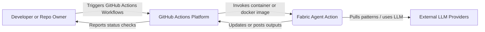
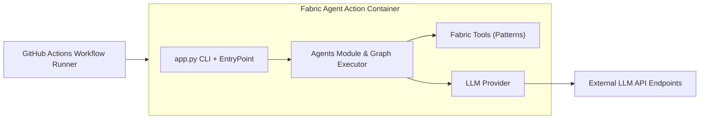
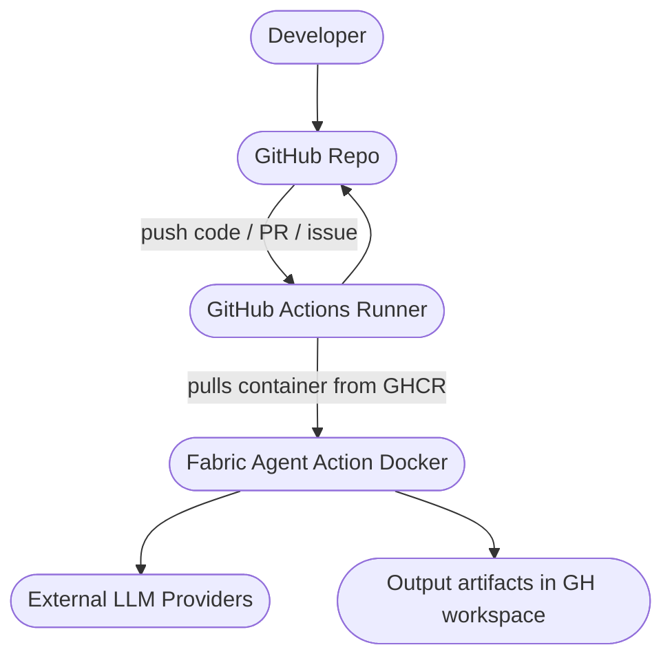
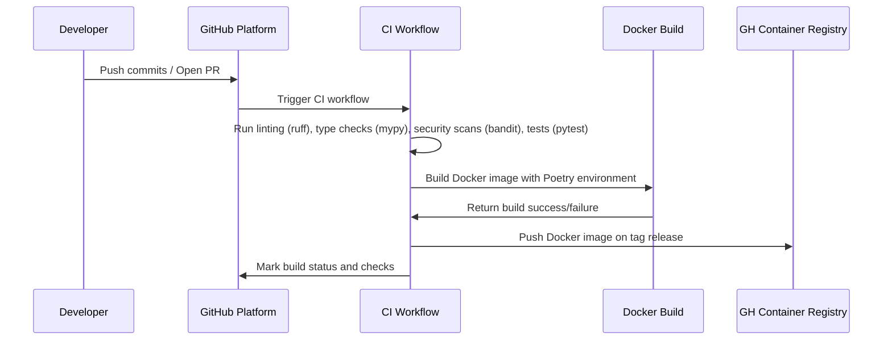

## BUSINESS POSTURE

The Fabric Agent Action is designed to automate complex workflows within GitHub repositories by leveraging Large Language Models (LLMs) and a library of Fabric Patterns. The main business goals are:

1. Streamline and simplify repetitive or semi-automated GitHub tasks (issue handling, pull request generation, documentation, code reviews, etc.).
2. Leverage AI capabilities to enhance productivity, especially for repetitive tasks.
3. Provide a standardized mechanism to incorporate a range of Fabric Patterns directly within GitHub Actions.

Business priorities:
- Deliver an easy-to-use GitHub Action that can be integrated quickly and run reliably.
- Maintain low overhead in terms of cost, setup, and complexity.
- Make it flexible so that different LLM providers (OpenAI, OpenRouter, Anthropic) can be used according to the user’s preference or requirement.

Business risks based on these priorities and goals:
- High operational costs from irresponsible or unmonitored usage of LLM calls (possible cost overruns).
- Reputational damage if AI outputs are incorrect or malicious content is posted automatically.
- Opportunity cost if new features are not quickly integrated or if the solution does not address the most critical developer workflows.
- Slower adoption if the Action is not user-friendly or flexible enough for different organizational needs.

## SECURITY POSTURE

Existing security controls:

Security control: GitHub Workflow automation conditions
- Described in README under the "Access Control Patterns", restricting usage based on the event context, repository ownership checks, and additional user checks.
- Implemented within GitHub Actions workflow syntax (pull request source checks, comment author checks).

Security control: API key handling through GitHub Secrets
- The LLM provider API keys (OPENAI_API_KEY, OPENROUTER_API_KEY, ANTHROPIC_API_KEY) are stored in GitHub Secrets, preventing direct exposure in logs and environment variables.
- Implemented as environment variables in the GitHub workflow environment.

Security control: CI pipeline security
- Pipeline scanning using Bandit (Python security checks), hadolint (Dockerfile linter), ruff/mypy for code quality.
- Implemented in the .github/workflows/ci.yaml and .github/workflows/publish.yaml.

Security control: Docker build with minimal surface
- Dockerfile uses Python 3.11 with Alpine for smaller footprint.
- The entrypoint script sets environment variables carefully.

Accepted risk: Partial reliance on external LLM services
- The project intentionally connects to external LLM providers, thus accepting possible data exposure to external APIs.
- Users are expected to trust the provider’s data handling.

Recommended security controls (high priority to implement if not already mentioned):
Security control: Rate limiting and usage monitoring
- Monitor the number of requests to the LLM provider to avoid cost explosion.
Security control: Additional policy checks for posted content
- Validate the output from LLM before posting any publicly visible content.
Security control: Secure supply chain policy
- Use pinned Docker image versions and scanning for base images to confirm no vulnerabilities.
Security control: Secret scanning and vault references
- Ensure that all secrets in workflows are validated with secret scanning.

Security requirements for this project include:
- Authentication: GitHub user authentication for workflow triggers.
- Authorization: Enforce only authorized users can trigger advanced or costly patterns.
- Input Validation: Filter user-provided inputs to remove malicious instructions.
- Cryptography: Rely on TLS for communication with LLM providers.

Where each existing security control is implemented or described:
- Access Control Patterns: Documented in the README, implemented in the sample workflows.
- GitHub Secrets: Environment variable usage in action.yml, Dockerfile entrypoint, and workflow examples.
- CI Security Checks: Defined and automated in .github/workflows/ci.yaml and .github/workflows/publish.yaml.

## DESIGN

### C4 CONTEXT

Table describing context diagram elements:

| Name                                  | Type                        | Description                                                                                 | Responsibilities                                                                 | Security controls                                                             |
|---------------------------------------|-----------------------------|---------------------------------------------------------------------------------------------|----------------------------------------------------------------------------------|-------------------------------------------------------------------------------|
| Developer or Repo Owner               | Person / User               | GitHub users who configure and run the workflows                                            | Initiate workflows, manage repo, handle secrets                                  | GitHub user authentication (via GitHub login)                                 |
| GitHub Actions Platform               | System                      | Orchestration layer that executes the configured workflows and actions                      | Receives triggers, sets environment, runs actions                                | GitHub ephemeral runner security, workflow access control                     |
| Fabric Agent Action                   | Container / Action          | The custom GitHub Action that processes user instructions and executes patterns             | Handles LLM calls, runs patterns, returns results                                | Docker security best practices; secrets from GH environment                  |
| External LLM Providers                | External System / Service   | External APIs like OpenAI, OpenRouter, Anthropic used to process AI requests               | Provide LLM-based text generation or analysis                                    | Encrypted transport (TLS), provider-level security, usage limited with secrets|

### C4 CONTAINER

In this project, the main container is the Docker image that runs the Fabric Agent Action. The high-level container architecture is fairly straightforward. Below is a container diagram showing interactions in more detail.

Table describing container diagram elements:

| Name                            | Type                   | Description                                                                                          | Responsibilities                                                                       | Security controls                                               |
|---------------------------------|------------------------|------------------------------------------------------------------------------------------------------|----------------------------------------------------------------------------------------|-----------------------------------------------------------------|
| GitHub Actions Workflow Runner  | GH Runner Container    | Executes the defined GitHub workflow in an ephemeral environment                                     | Orchestrates jobs, sets environment variables, downloads code                          | GitHub ephemeral runner security                                |
| Fabric Agent Action Container   | Docker Container       | The built Docker image containing Python, Poetry, Action scripts, etc.                               | Runs the Action entrypoint, executes the agent logic, calls patterns and LLM           | Docker container sandbox, read-only file system in GitHub runner |
| app.py CLI + EntryPoint         | Python CLI/Script      | The main script that is invoked by GitHub Actions with designated environment variables and arguments | Parses arguments, reads input, orchestrates agent building and graph execution         | Input sanitization, environment variable handling               |
| Agents Module & Graph Executor  | Python Modules         | Contains code that builds agents, compiles state graphs, and routes messages between user and tools  | Analyzes instructions, decides which patterns to invoke, processes LLM I/O             | Safe invocation of LLM calls, maximum turn limits               |
| Fabric Tools (Patterns)         | Python Module          | Library of python functions representing Fabric Patterns                                             | Provide specialized AI-based transformations, analyses, and text generation functions  | None (direct LLM usage), but code checks in CI pipeline          |
| LLM Provider                    | Python Module          | Connects to external LLM backends. Can switch among openai, openrouter, anthropic                    | Abstracts the low-level request details to external LLM APIs                           | API key usage from GitHub Secrets, TLS for external calls        |
| External LLM API Endpoints      | External Cloud Service | The actual inbound interface for OpenAI, OpenRouter, or Anthropic calls                              | Processes and returns generative or analytical text results                            | Provider security; user must store limited scope keys           |

### DEPLOYMENT

The Fabric Agent Action can be deployed in several ways:
1. GitHub Action using the dockerized approach from GHCR.
2. Locally as a Python script (less common).
3. Docker run command in other CICD platforms (rare usage).

In a typical environment, it is used as a GitHub Action:

Table describing deployment diagram elements:

| Name                   | Type                   | Description                                                       | Responsibilities                                                 | Security controls                                                         |
|------------------------|------------------------|-------------------------------------------------------------------|----------------------------------------------------------------|-----------------------------------------------------------------------------|
| Developer              | Person / User          | Writes code, configures workflows, merges pull requests           | Maintains code, triggers workflows                               | GitHub standard authentication and authorization                           |
| GitHub Repo            | Repository             | Hosts source code, GitHub Actions workflows, secrets, and config  | Stores code, configuration, issues, pull requests                | Repository-level permissions, fine-grained access control                   |
| GitHub Actions Runner  | Compute (Ephemeral)    | Orchestrates the job steps defined in .github/workflows           | Executes steps in a controlled ephemeral environment             | Strict ephemeral environment, limited concurrency, ephemeral storage        |
| Fabric Agent Action Docker | Container Image     | The container pulled from GHCR or built at runtime                | Provides the entrypoint logic, runs the agent code               | Docker-based isolation, environment variable referencing secrets            |
| External LLM Providers | External Services      | Third-party systems that handle model inference                   | Provide or store advanced text generation functionalities         | Network security (TLS), secrets-based API authentication                    |
| ResultsArtifacts       | File / Artifacts       | The local workspace results or posted comments in GitHub          | Stores, logs, or references the AI output for subsequent steps    | Encrypted at rest by GitHub, ephemeral ephemeral runner file system         |

### BUILD

The project uses GitHub workflows for build and deployment (see .github/workflows/ci.yaml and publish.yaml). High-level build process:

Security controls in the build process:
- SAST scanners (Bandit, ruff, mypy).
- Dockerfile linting (hadolint).
- Tests with pytest.
- Authentication to GHCR for push.

## RISK ASSESSMENT

1. Critical business processes we are trying to protect:
- Automation around GitHub workflows that post or merge code, open pull requests, or alter repository content.

2. Data we are trying to protect and their sensitivity:
- GitHub repository content (proprietary code).
- LLM API tokens stored in GitHub Secrets to prevent uncontrolled usage or cost infiltration.
- AI-generated outputs that could contain privileged or sensitive data if improperly handled by the LLM.

## QUESTIONS & ASSUMPTIONS

1. Questions:
- Do we have a mechanism for usage quotas or rate-limiting LLM requests in this Action?
- Is there a recommended safe of handling untrusted user input regarding malicious prompts?
- Regarding external LLMs, is the user comfortable with the risk profile of sending partial repository content externally?

2. Assumptions:
- Users will store their API keys in GitHub Secrets.
- The GitHub repository owners understand the risk of LLM-based content generation and have set appropriate usage policies.
- The ephemeral GitHub runners used for this project are sufficiently secure and ephemeral, so no sensitive data persists after job completion.
