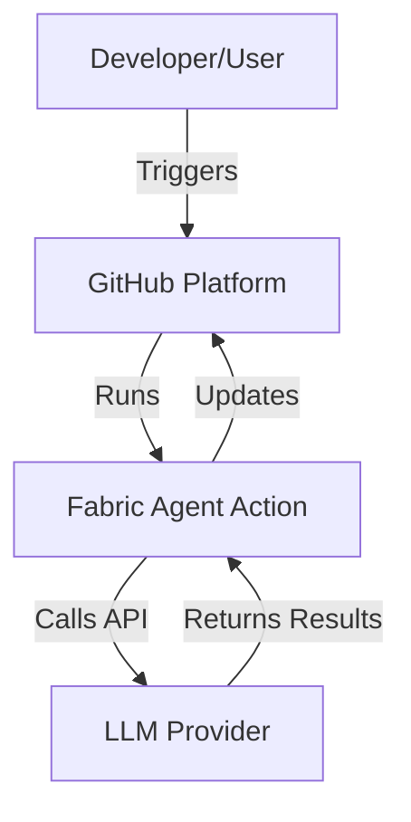
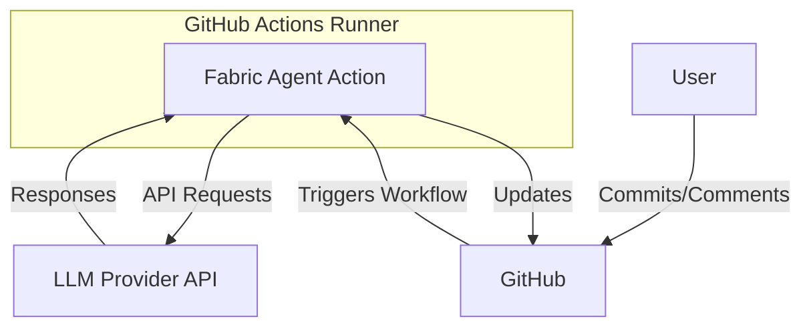
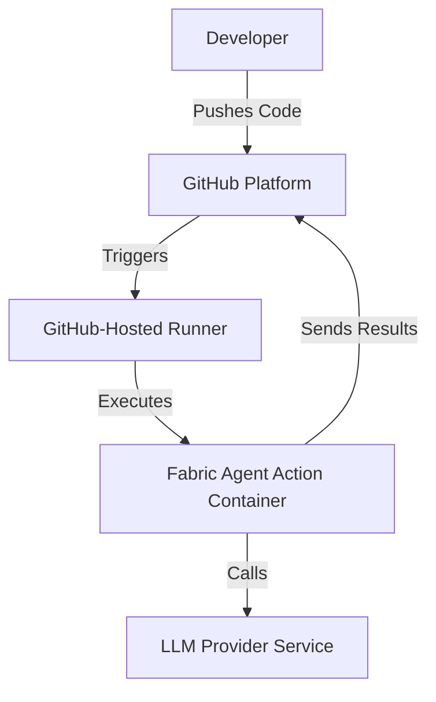
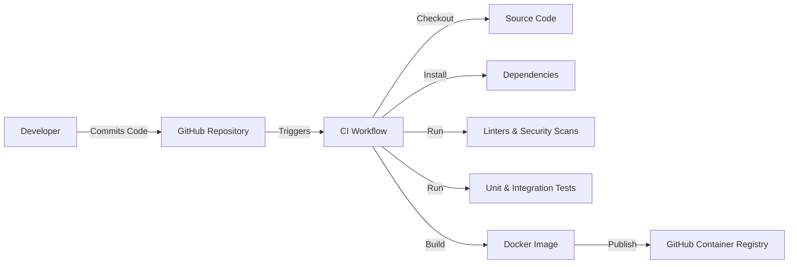

# BUSINESS POSTURE

The **Fabric Agent Action** project aims to streamline the integration of [Fabric Patterns](https://github.com/danielmiessler/fabric/tree/main/patterns) into GitHub workflows. By leveraging an agent-based approach, it automates complex workflows using Large Language Models (LLMs). The primary business priorities and goals include:

- **Simplifying Workflow Automation**: Provide developers with an easy-to-use GitHub Action that seamlessly incorporates Fabric Patterns into existing workflows, enhancing productivity and reducing manual effort.
- **Enhancing Flexibility**: Support multiple LLM providers (OpenAI, OpenRouter, Anthropic) to offer users the choice based on preference and availability.
- **Customizable Agent Behavior**: Allow users to select agent types and customize behaviors to suit various workflow needs.
- **Optimizing Performance**: Enable inclusion or exclusion of specific Fabric Patterns to comply with model limitations and optimize performance.

**Business Risks**:

- **Unauthorized Usage Leading to Increased Costs**: Without proper security controls, unauthorized users could trigger the action, causing unexpected API usage and escalating costs.
- **Security Vulnerabilities**: Insufficient access control could expose workflows to malicious actors, risking code integrity and data security.
- **Reliance on External Services**: Dependence on external LLM providers may introduce risks related to availability, compliance, and data privacy.

# SECURITY POSTURE

**Existing Security Controls**:

1. **Security Control**: **Access Control Patterns** implemented in workflows using conditional statements to restrict action execution.

   - *Implemented in:* README.md under **Security** section.
   - *Description:* Conditions like `github.event.comment.user.login == github.event.repository.owner.login` ensure only authorized users can trigger actions.

2. **Security Control**: **Secure Storage of API Keys** using GitHub Secrets.

   - *Implemented in:* Action configuration and usage instructions.
   - *Description:* API keys for LLM providers are stored securely to prevent unauthorized access.

3. **Security Control**: **Environment Variable Management** to prevent exposure of sensitive information.

   - *Implemented in:* `entrypoint.sh` and action workflows.
   - *Description:* Ensures sensitive data is not printed in logs or error messages.

**Accepted Risks**:

1. **Accepted Risk**: Potential for unauthorized usage if workflows are not properly secured, leading to increased API costs.

**Recommended Security Controls**:

1. **Security Control**: **Input Validation** to sanitize and validate all inputs provided to the action, preventing injection attacks or misuse.
2. **Security Control**: **Enhanced Authentication Mechanisms** within the action to supplement workflow-level access controls.
3. **Security Control**: **Audit Logging** to monitor and log action usage for audit trails and anomaly detection.

**Security Requirements**:

- **Authentication**:

  - Ensure that only authenticated users can trigger workflows.
  - Use GitHub's authentication mechanisms and verify user identities.

- **Authorization**:

  - Implement strict permission checks to confirm that users have the necessary rights to execute actions.
  - Limit action execution to repository collaborators or specified roles.

- **Input Validation**:

  - Validate all input data to prevent malicious input from causing unintended behavior.
  - Implement checks for command injection, script injection, and other common vulnerabilities.

- **Cryptography**:

  - Use HTTPS for all communications with LLM providers to ensure data in transit is encrypted.
  - Securely store and handle API keys and secrets using GitHub Secrets.

# DESIGN

## C4 CONTEXT

### Context Diagram Elements

| Name                | Type             | Description                                     | Responsibilities                                     | Security Controls                             |
|---------------------|------------------|-------------------------------------------------|-----------------------------------------------------|-----------------------------------------------|
| User                | Person           | Developer using the action in workflows         | Initiates workflows, provides input commands         | **Security Control**: GitHub authentication   |
| GitHub              | System           | Hosts repositories and workflows                | Executes workflows, manages code repositories        | **Security Control**: Access controls         |
| Fabric Agent Action | Component        | GitHub Action executing Fabric Patterns         | Processes inputs, interacts with LLMs, outputs results | **Security Control**: Workflow conditions    |
| LLM Provider        | External System  | Provides LLM APIs (OpenAI, OpenRouter, Anthropic) | Processes requests, returns generated outputs        | **Security Control**: Secure API keys, HTTPS  |

## C4 CONTAINER

### Container Diagram Elements

| Name            | Type             | Description                                             | Responsibilities                                 | Security Controls                                      |
|-----------------|------------------|---------------------------------------------------------|-------------------------------------------------|--------------------------------------------------------|
| Fabric Agent Action | Container        | Docker container running the action within GitHub Runner | Executes patterns, communicates with LLM APIs   | **Security Control**: Isolated execution environment   |
| LLM Provider API    | External Service | API endpoint of the selected LLM provider               | Processes API calls, generates responses        | **Security Control**: API key management, HTTPS        |
| GitHub Actions Runner | Container      | Environment where GitHub Actions are executed          | Runs workflows and actions                      | **Security Control**: GitHub-managed security controls |
| User            | Person           | Developer interacting with GitHub                      | Triggers workflows via commits or comments      | **Security Control**: GitHub authentication            |

## DEPLOYMENT

Possible deployment architectures:

1. **GitHub-Hosted Runners**: Default environment provided by GitHub for action execution.
2. **Self-Hosted Runners**: Custom environment managed by the user for more control.

**Selected Deployment Architecture**: GitHub-Hosted Runners

### Deployment Diagram Elements

| Name                   | Type             | Description                                              | Responsibilities                                           | Security Controls                                      |
|------------------------|------------------|----------------------------------------------------------|-----------------------------------------------------------|--------------------------------------------------------|
| Developer              | Person           | User who commits code or comments to trigger workflows   | Initiates workflows                                        | **Security Control**: GitHub authentication            |
| GitHub Platform        | Cloud Service    | Hosts repositories and workflows                         | Manages code, triggers workflows                           | **Security Control**: Access control, secret management |
| GitHub-Hosted Runner   | Execution Environment | Executes the GitHub Actions                            | Runs the Fabric Agent Action                               | **Security Control**: Isolated environment             |
| Fabric Agent Action Container | Docker Container | Contains the action code and dependencies          | Processes inputs, communicates with LLMs                   | **Security Control**: Secure handling of secrets       |
| LLM Provider Service   | External Service | Processes API requests from the action                   | Generates outputs based on prompts                         | **Security Control**: API keys, HTTPS communication    |

## BUILD

The project leverages GitHub Actions for Continuous Integration (CI) and Continuous Deployment (CD).

**Build and Publish Process**:

1. **Code Commit**: Developer pushes code changes to the repository.
2. **CI Workflow Triggered**: GitHub Actions initiates the CI workflow (`ci.yaml`).
3. **Steps in CI Workflow**:

   - **Checkout Code**: Repository code is checked out.
   - **Install Python and Poetry**: Python environment is set up using Poetry.
   - **Install Dependencies**: Project dependencies are installed.
   - **Code Quality Checks**:

     - **Ruff**: Linting tool checks for code quality issues.
     - **MyPy**: Static type checker validates type annotations.
     - **Bandit**: Security linter scans for common security issues.
     - **Hadolint**: Linter checks the Dockerfile for best practices.

   - **Testing**:

     - **Pytest**: Runs unit tests.
     - **Integration Tests**: Docker image is built and tested.

4. **Docker Image Build**:

   - Using `publish.yaml`, the Docker image is built upon tagging a release.
   - Image is pushed to GitHub Container Registry.

5. **Security Controls in Build Process**:

   - **Security Control**: Use of linters and security scanners (Ruff, Bandit) to identify vulnerabilities.
   - **Security Control**: Dependency management with `poetry.lock` to ensure reproducible builds.
   - **Security Control**: Isolated build environment provided by GitHub Actions.

**Build Process Diagram**:

# RISK ASSESSMENT

- **What are the critical business processes we are trying to protect?**

  - Integrity and reliability of automated workflows.
  - Secure handling of API keys and sensitive data.
  - Prevention of unauthorized access and execution of actions.

- **What data are we trying to protect and what is their sensitivity?**

  - **API Keys for LLM Providers**: High sensitivity; unauthorized access could lead to misuse and cost implications.
  - **Source Code and Workflow Configurations**: Medium sensitivity; contains logic and secrets that could be exploited.
  - **User Input Data**: Medium sensitivity; may contain proprietary or confidential information.

# QUESTIONS & ASSUMPTIONS

**Questions**:

1. Are additional authentication mechanisms needed beyond GitHub's built-in controls to enhance security?
2. How are API keys rotated and managed to minimize the risk of key compromise?
3. Are there plans to support additional LLM providers or self-hosted models for greater flexibility?
4. What are the compliance requirements concerning data processing with external LLM services?

**Assumptions**:

- It is assumed that users will properly configure workflow access controls as outlined in the documentation.
- API keys are securely stored using GitHub Secrets and are not exposed in logs or outputs.
- LLM providers comply with relevant data protection regulations (e.g., GDPR, CCPA).
- The action will primarily run in GitHub-hosted runners unless explicitly configured otherwise.
