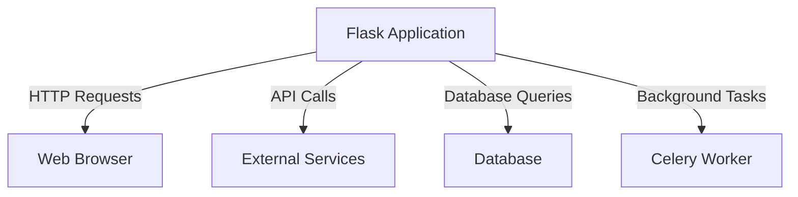
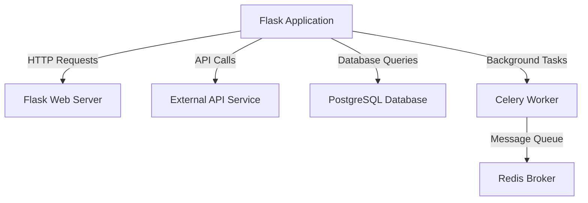
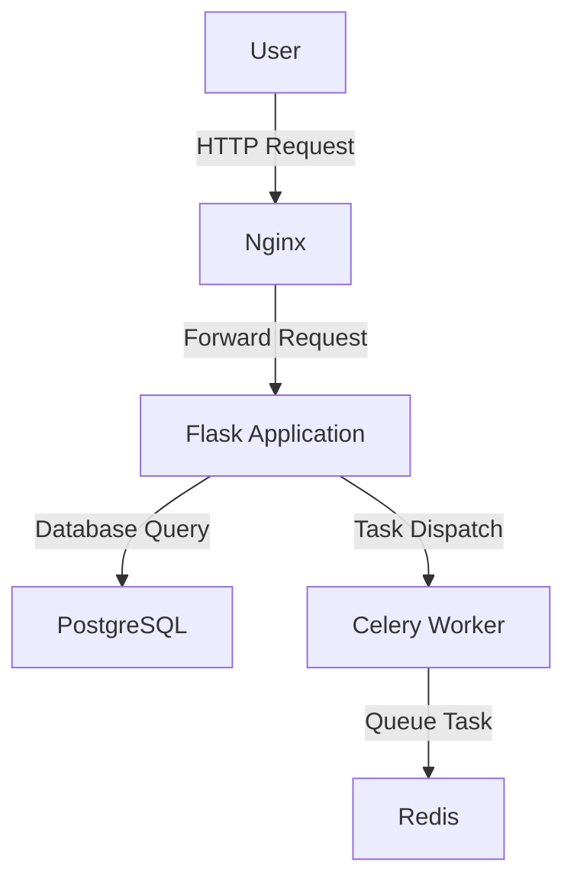
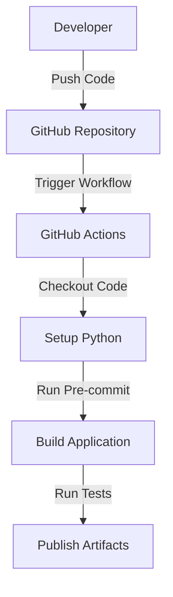

# Flask Project Design Document

## BUSINESS POSTURE

The Flask project is a lightweight WSGI web application framework designed to make getting started with web development quick and easy, while also being scalable to complex applications. The primary business goal is to provide a flexible and extensible framework that allows developers to build web applications with minimal overhead. The project does not enforce any dependencies or project layout, giving developers the freedom to choose their tools and libraries.

### Business Risks
- **Dependency Management**: Since Flask does not enforce dependencies, there is a risk of dependency conflicts or security vulnerabilities if not managed properly.
- **Scalability**: While Flask is designed to scale, improper use or lack of understanding of its capabilities can lead to performance bottlenecks in larger applications.
- **Security**: As a web framework, Flask applications are exposed to common web vulnerabilities such as SQL injection, XSS, and CSRF.

## SECURITY POSTURE

### Existing Security Controls
- **Security Control**: Use of Werkzeug for request and response handling, which includes security features like escaping and secure cookies.
- **Security Control**: Integration with Jinja2 for templating, which auto-escapes inputs to prevent XSS attacks.
- **Security Control**: Use of `itsdangerous` for secure session management and signing.
- **Security Control**: Support for HTTPS through configuration and external libraries.
- **Security Control**: Type checking and error handling mechanisms in place to ensure robust application behavior.
- **Security Control**: Flask's built-in support for CSRF protection through extensions like Flask-WTF.
- **Security Control**: Use of `flask-talisman` for setting security headers like HSTS, CSP, X-Content-Type-Options, and X-Frame-Options.

### Accepted Risks
- **Accepted Risk**: Developers are responsible for implementing authentication and authorization mechanisms, as Flask does not provide these out of the box.
- **Accepted Risk**: Input validation is left to the developer, which can lead to security vulnerabilities if not properly handled.

### Recommended Security Controls
- **Security Control**: Implement a robust authentication and authorization system using Flask extensions like Flask-Login or Flask-Security.
- **Security Control**: Use input validation libraries or frameworks to sanitize and validate user inputs.
- **Security Control**: Regularly update dependencies to patch known vulnerabilities.

### Security Requirements
- **Authentication**: Implement user authentication using secure methods such as OAuth or JWT.
- **Authorization**: Ensure that user roles and permissions are properly managed and enforced.
- **Input Validation**: Validate all user inputs to prevent injection attacks.
- **Cryptography**: Use strong cryptographic methods for storing sensitive data and managing sessions.

## DESIGN

### C4 CONTEXT

#### Context Diagram Elements

| Name               | Type          | Description                                      | Responsibilities                              | Security Controls                                      |
|--------------------|---------------|--------------------------------------------------|-----------------------------------------------|--------------------------------------------------------|
| Flask Application  | Software      | The main web application built using Flask.      | Handle HTTP requests, render templates, manage sessions. | Secure session management, input validation.            |
| Web Browser        | External User | Users accessing the application via a web browser. | Send HTTP requests, receive and render responses. | N/A                                                    |
| External Services  | External System | Third-party services the application interacts with. | Provide additional functionality via APIs.    | Secure API communication (e.g., OAuth, HTTPS).         |
| Database           | Data Store    | The database storing application data.           | Store and retrieve data for the application.  | Secure database connections, use of ORM for queries.   |
| Celery Worker      | Background Process | Handles asynchronous tasks for the application. | Execute background tasks, manage task queues. | Secure task execution, use of message broker security. |

### C4 CONTAINER

#### Container Diagram Elements

| Name               | Type          | Description                                      | Responsibilities                              | Security Controls                                      |
|--------------------|---------------|--------------------------------------------------|-----------------------------------------------|--------------------------------------------------------|
| Flask Web Server   | Container     | The server running the Flask application.        | Serve HTTP requests, manage application lifecycle. | Secure server configuration, HTTPS support.            |
| External API Service | External System | Third-party APIs the application interacts with. | Provide additional functionality via APIs.    | Secure API communication (e.g., OAuth, HTTPS).         |
| PostgreSQL Database | Data Store    | The database storing application data.           | Store and retrieve data for the application.  | Secure database connections, use of ORM for queries.   |
| Celery Worker      | Background Process | Handles asynchronous tasks for the application. | Execute background tasks, manage task queues. | Secure task execution, use of message broker security. |
| Redis Broker       | Message Queue | The message broker for Celery tasks.             | Queue and manage background tasks.            | Secure message broker configuration, use of TLS.       |

### DEPLOYMENT

The Flask application can be deployed in various environments, such as on-premises servers, cloud platforms, or containerized environments. A common deployment architecture involves using a web server like Nginx or Apache to serve the Flask application, with a PostgreSQL database for data storage and a Redis broker for managing Celery tasks.

#### Deployment Diagram Elements

| Name               | Type          | Description                                      | Responsibilities                              | Security Controls                                      |
|--------------------|---------------|--------------------------------------------------|-----------------------------------------------|--------------------------------------------------------|
| User               | External User | End users accessing the application.             | Send HTTP requests, receive and render responses. | N/A                                                    |
| Nginx              | Web Server    | The web server serving the Flask application.    | Serve static files, forward requests to Flask. | Secure server configuration, HTTPS support.            |
| Flask Application  | Application   | The main web application built using Flask.      | Handle HTTP requests, render templates, manage sessions. | Secure session management, input validation.            |
| PostgreSQL         | Database      | The database storing application data.           | Store and retrieve data for the application.  | Secure database connections, use of ORM for queries.   |
| Celery Worker      | Background Process | Handles asynchronous tasks for the application. | Execute background tasks, manage task queues. | Secure task execution, use of message broker security. |
| Redis              | Message Queue | The message broker for Celery tasks.             | Queue and manage background tasks.            | Secure message broker configuration, use of TLS.       |

### BUILD

The Flask project uses GitHub Workflows for continuous integration and deployment. The build process includes steps for checking out the code, setting up the Python environment, running pre-commit checks, building the application, and running tests.

## RISK ASSESSMENT

- **Critical Business Process**: The primary business process is to provide a flexible and extensible web framework for building web applications.
- **Data Sensitivity**: The data handled by Flask applications can vary widely, from public data to sensitive user information. It is crucial to implement appropriate security measures to protect sensitive data, such as user credentials and personal information.

## QUESTIONS & ASSUMPTIONS

- **Questions**:
  - What specific authentication and authorization mechanisms are recommended for Flask applications?
  - Are there any specific guidelines for managing dependencies in Flask projects?

- **Assumptions**:
  - It is assumed that developers using Flask are responsible for implementing security best practices, such as input validation and secure session management.
  - It is assumed that the deployment environment will provide necessary security features, such as HTTPS and secure database connections.
