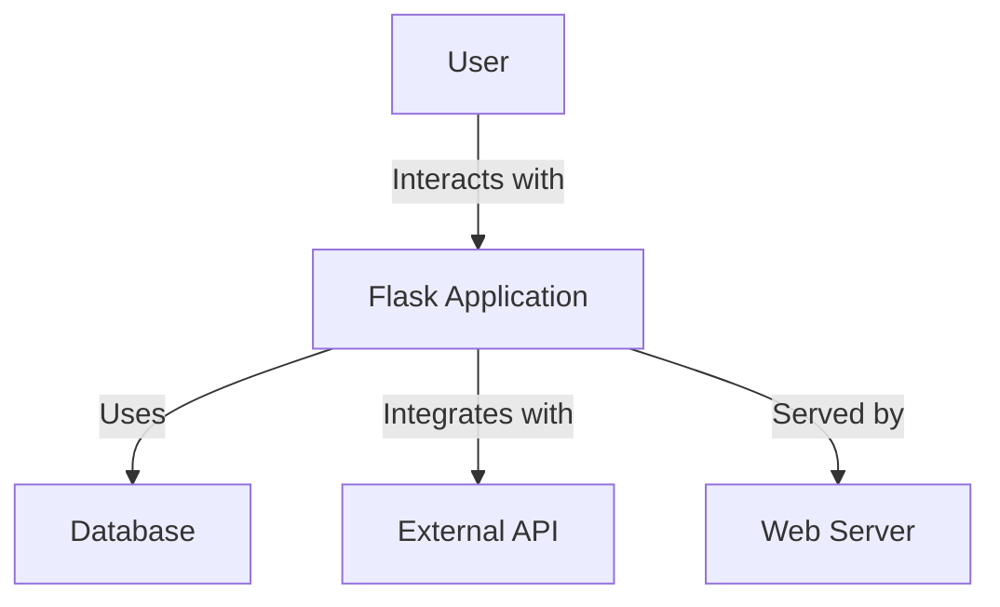
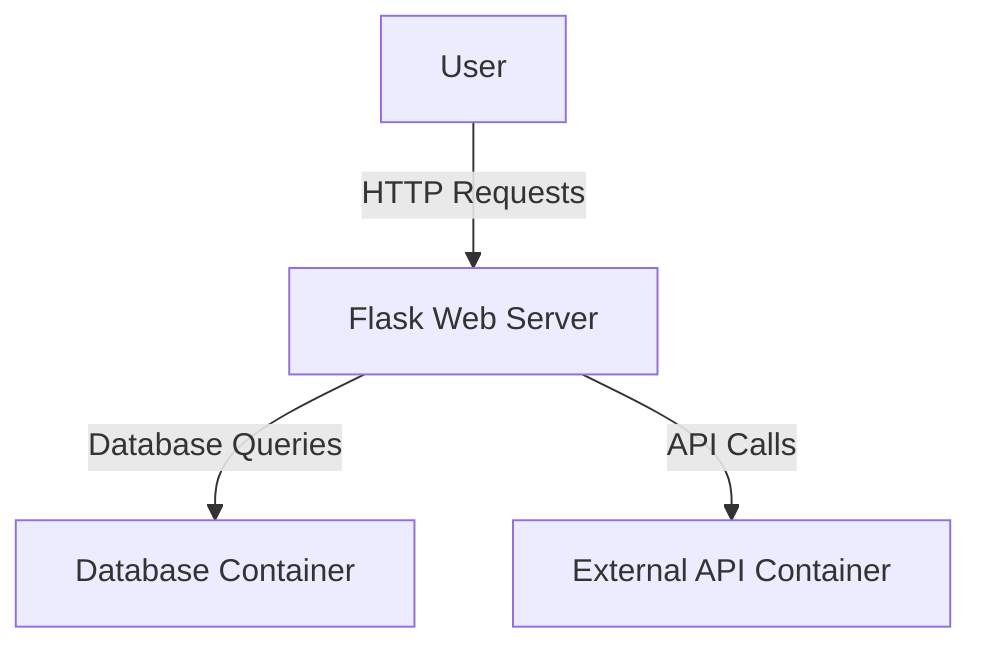
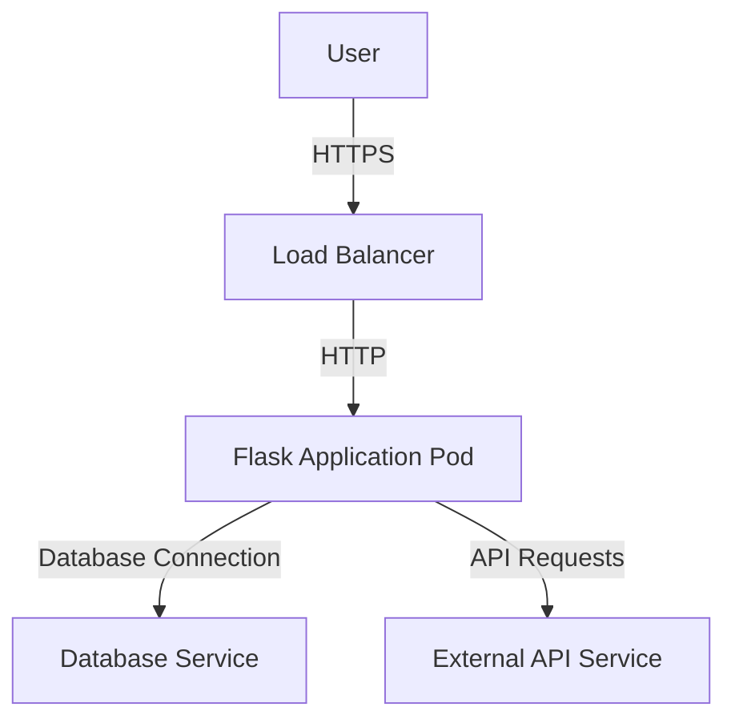
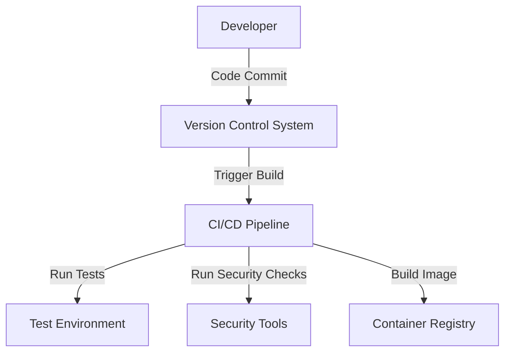

# BUSINESS POSTURE

Flask is a lightweight WSGI web application framework in Python. It is designed to make getting started quick and easy, with the ability to scale up to complex applications. The primary business goals of Flask are to provide a simple, flexible, and easy-to-use framework for building web applications. It aims to cater to both beginners and experienced developers by offering a minimalistic core with the ability to extend functionality through extensions.

The most important business risks that need to be addressed include ensuring the framework remains easy to use while providing sufficient flexibility and power for more complex applications. Additionally, maintaining a strong community and ecosystem around Flask is crucial for its continued success and adoption.

# SECURITY POSTURE

Existing security controls:
- Security control: Input validation is encouraged through the use of form libraries like WTForms.
- Security control: Flask provides mechanisms for securely handling sessions and cookies.
- Security control: Extensions are available for implementing authentication and authorization, such as Flask-Login and Flask-Security.
- Security control: Flask supports secure configuration management through environment variables and configuration files.
- Security control: Flask applications can be deployed behind a reverse proxy to handle HTTPS and other security concerns.

Accepted risks:
- Accepted risk: As a micro-framework, Flask leaves many security decisions to the developer, which can lead to insecure implementations if not properly managed.

Recommended security controls:
- Security control: Implement a security-focused extension or middleware to enforce security headers (e.g., Content Security Policy, X-Content-Type-Options).
- Security control: Encourage the use of automated security testing tools during development, such as SAST and DAST tools.
- Security control: Provide guidelines for secure deployment practices, including the use of HTTPS and secure configurations.

Security requirements:
- Authentication: Support for secure user authentication mechanisms, potentially through extensions.
- Authorization: Fine-grained access control mechanisms to protect resources.
- Input validation: Ensure all user inputs are validated and sanitized to prevent injection attacks.
- Cryptography: Secure handling of sensitive data, including encryption of data at rest and in transit.

# DESIGN

## C4 CONTEXT

| Name            | Type       | Description                                      | Responsibilities                             | Security controls                                      |
|-----------------|------------|--------------------------------------------------|----------------------------------------------|---------------------------------------------------------|
| User            | Actor      | End-users interacting with the Flask application | Interact with the application                | N/A                                                     |
| Flask Application | System    | The main web application built using Flask      | Handle web requests, business logic          | Input validation, session management                    |
| Database        | System     | Database storing application data                | Store and retrieve data                       | Secure connections, access control                      |
| External API    | System     | Third-party API integrated with the application  | Provide additional functionality              | Secure API keys, validate responses                     |
| Web Server      | System     | Server hosting the Flask application             | Serve web content, manage requests            | HTTPS, reverse proxy                                    |

## C4 CONTAINER

| Name                | Type       | Description                                      | Responsibilities                             | Security controls                                      |
|---------------------|------------|--------------------------------------------------|----------------------------------------------|---------------------------------------------------------|
| User                | Actor      | End-users interacting with the Flask application | Interact with the application                | N/A                                                     |
| Flask Web Server    | Container  | Container running the Flask application          | Handle HTTP requests, execute application logic | Input validation, session management                    |
| Database Container  | Container  | Container running the database                   | Store and retrieve data                       | Secure connections, access control                      |
| External API Container | Container | Container for interacting with external APIs    | Facilitate communication with external services | Secure API keys, validate responses                     |

## DEPLOYMENT

Possible deployment solutions:
1. Deploy on a single server with a reverse proxy (e.g., Nginx) for handling HTTPS.
2. Deploy on a cloud platform (e.g., AWS, Azure) using container orchestration (e.g., Kubernetes).
3. Deploy using a Platform-as-a-Service (PaaS) provider (e.g., Heroku).

Selected deployment solution: Deploy on a cloud platform using container orchestration.

| Name                  | Type       | Description                                      | Responsibilities                             | Security controls                                      |
|-----------------------|------------|--------------------------------------------------|----------------------------------------------|---------------------------------------------------------|
| User                  | Actor      | End-users interacting with the Flask application | Interact with the application                | N/A                                                     |
| Load Balancer         | Component  | Distributes incoming traffic across application pods | Manage traffic, ensure availability          | HTTPS termination, DDoS protection                      |
| Flask Application Pod | Component  | Pod running the Flask application                | Handle HTTP requests, execute application logic | Input validation, session management                    |
| Database Service      | Component  | Managed database service                         | Store and retrieve data                       | Secure connections, access control                      |
| External API Service  | Component  | Service for interacting with external APIs       | Facilitate communication with external services | Secure API keys, validate responses                     |

## BUILD

The Flask project can be built and published using a CI/CD pipeline. The pipeline can be configured to run automated tests, security checks, and build the application into a container image.

- Supply chain security: Use dependency management tools to ensure secure and up-to-date libraries.
- Build automation: Use CI/CD tools like GitHub Actions or Jenkins for automated builds.
- Security checks: Integrate SAST tools and linters to identify security issues during the build process.

# RISK ASSESSMENT

- Critical business process: The critical business process is the ability to develop and deploy web applications quickly and securely using Flask.
- Data sensitivity: The data being protected includes user data, application data, and any sensitive information processed by the application. The sensitivity of the data depends on the specific use case and application.

# QUESTIONS & ASSUMPTIONS

- Questions:
  - What are the specific security requirements for the applications built using Flask?
  - How is Flask being deployed in different environments (e.g., on-premises, cloud)?
  - What are the most common extensions used with Flask, and how do they impact security?

- Assumptions:
  - Flask applications are primarily deployed in cloud environments with modern infrastructure.
  - Developers using Flask have a basic understanding of web security best practices.
  - The Flask community actively maintains and updates the framework to address security vulnerabilities.
