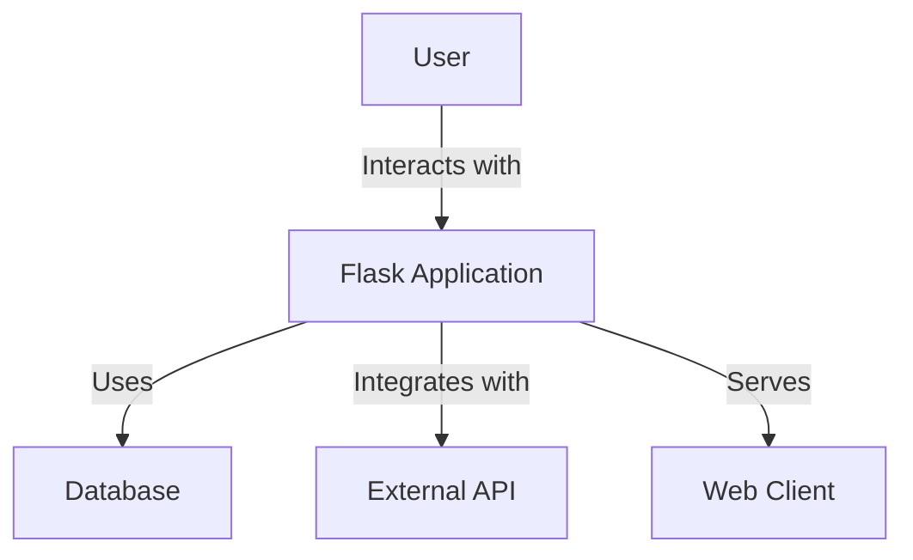
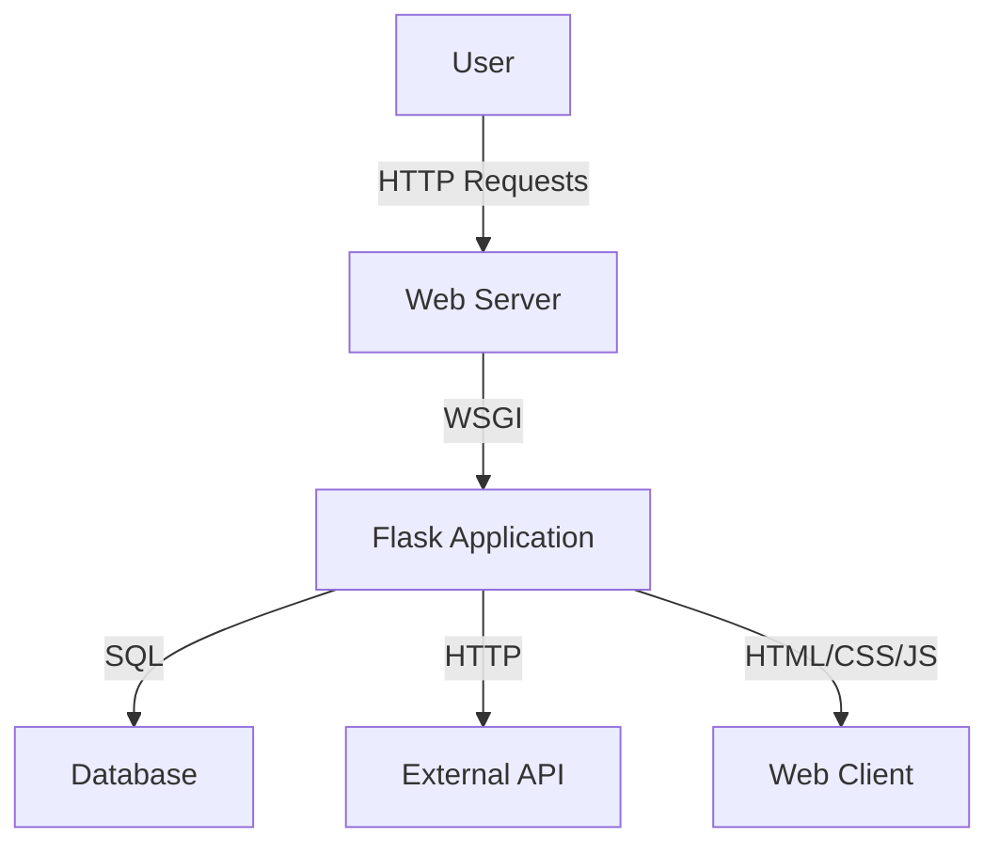
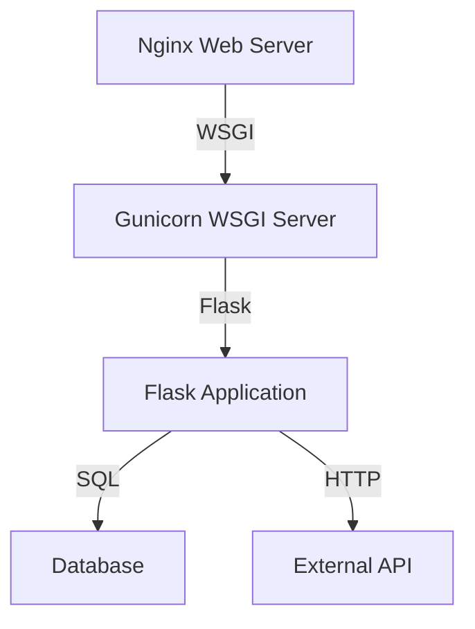
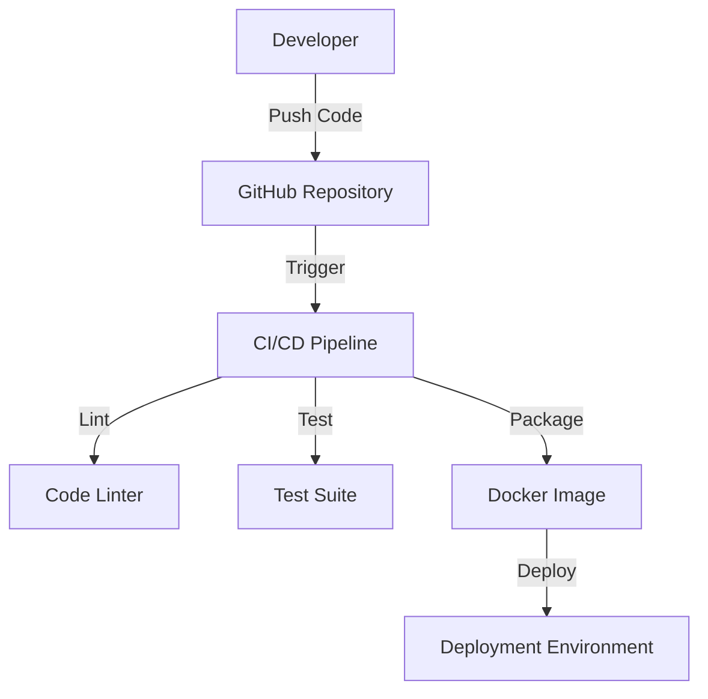

# BUSINESS POSTURE

Flask is a micro web framework for Python, designed to make getting started quick and easy, with the ability to scale up to complex applications. The primary business goal of Flask is to provide a lightweight and flexible framework for developers to build web applications. It aims to be simple, easy to use, and extendable, allowing developers to add functionality as needed.

The most important business risks that need to be addressed include:

1. **Scalability**: As applications grow, Flask must be able to handle increased load and complexity.
2. **Security**: Ensuring that applications built with Flask are secure against common web vulnerabilities.
3. **Maintainability**: Keeping the framework easy to maintain and update, ensuring compatibility with new Python versions and libraries.
4. **Community Support**: Maintaining a strong community to support developers and contribute to the framework's growth.

# SECURITY POSTURE

Existing security controls and accepted risks for Flask include:

- Security control: Flask provides built-in support for secure cookies, which helps in maintaining session integrity.
- Security control: The framework encourages the use of Werkzeug, which includes utilities for secure password hashing.
- Security control: Flask's documentation provides guidelines for secure deployment and best practices.
- Accepted risk: As a micro-framework, Flask leaves many security decisions to the developer, which can lead to inconsistent security implementations.

Recommended security controls to implement:

- Security control: Implement a default Content Security Policy (CSP) to mitigate cross-site scripting (XSS) attacks.
- Security control: Provide built-in support for rate limiting to prevent denial-of-service (DoS) attacks.
- Security control: Integrate security headers by default to enhance security posture.

Security requirements for Flask:

- **Authentication**: Support for various authentication mechanisms, including OAuth, JWT, and basic authentication.
- **Authorization**: Role-based access control (RBAC) and permission management.
- **Input Validation**: Ensure that all user inputs are validated and sanitized to prevent injection attacks.
- **Cryptography**: Use strong cryptographic algorithms for data protection and secure communication.

# DESIGN

## C4 CONTEXT

| Name         | Type       | Description                                      | Responsibilities                          | Security controls                          |
|--------------|------------|--------------------------------------------------|-------------------------------------------|--------------------------------------------|
| User         | Actor      | End user interacting with the Flask application  | Interact with the application             | N/A                                        |
| Flask        | System     | The Flask web application                        | Handle requests, process data, serve content | Secure cookies, input validation          |
| Database     | System     | Database used by the Flask application           | Store and retrieve data                   | Secure connections, access control         |
| ExternalAPI  | System     | External API integrated with the Flask application | Provide additional functionality          | Secure API calls, authentication           |
| WebClient    | System     | Client-side application served by Flask          | Display content to the user               | Secure communication, CSP                  |

## C4 CONTAINER

| Name         | Type       | Description                                      | Responsibilities                          | Security controls                          |
|--------------|------------|--------------------------------------------------|-------------------------------------------|--------------------------------------------|
| User         | Actor      | End user interacting with the Flask application  | Interact with the application             | N/A                                        |
| WebServer    | Container  | Web server hosting the Flask application         | Serve HTTP requests                       | Secure configuration, HTTPS                |
| FlaskApp     | Container  | The Flask application running on the server      | Handle business logic, process requests   | Input validation, secure cookies           |
| Database     | Container  | Database used by the Flask application           | Store and retrieve data                   | Secure connections, access control         |
| ExternalAPI  | Container  | External API integrated with the Flask application | Provide additional functionality          | Secure API calls, authentication           |
| WebClient    | Container  | Client-side application served by Flask          | Display content to the user               | Secure communication, CSP                  |

## DEPLOYMENT

Flask applications can be deployed in various environments, including on-premises servers, cloud platforms, and containerized environments. A common deployment architecture involves using a web server like Nginx or Apache to serve the Flask application.

| Name         | Type       | Description                                      | Responsibilities                          | Security controls                          |
|--------------|------------|--------------------------------------------------|-------------------------------------------|--------------------------------------------|
| Nginx        | Server     | Web server for handling HTTP requests            | Load balancing, SSL termination           | Secure configuration, HTTPS                |
| Gunicorn     | Server     | WSGI server for running the Flask application    | Manage application processes              | Secure configuration                       |
| FlaskApp     | Application| The Flask application                            | Handle business logic, process requests   | Input validation, secure cookies           |
| Database     | Database   | Database used by the Flask application           | Store and retrieve data                   | Secure connections, access control         |
| ExternalAPI  | API        | External API integrated with the Flask application | Provide additional functionality          | Secure API calls, authentication           |

## BUILD

Flask applications can be built and deployed using various CI/CD pipelines. A typical build process involves code linting, testing, and packaging.

# RISK ASSESSMENT

- **Critical Business Process**: The critical business process is the ability to develop and deploy web applications efficiently and securely.
- **Data Sensitivity**: The data being protected includes user data, application data, and any sensitive information processed by the application. The sensitivity of this data can vary depending on the specific application built with Flask.

# QUESTIONS & ASSUMPTIONS

- **Questions**:
  - What specific types of applications are most commonly built with Flask?
  - Are there any industry-specific security requirements that need to be considered?
  - How does Flask handle updates and backward compatibility?

- **Assumptions**:
  - Flask is primarily used for building web applications and APIs.
  - Developers using Flask are responsible for implementing additional security measures as needed.
  - The deployment environment will have standard security practices in place, such as firewalls and intrusion detection systems.
