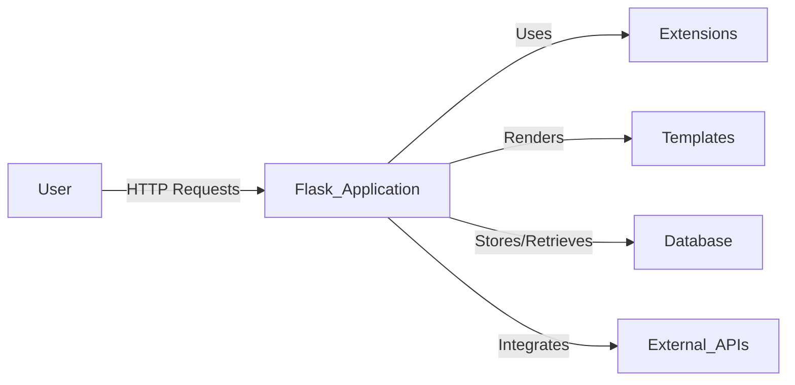
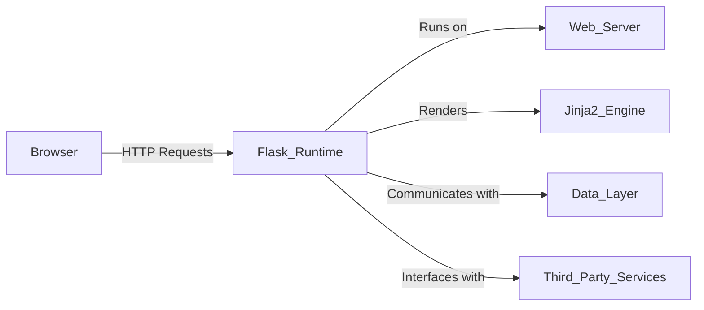
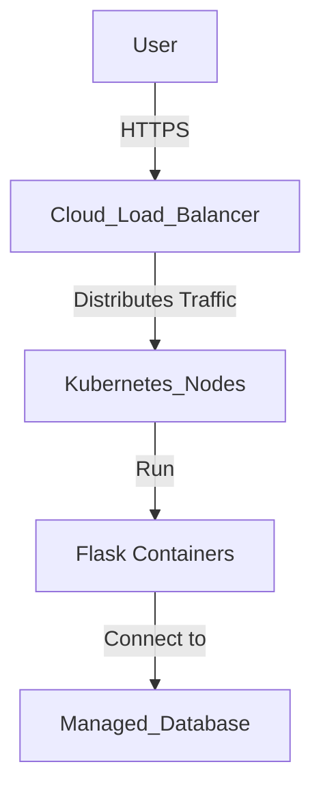
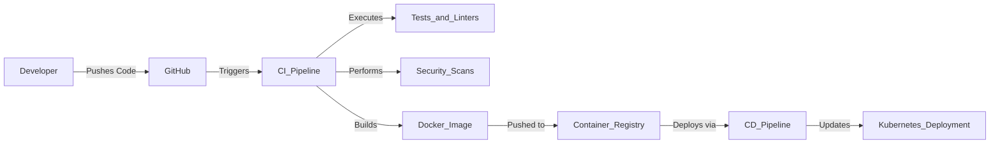

GITHUB REPOSITORY: https://github.com/pallets/flask
CURRENT DESIGN DOCUMENT:
# BUSINESS POSTURE

Flask is a micro web framework written in Python, designed to make web development quick and straightforward. Its primary goal is to provide a simple, yet extensible core that allows developers to build web applications efficiently. By focusing on minimalism and flexibility, Flask aims to cater to both beginners and experienced developers in creating scalable web applications.

**Business Priorities and Goals:**

- **Ease of Use:** Provide an intuitive framework that lowers the barrier to entry for web development in Python.
- **Extensibility:** Allow seamless integration with extensions to add functionality as needed.
- **Performance:** Ensure the framework is lightweight and efficient to support responsive applications.
- **Community Support:** Foster a robust community to contribute to the framework's growth and maintenance.

**Important Business Risks:**

- **Security Vulnerabilities:** Potential security flaws could harm the framework's reputation and user trust.
- **Scalability Limitations:** Inadequate support for larger applications may limit adoption among enterprise users.
- **Competitive Pressure:** Risk of losing relevance if not continuously improved amidst other emerging frameworks.
- **Maintenance Challenges:** Insufficient community engagement could slow development and delay critical updates.

# SECURITY POSTURE

**Existing Security Controls:**

- **Security Control:** Input validation mechanisms to prevent injection attacks.
- **Security Control:** Secure session management using cryptographic signing.
- **Security Control:** Support for integrating authentication and authorization via extensions.
- **Security Control:** Documentation providing best practices for secure application development.
- **Security Control:** Utilization of Werkzeug for robust WSGI utilities and security features.

**Accepted Risks:**

- **Accepted Risk:** Reliance on developers to implement comprehensive security measures.
- **Accepted Risk:** Minimalist core may lack advanced built-in security features.
- **Accepted Risk:** Quality and security of extensions vary, potentially introducing vulnerabilities.

**Recommended Security Controls:**

- **Security Control:** Implement a formal security review process for code contributions.
- **Security Control:** Provide official security-focused extensions or modules.
- **Security Control:** Regularly update dependencies to address known vulnerabilities.
- **Security Control:** Enforce secure default configurations in the framework settings.

**Security Requirements:**

- **Authentication:** Support mechanisms to verify user identity securely.
- **Authorization:** Define user roles and permissions to control access to resources.
- **Input Validation:** Ensure all user inputs are sanitized to prevent injection and other attacks.
- **Cryptography:** Use secure methods for data encryption, password hashing, and managing cryptographic keys.

**Implementation of Security Controls:**

- **Input Validation:** Implemented via Werkzeug's built-in request data handling.
- **Session Management:** Leveraging secure cookies with cryptographic signing in Flask's session handling.
- **Authentication & Authorization:** Available through extensions like Flask-Login and Flask-Security.
- **Documentation:** Security considerations and recommendations are detailed in Flask's official docs.

# DESIGN

Flask is architected as a microframework, providing essential components to build web applications while giving developers the freedom to choose additional libraries and tools. It follows a modular design, relying on Werkzeug for WSGI support and Jinja2 for templating.

## C4 CONTEXT

### Context Diagram Elements

| Name             | Type   | Description                            | Responsibilities                            | Security Controls                                |
|------------------|--------|----------------------------------------|---------------------------------------------|--------------------------------------------------|
| User             | Actor  | End-user of the web application        | Interacts with the application via the web  | N/A                                              |
| Flask Application| System | The web application built with Flask   | Handles requests, processes data, sends responses | Input validation, session management             |
| Extensions       | System | Plugins to add functionalities         | Enhance application features (e.g., auth)   | Varies; should be reviewed for security          |
| Templates        | System | Jinja2 templates for rendering views   | Generate dynamic HTML content               | Auto-escaping to prevent XSS attacks             |
| Database         | System | Data storage (e.g., SQL databases)     | Persist application data                    | Secure connections, ORM for query safety         |
| External APIs    | System | Third-party services                   | Provide additional data/functionality       | Secure API communication (HTTPS)                 |

## C4 CONTAINER

### Container Diagram Elements

| Name                | Type       | Description                             | Responsibilities                          | Security Controls                                |
|---------------------|------------|-----------------------------------------|-------------------------------------------|--------------------------------------------------|
| Browser             | Container  | User's web browser                      | Sends requests, displays responses        | N/A                                              |
| Flask Runtime       | Container  | The executing Flask application         | Processes logic, handles routing          | Input validation, manages sessions               |
| Web Server          | Container  | Serves the Flask application (e.g., Gunicorn) | Handles HTTP requests, serves content    | Secure configurations, SSL/TLS support            |
| Jinja2 Engine       | Container  | Templating engine for rendering views   | Processes templates, renders HTML         | Auto-escaping mechanisms                         |
| Data Layer          | Container  | Database or data storage system         | Stores and retrieves data                 | Secure connections, encryption at rest            |
| Third-Party Services| Container  | External APIs or services               | Extends functionality of the application  | Secure API keys, HTTPS communication             |

## DEPLOYMENT

Flask applications can be deployed in various environments, from simple shared hosting to complex cloud infrastructures. Below are potential deployment solutions with a focus on a cloud-based deployment using Docker containers.

**Possible Deployment Solutions:**

- Hosting on traditional servers with WSGI servers like Gunicorn or uWSGI.
- Deployment on PaaS platforms such as Heroku, AWS Elastic Beanstalk, or Google App Engine.
- Containerization using Docker, orchestrated by Kubernetes in a cloud environment.

**Selected Deployment Architecture:**

Deploying the Flask application within a Docker container, managed by Kubernetes on a cloud platform such as AWS, Azure, or Google Cloud Platform.

### Deployment Diagram Elements

| Name                | Type           | Description                             | Responsibilities                          | Security Controls                                |
|---------------------|----------------|-----------------------------------------|-------------------------------------------|--------------------------------------------------|
| User                | External Entity| End-users accessing the application     | Initiate requests via browser             | N/A                                              |
| Cloud Load Balancer | Service        | Distributes incoming traffic            | Ensures availability and scalability      | SSL/TLS termination, protects against DDoS       |
| Kubernetes Nodes    | Infrastructure | Hosts Docker containers                 | Orchestrates containers, scaling          | Network policies, role-based access control      |
| Docker Containers   | Environment    | Isolated environments for the application| Run the Flask application                | Image scanning, resource isolation               |
| Managed Database    | Service        | Cloud-based database service            | Data persistence                          | Encrypted connections, automated backups         |

## BUILD

The build and deployment process leverages Continuous Integration and Continuous Deployment (CI/CD) pipelines to automate testing and deployment, ensuring code quality and accelerating delivery.

**Build Process Overview:**

1. **Code Commit:** Developers push code changes to the GitHub repository.
2. **CI Pipeline Activation:** GitHub Actions triggers the CI pipeline upon detecting new commits.
3. **Automated Testing:** The pipeline runs unit tests, integration tests, and code linting tools.
4. **Security Analysis:** Static Application Security Testing (SAST) tools scan the codebase for vulnerabilities.
5. **Container Build:** A Docker image of the application is built.
6. **Artifact Storage:** The Docker image is pushed to a secure container registry.
7. **CD Pipeline Activation:** Upon successful build, the CD pipeline deploys the image to the Kubernetes cluster.
8. **Monitoring:** Deployed applications are monitored for performance and security.

**Security Controls in Build Process:**

- **Supply Chain Security:** Use of verified base images and dependency management.
- **Automated Builds:** CI/CD pipelines reduce manual errors and enforce consistency.
- **Security Scanning:** Integration of SAST and dependency scanning tools in the CI pipeline.
- **Access Control:** Restricted access to build environments and artifact repositories.
- **Artifact Integrity:** Digitally signing images and artifacts to ensure they are untampered.

# RISK ASSESSMENT

**Critical Business Processes to Protect:**

- **Application Functionality:** Ensuring the Flask framework and applications built on it operate reliably and securely.
- **User Trust:** Maintaining the integrity and security of applications to uphold user confidence.
- **Data Integrity:** Protecting the data processed by the applications from corruption or unauthorized access.

**Data to Protect and Their Sensitivity:**

- **Source Code:** Highly sensitive; must be protected against unauthorized access and tampering.
- **User Data:** Varies depending on applications but may include sensitive personal information.
- **Credentials:** API keys, database passwords, and other secrets are highly sensitive and require strict protection.

# QUESTIONS & ASSUMPTIONS

**Questions:**

1. What is the expected scale and complexity of applications intended to be built with Flask?
2. Are there specific regulatory compliance standards (e.g., PCI DSS, HIPAA) that need to be adhered to?
3. What policies are in place for validating and approving third-party extensions?
4. How is ongoing security monitoring and incident response handled for the framework?

**Assumptions:**

- **Business Posture:**
  - The primary goal is to maintain a balance between simplicity and providing robust features.
  - Flask aims to serve a broad audience, from hobbyists to enterprise developers.
- **Security Posture:**
  - Security is a shared responsibility between the framework and the application developers.
  - The framework provides essential security features but does not enforce strict defaults.
- **Design:**
  - The deployment environment leverages modern cloud infrastructure and containerization.
  - CI/CD pipelines are utilized to streamline development and deployment processes.
  - Applications may handle sensitive data and thus require appropriate security measures.
