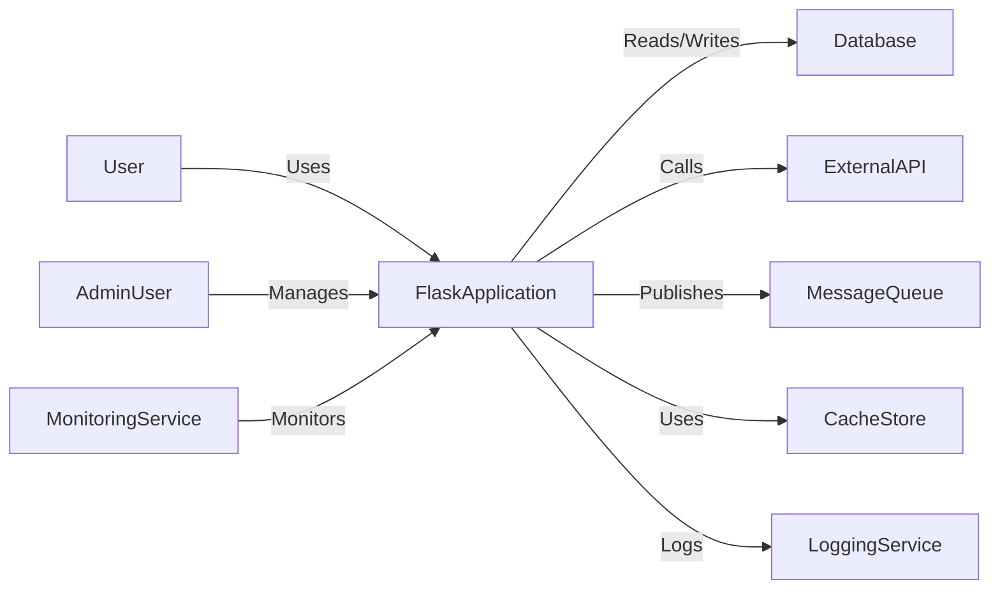
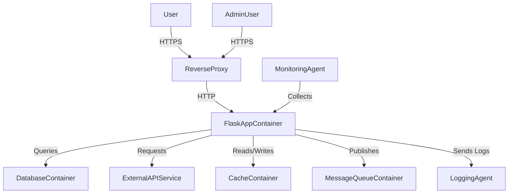
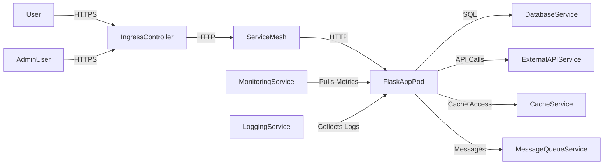
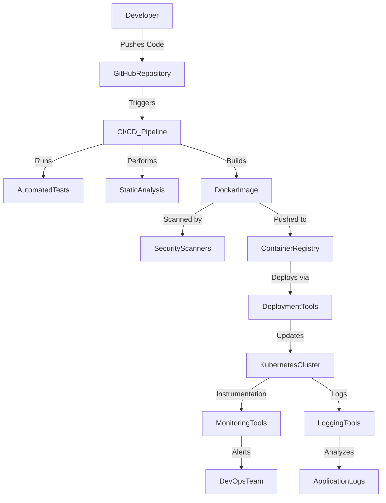

## BUSINESS POSTURE

Flask is an open-source micro web framework written in Python, designed to help developers build web applications quickly and with minimal overhead. Its primary goals are:

- **Ease of Use**: Provide a simple and intuitive framework that lowers the barrier to entry for web development in Python.
- **Flexibility**: Allow developers to customize components as needed without enforcing a specific development pattern or dependencies.
- **Scalability**: Support applications that can grow from simple prototypes to complex systems.
- **Community Support**: Foster a vibrant open-source community for contributions and extensions.
- **Modernization**: Keep the framework up-to-date with modern web development practices and Python features.
- **Ecosystem Development**: Encourage the growth of the Flask ecosystem through extensions and plugins.
- **Performance Optimization**: Enhance the performance of web applications by providing efficient tools and supporting asynchronous features.

**Business Risks**:

- **Security Vulnerabilities**: Potential for common web vulnerabilities if security best practices are not followed.
- **Dependency Risks**: Reliance on third-party extensions that may introduce vulnerabilities or become deprecated.
- **Lack of Enforced Security**: Minimalist design may lead to developers overlooking essential security measures.
- **Sustainability Risks**: Dependence on community contributions for ongoing support and maintenance.
- **Competition**: Increasing competition from other web frameworks (e.g., FastAPI, Django) may impact user adoption.
- **Maintainer Burnout**: Risk of maintainers becoming overwhelmed without sufficient support.
- **Performance Bottlenecks**: Potential scalability issues in high-load scenarios if the application is not properly optimized.
- **Fragmentation**: Diversification through numerous extensions might lead to compatibility issues and fragmentation.

## SECURITY POSTURE

**Existing Security Controls**:

- Security control: Comprehensive documentation on secure development practices provided by Flask in the official documentation.
- Security control: Secure session management using signed cookies with the ability to configure session expiration and security flags.
- Security control: Integration with Werkzeug, which includes request handling safeguards and secure password hashing utilities, such as `generate_password_hash` and `check_password_hash`.
- Security control: Auto-escaping of user inputs in Jinja2 templates to prevent Cross-Site Scripting (XSS) attacks.
- Security control: Support for Blueprints and application factories to promote clean code organization and separation of concerns.
- Security control: Secure default configurations for development and production environments.
- Security control: Use of `itsdangerous` library for secure data serialization and cryptographic signing.
- Security control: Built-in support for asynchronous request handling (since Flask 2.x), allowing for more secure and efficient applications.
- Security control: Detailed error handling and logging mechanisms that can be configured for security.

**Accepted Risks**:

- Accepted risk: Responsibility for implementing security features is placed on the developer.
- Accepted risk: Potential misuse of Flask's flexibility leading to insecure code.
- Accepted risk: Minimal built-in protection against Cross-Site Request Forgery (CSRF) attacks; reliance on developers to implement CSRF protection as needed.
- Accepted risk: Default server is not suitable for production; developers need to configure a production-ready server securely.
- Accepted risk: Third-party extensions may not be maintained or secure, placing burden on developers to vet extensions.

**Recommended Security Controls**:

- Security control: Encourage use of established Flask extensions for security (e.g., Flask-Login for authentication, Flask-WTF for form validation and CSRF protection, Flask-Talisman for HTTPS and security headers).
- Security control: Implement input validation and sanitization practices, ensuring all user inputs are validated before processing.
- Security control: Provide guidelines for secure configuration and deployment, including environment configuration best practices.
- Security control: Enforce secure session cookies using appropriate flags (`HttpOnly`, `Secure`, `SameSite`).
- Security control: Implement Cross-Site Request Forgery (CSRF) protection using `Flask-WTF` or custom solutions.
- Security control: Enforce Content Security Policy (CSP) headers to mitigate certain types of attacks.
- Security control: Utilize secure default configurations and promote the principle of least privilege in resource access.
- Security control: Implement rate limiting to protect against brute-force attacks and Denial-of-Service (DoS) attacks (e.g., using Flask-Limiter).
- Security control: Secure secret key management practices, ensuring that secret keys are kept confidential and not hard-coded in source code.
- Security control: Ensure the application runs with debug mode disabled in production to prevent sensitive information leakage.
- Security control: Use secure communications protocols (HTTPS) to protect data in transit.
- Security control: Provide code examples and templates that follow security best practices to guide developers.
- Security control: Regularly update dependencies and monitor for security patches.

**Security Requirements**:

- **Authentication**: Implement secure user authentication mechanisms using extensions like Flask-Login. Ensure password storage uses strong hashing algorithms provided by Werkzeug. Multi-factor authentication (MFA) should be considered for added security.
- **Authorization**: Enforce role-based access control (RBAC) or attribute-based access control (ABAC) to restrict user permissions, potentially using extensions like Flask-Principal or custom decorators.
- **Input Validation**: Validate and sanitize all user inputs to prevent injection attacks. Utilize libraries like WTForms for form handling and validation, and ensure input data conforms to expected formats.
- **Cryptography**: Use secure cryptographic functions provided by libraries such as `itsdangerous` for data signing and token generation. Ensure that cryptographic keys are managed securely and rotate keys periodically.
- **Session Management**: Implement secure session handling, including session expiration, protection against session fixation and hijacking, and storage of session data on the server-side if necessary.
- **Error Handling**: Configure the application to display user-friendly error messages without exposing stack traces or sensitive information. Use logging to record detailed error information securely.
- **Logging and Monitoring**: Implement logging of security-relevant events and monitor logs for suspicious activities. Use tools to aggregate and analyze logs for intrusion detection.
- **Secure Configuration**: Ensure that the application is configured securely for the production environment, including disabling debug mode and properly handling configuration secrets.
- **Transport Layer Security**: Enforce HTTPS for all communications, using TLS certificates, and redirect HTTP traffic to HTTPS.
- **Dependency Management**: Maintain up-to-date dependencies, using tools like pip-tools or Poetry. Monitor for security advisories related to dependencies.
- **Input Encoding**: Properly encode any output data to prevent injection attacks.

Existing security controls are implemented within Flask's core components (e.g., Werkzeug, Jinja2) and are described in Flask's official documentation. Additional security features are available through well-maintained Flask extensions.

## DESIGN

### C4 CONTEXT

#### Context Diagram Elements

| Name               | Type            | Description                                              | Responsibilities                                    | Security controls                                                  |
|--------------------|-----------------|----------------------------------------------------------|-----------------------------------------------------|--------------------------------------------------------------------|
| User               | Person          | End-user accessing the web application                   | Interacts with the application through a UI         | N/A                                                                |
| AdminUser          | Person          | Administrator managing application settings              | Manages administrative functions                    | Security control: Authentication and authorization                 |
| FlaskApplication   | Software System | The web application built using Flask                    | Handles requests, processes data, provides responses | Security controls within Flask and extensions used                 |
| Database           | Software System | Data storage system (e.g., SQL or NoSQL database)        | Stores and retrieves persistent data                | Security control: Secure connections, access control, encryption   |
| ExternalAPI        | Software System | Third-party services accessed via APIs                   | Provides additional functionalities                  | Security control: Secure communication (HTTPS), API keys/secrets management |
| MessageQueue       | Software System | Messaging system for asynchronous tasks (e.g., RabbitMQ) | Handles background tasks and inter-service messages | Security control: Authentication, encrypted connections            |
| CacheStore         | Software System | Caching system (e.g., Redis)                             | Improves performance by caching data                | Security control: Secure connections, access control               |
| MonitoringService  | Software System | Monitoring and alerting tools (e.g., Prometheus)         | Monitors application health and performance         | Security control: Secure access controls, encrypted communication  |
| LoggingService     | Software System | Centralized logging system (e.g., ELK Stack)             | Collects and stores application logs                | Security control: Secure transport, access control                 |

### C4 CONTAINER

#### Container Diagram Elements

| Name                  | Type      | Description                                            | Responsibilities                                    | Security controls                                                      |
|-----------------------|-----------|--------------------------------------------------------|-----------------------------------------------------|------------------------------------------------------------------------|
| User                  | Person    | End-user interacting with the web application          | Sends requests, receives responses                  | N/A                                                                    |
| AdminUser             | Person    | Administrator with elevated privileges                 | Manages application configuration and data          | Security control: Strong authentication and authorization              |
| ReverseProxy          | Container | Reverse proxy server (e.g., Nginx, HAProxy)            | Handles HTTPS requests, SSL termination, routing    | Security control: SSL/TLS encryption, secure configurations            |
| FlaskAppContainer     | Container | Container running the Flask application with WSGI server (e.g., Gunicorn) | Processes application logic, handles routing | Security controls within application code, secure coding practices     |
| DatabaseContainer     | Container | Database server instance (e.g., PostgreSQL, MongoDB)   | Data management and storage                         | Security control: Authentication, encrypted connections, access control |
| ExternalAPIService    | External  | External service APIs                                  | Provides additional functionalities                 | Security control: Use secure protocols, API keys/secrets               |
| CacheContainer        | Container | In-memory data store (e.g., Redis)                     | Caches data to improve performance                  | Security control: Secure access control, encrypted data                |
| MessageQueueContainer | Container | Message queue system (e.g., RabbitMQ, Kafka)           | Handles asynchronous communication                  | Security control: Authentication, encrypted connections                |
| MonitoringAgent       | Container | Monitoring agent (e.g., Prometheus Node Exporter)      | Collects metrics from containers                    | Security control: Restricted network access, encrypted communication   |
| LoggingAgent          | Container | Logging agent (e.g., Filebeat, Fluentd)                | Forwards logs to logging service                    | Security control: Secure transport (TLS), access control               |

### DEPLOYMENT

Flask applications can be deployed in various ways. A common deployment is using a WSGI server behind a reverse proxy in a cloud environment.

**Possible Deployment Solutions**:

1. **On-Premises Servers**: Deploying on self-managed physical servers.
2. **Cloud Virtual Machines**: Using cloud providers (e.g., AWS EC2) to host the application.
3. **Container Orchestration Platforms**: Deploying using Docker containers managed by Kubernetes or Docker Swarm.
4. **Platform-as-a-Service (PaaS)**: Utilizing services like Heroku or AWS Elastic Beanstalk.
5. **Serverless Architectures**: Deploying using serverless platforms like AWS Lambda with tools like Zappa.
6. **Function-as-a-Service**: Using services like Google Cloud Functions for specific functionalities.

**Selected Deployment Architecture**: Containerized deployment using Docker on a cloud platform orchestrated by Kubernetes, enhanced with service mesh for observability and security.

#### Deployment Diagram Elements

| Name                  | Type            | Description                                            | Responsibilities                                      | Security controls                                                  |
|-----------------------|-----------------|--------------------------------------------------------|-------------------------------------------------------|--------------------------------------------------------------------|
| User                  | External Entity | End-users of the application                           | Access the application via HTTPS                      | N/A                                                                |
| AdminUser             | External Entity | Administrators of the application                      | Manage application settings and data                  | Security control: Strong authentication                            |
| IngressController     | Node            | Kubernetes Ingress Controller (e.g., Nginx Ingress)    | Route external traffic to services                    | Security control: SSL/TLS certificates, secure configurations      |
| ServiceMesh           | Node            | Service mesh layer (e.g., Istio)                       | Provides traffic management, security, observability  | Security controls: Mutual TLS, policy enforcement                  |
| FlaskAppPod           | Pod             | Kubernetes Pod running application containers          | Hosts application containers                          | Security control: Pod security policies, run as non-root            |
| DatabaseService       | Service         | Managed database service (e.g., AWS RDS)               | Data persistence                                      | Security control: Encrypted storage, network policies, IAM roles    |
| ExternalAPIService    | External Service| Third-party API services                               | Provide additional functionalities                    | Security control: Secure communication, API keys/secrets           |
| CacheService          | Service         | Caching service (e.g., Redis)                          | Provides caching for application data                 | Security control: Authentication, encrypted data in transit        |
| MessageQueueService   | Service         | Messaging queue service (e.g., RabbitMQ, Kafka)        | Handles messaging between services                    | Security control: Authentication, encrypted connections            |
| MonitoringService     | Service         | Monitoring tools (e.g., Prometheus, Grafana)           | Collects and visualizes metrics                       | Security control: Access control, encrypted communication          |
| LoggingService        | Service         | Centralized logging system (e.g., ELK Stack)           | Aggregates and stores logs                            | Security control: Secure transport, access control                 |

### BUILD

The project uses continuous integration and deployment practices to build and publish the application.

**Build Process**:

1. **Developer** commits code changes to the GitHub repository.
2. **CI/CD Pipeline** is triggered (e.g., GitHub Actions, Jenkins, GitLab CI).
3. **Automated Tests** are executed, including unit, integration, and end-to-end tests.
4. **Static Analysis** tools (e.g., linters, SAST scanners) run to detect code issues.
5. **Docker Image** is built and tagged with a unique version.
6. **Security Scans** are performed on the Docker image (e.g., scanning for vulnerabilities using tools like Trivy).
7. **Artifact Publishing**: The Docker image is pushed to a secure container registry (e.g., AWS ECR, Docker Hub with private repositories).
8. **Infrastructure as Code (IaC)** templates are updated (e.g., Helm charts, Terraform scripts).
9. **Deployment**: The application is deployed to the target environment (e.g., Kubernetes cluster) using automated deployment tools.
10. **Deployment Verification**: Post-deployment tests are run to verify the deployment.
11. **Monitoring and Alerts**: Set up monitoring dashboards and alerts for the new deployment.

**Security Controls in Build Process**:

- Security control: Use of CI/CD pipelines to enforce build integrity and consistency.
- Security control: Execution of SAST tools to identify potential code vulnerabilities.
- Security control: Docker image scanning to detect known vulnerabilities.
- Security control: Implementing supply chain security practices (e.g., dependency analysis, use of pinned dependencies).
- Security control: Secure storage and handling of credentials and secrets within CI/CD pipelines (e.g., using Vault, encrypted variables).
- Security control: Enforce code reviews and approvals before merging.
- Security control: Use of infrastructure as code with version control to manage deployment configurations securely.
- Security control: Automation of security tests, including dependency checks and policy compliance.
- Security control: Use of signed Docker images and verification at deployment time.
- Security control: Implement access controls on CI/CD tools to prevent unauthorized changes.

## RISK ASSESSMENT

**What are critical business processes we are trying to protect?**

- **User Interaction**: Ensuring secure handling of user data and interactions within web applications built using Flask.
- **Data Integrity and Confidentiality**: Protecting the integrity and confidentiality of data processed and stored by applications.
- **Framework Reliability and Trustworthiness**: Maintaining the reliability and security of the Flask framework for developers and organizations.
- **Service Availability**: Ensuring applications remain available and performant to meet user expectations and business needs.
- **Regulatory Compliance**: Adhering to industry standards and regulations (e.g., GDPR, HIPAA, CCPA) where applicable.
- **Supply Chain Security**: Ensuring all dependencies and extensions are secure and free from vulnerabilities.

**What data are we trying to protect and what is their sensitivity?**

- **User Data**: Personal information, authentication credentials, payment information; highly sensitive and subject to privacy regulations.
- **Business Data**: Proprietary business information, transaction records; sensitive and critical for operations.
- **Operational Data**: Logs, metrics, and monitoring data; may contain sensitive system information that could be exploited.
- **Framework Codebase**: The Flask source code; critical for integrity, trustworthiness, and preventing supply chain attacks.
- **API Keys and Secrets**: Credentials used to access external services or internal components; highly sensitive.

## QUESTIONS & ASSUMPTIONS

**Questions**:

1. Are there plans to integrate more built-in security features into Flask without compromising its minimalist philosophy?
2. How does the project handle security disclosures and vulnerability management? Is there a formal process in place?
3. What are the recommended best practices for developers deploying Flask applications securely, and how are these communicated?
4. Are there initiatives to provide secure default configurations or templates for common use cases?
5. How does Flask ensure the security of its dependencies and manage its supply chain risks?
6. Is there support for asynchronous operations and WebSockets in the framework, and how are these secured?
7. How does the project stay updated with the latest security threats and mitigation strategies?
8. What mechanisms are in place to verify the integrity of Flask's codebase and distributions (e.g., signed releases)?

**Assumptions**:

- **Business Posture**: Flask will continue to prioritize flexibility and simplicity, providing core functionalities while relying on extensions for additional features.
- **Security Posture**: Security implementation is primarily the responsibility of the developer, supported by official guidance and best practices in Flask's documentation.
- **Design**: The application's architecture remains modular and scalable, supporting various deployment and scaling strategies.
- **Deployment**: The chosen deployment model follows industry best practices for security, including containerization, orchestration with Kubernetes, and use of service mesh technologies.
- **Build Process**: The project utilizes modern CI/CD pipelines with integrated security controls to maintain code quality and security throughout the development lifecycle.
- **Developer Expertise**: Assumes that developers using Flask have a basic understanding of web security principles and are committed to following best practices.
- **Extension Trustworthiness**: Assumes that commonly used Flask extensions are well-maintained and secure.
- **Compliance Requirements**: Assumes that applications built on Flask may need to comply with various regulations, and the framework should facilitate compliance where possible.
- **Testing Coverage**: Assumes that robust testing practices are in place, including security testing.
