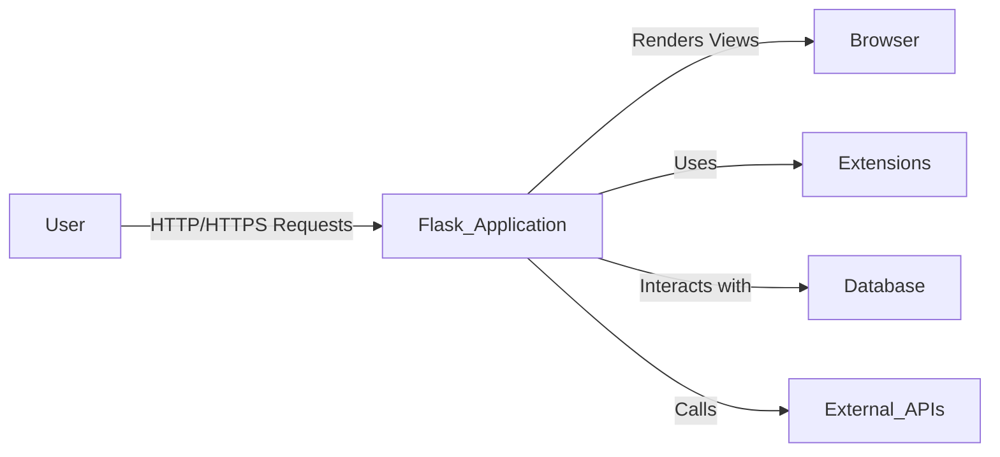
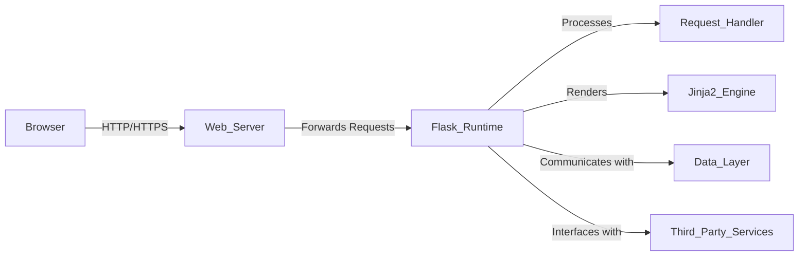
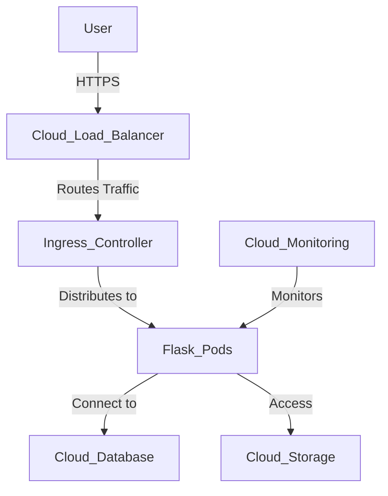
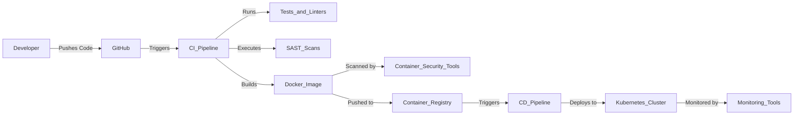

# BUSINESS POSTURE

Flask is a micro web framework written in Python, designed to make web development quick and straightforward. Its primary goal is to provide a simple yet extensible core that allows developers to build web applications efficiently. By focusing on minimalism and flexibility, Flask caters to both beginners and experienced developers in creating scalable web applications.

Business Priorities and Goals:

- Ease of Use: Provide an intuitive framework that lowers the barrier to entry for web development in Python.
- Extensibility: Allow seamless integration with extensions to add functionality as needed.
- Performance: Ensure the framework is lightweight and efficient to support responsive applications.
- Security: Maintain a secure framework that helps developers build secure applications.
- Community Support: Foster a robust community to contribute to the framework's growth and maintenance.

Important Business Risks:

- Security Vulnerabilities: Potential security flaws could harm the framework's reputation and user trust.
- Scalability Limitations: Inadequate support for larger applications may limit adoption among enterprise users.
- Competitive Pressure: Risk of losing relevance if not continuously improved amidst other emerging frameworks.
- Maintenance Challenges: Insufficient community engagement could slow development and delay critical updates.
- Compliance Risks: Failure to meet industry standards and compliance requirements could hinder adoption in regulated industries.

# SECURITY POSTURE

Existing Security Controls:

- Security Control: Input validation mechanisms to prevent injection attacks.
- Security Control: Secure session management using cryptographic signing.
- Security Control: Support for integrating authentication and authorization via extensions.
- Security Control: Documentation providing best practices for secure application development.
- Security Control: Utilization of Werkzeug for robust WSGI utilities and security features.
- Security Control: Auto-escaping in Jinja2 templates to prevent cross-site scripting (XSS) attacks.

Accepted Risks:

- Accepted Risk: Reliance on developers to implement comprehensive security measures.
- Accepted Risk: Minimalist core may lack advanced built-in security features.
- Accepted Risk: Quality and security of extensions vary, potentially introducing vulnerabilities.
- Accepted Risk: No built-in rate limiting or protection against brute-force attacks.

Recommended Security Controls:

- Security Control: Implement a formal security review process for code contributions.
- Security Control: Provide official security-focused extensions or modules.
- Security Control: Regularly update dependencies to address known vulnerabilities.
- Security Control: Enforce secure default configurations in the framework settings.
- Security Control: Introduce built-in support for common security features like CSRF protection.
- Security Control: Promote the use of HTTPS and secure cookies by default.

Security Requirements:

- Authentication: Support mechanisms to verify user identity securely, including multi-factor authentication via extensions.
- Authorization: Define user roles and permissions to control access to resources.
- Input Validation: Ensure all user inputs are sanitized to prevent injection and other attacks.
- Cryptography: Use secure methods for data encryption, password hashing, and managing cryptographic keys.

Implementation of Security Controls:

- Input Validation: Implemented via Werkzeug's built-in request data handling.
- Session Management: Leveraging secure cookies with cryptographic signing in Flask's session handling.
- Authentication & Authorization: Available through extensions like Flask-Login, Flask-Security, and Flask-JWT.
- Documentation: Security considerations and recommendations are detailed in Flask's official documentation.
- Template Security: Jinja2 templates auto-escape content by default to prevent XSS attacks.

# DESIGN

Flask is architected as a microframework, providing essential components to build web applications while giving developers the freedom to choose additional libraries and tools. It follows a modular design, relying on Werkzeug for WSGI support and Jinja2 for templating.

## C4 CONTEXT

### Context Diagram Elements

| Name               | Type   | Description                                | Responsibilities                            | Security Controls                              |
|--------------------|--------|--------------------------------------------|---------------------------------------------|-----------------------------------------------|
| User               | Actor  | End-user of the web application            | Interacts with the application via web      | N/A                                           |
| Flask Application  | System | The web application built with Flask       | Handles requests, processes data, sends responses | Input validation, session management         |
| Extensions         | System | Plugins to add functionalities             | Enhance application features (e.g., auth)   | Must be reviewed; security varies             |
| Browser            | System | User's web browser                         | Displays rendered content                   | N/A                                           |
| Database           | System | Data storage (e.g., SQL databases)         | Persist application data                    | Secure connections, SQL injection prevention  |
| External APIs      | System | Third-party services                       | Provide additional data/functionality       | Secure API communication (HTTPS)              |

## C4 CONTAINER

### Container Diagram Elements

| Name                | Type       | Description                               | Responsibilities                           | Security Controls                                |
|---------------------|------------|-------------------------------------------|--------------------------------------------|--------------------------------------------------|
| Browser             | Container  | User's web browser                        | Sends requests, displays responses         | N/A                                              |
| Web Server          | Container  | HTTP server (e.g., Nginx, Apache)         | Handles static files, forwards requests    | SSL/TLS termination, security headers            |
| Flask Runtime       | Container  | The executing Flask application           | Processes logic, handles routing           | Input validation, session management             |
| Request Handler     | Component  | Part of Flask handling requests           | Parses requests, calls view functions      | Validation, authentication checks                |
| Jinja2 Engine       | Component  | Templating engine for rendering views     | Processes templates, renders HTML          | Auto-escaping mechanisms                         |
| Data Layer          | Container  | Database or data storage system           | Stores and retrieves data                  | Secure connections, query parameterization         |
| Third-Party Services| Container  | External APIs or services                 | Extends functionality of the application   | Secure API keys, HTTPS communication             |

## DEPLOYMENT

Flask applications can be deployed in various environments, from simple shared hosting to complex cloud infrastructures. Below are potential deployment solutions, focusing on a cloud-based deployment using Docker containers.

Possible Deployment Solutions:

- Hosting on traditional servers with WSGI servers like Gunicorn or uWSGI.
- Deployment on PaaS platforms such as Heroku, AWS Elastic Beanstalk, or Google App Engine.
- Containerization using Docker, orchestrated by Kubernetes or Docker Swarm in a cloud environment.
- Serverless deployment using AWS Lambda, Azure Functions, or Google Cloud Functions with Flask adapters.

Selected Deployment Architecture:

Deploying the Flask application within Docker containers, managed by Kubernetes on a cloud platform such as AWS EKS, Azure AKS, or Google GKE.

### Deployment Diagram Elements

| Name                 | Type           | Description                            | Responsibilities                          | Security Controls                                |
|----------------------|----------------|----------------------------------------|-------------------------------------------|--------------------------------------------------|
| User                 | External Entity| End-users accessing the application    | Initiate requests via browser             | N/A                                              |
| Cloud Load Balancer  | Service        | Distributes incoming traffic           | Ensures availability and scalability      | SSL/TLS termination, DDoS protection             |
| Ingress Controller   | Component      | Manages external access to services    | Routes HTTP/S traffic to services         | SSL/TLS certificates, routing rules              |
| Flask Pods           | Deployment     | Kubernetes Pods running Flask containers| Run the Flask application instances       | Pod security policies, resource quotas           |
| Cloud Database       | Service        | Managed database service               | Data persistence                          | Encrypted at rest and in transit, access control |
| Cloud Storage        | Service        | Storage for static files or assets     | Stores media and static content           | Access permissions, encryption                   |
| Cloud Monitoring     | Service        | Monitoring and logging services        | Observability of application performance  | Secure logging, alerting on anomalies            |

## BUILD

The build and deployment process leverages Continuous Integration and Continuous Deployment (CI/CD) pipelines to automate testing and deployment, ensuring code quality and accelerating delivery.

Build Process Overview:

1. **Code Commit:** Developers push code changes to the GitHub repository.
2. **CI Pipeline Activation:** GitHub Actions triggers the CI pipeline upon detecting new commits or pull requests.
3. **Automated Testing:** The pipeline runs unit tests, integration tests, and code linters.
4. **Security Analysis:** Static Application Security Testing (SAST) tools scan the codebase for vulnerabilities.
5. **Container Security:** Container scanning tools check the Docker image for vulnerabilities.
6. **Container Build:** A Docker image of the application is built.
7. **Artifact Storage:** The Docker image is pushed to a secure container registry.
8. **CD Pipeline Activation:** Upon successful build, the CD pipeline deploys the image to the Kubernetes cluster.
9. **Deployment Verification:** Automated tests run to ensure the deployment was successful.
10. **Monitoring:** Deployed applications are monitored for performance and security.

Security Controls in Build Process:

- **Supply Chain Security:** Use of trusted base images and dependency management with tools like pip-tools.
- **Automated Builds:** CI/CD pipelines enforce consistency and reduce manual errors.
- **Security Scanning:** Integration of SAST tools like Bandit and dependency scanning with safety or Dependabot.
- **Container Scanning:** Tools like Trivy or Clair scan Docker images for vulnerabilities.
- **Access Control:** Restricted access to build environments and artifact repositories using IAM policies.
- **Artifact Integrity:** Use of digital signatures for images and artifacts to ensure integrity.
- **Secrets Management:** Secure storage of secrets and environment variables, avoiding hardcoding in code or pipelines.

# RISK ASSESSMENT

Critical Business Processes to Protect:

- **Application Functionality:** Ensuring the Flask framework and applications built on it operate reliably and securely.
- **User Trust:** Maintaining the integrity and security of applications to uphold user confidence.
- **Data Integrity and Confidentiality:** Protecting the data processed by the applications from unauthorized access or corruption.

Data to Protect and Their Sensitivity:

- **Source Code:** Highly sensitive; must be protected against unauthorized access and tampering.
- **User Data:** May include sensitive personal information, requiring strict confidentiality and compliance with data protection laws like GDPR.
- **Credentials and Secrets:** API keys, database passwords, and other credentials are highly sensitive and require secure storage and handling.
- **Transaction Data:** For applications handling financial transactions, data must be secured to prevent fraud and comply with regulations.

# QUESTIONS & ASSUMPTIONS

Questions:

1. What is the expected scale and complexity of applications intended to be built with Flask?
2. Are there specific regulatory compliance standards (e.g., PCI DSS, HIPAA, GDPR) that need to be adhered to?
3. What policies are in place for validating and approving third-party extensions?
4. How is ongoing security monitoring and incident response handled for the framework?
5. Is there a dedicated security team reviewing the Flask core and extensions?
6. How are updates and patches communicated to the community?
7. Are there any performance benchmarks or SLAs that need to be met?

Assumptions:

- **Business Posture:**
  - The primary goal is to maintain a balance between simplicity and providing robust features.
  - Flask aims to serve a broad audience, from hobbyists to enterprise developers.
  - There is a commitment to keeping Flask up-to-date with modern web development practices.

- **Security Posture:**
  - Security is a shared responsibility between the framework maintainers and the application developers.
  - The framework provides essential security features but does not enforce strict defaults to maintain flexibility.
  - Developers are expected to follow best practices and utilize extensions to enhance security.

- **Design:**
  - The deployment environment leverages modern cloud infrastructure and containerization.
  - CI/CD pipelines are utilized to streamline development and deployment processes.
  - Applications may handle sensitive data and thus require appropriate security measures.
  - The infrastructure is expected to scale to meet increasing demand without compromising security.
