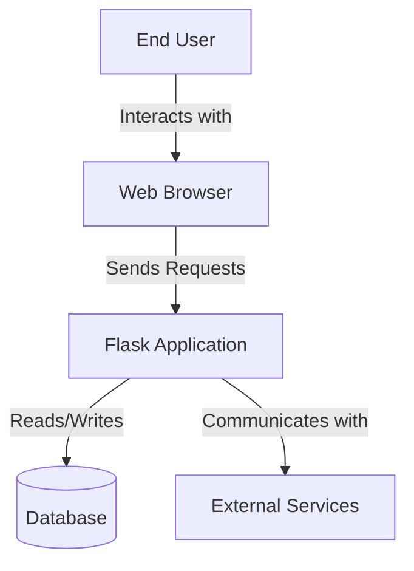
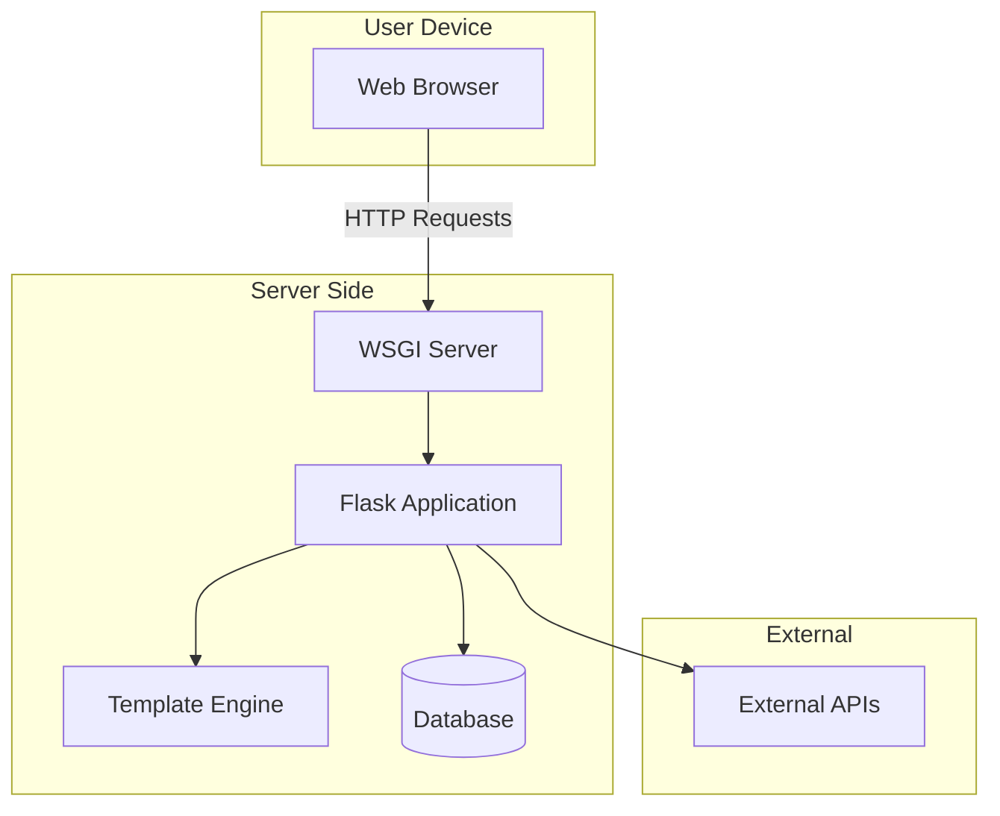
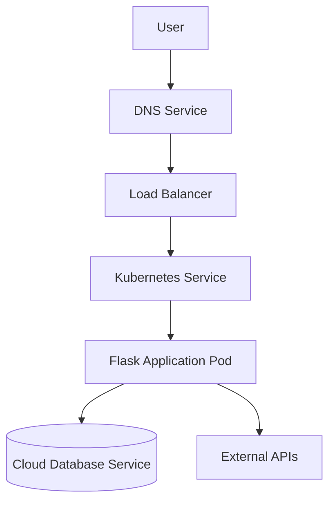
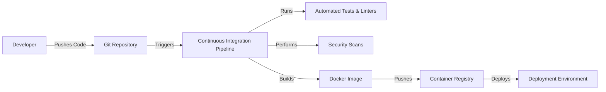

# BUSINESS POSTURE

Flask is an open-source web microframework for Python, designed to facilitate the development of web applications by providing a lightweight and flexible foundation. The primary business priorities and goals of the Flask project are:

- **Simplicity and Ease of Use**: Enable developers to build web applications quickly without unnecessary complexity.
- **Flexibility and Extensibility**: Allow developers to customize and extend the framework to suit their specific needs.
- **Community and Adoption**: Maintain a strong community presence to encourage widespread adoption and contribution.

**Business Risks** that need to be addressed based on these priorities include:

- **Security Vulnerabilities**: Risks arising from potential security flaws in the framework that could impact applications built with it.
- **Maintenance Challenges**: Ensuring continuous updates and support to keep up with evolving web standards and security practices.
- **Competition**: Staying relevant in the face of other web frameworks and technologies.

# SECURITY POSTURE

Existing security controls and accepted risks for the Flask project are as follows.

**Existing Security Controls**:

- Security control: Encourages input validation through request parsing and data handling practices.
- Security control: Supports secure session management and cookie handling.
- Security control: Provides extensions for authentication and authorization (e.g., Flask-Login, Flask-Security).
- Security control: Utilizes the Werkzeug toolkit, which includes security features for handling requests and responses.

**Accepted Risks**:

- Accepted risk: As a microframework, Flask leaves many security implementations to the developer, which may lead to misconfigurations.
- Accepted risk: Lack of enforced secure defaults for certain functionalities, placing responsibility on developers.

**Recommended Security Controls** (High Priority to Implement):

- Security control: Implement secure default configurations to reduce misconfiguration risks.
- Security control: Provide built-in Cross-Site Request Forgery (CSRF) protection mechanisms.
- Security control: Offer utilities for setting secure HTTP headers by default.
- Security control: Enhance documentation on security best practices specific to Flask.

**Security Requirements**:

- **Authentication**: Support secure authentication mechanisms to protect user credentials and sessions.
- **Authorization**: Implement robust authorization controls to restrict access based on user roles and permissions.
- **Input Validation**: Provide tools or guidelines for validating and sanitizing user input to prevent injection attacks.
- **Cryptography**: Ensure safe use of cryptographic functions for sessions, tokens, and data encryption.

For each existing security control, implementation details are as follows:

- **Input Validation**: Achieved through request parsing methods and integration with form libraries like WTForms.
- **Authentication and Authorization**: Facilitated via extensions such as Flask-Login and Flask-Security.
- **Session Management**: Secure session handling is built into Flask, with options for configuration.
- **Cookie Management**: Secure cookies can be configured to include flags like HttpOnly and Secure.

# DESIGN

Flask is designed as a micro web framework that provides the essential components to build web applications in Python. It leverages the WSGI specification for web servers and focuses on simplicity, leaving many decisions to the developer.

## C4 CONTEXT

### Context Diagram Elements

| Name             | Type            | Description                                       | Responsibilities                                         | Security Controls                                   |
|------------------|-----------------|---------------------------------------------------|----------------------------------------------------------|-----------------------------------------------------|
| User             | Actor           | An end user of the web application                | Interacts with the application via a web browser         | N/A                                                 |
| Web Browser      | System          | User's web browser                                | Sends HTTP requests and renders responses                | Uses HTTPS protocols                                |
| Flask Application| Software System | The web application built using Flask framework   | Handles HTTP requests, processes data, generates responses | Input validation, session management, secure defaults |
| Database         | Data Store      | Database used by the application                  | Stores and retrieves application data                    | Secure connections, access control                  |
| External Services| External System | Third-party services integrated with the application | Provides additional functionality via APIs              | Secure API calls, authentication                    |

## C4 CONTAINER

### Container Diagram Elements

| Name             | Type                | Description                                            | Responsibilities                                           | Security Controls                                     |
|------------------|---------------------|--------------------------------------------------------|------------------------------------------------------------|-------------------------------------------------------|
| Web Browser      | Client Application  | The user's web browser                                 | Sends HTTP requests, displays HTML/CSS/JS content           | Uses HTTPS, adheres to web security standards         |
| WSGI Server      | Application Server  | Serves the Flask application via WSGI interface         | Handles incoming HTTP requests, forwards them to Flask app  | Configured for SSL/TLS, request size limitations      |
| Flask Application| Application Container| The core application code built with Flask             | Processes requests, applies business logic, generates responses | Input validation, authentication, error handling     |
| Template Engine  | Library             | Renders HTML templates                                 | Generates dynamic HTML content                             | Escapes outputs to prevent XSS                        |
| Database         | Data Store          | Stores application data                                | Persists data, handles queries                             | Access control, encrypted connections                 |
| External APIs    | External Service    | Third-party APIs integrated into the application       | Provides additional data or functionality                  | Secure API usage, credential management               |

## DEPLOYMENT

Flask applications can be deployed in various environments. A common approach is to containerize the application using Docker and deploy it on a cloud platform using Kubernetes.

### Deployment Diagram Elements

| Name              | Type                | Description                                               | Responsibilities                                            | Security Controls                                       |
|-------------------|---------------------|-----------------------------------------------------------|-------------------------------------------------------------|---------------------------------------------------------|
| User              | Actor               | End user accessing the application                        | Initiates requests to the application                       | N/A                                                     |
| DNS Service       | DNS Service         | Resolves domain names to IP addresses                      | Directs user requests to the load balancer                  | DNSSEC, HTTPS enforcement                               |
| Load Balancer     | Network Component   | Distributes incoming traffic across multiple pods          | Manages traffic load and ensures availability               | SSL/TLS termination, DDoS mitigation                    |
| Kubernetes Service| Service             | Exposes the Flask application pods within the cluster      | Routes traffic to application pods                          | Network policies, access controls                       |
| Pod               | Kubernetes Pod      | Runs the Flask application container                       | Executes the application code                               | Container isolation, runtime security                   |
| Database Service  | Cloud Service       | Managed database service (e.g., AWS RDS, GCP Cloud SQL)    | Stores and retrieves application data                       | Encrypted connections, IAM policies                     |
| External APIs     | External Services   | Third-party APIs the application interacts with            | Provides additional functionality                           | Secure API communication, authentication                |

## BUILD

The Flask project follows a build and publish process emphasizing automation and security.

**Build Process Details**:

1. **Code Development**: Developers write code, manage dependencies, and implement tests locally.
2. **Version Control**: Code is committed and pushed to a repository, such as GitHub.
3. **Continuous Integration**:
   - Automated tests and linters are executed to ensure code quality.
   - Security scans (SAST) are performed to detect vulnerabilities.
4. **Artifact Creation**: A Docker image of the application is built.
5. **Artifact Storage**: The Docker image is stored in a secure container registry.
6. **Deployment**: The application is deployed from the container registry to the target environment (e.g., Kubernetes cluster).

**Security Controls in Build Process**:

- Use of secure CI pipelines with restricted access.
- Implementation of code signing for build artifacts.
- Regular security scans and compliance checks.
- Storage of artifacts in secure, access-controlled registries.

# RISK ASSESSMENT

- **Critical Business Processes to Protect**:
  - Secure and reliable processing of user requests within the Flask application.
  - Protection of the application's integrity and availability to end-users.
  - Safe interaction with databases and external services to prevent data breaches.

- **Data to Protect and Their Sensitivity**:
  - **User Data**: Personal information and credentials that are sensitive and require confidentiality.
  - **Application Data**: Business logic data and configurations that could be sensitive or proprietary.
  - **Secrets and Credentials**: API keys, database passwords, and other secrets that are highly sensitive.

# QUESTIONS & ASSUMPTIONS

**Questions**:

1. Are there any specific regulatory compliance requirements (e.g., GDPR, HIPAA) that the application must adhere to?
2. What is the anticipated scale of the application in terms of user load and data volume?
3. Will there be dedicated resources or teams responsible for ongoing security maintenance and updates?
4. Are there policies in place for managing third-party extensions and plugins used with Flask?

**Assumptions**:

- **Business Posture**: The project aims to empower developers by providing a secure and flexible framework, minimizing overhead while maintaining best practices.
- **Security Posture**: Security is a shared responsibility, with the framework providing foundational controls and developers implementing additional measures as needed.
- **Design**: The application will leverage modern deployment practices, including containerization and orchestration tools like Docker and Kubernetes.
