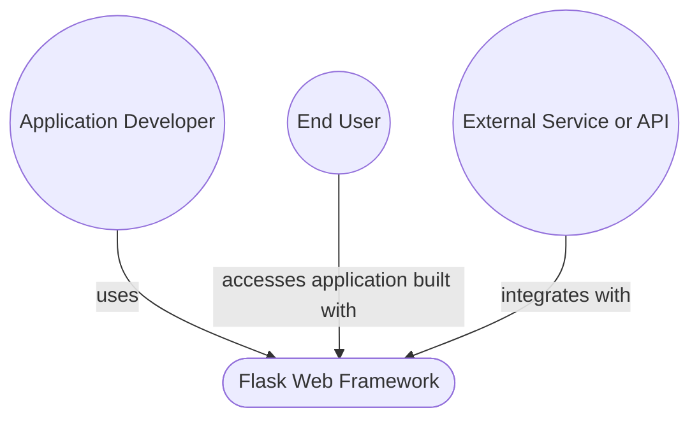
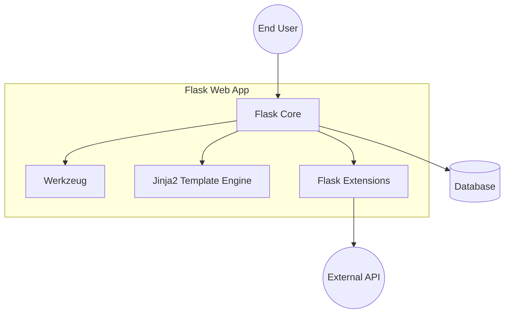
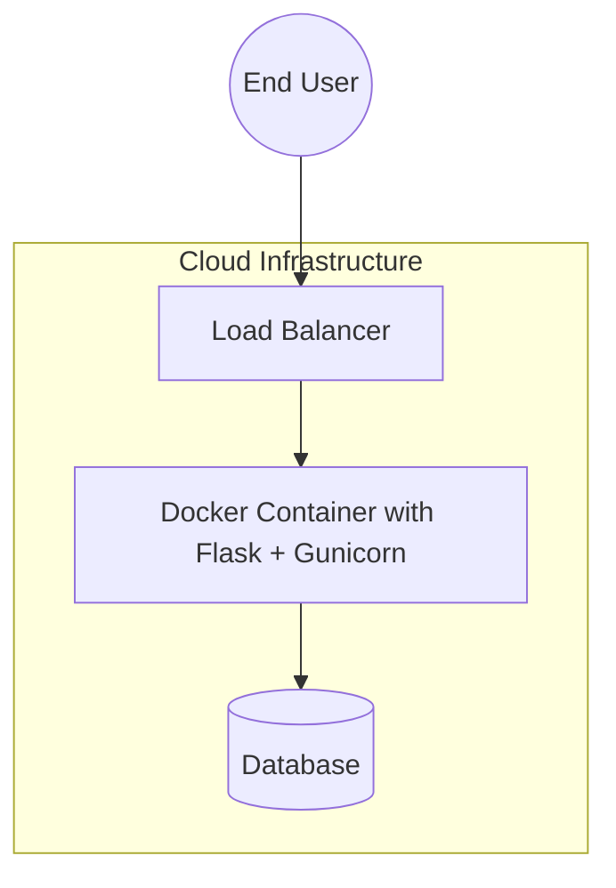

# BUSINESS POSTURE
The Flask project is an open-source Python microframework designed to enable developers to quickly build web applications. It focuses on simplicity, flexibility, and extensibility. The primary business goals and priorities include:

1. Rapid Development: Provide a simple and minimalistic framework that allows developers to prototype and build web applications quickly.
2. Community Adoption: Maintain a vibrant community where users contribute, extend, and document the framework to sustain consistent growth and improvements.
3. Extensibility: Provide mechanisms (extensions, plugins) that allow for easy integration of additional functionality (databases, authentication, etc.).
4. Lightweight Footprint: Keep the overhead minimal, so the framework remains easy to learn, maintain, and deploy.

Most important business risks based on these priorities and goals:
1. Sustainability Risk: The framework’s continued success relies on maintaining a strong open-source community and volunteer developer support.
2. Security Reputation Risk: A security vulnerability in a widely used framework can lead to significant reputational damage.
3. Scalability & Performance Risk: If user applications are not performant or cannot scale, Flask’s reputation as a lightweight and flexible framework may suffer.
4. Extension Ecosystem Risk: Extensions not maintained or poorly tested can introduce vulnerabilities and erode user trust.

# SECURITY POSTURE
This section identifies the existing security mechanisms, discusses accepted risks, and recommends additional controls for secure software development and deployment of a Flask-based project.

Existing Security Controls:
- security control: Session management using Flask’s built-in session functionality, which can be configured for secure cookie usage.
- security control: Integration with Werkzeug, providing a robust WSGI server interface that includes secure HTTP request handling.
- security control: Configuration management for secret keys and environment variables (though usage depends on implementers).
- security control: Built-in cross-site request forgery (CSRF) protection via popular Flask extensions (e.g., Flask-WTF) if adopted by users.
- security control: Minimal default attack surface (by design, Flask only provides the core essentials, limiting the built-in functionality that could be exploited).

Accepted Risks:
- accepted risk: Lack of opinionated security defaults for advanced scenarios (e.g., advanced access control rules, rate limiting). Responsibility often shifts to the application developer.
- accepted risk: Reliance on community-provided extensions for advanced security features could create inconsistent or under-reviewed code.

Recommended Security Controls:
- security control: Encourage security-critical extensions (e.g., CSRF, secure session, rate limiting) as part of official guidelines.
- security control: Implement secure coding guidelines (linting, static analysis) and incorporate them rigorously into CI processes.
- security control: Provide official support and best practices for authentication/authorization patterns (e.g., OAuth2, JWT).
- security control: Encourage or provide secure default configuration for TLS/HTTPS, session timeouts, and secure cookies.

Security Requirements:
1. Authentication: Provide extensible mechanisms (via extensions or built-in patterns) to handle user authentication safely (password handling, OAuth2, etc.).
2. Authorization: Offer straightforward ways to define and enforce role-based or permission-based access control within Flask routes.
3. Input Validation: Implement strong input validation patterns or encourage usage of libraries that support server-side validation to mitigate injection attacks.
4. Cryptography: Use secure random number generators for tokens, adopt modern and trusted libraries for encryption, and recommend best practices for key management.

# DESIGN

## C4 CONTEXT



### Context Diagram Elements
| Name             | Type           | Description                                                            | Responsibilities                                            | Security controls                                                                          |
|------------------|----------------|------------------------------------------------------------------------|------------------------------------------------------------|--------------------------------------------------------------------------------------------|
| Developer        | Person         | The application developer integrating Flask into their project         | Build, test, and maintain the Flask application            | security control: Follows secure coding guidelines                                         |
| Flask            | System         | A lightweight Python microframework for building web applications      | Provides core features (routing, session management, etc.) | security control: Minimal default attack surface; security control: Official security docs |
| End User         | Person         | A person interacting with the Flask-based web application              | Consumes the web service or website                        | Typically not enforced by Flask itself, rely on secure sessions and proper validations      |
| External Service | External System| Third-party service or API that the Flask application may integrate with| Provide or consume data                                    | security control: Secure communication via HTTPS/SSL                                       |

## C4 CONTAINER



### Container Diagram Elements
| Name            | Type       | Description                                                                           | Responsibilities                                                                      | Security controls                                                                       |
|-----------------|-----------|---------------------------------------------------------------------------------------|---------------------------------------------------------------------------------------|-----------------------------------------------------------------------------------------|
| Flask Core      | Container | The main framework code that handles routing, requests, and responses                 | Processes incoming requests, coordinates with extensions, invokes templates           | security control: Built-in support for secure cookie sessions                           |
| Werkzeug        | Container | The WSGI library that powers Flask’s request and response handling                    | Implements HTTP parsing, request/response objects, and server interface               | security control: Request validation, robust server interface                           |
| Jinja2 Template Engine | Container | The default templating engine used by Flask                              | Generates HTML pages, handles dynamic template rendering                              | security control: Autoescaping of HTML to help mitigate XSS                             |
| Flask Extensions | Container | Additional components (e.g., CSRF protection, database adapters, authentication)     | Extend Flask functionalities such as form handling, DB communication, authentication  | security control: Provided if chosen by the developer (CSRF, secure sessions, etc.)      |
| Database        | External  | The database system used by the Flask application                                   | Stores application data, user information, logs, etc.                                 | security control: Recommend encryption at rest, restricted networking                   |
| End User        | External  | A person interacting with the Flask-based web application                             | Consumes the web service or website                                                  | Typically depends on how the app enforces input validation, authentication, etc.         |
| External API    | External  | External APIs that the Flask application may consume or provide integrations for      | Provide or consume external data or services                                          | security control: Secure communication, token-based authentication                      |

## DEPLOYMENT
Depending on requirements, Flask can be deployed in multiple ways. For production, a common approach is to run Flask behind a production-ready WSGI server (e.g., Gunicorn or uWSGI) on a cloud platform. Alternatively, it can be containerized using Docker.

Possible Deployment Approaches:
1. Standard Virtual Machine Hosting
2. Containerized (Docker) on Cloud (AWS, GCP, Azure)
3. On-Premises Deployment via WSGI

Chosen Deployment: Containerized environment with Gunicorn.
Below is a sample deployment diagram illustrating how the Flask application is deployed in a container environment and served behind a load balancer.



### Deployment Diagram Elements
| Name                                    | Type          | Description                                                                 | Responsibilities                                               | Security controls                                          |
|-----------------------------------------|---------------|-----------------------------------------------------------------------------|----------------------------------------------------------------|------------------------------------------------------------|
| user                                    | External      | End user accessing the Flask application via the internet                   | Initiates HTTP/HTTPS requests                                  | Rely on TLS encryption and secure cookies                  |
| lb (Load Balancer)                      | Infrastructure| Distributes incoming requests among container instances                     | High availability, load distribution, TLS termination          | security control: TLS/SSL termination and DDoS protection  |
| container (Flask + Gunicorn)            | Container     | Docker container running the Flask web application with Gunicorn WSGI server| Serve and process application logic with concurrency handling  | security control: Secure builds, limited network exposure  |
| db (Database)                           | Infrastructure| Database instance (SQL/PostgreSQL, NoSQL, etc.) for storing data            | Store and manage application data                              | security control: Encrypted storage, restricted network    |

## BUILD
When building Flask from source or integrating it into an application, the following process ensures secure supply chain, build automation, and testing:

```mermaid
flowchart LR
    developer((Developer)) --> commitCode[Commit to GitHub Repository]
    commitCode --> ciProcess[CI/CD (GitHub Actions)]
    ciProcess --> lintAndTests[Code Linting & Tests (PyTest, Flake8)]
    lintAndTests --> securityScans[SAST & Dependency Scans]
    securityScans --> buildArtifacts[Build Artifacts & Publish to PyPI or Internal Registry]
```

Within the build process, the key security controls include:
- Code linting (e.g., Flake8) to enforce coding standards and catch basic errors
- Static Application Security Testing (SAST) scans (e.g., Bandit) to detect common Python security flaws
- Dependency scanning to identify known vulnerabilities in third-party libraries
- Integrity checks and signatures for build artifacts before they are published

# RISK ASSESSMENT
What are the critical business processes we are trying to protect?
- The ability for developers to rapidly prototype and deploy secure web applications with minimal overhead.
- The trust relationship between Flask as a framework and the developers/companies that adopt it.

What data are we trying to protect and what is their sensitivity?
- Various forms of application data stored in or processed by Flask-based applications (user credentials, personally identifiable information, payment data).
- Source code integrity: protecting against malicious code injection or supply chain attacks on the Flask repository or its dependencies.

# QUESTIONS & ASSUMPTIONS
1. Questions:
   - Which security extensions does the project officially endorse or recommend?
   - Is there a stance on official code scanning or mandatory security reviews before merging community contributions?
   - Does the project plan to guide new developers to follow best practices for authentication/authorization?

2. Assumptions:
   - Flask usage will typically be combined with additional security libraries or frameworks for production environments.
   - The recommended security controls (TLS, secure session tokens, input validation) will be configured by the application developer.
   - The repository’s maintainers and community contributors will follow typical open-source contribution review processes.
