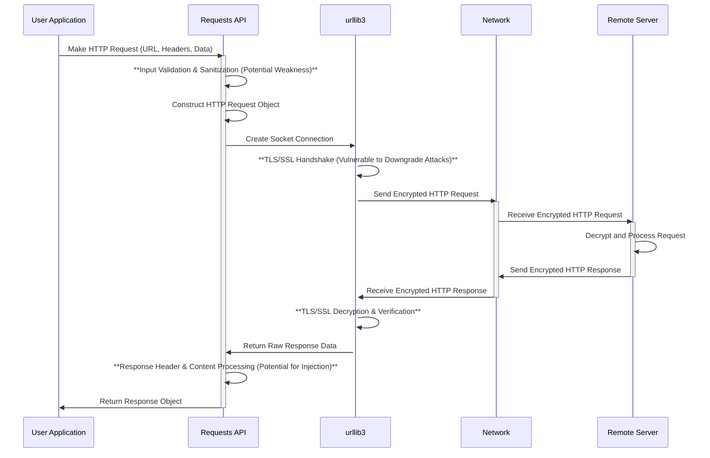

# Project Design Document: Requests Library (Improved)

**Version:** 2.0
**Date:** October 26, 2023
**Author:** AI Software Architect

## 1. Introduction

This document provides an enhanced and more detailed design overview of the Python Requests library, specifically tailored for threat modeling purposes. Building upon the previous version, this document delves deeper into the library's architecture, data flow, and security considerations, aiming to provide a comprehensive understanding for security analysis and risk assessment.

The Requests library remains a cornerstone of Python's web interaction capabilities, simplifying HTTP/1.1 request creation and handling. This improved document emphasizes aspects relevant to identifying potential vulnerabilities and attack vectors.

## 2. Goals

The primary goals of this enhanced design document are:

* **Provide a granular description of the Requests library's architecture, highlighting security-relevant components and interactions.**
* **Detail the data flow during request and response cycles with a focus on potential interception and manipulation points.**
* **Thoroughly identify critical security considerations, potential vulnerabilities, and associated risks.**
* **Serve as a precise and actionable reference for conducting comprehensive threat modeling exercises.**
* **Facilitate a deeper understanding of the library's security posture for developers and security professionals.**

## 3. Scope

This document maintains its focus on the core functionality of the Requests library but expands on security-related aspects:

* **Detailed analysis of making HTTP requests (GET, POST, PUT, DELETE, etc.) with emphasis on parameter handling and data serialization.**
* **In-depth examination of header manipulation and potential injection points.**
* **Comprehensive coverage of server response processing, including status code interpretation and content handling vulnerabilities.**
* **Detailed analysis of cookie and session management, including security attributes and potential weaknesses.**
* **Thorough exploration of redirection handling and associated risks (e.g., open redirects).**
* **Detailed breakdown of basic and more advanced authentication mechanisms and their security implications.**
* **In-depth analysis of TLS/SSL verification processes and potential bypass scenarios.**

The exclusions remain the same as the previous version, focusing on the core library functionality rather than specific integrations or internal `urllib3` details.

## 4. High-Level Architecture

The high-level architecture remains consistent, but the description is enhanced to highlight security boundaries and interaction points.

```mermaid
graph LR
    UA[User Application] --> RA(Requests API);
    subgraph "Client Side"
        RA --> U3(urllib3);
    end
    U3 -- TLS/SSL Encrypted Connection --> NW(Network);
    NW --> RS(Remote Server);
    RS -- TLS/SSL Encrypted Connection --> NW;
    NW --> U3;
    U3 --> RA;
    RA --> UA;

    style UA fill:#f9f,stroke:#333,stroke-width:2px, title: "Potentially Untrusted Input"
    style RA fill:#ccf,stroke:#333,stroke-width:2px
    style U3 fill:#ddf,stroke:#333,stroke-width:2px
    style NW fill:#eee,stroke:#333,stroke-width:2px, title: "Untrusted Network"
    style RS fill:#aaf,stroke:#333,stroke-width:2px

    linkStyle 0,4 stroke-width:2px,color:green;
    linkStyle 2,3 stroke-width:2px,color:red, style:dashed;
```

**Components (with Security Focus):**

* **User Application (UA):** The application code using Requests. This is a critical point for secure coding practices as it's where request parameters and data originate, potentially introducing vulnerabilities if not handled correctly.
* **Requests API (RA):** The public interface. It's responsible for sanitizing and encoding data before passing it to `urllib3`, but vulnerabilities can still arise from improper usage.
* **urllib3 (U3):** Handles the low-level HTTP communication, including TLS/SSL. Its security is paramount, and any vulnerabilities here directly impact Requests.
* **Network (NW):** The untrusted medium where data is transmitted. This is a primary target for eavesdropping and man-in-the-middle attacks. The TLS/SSL connection aims to secure this communication.
* **Remote Server (RS):** The target server. While not part of the Requests library itself, understanding its security posture is crucial when assessing the overall risk.

## 5. Detailed Design

### 5.1. Request Flow (Enhanced for Security)

The request flow is augmented to highlight security checks and potential vulnerabilities at each stage.



**Security Considerations in Request Flow:**

* **Input Validation & Sanitization (Requests API):** The Requests API attempts to handle some basic encoding, but thorough validation of user-provided data (especially in URLs, headers, and request bodies) is the responsibility of the *user application*. Failure to do so can lead to injection vulnerabilities.
* **TLS/SSL Handshake (urllib3):** While `urllib3` handles TLS, vulnerabilities can exist in the handshake process itself (e.g., downgrade attacks if not configured correctly).
* **Network Transmission:** The network is inherently insecure. TLS/SSL encryption is crucial to protect data in transit. Misconfigurations or vulnerabilities in the TLS implementation can expose data.
* **Response Header & Content Processing (Requests API):** Processing response headers and content can introduce vulnerabilities if not done carefully. For example, blindly trusting and rendering HTML content from a response can lead to XSS.

### 5.2. Key Components (Security Focused)

* **`requests.api`:**  The entry point. Security considerations here involve how parameters are passed and how the API is used to construct requests. Improper use can bypass security mechanisms.
* **`requests.sessions.Session`:**  Manages cookies and authentication. Vulnerabilities can arise from insecure cookie handling (e.g., missing `HttpOnly` or `Secure` flags) or improper storage of authentication credentials.
* **`requests.models.Request`:** Represents the outgoing request. Manipulating the attributes of this object directly (though less common) could bypass intended security measures.
* **`requests.models.Response`:** Represents the server's response. Security concerns revolve around how the response data is processed and used, particularly the potential for interpreting malicious content.
* **`requests.cookies.RequestsCookieJar`:**  Stores and manages cookies. Vulnerabilities can occur if cookies are not handled with appropriate security attributes or if the jar itself is compromised.
* **`requests.auth`:** Handles authentication. The security of this component depends on the strength of the implemented authentication mechanisms and the secure handling of credentials.
* **`requests.adapters`:** Allows customization of the transport layer. Using custom adapters introduces potential security risks if the adapter itself is not secure.
* **`urllib3`:**  The foundation for secure communication. Vulnerabilities in `urllib3` directly impact the security of Requests. Keeping this dependency updated is critical.

### 5.3. Data Elements (with Security Implications)

| Data Element          | Description                                                                 | Security Implications                                                                                                                               |
|-----------------------|-----------------------------------------------------------------------------|-----------------------------------------------------------------------------------------------------------------------------------------------------|
| **URL**               | Target address of the request.                                              | Potential for URL injection if not properly validated. Sensitive information in the URL can be exposed in logs or browser history.                 |
| **HTTP Method**       | Action to be performed (e.g., GET, POST).                                  | While generally safe, using incorrect methods can lead to unintended server-side actions.                                                          |
| **Headers**           | Key-value pairs providing request/response metadata.                         | Header injection vulnerabilities (e.g., CRLF injection) can allow attackers to manipulate responses or set malicious cookies. Sensitive information leakage. |
| **Request Body**      | Data sent to the server (e.g., form data, JSON).                            | Injection vulnerabilities (e.g., SQL injection if data is used in database queries on the server). Exposure of sensitive data if not encrypted.      |
| **Response Status Code**| Indicates the outcome of the request.                                       | Can be used by attackers to infer information about the server's state.                                                                            |
| **Response Body**     | Data returned by the server.                                                | Potential for XSS vulnerabilities if HTML content is rendered without proper sanitization. Exposure of sensitive data.                             |
| **Cookies**           | Small pieces of data stored by the client.                                  | Session hijacking if cookies are not secure (missing `HttpOnly`, `Secure` flags). Cross-site scripting (XSS) can be used to steal cookies.         |
| **Authentication Data**| Credentials used for authentication (e.g., username/password, API keys). | Exposure of these credentials leads to unauthorized access. Weak authentication mechanisms can be easily bypassed.                                  |

## 6. Security Considerations (Expanded)

This section provides a more detailed breakdown of security considerations and potential threats:

* **TLS/SSL Verification:**
    * **Threat:** Man-in-the-middle (MITM) attacks if verification is disabled or improperly configured. Attackers can intercept and modify communication.
    * **Mitigation:** Always enable and properly configure TLS/SSL verification. Use trusted certificate authorities. Be wary of ignoring certificate errors.
* **Input Validation:**
    * **Threat:** Injection attacks (e.g., SQL injection, command injection, header injection) if user-provided data is not validated and sanitized before being used in requests.
    * **Mitigation:** Implement robust input validation on the client-side *before* making requests. Sanitize data to remove potentially harmful characters or sequences. Use parameterized queries or prepared statements on the server-side.
* **Output Encoding:**
    * **Threat:** Cross-site scripting (XSS) vulnerabilities if data received from the server is rendered in a web browser without proper encoding.
    * **Mitigation:** Encode output based on the context (e.g., HTML escaping, JavaScript escaping). Use templating engines that automatically handle encoding.
* **Cookie Handling:**
    * **Threat:** Session hijacking, cross-site scripting (XSS) leading to cookie theft, cross-site request forgery (CSRF) if cookies are not properly secured.
    * **Mitigation:** Set `HttpOnly` and `Secure` flags on cookies. Use strong, unpredictable session IDs. Implement CSRF protection mechanisms.
* **Redirection Handling:**
    * **Threat:** Open redirect vulnerabilities where an attacker can trick the application into redirecting users to a malicious site.
    * **Mitigation:** Avoid blindly following redirects. Validate the target of redirects against a whitelist of allowed domains.
* **Authentication:**
    * **Threat:** Brute-force attacks, credential stuffing, replay attacks if authentication mechanisms are weak or improperly implemented. Exposure of credentials if not transmitted securely.
    * **Mitigation:** Use strong authentication mechanisms (e.g., OAuth 2.0). Enforce strong password policies. Use HTTPS for transmitting credentials. Store credentials securely (e.g., using hashing and salting).
* **Dependency Management:**
    * **Threat:** Vulnerabilities in dependencies (especially `urllib3`) can directly impact the security of the Requests library.
    * **Mitigation:** Regularly update the Requests library and its dependencies to patch known vulnerabilities. Use dependency scanning tools to identify potential risks.
* **Error Handling:**
    * **Threat:** Information leakage through overly verbose error messages. Potential for denial-of-service (DoS) if error handling is not robust.
    * **Mitigation:** Implement generic error messages that do not reveal sensitive information. Implement proper logging for debugging purposes.
* **Timeout Configuration:**
    * **Threat:** Denial-of-service (DoS) attacks if requests are allowed to hang indefinitely, consuming resources.
    * **Mitigation:** Set appropriate timeouts for requests to prevent them from blocking resources indefinitely.

**Attack Surface:**

The primary attack surface of applications using the Requests library includes:

* **User-provided input:** URLs, headers, request bodies.
* **Network communication:** Potential for interception and manipulation if TLS/SSL is not properly implemented.
* **Server responses:** Malicious content in headers or the response body.
* **Cookie handling:** Vulnerabilities in how cookies are set, stored, and used.

## 7. Dependencies

The primary dependency remains `urllib3`. It is crucial to ensure this dependency is kept up-to-date due to its direct impact on the security of network communication. Security vulnerabilities in `urllib3` can directly translate to vulnerabilities in applications using Requests.

## 8. Deployment Considerations (Security Focused)

Security considerations during deployment are paramount:

* **Secure Environment:** Deploy applications using Requests in secure environments with proper network segmentation and access controls.
* **Configuration Management:** Securely manage any configuration settings, especially those related to TLS/SSL, timeouts, and authentication. Avoid storing sensitive information in plain text.
* **Monitoring and Logging:** Implement comprehensive monitoring and logging to detect suspicious activity, failed requests, and potential security breaches.
* **Regular Updates:** Ensure the underlying operating system, Python interpreter, and all dependencies are regularly updated to patch security vulnerabilities.

## 9. Diagrams

The diagrams used in this document are:

* **High-Level Architecture Diagram (Improved):**  Highlights security boundaries and the untrusted network.
* **Request Flow Diagram (Enhanced for Security):**  Annotates potential vulnerabilities and security checks within the request lifecycle.

## 10. Conclusion

This improved design document provides a more in-depth and security-focused analysis of the Python Requests library. By detailing the architecture, data flow, and potential vulnerabilities, this document serves as a valuable resource for conducting thorough threat modeling exercises and building more secure applications that leverage the power of Requests. Understanding these security considerations is crucial for mitigating risks and protecting applications from potential attacks.
