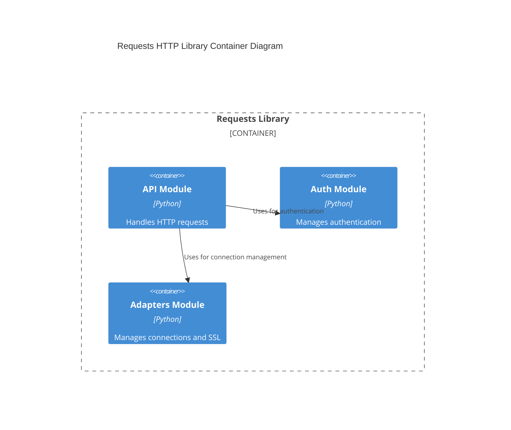
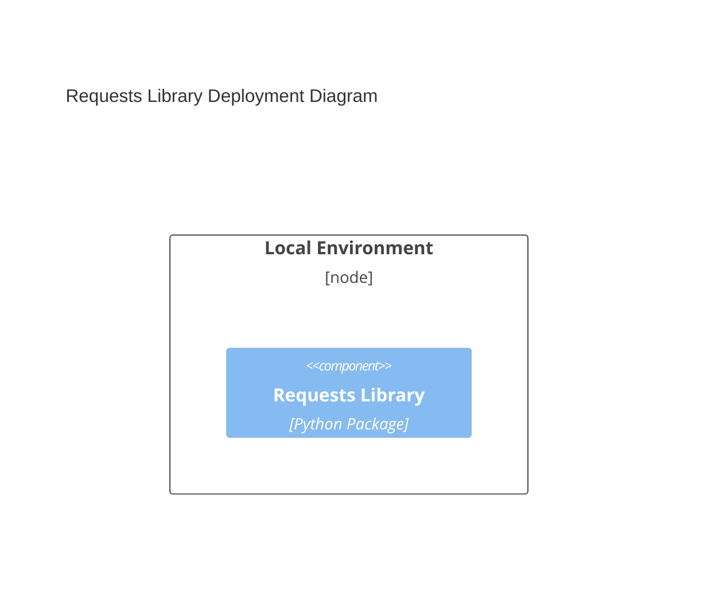
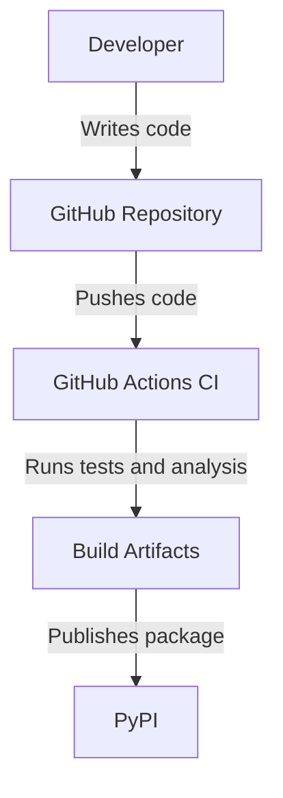

# Design Document for Requests HTTP Library

## BUSINESS POSTURE

The Requests library is a widely used HTTP library in Python, designed to make HTTP requests simpler and more human-friendly. The primary business goal is to provide a reliable, easy-to-use interface for making HTTP requests, which is crucial for web scraping, API interactions, and other web-related tasks. The library is depended upon by over a million repositories, indicating its critical role in many applications.

**Business Priorities and Goals:**
- Maintain high reliability and ease of use.
- Ensure compatibility with a wide range of Python versions and environments.
- Provide robust support for HTTP features like sessions, authentication, and SSL verification.

**Business Risks:**
- Security vulnerabilities due to the library's widespread use.
- Compatibility issues with new Python versions or changes in HTTP standards.
- Performance bottlenecks in high-load scenarios.

## SECURITY POSTURE

**Existing Security Controls:**
- **Security Control:** SSL/TLS verification is enabled by default (`verify=True`), ensuring secure connections. Implemented in `adapters.py`.
- **Security Control:** Support for HTTP Basic and Digest Authentication, allowing secure access to protected resources. Implemented in `auth.py`.
- **Security Control:** Proxy support with authentication, ensuring secure and configurable network requests. Implemented in `adapters.py`.
- **Security Control:** Vulnerability disclosure process outlined in `SECURITY.md`.

**Accepted Risks:**
- **Accepted Risk:** Allowing `verify=False` for SSL/TLS verification, which can lead to man-in-the-middle attacks if misused.

**Recommended Security Controls:**
- **Security Control:** Implement rate limiting to prevent abuse in high-load scenarios.
- **Security Control:** Enhance logging for security-related events to aid in monitoring and incident response.

**Security Requirements:**
- **Authentication:** Support for various authentication mechanisms (Basic, Digest, OAuth).
- **Authorization:** Not directly applicable, as Requests is a client-side library.
- **Input Validation:** Ensure all inputs, especially URLs and headers, are properly validated to prevent injection attacks.
- **Cryptography:** Use secure cryptographic libraries for SSL/TLS and hashing (e.g., `ssl`, `hashlib`).

## DESIGN

### C4 CONTEXT

```mermaid
C4Context
    title Requests HTTP Library Context Diagram
    Boundary(requests, "Requests Library") {
        System_Ext(user, "Developer")
        System_Ext(api, "External API")
    }
    Rel(user, requests, "Uses")
    Rel(requests, api, "Sends HTTP requests to")
```

| Name      | Type       | Description                          | Responsibilities                  | Security Controls                          |
|-----------|------------|--------------------------------------|----------------------------------|--------------------------------------------|
| Developer | External   | A developer using the Requests library | Utilize the library to make HTTP requests | N/A                                        |
| Requests Library | System | The Requests HTTP library itself     | Facilitate HTTP requests and responses | SSL/TLS verification, Authentication       |
| External API | External | An API that the Requests library interacts with | Provide data and services via HTTP | N/A                                        |

### C4 CONTAINER



| Name          | Type      | Description                              | Responsibilities                  | Security Controls                          |
|---------------|-----------|------------------------------------------|----------------------------------|--------------------------------------------|
| API Module    | Container | Handles the construction and sending of HTTP requests | Construct and send HTTP requests | Input validation, SSL/TLS verification     |
| Auth Module   | Container | Manages authentication mechanisms        | Provide authentication support   | Basic and Digest Authentication            |
| Adapters Module | Container | Manages connections and SSL settings     | Handle connection pooling and SSL | SSL/TLS verification, Proxy support        |

### DEPLOYMENT

**Deployment Options:**
1. Local Python environment
2. Cloud-based Python environment (e.g., AWS Lambda, Google Cloud Functions)

**Chosen Deployment: Local Python Environment**



| Name              | Type       | Description                              | Responsibilities                  | Security Controls                          |
|-------------------|------------|------------------------------------------|----------------------------------|--------------------------------------------|
| Local Environment | Node       | The local machine where the library is used | Execute Python scripts using Requests | N/A                                        |
| Requests Library  | Component  | The Requests library package             | Facilitate HTTP requests and responses | SSL/TLS verification, Authentication       |

### BUILD

**Build Process:**
- The Requests library is built and published using `setuptools`.
- Continuous Integration (CI) is implemented using GitHub Actions, with workflows for linting, testing, and security analysis.



**Security Controls in Build Process:**
- **Security Control:** CodeQL analysis for security vulnerabilities (`codeql-analysis.yml`).
- **Security Control:** Linting to enforce code quality (`lint.yml`).
- **Security Control:** Automated testing across multiple Python versions (`run-tests.yml`).

## RISK ASSESSMENT

- **Critical Business Process:** Ensuring reliable and secure HTTP communication for applications using the Requests library.
- **Data Sensitivity:** The library handles potentially sensitive data such as API keys and user credentials, which must be protected during transmission.

## QUESTIONS & ASSUMPTIONS

- **Questions:**
  - Are there any additional security requirements for specific use cases of the library?
  - How often are security audits conducted on the library's codebase?

- **Assumptions:**
  - The library will continue to support a wide range of Python versions.
  - Users will follow best practices for securing their applications, such as not setting `verify=False` unless absolutely necessary.
