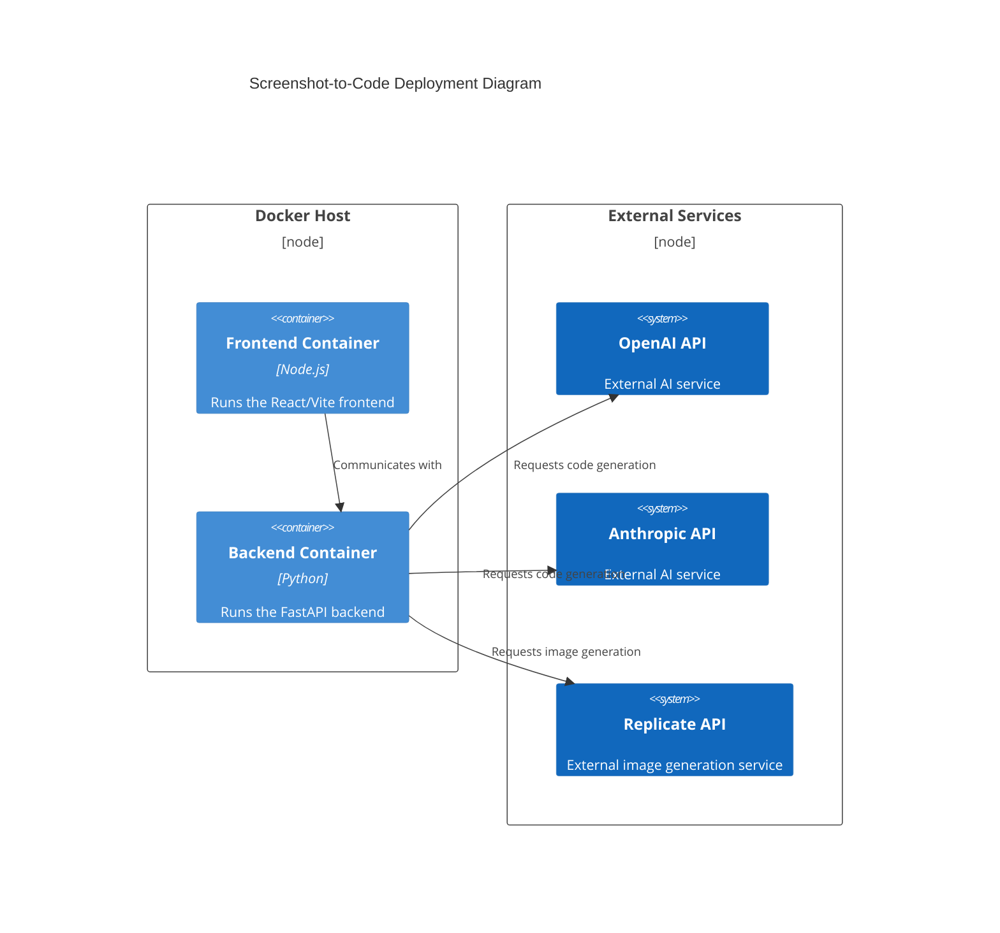

# Design Document for Screenshot-to-Code Project

## Business Posture

The primary goal of the Screenshot-to-Code project is to provide a tool that converts screenshots, mockups, and Figma designs into clean, functional code using AI. The project supports multiple technology stacks and AI models, aiming to streamline the process of turning visual designs into code, thus enhancing productivity for developers and designers. The business priorities include expanding support for various frameworks, improving AI model accuracy, and providing a seamless user experience. Key business risks involve maintaining the accuracy and reliability of the code generation process and ensuring compatibility with a wide range of design inputs.

## Security Posture

### Existing Security Controls
- **Security Control**: API keys for OpenAI and Anthropic are stored in environment variables and can be set via a settings dialog in the frontend. (Implemented in `backend/config.py`)
- **Security Control**: CORS middleware is configured to allow all origins, methods, and headers, which may need to be restricted in production. (Implemented in `backend/main.py`)
- **Security Control**: Docker is used for containerization, providing an isolated environment for running the application. (Described in `docker-compose.yml`)

### Accepted Risks
- **Accepted Risk**: The use of third-party AI models may introduce dependencies on external services, which could affect availability and performance.

### Recommended Security Controls
- **Security Control**: Implement input validation to ensure that only valid and expected data is processed by the backend.
- **Security Control**: Use HTTPS for all communications to protect data in transit.
- **Security Control**: Implement rate limiting to prevent abuse of the API.

### Security Requirements
- **Authentication**: Use API keys for authenticating requests to external AI services.
- **Authorization**: Ensure that only authorized users can access certain features, especially those involving API key management.
- **Input Validation**: Validate all inputs to the backend to prevent injection attacks and ensure data integrity.
- **Cryptography**: Use secure methods for storing and transmitting API keys and other sensitive information.

## Design

### C4 Context

| Name              | Type   | Description                                      | Responsibilities                              | Security Controls                                      |
|-------------------|--------|--------------------------------------------------|-----------------------------------------------|--------------------------------------------------------|
| Screenshot-to-Code| System | Converts screenshots to code using AI            | Process inputs, generate code, manage API keys| API key management, CORS configuration, Docker isolation|
| User              | Person | Developer or Designer using the tool             | Provide inputs, receive generated code        | N/A                                                    |
| OpenAI API        | System | External AI service for code generation          | Provide AI models for code generation         | API key authentication                                 |
| Anthropic API     | System | External AI service for code generation          | Provide AI models for code generation         | API key authentication                                 |
| Replicate API     | System | External service for image generation            | Provide image generation capabilities         | API key authentication                                 |

### C4 Container

| Name      | Type       | Description                                      | Responsibilities                              | Security Controls                                      |
|-----------|------------|--------------------------------------------------|-----------------------------------------------|--------------------------------------------------------|
| Frontend  | Container  | User interface for interacting with the tool     | Display UI, handle user inputs                | N/A                                                    |
| Backend   | Container  | Handles requests and communicates with AI services| Process requests, manage API keys, store data| API key management, CORS configuration, Docker isolation|
| Database  | Container  | Stores user data and application state           | Persist data, manage state                    | Secure access controls, encryption at rest              |
| AI Services| Container | Provides AI models for code and image generation | Generate code and images                      | API key authentication                                 |

### Deployment

The project can be deployed using Docker, which provides an isolated environment for both the frontend and backend components. The deployment can be configured using `docker-compose.yml`, which sets up the necessary services and environment variables.

| Name              | Type       | Description                                      | Responsibilities                              | Security Controls                                      |
|-------------------|------------|--------------------------------------------------|-----------------------------------------------|--------------------------------------------------------|
| Docker Host       | Node       | Host machine for running Docker containers       | Run containers, manage resources              | Host security, Docker security best practices          |
| Frontend Container| Container  | Runs the React/Vite frontend                     | Serve frontend application                    | Container isolation                                    |
| Backend Container | Container  | Runs the FastAPI backend                         | Serve backend API, manage requests            | Container isolation, API key management                |
| External Services | Node       | External AI and image generation services        | Provide AI models and image generation        | API key authentication                                 |

### Build

The project uses a combination of Poetry for Python dependency management and Yarn for Node.js dependencies. The build process involves setting up the environment, installing dependencies, and running the application using Docker or directly on the host machine.

- **Supply Chain Security**: Use of Poetry and Yarn ensures that dependencies are managed and locked to specific versions.
- **Build Automation**: The use of Docker and CI/CD pipelines automates the build and deployment process.
- **Security Checks**: Implement SAST scanners and linters in the CI/CD pipeline to catch security issues early.

## Risk Assessment

- **Critical Business Process**: The primary business process is the conversion of visual designs into functional code, which is critical for user satisfaction and business success.
- **Data Sensitivity**: The project handles API keys and potentially sensitive design data, which must be protected to prevent unauthorized access and misuse.

## Questions & Assumptions

- **Questions**:
  - How is user authentication and authorization managed in the hosted version?
  - What measures are in place to handle API rate limits and potential downtime of external services?
  - Are there any plans to support additional AI models or frameworks in the future?

- **Assumptions**:
  - The project will continue to rely on external AI services for code generation.
  - The current security controls are sufficient for the initial deployment, but may need to be enhanced as the project scales.
  - The Docker-based deployment model will be used for both development and production environments.
