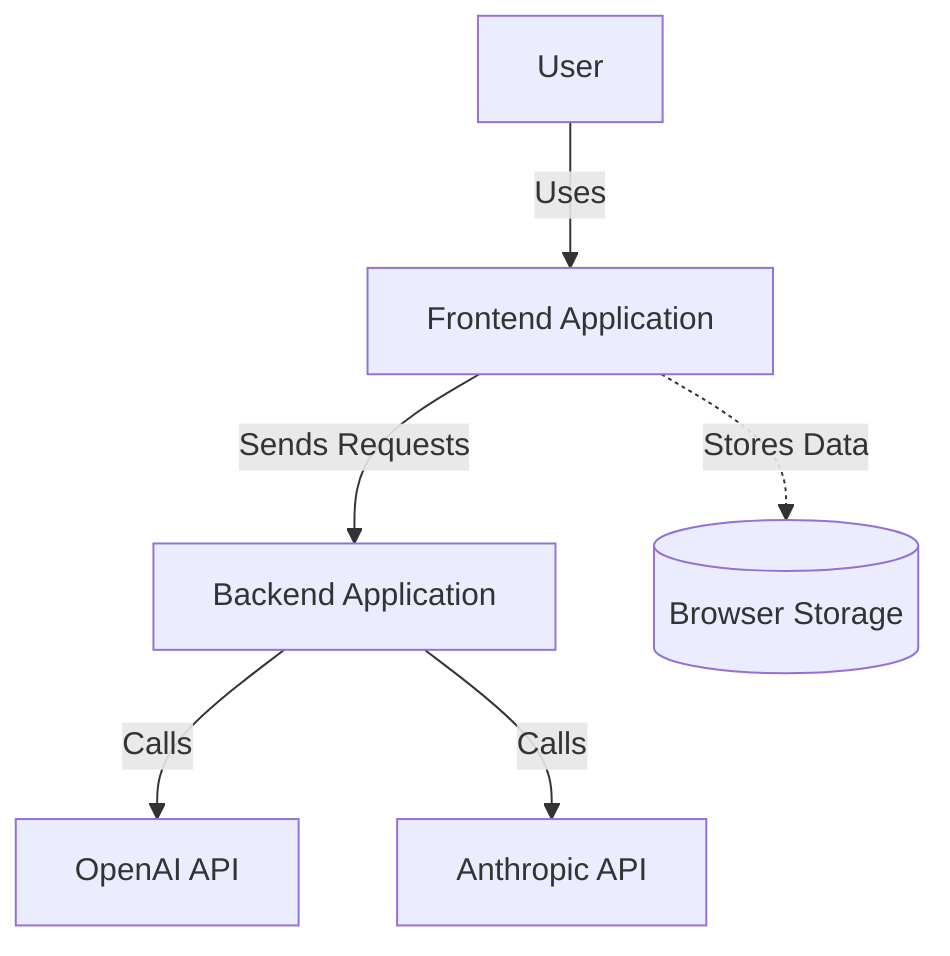
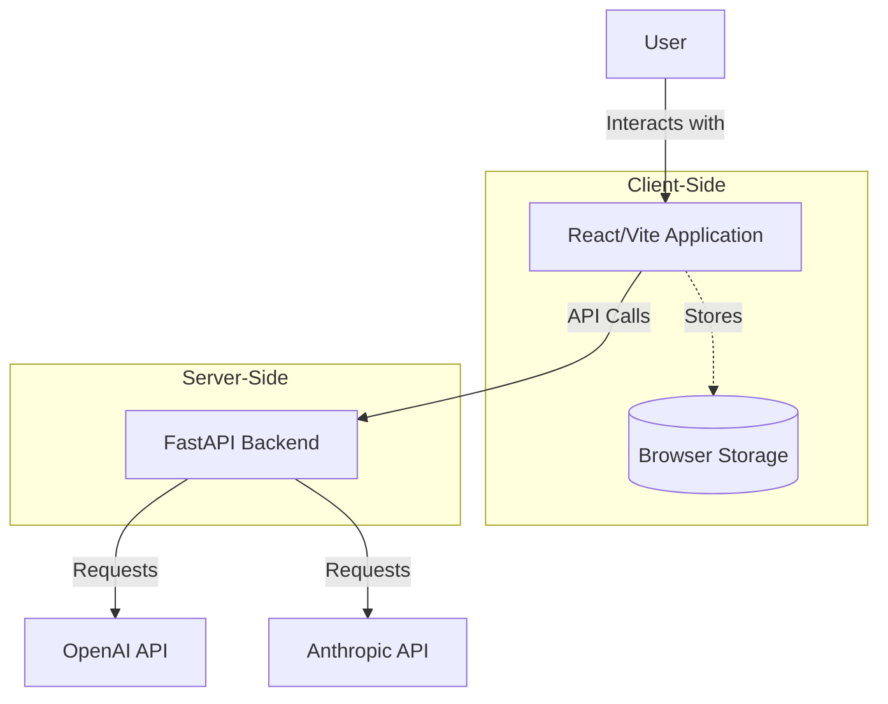
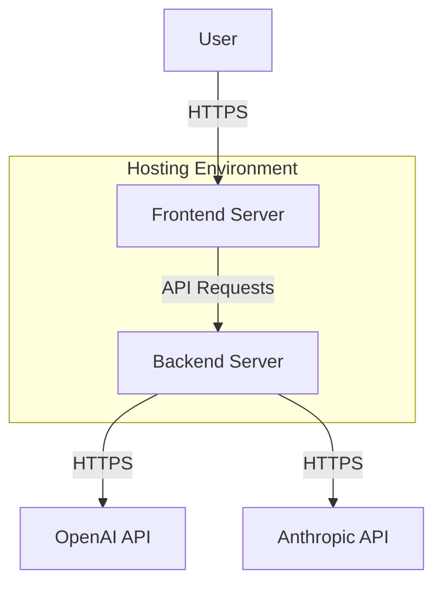
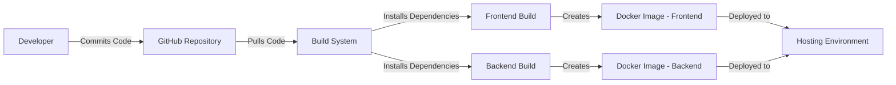

# BUSINESS POSTURE

The "screenshot-to-code" project is a tool designed to convert screenshots, mockups, and Figma designs into clean, functional code using AI models such as Claude Sonnet 3.5 and GPT-4o. The primary business priorities and goals of the project are:

- **Automate Code Generation**: Reduce manual coding effort by automating the conversion of visual designs into code, thereby increasing developer productivity and speeding up development cycles.

- **Support Multiple Technology Stacks**: Provide versatility by supporting various technology stacks including HTML + Tailwind, React, Vue, Bootstrap, Ionic, and SVG to cater to a wide range of developer preferences and project requirements.

- **Offer Both Hosted and Open Source Versions**: Allow users to try the tool via a hosted version for convenience or run it locally using the open-source version for customization and integration into their workflows.

- **Leverage Advanced AI Models**: Utilize state-of-the-art AI models to ensure high-quality code generation that closely matches the input designs.

**Business Risks to Address**:

- **Reliance on Third-Party AI Services**: Dependence on external AI services like OpenAI and Anthropic may pose risks related to service availability, pricing changes, or usage limits.

- **Competitive Market**: The presence of similar tools in the market increases the need for continuous innovation and maintaining a competitive edge.

- **User Trust and Adoption**: Ensuring the generated code is accurate and reliable is critical for user trust and widespread adoption.

# SECURITY POSTURE

**Existing Security Controls**:

- **security control**: **Environment Variables for API Keys** - Users set up their OpenAI and Anthropic API keys using environment variables or the frontend settings dialog. This prevents hardcoding sensitive keys in the codebase. (Implemented in `backend/config.py`, described in `README.md`)

- **security control**: **Local Storage of API Keys** - For the hosted version, API keys are stored locally in the user's browser and not on the server, reducing the risk of unauthorized access. (Described in `README.md`)

- **security control**: **CORS Configuration** - Cross-Origin Resource Sharing (CORS) middleware is configured in the backend to control and restrict cross-origin requests. (Implemented in `backend/main.py`)

- **security control**: **Mock Mode for Development** - A mock mode is available to run the backend without making actual API calls to OpenAI, preserving API key usage during development. (Controlled via `MOCK` environment variable in `backend/config.py`)

**Accepted Risks**:

- **accepted risk**: **User-Managed API Keys** - Users are responsible for securing their own API keys when running the application locally, which may lead to exposure if not handled properly.

- **accepted risk**: **Open Source Exposure** - The open-source nature of the project means the code is publicly accessible, which could potentially expose vulnerabilities.

**Recommended Security Controls**:

- **security control**: **Implement Authentication for Hosted Version** - Incorporate user authentication to control access to the hosted service and protect against unauthorized use.

- **security control**: **Input Validation and Sanitization** - Enforce strict input validation on all user inputs to prevent injection attacks and ensure data integrity.

- **security control**: **Secure API Communication** - Ensure all communications with external APIs are over HTTPS and handle API responses securely.

- **security control**: **Rate Limiting** - Implement rate limiting to prevent abuse of the service and mitigate denial-of-service attacks.

- **security control**: **Logging and Monitoring** - Establish comprehensive logging and monitoring to detect and respond to security incidents promptly.

**Security Requirements**:

- **Authentication**:

  - Currently, there is no authentication mechanism in place. Authentication should be implemented, especially for the hosted version, to restrict access to authorized users.

- **Authorization**:

  - All users have equal access rights. Introducing role-based access control could provide more granular permission levels as the project grows.

- **Input Validation**:

  - Input validation is critical to prevent malformed data from causing errors or security vulnerabilities. This includes validating user-provided images, code, and API keys. (Implementation needed in both frontend and backend)

- **Cryptography**:

  - While API keys are stored locally and not on the server, any sensitive data transmitted should be encrypted in transit using HTTPS.

# DESIGN

## C4 CONTEXT

### Context Diagram Elements

| Name            | Type           | Description                                        | Responsibilities                                      | Security Controls                                    |
|-----------------|----------------|----------------------------------------------------|-------------------------------------------------------|------------------------------------------------------|
| User            | Person         | End-user interacting with the application          | Provides input images and configures settings         | N/A                                                  |
| Frontend        | Application    | React/Vite frontend application                    | Captures user input and communicates with the backend | security control: CORS policy, Input Validation      |
| Backend         | Application    | FastAPI backend application                        | Processes requests and interacts with AI APIs         | security control: API key handling, Input Validation |
| OpenAI API      | External System| OpenAI's API services                              | Provides AI model for code generation                 | security control: HTTPS communication                |
| Anthropic API   | External System| Anthropic's API services                           | Provides AI model for code generation                 | security control: HTTPS communication                |
| Browser Storage | Data Store     | Client-side storage in the user's browser          | Stores user settings and API keys                     | security control: API keys stored locally            |

## C4 CONTAINER

### Container Diagram Elements

| Name            | Type             | Description                                        | Responsibilities                                      | Security Controls                                    |
|-----------------|------------------|----------------------------------------------------|-------------------------------------------------------|------------------------------------------------------|
| User            | Person           | End-user using the application                     | Provides images and inputs                            | N/A                                                  |
| Frontend        | Container        | React application running in the user's browser    | Renders UI and communicates with backend              | security control: CORS policy, Input Validation      |
| Backend         | Container        | FastAPI application running on the server          | Handles API requests and processes data               | security control: API key handling, Input Validation |
| OpenAI API      | External Service | OpenAI's API services                              | Provides AI functionalities                           | security control: HTTPS communication                |
| Anthropic API   | External Service | Anthropic's API services                           | Provides AI functionalities                           | security control: HTTPS communication                |
| Browser Storage | Data Store       | Local storage in the user's browser                | Stores API keys and user settings                     | security control: API keys stored locally            |

## DEPLOYMENT

The project can be deployed in multiple ways, including local deployment using Docker or a hosted version accessible to users. Here, we focus on the hosted deployment.

### Deployment Diagram Elements

| Name            | Type             | Description                                        | Responsibilities                                      | Security Controls                                    |
|-----------------|------------------|----------------------------------------------------|-------------------------------------------------------|------------------------------------------------------|
| User            | Person           | End-user accessing the application via a browser   | Interacts with the frontend application               | N/A                                                  |
| FrontendServer  | Server           | Server hosting the frontend application            | Serves the React application to users                 | security control: HTTPS, Web Application Firewall    |
| BackendServer   | Server           | Server hosting the backend application             | Processes API requests and communicates with AI APIs  | security control: HTTPS, Secure API configuration    |
| OpenAI API      | External Service | OpenAI's API services                              | Provides AI functionalities                           | security control: HTTPS communication                |
| Anthropic API   | External Service | Anthropic's API services                           | Provides AI functionalities                           | security control: HTTPS communication                |

## BUILD

The build process involves setting up both frontend and backend applications using package managers and can be containerized using Docker for deployment.

**Build Process Steps**:

1. **Local Development**:
   - Developers clone the repository and make changes.
   - Frontend built using `yarn` and `vite`.
   - Backend built using `poetry` for Python dependencies.

2. **Containerization**:
   - Dockerfiles are provided for both frontend and backend.
   - `docker-compose` used to build and run the application.

3. **Deployment**:
   - Containers are deployed to the hosting environment.
   - Environment variables are set for API keys and configurations.

**Security Controls in Build Process**:

- **security control**: **Dependency Management** - Using `poetry` and `yarn` ensures consistent dependencies and reduces risks from third-party libraries.

- **security control**: **Dockerization** - Containerization isolates the application environment, enhancing security.

- **security control**: **Environment Variables for Configuration** - Sensitive information like API keys are provided through environment variables.

- **Recommended Security Controls**:
   - **Implement CI/CD Pipeline with Security Scans** - Automate builds and include static analysis tools to detect vulnerabilities.
   - **Use Trusted Base Images** - Ensure Docker base images are from trusted sources and kept up-to-date.

**Build Process Diagram**:

# RISK ASSESSMENT

**Critical Business Processes to Protect**:

- **Code Generation Accuracy**: The reliability and accuracy of the code generated are vital to user satisfaction and trust.

- **API Key Confidentiality**: Protecting API keys from unauthorized access is crucial to prevent misuse and potential financial loss due to unauthorized API calls.

- **Service Availability**: Ensuring the application is available and performant enhances user experience and adoption.

**Data to Protect and Sensitivity**:

- **User-Provided Images**:
  - **Sensitivity**: High
  - **Protection Needed**: Images may contain proprietary or sensitive information and should be handled securely, with proper deletion after processing.

- **API Keys**:
  - **Sensitivity**: High
  - **Protection Needed**: Must be securely stored and not logged or exposed.

- **Generated Code**:
  - **Sensitivity**: Medium
  - **Protection Needed**: Should ensure it's delivered securely to the user and not exposed to unauthorized parties.

# QUESTIONS & ASSUMPTIONS

**Questions**:

1. **Business Posture**:
   - Are there any plans to introduce premium features or a subscription model for the hosted version?
   - What is the anticipated user load, and how will scaling be managed to maintain performance?

2. **Security Posture**:
   - Is there a log management system to monitor and review access and error logs for security purposes?
   - How are updates and patches to dependencies and base images managed, and how frequently are they updated?

3. **Design**:
   - Will there be support for additional AI models or services in the future, and how will that impact the current architecture?
   - Are there any internationalization or localization requirements for the application?

**Assumptions**:

- **Business Posture**:
   - The application is intended for developers and designers seeking to streamline their workflow.
   - The open-source nature will continue to foster community contributions and improvements.

- **Security Posture**:
   - Users running the application locally assume responsibility for their environment's security.
   - No user data is stored long-term on the server; any data is used only for processing and then discarded.

- **Design**:
   - The architecture is designed to be modular to facilitate the addition of new features.
   - The application will adhere to web standards and best practices for compatibility and accessibility.
