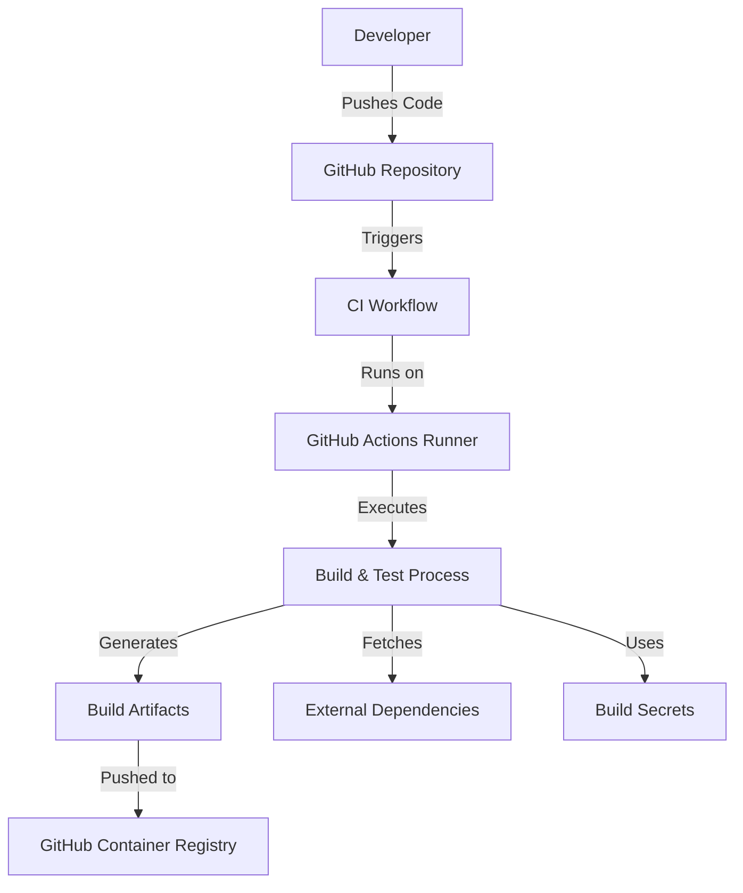

# APPLICATION THREAT MODEL

## ASSETS

- **Fabric Agent Action Codebase**: The source code and configurations of the Fabric Agent Action GitHub repository.
- **API Keys and Secrets**: OpenAI, OpenRouter, Anthropic API keys, and GitHub tokens stored in repository secrets.
- **User Input Data**: Inputs provided by users or workflows, including issue comments and pull request data.
- **Generated Output Data**: Output files and comments generated by the action, which may contain sensitive information.
- **Fabric Patterns**: External patterns downloaded from the Fabric repository, used for processing.
- **Configuration Files**: Files such as `action.yml`, `Dockerfile`, `pyproject.toml`, and scripts.
- **GitHub Runner Environment**: The environment in which the action executes, including temporary files and logs.

## DATA FLOW DIAGRAM

```mermaid
flowchart TD
    User[User / Developer]
    GitHub[GitHub Repository]
    GitHubRunner[GitHub Actions Runner]
    FabricAgent[Fabric Agent Action]
    InputFile[Input File]
    OutputFile[Output File]
    Patterns[Fabric Patterns]
    LLMProviders[LLM Providers]
    GitHubAPI[GitHub API]

    User -->|Triggers Action| GitHub
    GitHub -->|Starts Workflow| GitHubRunner
    GitHubRunner -->|Executes| FabricAgent
    FabricAgent -->|Reads| InputFile
    FabricAgent -->|Downloads| Patterns
    FabricAgent -->|Sends Prompts| LLMProviders
    LLMProviders -->|Returns Responses| FabricAgent
    FabricAgent -->|Writes| OutputFile
    FabricAgent -->|Posts Comments| GitHubAPI
    GitHubAPI -->|Stores Comment| GitHub
    User <--|Reads Comment| GitHub
```

## TRUST BOUNDARIES

1. **User Input Boundary**: Between the untrusted user input (issue comments, PRs) and the Fabric Agent Action.
2. **External Services Boundary**: Between the Fabric Agent Action and external LLM Providers (OpenAI, OpenRouter, Anthropic).
3. **External Code Boundary**: Between the Fabric Agent Action and external Fabric Patterns repository.
4. **Secrets Boundary**: Between the GitHub Runner environment and the repository secrets (API keys, tokens).
5. **GitHub API Boundary**: Between the Fabric Agent Action and the GitHub API when posting comments.
6. **Output Storage Boundary**: Between the Fabric Agent Action and GitHub storage for output files and comments.

## DATA FLOWS

1. **DF1**: User triggers action via issue comment or pull request (`User` → `GitHub`)
   - Crosses **User Input Boundary**
2. **DF2**: GitHub starts workflow on GitHub Runner (`GitHub` → `GitHubRunner`)
3. **DF3**: Fabric Agent Action reads input file (`FabricAgent` → `InputFile`)
4. **DF4**: Fabric Agent Action downloads Fabric Patterns (`FabricAgent` → `Patterns`)
   - Crosses **External Code Boundary**
5. **DF5**: Fabric Agent Action sends prompts to LLM Providers (`FabricAgent` → `LLMProviders`)
   - Crosses **External Services Boundary**
6. **DF6**: LLM Providers return responses (`LLMProviders` → `FabricAgent`)
   - Crosses **External Services Boundary**
7. **DF7**: Fabric Agent Action writes output file (`FabricAgent` → `OutputFile`)
   - Crosses **Output Storage Boundary**
8. **DF8**: Fabric Agent Action posts comments to GitHub API (`FabricAgent` → `GitHubAPI`)
   - Crosses **GitHub API Boundary**
9. **DF9**: User reads comments from GitHub (`GitHub` → `User`)
   - Crosses **User Input Boundary**

## APPLICATION THREATS

| THREAT ID | COMPONENT NAME         | THREAT NAME                                                                                                                                           | STRIDE CATEGORY     | WHY APPLICABLE                                                                                                                                                                                                                                                       | HOW MITIGATED                                                                                                                                                                                                                                                 | MITIGATION                                                                                                                                                                                                                                                                                              | LIKELIHOOD EXPLANATION                                                                                                                                                   | IMPACT EXPLANATION                                                                                                                                                                                                                                                       | RISK SEVERITY |
|-----------|------------------------|--------------------------------------------------------------------------------------------------------------------------------------------------------|---------------------|-----------------------------------------------------------------------------------------------------------------------------------------------------------------------------------------------------------------------------------------------------------------------|---------------------------------------------------------------------------------------------------------------------------------------------------------------------------------------------------------------------------------------------------------------|----------------------------------------------------------------------------------------------------------------------------------------------------------------------------------------------------------------------------------------------------------------------------------------------------------|--------------------------------------------------------------------------------------------------------------------------------------------------------------------------|----------------------------------------------------------------------------------------------------------------------------------------------------------------------------------------------------------------------------------------------------------------------|---------------|
| 0001      | Fabric Agent Action    | Malicious code execution through crafted user input                                                                                                   | Tampering           | Untrusted user input could contain malicious commands that the action might process, potentially leading to code execution.                                                                                                                                          | Currently, there is no mention of sanitizing or validating user inputs before processing.                                                                                                                             | Implement input validation and sanitization to ensure that any user-provided data is safe before processing. Use strict parsing and limit the types of allowed inputs.                                                                                             | High likelihood due to direct processing of user inputs without validation.                                                                                               | High impact as it could lead to unauthorized code execution on the GitHub Runner, compromising the environment and secrets.                                                                                                     | Critical       |
| 0002      | GitHub Runner          | Exposure of secrets in logs or output files                                                                                                            | Information Disclosure | Secrets (API keys) might unintentionally be logged or written to output files, which can be accessed by unauthorized parties.                                                                                                                                        | The action does not mention handling secrets carefully to prevent exposure in outputs.                                                                                                                               | Ensure that secrets are not printed in logs or written to output files. Use environment variables securely and mask secrets in logs.                                                                                                                              | Medium likelihood if logging is verbose and not properly handled.                                                                                                           | High impact since exposed API keys can lead to unauthorized access to external services and compromise of data.                                                                                                               | High          |
| 0003      | LLM Providers          | Unauthorized access to LLM Provider APIs using stolen API keys                                                                                         | Spoofing            | If API keys are compromised, an attacker can impersonate the action and access the LLM Provider services.                                                                                                                                                           | API keys are stored in GitHub secrets, but improper handling could lead to leaks.                                                                                                                                   | Use GitHub secrets securely and avoid exposing API keys. Rotate keys regularly and enforce least privilege.                                                                                                               | Low likelihood if secrets are properly managed, but possible if there are vulnerabilities.                                                                                    | High impact as attacker can incur costs and access sensitive data from LLM providers.                                                                                                                                             | High          |
| 0004      | Fabric Patterns        | Execution of malicious code from compromised Fabric Patterns repository                                                                                | Tampering           | The action downloads patterns from an external repository. If the repository is compromised, malicious patterns could be introduced.                                                                                                                                | No validation of the downloaded patterns is mentioned.                                                                                                                                                             | Implement verification of the patterns, such as using checksums or signed commits. Consider pinning to specific versions or maintaining a vetted copy of the patterns.                                                     | Medium likelihood due to dependency on external repository without strict control.                                                                                         | High impact as malicious code could execute within the action, leading to compromise of the environment and data.                                                                                                              | High          |
| 0005      | Fabric Agent Action    | Denial of Service due to large or malformed inputs causing excessive resource consumption                                                              | Denial of Service   | Large or specially crafted inputs could cause the action to consume excessive resources, leading to timeouts or resource exhaustion on the GitHub Runner.                                                                      | There is no mention of input size limitations or resource management.                                                                                                                                             | Implement input size restrictions and validation. Use timeouts and resource limits within the action to prevent abuse.                                                                                                 | High likelihood since users can provide inputs without constraints.                                                                                                         | Medium impact as it affects availability of the action and possibly other workflows on the runner.                                                                                                                        | High          |
| 0006      | GitHub API             | Abuse of GitHub API rate limits by excessive comment posting                                                                                           | Denial of Service   | The action could be manipulated to post a large number of comments, leading to rate limit exhaustion or service degradation.                                                                                                 | The action posts comments but may not have controls to prevent abuse in high-frequency scenarios.                                                                                                                  | Implement rate limiting and checks to prevent excessive API calls. Ensure that the action only posts necessary comments.                                                                                                 | Medium likelihood if not properly controlled.                                                                                                                              | Medium impact affecting GitHub API availability for the repository or user.                                                                                                                                                 | Medium        |
| 0007      | Output Files           | Injection of malicious content into output files that are later executed or rendered by users                                                          | Tampering           | The action writes output files that may contain content from untrusted sources. Malicious content could be injected, leading to code execution when the files are used.                                                      | No sanitization of outputs is mentioned. Output files may contain processed data that include user inputs or LLM outputs.                                                                                          | Implement output sanitization, especially for files that may be executed or rendered with rich formatting (e.g., markdown). Use safe encoding and validation.                                                               | Medium likelihood due to processing of untrusted data and LLM outputs.                                                                                                      | High impact if malicious output leads to code execution on user systems or repositories.                                                                                                                                    | High          |
| 0008      | GitHub Runner Environment | Compromise of runner environment via untrusted code execution                                                                                      | Elevation of Privilege | If the action executes untrusted code (e.g., from patterns or inputs), it could lead to escalation of privileges within the runner environment.                                                                               | No evidence of sandboxing or isolation mechanisms in place.                                                                                                                                                | Employ sandboxing techniques when executing code. Run processes with least privilege. Avoid executing untrusted code when possible.                                                                                       | Low likelihood if code execution paths are controlled, but possible if inputs are not strictly managed.                                                                      | Critical impact as it could lead to full compromise of the runner and access to other workflows and secrets.                                                                                                                 | Critical       |
| 0009      | Secrets Management     | Failure to properly rotate and manage API keys and tokens                                                                                              | Information Disclosure | Long-lived API keys increase the window of opportunity for attackers if keys are compromised.                                                                                                                                 | The action relies on API keys stored in secrets but does not mention rotation policies.                                                                                                                         | Implement regular rotation of API keys and tokens. Use short-lived tokens where possible. Monitor and audit key usage.                                                                                                  | Medium likelihood due to standard practices not being enforced.                                                                                                              | Medium impact, leading to prolonged access if keys are compromised.                                                                                                                                                         | Medium        |
| 0010      | Logging Mechanisms     | Sensitive information leakage through excessive logging                                                                                                | Information Disclosure | Verbose logging modes (`verbose` and `debug`) may inadvertently log sensitive data, including API responses or secrets.                                                                                                       | Logging modes are available, but there is no mention of scrubbing sensitive data.                                                                                                                             | Ensure that logs are scrubbed of sensitive information. Disable debug logging in production environments. Mask or omit sensitive data in logs.                                                                             | Medium likelihood if logging is not properly configured.                                                                                                                     | High impact if sensitive data is exposed in logs accessible by unauthorized users.                                                                                                                                          | High          |

# DEPLOYMENT THREAT MODEL

## ASSETS

- **Docker Image**: The built Docker image of the Fabric Agent Action hosted on GitHub Container Registry (GHCR).
- **GitHub Actions Workflow**: The CI/CD workflows used for building and deploying the action.
- **Registry Credentials**: Credentials used to push and pull images from GHCR.
- **GitHub Runner Environment**: The execution environment for the deployment workflows.
- **Action Users**: External repositories and workflows that utilize the Fabric Agent Action.

## DEPLOYMENT DIAGRAM

```mermaid
flowchart TD
    CIWorkflow[CI Workflow]
    DockerBuild[Docker Build Process]
    DockerImage[Docker Image (GHCR)]
    GitHubRunner[GitHub Actions Runner]
    Users[External Action Users]
    GHCR[GitHub Container Registry]

    CIWorkflow -->|Triggers| DockerBuild
    DockerBuild -->|Builds| DockerImage
    DockerImage -->|Pushes| GHCR
    Users -->|Pulls| GHCR
    Users -->|Uses| DockerImage
```

## TRUST BOUNDARIES

1. **Build Environment Boundary**: Between the CI workflow and the Docker build environment.
2. **Registry Access Boundary**: Between the build process and the GitHub Container Registry.
3. **Action User Boundary**: Between external users (untrusted) and the action's Docker image.
4. **Secrets Boundary**: Between the workflow environment and the registry credentials.
5. **Dependency Boundary**: Between the build process and external dependencies (e.g., base images, packages).

## DEPLOYMENT THREATS

| THREAT ID | COMPONENT NAME          | THREAT NAME                                                                                                                       | WHY APPLICABLE                                                                                                                                                                                                                                                             | HOW MITIGATED                                                                                                                                                                                                                                            | MITIGATION                                                                                                                                                                                                                                                                                           | LIKELIHOOD EXPLANATION                                                                                                                                                 | IMPACT EXPLANATION                                                                                                                                                                                                 | RISK SEVERITY |
|-----------|-------------------------|------------------------------------------------------------------------------------------------------------------------------------|-----------------------------------------------------------------------------------------------------------------------------------------------------------------------------------------------------------------------------------------------------------------------------|------------------------------------------------------------------------------------------------------------------------------------------------------------------------------------------------------------------------------------------------------------|-----------------------------------------------------------------------------------------------------------------------------------------------------------------------------------------------------------------------------------------------------------------------------------------------------|------------------------------------------------------------------------------------------------------------------------------------------------------------------------|----------------------------------------------------------------------------------------------------------------------------------------------------------------------------------------------------------------------|---------------|
| 0001      | Docker Image            | Compromise of Docker image leading to distribution of malicious code                                                               | If the Docker image is tampered with or built from untrusted sources, users of the action could execute malicious code.                                                                                                                                                     | Use of CI workflows with checks, but no mention of image signing or verification.                                                                                                                                                                      | Implement Docker image signing (e.g., using Docker Content Trust). Use secure base images and verify dependencies.                                                                                                                                            | Medium likelihood due to potential vulnerabilities in the build pipeline.                                                                                             | High impact as malicious images affect all users of the action, leading to widespread compromise.                                                                                 | High          |
| 0002      | GitHub Actions Workflow | Unauthorized access to deployment workflows allowing attackers to inject code or manipulate the deployment                                                              | If an attacker gains access to the repository or workflow configuration, they can alter the deployment process.                                                                                                                                                             | Access controls are managed by GitHub, but potential misconfigurations exist.                                                                                                                                                                           | Enforce strict access controls and permissions on the repository. Use code reviews for workflow changes. Protect main branches with required reviews.                                                                                                         | Low likelihood if best practices are followed.                                                                                                                      | High impact due to potential compromise of the action and Docker images.                                                                                                                                       | High          |
| 0003      | Registry Credentials    | Exposure of GHCR credentials leading to unauthorized image push or pull                                                             | If credentials are compromised, attackers can push malicious images or pull private images.                                                                                                                                                                                 | Credentials are stored in GitHub secrets, but improper handling could lead to exposure.                                                                                                                                                               | Ensure credentials are securely stored and not exposed in logs or code. Use least privilege principles. Rotate credentials regularly.                                                                                                                        | Low likelihood with proper secret management, but possible through misconfiguration.                                                                              | High impact affecting the integrity of Docker images and trust in the action.                                                                                                                                 | High          |
| 0004      | Dependency Management   | Use of vulnerable or malicious dependencies in the build process                                                                   | The build process relies on external dependencies (Python packages, base images) that may have vulnerabilities.                                                                                                                                                             | Uses package management tools, but there's no mention of vulnerability scanning or pinning versions.                                                                                                                                                  | Implement dependency scanning tools. Pin dependency versions and update them regularly. Use trusted sources for base images and dependencies.                                                                                                                 | Medium likelihood due to common dependency risks.                                                                                                                   | Medium impact potentially introducing vulnerabilities or backdoors in the action.                                                                                                                                | Medium        |
| 0005      | Build Process           | Insecure build environment allowing code injection or tampering during the build                                                   | If the build environment is compromised, the resulting Docker image could be affected.                                                                                                                                                                                      | The build runs on GitHub-hosted runners with default security measures.                                                                                                                                                                               | Use ephemeral runners if possible. Validate the build environment state before building. Monitor build logs for anomalies.                                                                                                                                    | Low likelihood given GitHub's management of hosted runners.                                                                                                           | High impact if the build process is compromised leading to malicious artifacts.                                                                                                                                        | High          |
| 0006      | Action Users            | Misuse of the action by users leading to unintended exposure or execution in their environments                                    | Users may configure the action improperly, leading to exposure of their own secrets or execution of untrusted code in their environments.                                                                                                                                | Documentation provides some guidance, but users may not follow best practices.                                                                                                                                                                        | Provide clear usage instructions emphasizing security practices. Include warnings about proper secret management and access controls.                                                                                                                         | Medium likelihood due to user errors.                                                                                                                                | Medium impact affecting individual users' environments and data.                                                                                                                                              | Medium        |

# BUILD THREAT MODEL

## ASSETS

- **Source Code Repository**: The GitHub repository containing the action's source code.
- **CI/CD Pipelines**: Workflows used for building, testing, and publishing the action.
- **Dependencies and Packages**: External libraries and packages used in the project (specified in `pyproject.toml`).
- **Build Secrets**: Tokens and keys used during the build process (e.g., `GITHUB_TOKEN`, API keys).
- **Build Artifacts**: Generated files and Docker images from the build process.
- **GitHub Actions Runners**: The environment where builds and tests are executed.

## BUILD PROCESS DIAGRAM



## TRUST BOUNDARIES

1. **Source Control Boundary**: Between the code repository and the CI/CD pipelines.
2. **Dependency Boundary**: Between the build process and external dependency sources (e.g., PyPI).
3. **Secrets Boundary**: Between the build environment and the build secrets.
4. **Build Environment Boundary**: Between the CI workflow and the build runner environment.
5. **Registry Access Boundary**: Between build artifacts and the container registry.

## BUILD THREATS

| THREAT ID | COMPONENT NAME        | THREAT NAME                                                                                               | WHY APPLICABLE                                                                                                                                                                                                                                            | HOW MITIGATED                                                                                                                                                                                                                                             | MITIGATION                                                                                                                                                                                                                                                                                          | LIKELIHOOD EXPLANATION                                                                                                                                                 | IMPACT EXPLANATION                                                                                                                                                                                               | RISK SEVERITY |
|-----------|-----------------------|-----------------------------------------------------------------------------------------------------------|------------------------------------------------------------------------------------------------------------------------------------------------------------------------------------------------------------------------------------------------------------|-------------------------------------------------------------------------------------------------------------------------------------------------------------------------------------------------------------------------------------------------------------|----------------------------------------------------------------------------------------------------------------------------------------------------------------------------------------------------------------------------------------------------------------------------------------------------|------------------------------------------------------------------------------------------------------------------------------------------------------------------------|--------------------------------------------------------------------------------------------------------------------------------------------------------------------------------------------------------------------|---------------|
| 0001      | Source Code Repository | Unauthorized code modifications through compromised developer accounts                                    | If a developer's account is compromised, attackers can inject malicious code into the repository.                                                                                                                                                          | Access controls depend on GitHub settings; no mention of additional protections.                                                                                                                                                                      | Enforce multi-factor authentication (MFA) for all developers. Use code reviews and protected branches to prevent unauthorized changes.                                                                                                                      | Low likelihood if MFA and best practices are enforced.                                                                                                               | High impact as malicious code can be introduced into the build process and distributed.                                                                                  | High          |
| 0002      | Dependencies and Packages | Inclusion of malicious code via compromised or malicious dependencies                                      | The project relies on external packages that may be compromised, leading to supply chain attacks.                                                                                                                                                          | Dependency management is mentioned, but no specific measures for supply chain security.                                                                                                                                                             | Use dependency auditing tools. Pin dependency versions. Consider using hash-based verification. Employ tools like `poetry` lock files for consistent dependencies.                                                                                           | Medium likelihood due to existing risks in package repositories.                                                                                                     | High impact as it can lead to widespread compromise of the action users.                                                                                                  | High          |
| 0003      | Build Secrets          | Exposure of build secrets leading to unauthorized access to resources                                      | If secrets used in the build (e.g., `GITHUB_TOKEN`, API keys) are exposed, attackers can access resources or services unauthorizedly.                                                                                                                      | The build process uses secrets, but no mention of secret scanning or strict controls.                                                                                                                                                              | Implement secret scanning in the CI pipeline. Ensure secrets are not logged. Use least privilege tokens and rotate them regularly.                                                                                                                          | Medium likelihood if secrets are mishandled in scripts or logs.                                                                                                     | High impact as it could compromise repositories, APIs, and other services.                                                                                              | High          |
| 0004      | CI/CD Pipelines        | Execution of unauthorized or malicious code during the build process                                       | If the CI pipeline is not secured, attackers might inject malicious steps or modify build configurations.                                                                                                                                                  | No specific mention of securing the CI/CD pipeline configurations.                                                                                                                                                                                  | Protect CI workflow files with code reviews and branch protections. Limit who can modify workflows. Use hashed workflows or signed commits.                                                                                                                  | Low likelihood if best practices are followed.                                                                                                                      | High impact affecting the integrity of the build artifacts and distributed code.                                                                                       | High          |
| 0005      | Build Environment      | Compromise of build environment leading to tampered artifacts or leakage of sensitive information          | The build environment might be targeted to execute malicious code or access sensitive data during the build.                                                                                                                                               | Uses GitHub-hosted runners with standard security, but no additional hardening is mentioned.                                                                                                                                                       | Use ephemeral build environments. Limit environment variables and permissions. Monitor build logs for anomalies. Avoid storing sensitive data on the runners.                                                                                                | Low likelihood with GitHub-hosted runners, but insiders or advanced attackers may exploit.                                                                       | High impact if artifacts are tampered with or sensitive data is leaked.                                                                                                | High          |
| 0006      | Build Artifacts        | Unauthorized modification or tampering with build artifacts before they are published                       | If artifacts are not securely stored and transmitted, they might be altered before distribution.                                                                                                                                                           | No mention of securing artifact storage between build and deployment stages.                                                                                                                                                                       | Use secure channels for artifact storage and transmission. Implement integrity checks (e.g., checksums, signatures) before publishing.                                                                                                                       | Low likelihood if artifacts are handled within secure systems.                                                                                                     | Medium impact influencing the trustworthiness of the published artifacts.                                                                                                | Medium        |

# QUESTIONS & ASSUMPTIONS

- **Questions:**
  - Are there any input validation and sanitization mechanisms currently implemented for user-provided data?
  - How are secrets and API keys managed, and are there rotation policies in place?
  - Is there a process for verifying the integrity of the Fabric Patterns downloaded from external repositories?
  - Are there any monitoring or alerting systems for detecting unusual activities in the GitHub Actions workflows?
  - Do the CI/CD pipelines include security scanning for vulnerabilities in dependencies and code?

- **Assumptions:**
  - Users interacting with the action via issues or pull requests may be untrusted and can submit any content.
  - The GitHub Runner environment is considered trusted but could be a target for attackers if not properly secured.
  - Secrets stored in GitHub are assumed to be protected by GitHub's standard security measures.
  - External dependencies (LLM Providers, Fabric Patterns) are assumed to be trustworthy unless compromised.
  - The team follows standard security best practices unless specified otherwise in the project files.
