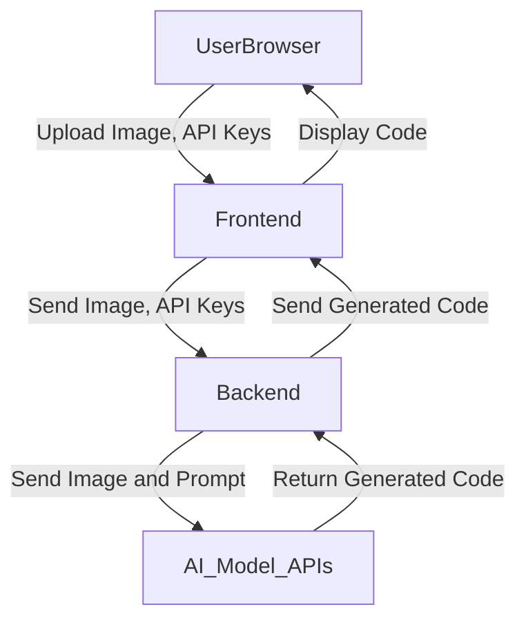
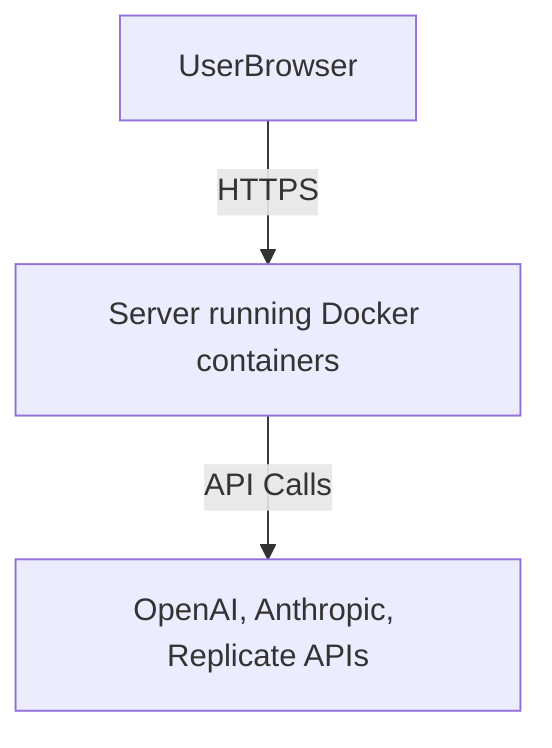
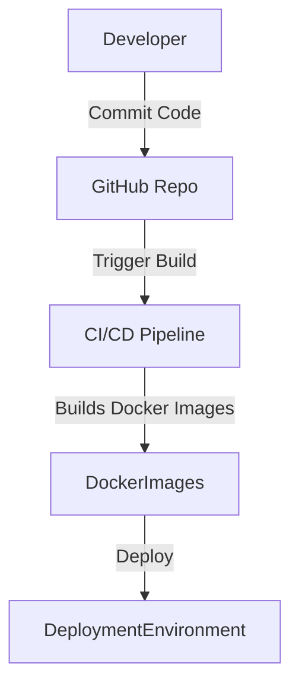

## APPLICATION THREAT MODEL

### ASSETS

- **User-Provided Images**: Screenshots, mockups, and designs uploaded by users for code generation.
- **Generated Code**: Code generated by AI models based on user-provided images.
- **API Keys**: Sensitive API keys for OpenAI, Anthropic, and Replicate used to access AI services.
- **User Data**: Any user preferences or settings stored in the application.
- **Application Backend**: The FastAPI backend handling processing and communication with AI models.
- **Logs**: Application logs that may contain sensitive information.

### DATA FLOW DIAGRAM

### TRUST BOUNDARIES

1. **User Browser to Frontend**: Input from the user crosses from an untrusted to a trusted zone.
2. **Frontend to Backend**: Data transmission between frontend and backend components.
3. **Backend to External AI APIs**: Communication with external AI services crosses organizational boundaries.
4. **External AI APIs to Backend**: Responses from AI services may contain untrusted data.
5. **Backend to Frontend**: Transmission of generated code back to the frontend.
6. **Frontend to User Browser**: Displaying generated code to the user crosses from trusted to untrusted rendering context.

### DATA FLOWS

1. **User to Frontend**: User uploads images and API keys (Crosses Trust Boundary 1).
2. **Frontend to Backend**: Frontend sends images and API keys to the backend (Crosses Trust Boundary 2).
3. **Backend to AI Model APIs**: Backend sends data to external AI services (Crosses Trust Boundary 3).
4. **AI Model APIs to Backend**: AI services return generated code to the backend (Crosses Trust Boundary 4).
5. **Backend to Frontend**: Backend sends generated code to the frontend (Crosses Trust Boundary 5).
6. **Frontend to User Browser**: Frontend displays the generated code to the user (Crosses Trust Boundary 6).

### APPLICATION THREATS

| THREAT ID | COMPONENT NAME       | THREAT NAME                                                                    | STRIDE CATEGORY     | WHY APPLICABLE                                                                                               | HOW MITIGATED                                             | MITIGATION                                                                                                 | LIKELIHOOD EXPLANATION                                                    | IMPACT EXPLANATION                                                                                  | RISK SEVERITY |
|-----------|----------------------|--------------------------------------------------------------------------------|---------------------|--------------------------------------------------------------------------------------------------------------|-----------------------------------------------------------|------------------------------------------------------------------------------------------------------------|----------------------------------------------------------------------------|------------------------------------------------------------------------------------------------------|---------------|
| 0001      | Backend Application  | Unauthorized access to user-provided API keys stored in application logs       | Information Disclosure | API keys may be stored or logged insecurely, exposing them to unauthorized access                            | Not specified in current architecture                    | Securely handle API keys without logging them; use secure storage mechanisms                              | Medium likelihood if security controls are not in place                   | High impact as compromised API keys can lead to unauthorized API usage and potential costs            | High          |
| 0002      | Frontend Application | Cross-site scripting (XSS) due to displaying generated code directly           | Tampering            | Generated code from AI APIs may contain malicious scripts that execute in the user's browser                 | Not specified in current architecture                    | Implement output encoding and sanitization; use Content Security Policy (CSP)                              | High likelihood since code is generated externally and displayed directly  | High impact as XSS can lead to session hijacking and data theft                                       | High          |
| 0003      | Backend Application  | Injection attacks via user-provided data (images, API keys)                    | Tampering            | User inputs may not be properly validated or sanitized before processing                                     | Not specified                                            | Validate and sanitize all user inputs to the backend                                                          | Medium likelihood if validation is insufficient                           | Medium impact; could lead to code execution or data corruption                                      | Medium        |
| 0004      | Communication Channel | Eavesdropping on API requests (Man-in-the-middle attacks)                      | Information Disclosure | Data in transit could be intercepted if communications are not properly secured                             | Use of HTTPS/TLS may be implied but not specified        | Enforce HTTPS/TLS encryption for all communications                                                          | Low likelihood if HTTPS is enforced                                       | High impact if API keys or sensitive data are intercepted                                             | Medium        |
| 0005      | Backend Application  | Malicious code returned by external AI APIs                                    | Tampering            | External AI APIs could return code containing vulnerabilities or malicious payloads                          | Not specified                                            | Implement code scanning and validation before displaying or executing generated code                        | Medium likelihood due to unpredictable AI outputs                        | High impact if malicious code is executed on the user's system                                        | High          |
| 0006      | Backend Application  | Logging of sensitive data (images, API keys)                                   | Information Disclosure | Sensitive user data may be inadvertently logged for debugging purposes                                       | Not specified                                            | Implement logging best practices to avoid logging sensitive information                                     | High likelihood if not mitigated                                         | High impact if sensitive data is exposed through logs                                                 | High          |
| 0007      | Backend Application  | Denial of Service due to resource exhaustion                                   | Denial of Service    | Application may be vulnerable to DoS via large image uploads or excessive requests                           | Not specified                                            | Implement rate limiting and input size validation                                                            | Medium likelihood                                                        | Medium impact; can lead to service unavailability                                                      | Medium        |
| 0008      | User Browser         | Spoofing of user identity                                                      | Spoofing             | Lack of authentication mechanisms may allow attackers to impersonate users                                   | Not specified                                            | Implement authentication and session management if necessary                                                | Low likelihood                                                            | Low impact if no sensitive data; higher impact if sensitive data is involved                         | Low           |
| 0009      | Backend Application  | Unauthorized access to stored user images                                      | Information Disclosure | If user images are stored on the server, they may be accessed by unauthorized parties                        | Not specified                                            | Secure storage with proper access controls; avoid storing images unnecessarily                              | Medium likelihood                                                        | Medium impact due to potential privacy violations                                                    | Medium        |
| 0010      | External AI APIs     | Repudiation due to lack of request-response tracking                           | Repudiation          | Difficult to prove the source of erroneous or malicious code returned by AI APIs                             | Not specified                                            | Implement comprehensive logging of requests and responses to external APIs                                   | Low likelihood                                                            | Medium impact due to potential disputes or inability to trace issues                                  | Low           |

## DEPLOYMENT THREAT MODEL

### ASSETS

- **Application Server**: Server hosting the application (backend and frontend services).
- **Docker Containers**: Containers encapsulating the application components.
- **Configuration Files**: Files containing application settings and API keys.
- **Network Infrastructure**: Network components facilitating user access to the application.

### DEPLOYMENT DIAGRAM

### TRUST BOUNDARIES

1. **Internet to Application Server**: Public network traffic crossing into the application's hosting environment.
2. **Application Server to External AI APIs**: Outbound connections to third-party AI services.
3. **Docker Container to Host OS**: Potential for container breakout affecting the host operating system.

### DEPLOYMENT THREATS

| THREAT ID | COMPONENT NAME       | THREAT NAME                                                                    | WHY APPLICABLE                                                                 | HOW MITIGATED                                             | MITIGATION                                                                                                 | LIKELIHOOD EXPLANATION                                                    | IMPACT EXPLANATION                                                                                  | RISK SEVERITY |
|-----------|----------------------|--------------------------------------------------------------------------------|--------------------------------------------------------------------------------|-----------------------------------------------------------|------------------------------------------------------------------------------------------------------------|----------------------------------------------------------------------------|------------------------------------------------------------------------------------------------------|---------------|
| 0001      | Application Server   | Unauthorized access due to misconfiguration of server or open ports            | Misconfigured firewall rules or security groups could expose services to attackers | Not specified                                            | Enforce strict firewall rules and security group configurations; limit open ports to necessary services      | Medium likelihood if misconfigurations exist                                 | High impact as attackers could gain access to the server                                        | High          |
| 0002      | Docker Containers    | Container breakout leading to host system compromise                           | Vulnerabilities in containerization could allow attackers to access the host OS | Not specified                                            | Apply container hardening best practices; run containers with least privilege                                | Low likelihood with proper container security measures                      | High impact if attackers gain control over the host system                                           | High          |
| 0003      | Configuration Files  | Exposure of sensitive configuration data (API keys) in images or repositories   | API keys might be hardcoded in images or pushed to code repositories inadvertently | Not specified                                            | Use environment variables and secrets management tools to handle sensitive data                              | Medium likelihood if best practices are not followed                         | High impact due to potential compromise of API keys                                                 | High          |
| 0004      | Network Infrastructure | Man-in-the-middle attacks due to lack of HTTPS/TLS                             | Without proper SSL/TLS setup, communications can be intercepted                  | Use of HTTPS/TLS implied but needs verification           | Ensure SSL certificates are correctly installed; enforce HTTPS for all communications                        | Low likelihood if HTTPS is properly implemented                            | High impact if sensitive data is intercepted                                                        | Medium        |

## BUILD THREAT MODEL

### ASSETS

- **Source Code**: The application's codebase stored in the GitHub repository.
- **Build Scripts**: Scripts and configurations used to build and deploy the application.
- **Dependencies**: External libraries and packages required by the application.
- **CI/CD Pipeline Configuration**: Settings and credentials for continuous integration and deployment tools.
- **Credentials**: Deployment keys, API tokens, and other secrets used in the build process.

### BUILD PROCESS DIAGRAM

### TRUST BOUNDARIES

1. **Developer to GitHub Repository**: Code pushed by developers crosses into the shared repository.
2. **GitHub Repository to CI/CD Pipeline**: Code from the repository triggers automated build processes.
3. **CI/CD Pipeline to Deployment Environment**: Artifacts from the build system are deployed to production.
4. **External Dependencies**: Third-party libraries and packages integrated into the build.

### BUILD THREATS

| THREAT ID | COMPONENT NAME       | THREAT NAME                                                                    | WHY APPLICABLE                                                                 | HOW MITIGATED                                             | MITIGATION                                                                                                 | LIKELIHOOD EXPLANATION                                                    | IMPACT EXPLANATION                                                                                  | RISK SEVERITY |
|-----------|----------------------|--------------------------------------------------------------------------------|--------------------------------------------------------------------------------|-----------------------------------------------------------|------------------------------------------------------------------------------------------------------------|----------------------------------------------------------------------------|------------------------------------------------------------------------------------------------------|---------------|
| 0001      | CI/CD Pipeline       | Compromise of CI/CD pipeline leading to injection of malicious code            | Unauthorized access could alter build processes or inject malicious artifacts  | Not specified                                            | Secure CI/CD systems with strong authentication; limit access permissions; monitor pipeline activities       | Medium likelihood with inadequate security measures                       | High impact as compromised pipeline could deploy malicious code                                       | High          |
| 0002      | Dependencies         | Inclusion of malicious or vulnerable dependencies                             | Use of external packages introduces risk of supply chain attacks              | Not specified                                            | Implement dependency scanning tools; lock dependency versions; use trusted sources                           | Medium likelihood due to widespread use of third-party packages             | High impact if malicious code is introduced via dependencies                                          | High          |
| 0003      | Build Scripts        | Tampering with build scripts to introduce vulnerabilities                      | Build scripts may be altered to modify the application behavior               | Not specified                                            | Enforce code reviews; implement access controls; use code signing for scripts                                 | Low likelihood with proper controls                                        | High impact if attackers manipulate the build process                                                  | Medium        |
| 0004      | Credentials          | Exposure of credentials used in build process                                  | Credentials might be stored in plaintext or improperly secured                | Not specified                                            | Utilize secrets management systems; avoid hardcoding credentials; restrict access to sensitive data           | Medium likelihood if best practices are not followed                         | High impact due to potential unauthorized access and data breaches                                     | High          |

## QUESTIONS & ASSUMPTIONS

- **Questions**:
  - *Are API keys provided by users stored or only used transiently during requests?*
  - *Is there any user authentication mechanism in place for the application?*
  - *How are user-uploaded images handled—are they stored persistently or processed in memory?*
  - *Does the application sanitize or validate the generated code before sending it to users?*
  - *Are there any automated security checks (e.g., SAST, dependency scanning) integrated into the build process?*
  - *What logging mechanisms are in place, and do logs ever include sensitive user data?*

- **Assumptions**:
  - The application does not implement user authentication; it is accessible to all users.
  - API keys are provided by users through the frontend and used transiently in the backend without persistent storage.
  - User-uploaded images are processed in memory and not stored on the server.
  - All communications between components (frontend, backend, external APIs) are secured using HTTPS/TLS.
  - The build process currently does not include automated security scanning tools.
  - The application does not perform sanitization or validation of the generated code before displaying it to users.
