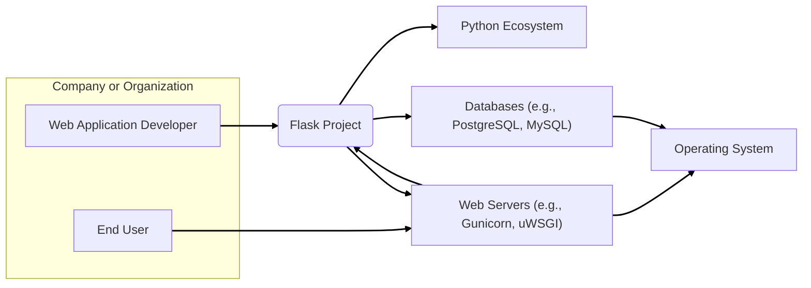
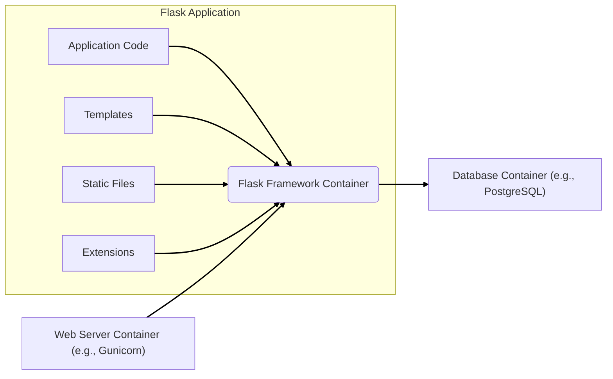

# BUSINESS POSTURE

Flask is a micro web framework for Python. Its primary business goal is to provide a flexible and lightweight tool for developers to build web applications, APIs, and web services.

Business Priorities and Goals:

- Enable rapid development of web applications.
- Provide a flexible and extensible framework that can be adapted to various project needs.
- Maintain a lightweight core framework, allowing developers to add only necessary components.
- Foster a strong and active community to support and extend the framework.
- Ensure the framework is robust and reliable for production use.

Business Risks:

- Risk of losing developer adoption to competing frameworks if Flask fails to adapt to evolving web development trends or lacks essential features.
- Risk of security vulnerabilities in the framework core that could impact applications built with Flask, damaging reputation and user trust.
- Risk of insufficient community support leading to slow bug fixes, lack of documentation, and fewer contributions.
- Risk of performance bottlenecks in the framework core hindering the performance of applications built with Flask.
- Risk of breaking changes in new versions disrupting existing applications and developer workflows.

# SECURITY POSTURE

Security Controls:

- security control: Code review process for contributions to the Flask framework. (Implemented in: GitHub Pull Request reviews)
- security control: Automated testing including unit tests and integration tests to ensure code quality and prevent regressions. (Implemented in: GitHub Actions CI pipelines, described in repository documentation and CI configuration)
- security control: Dependency management using `pip` and `requirements.txt` to track and manage project dependencies. (Implemented in: project setup, `setup.py` and `requirements.txt` files)
- security control: Usage of secure coding practices within the Flask codebase, such as input sanitization and output encoding where framework handles user inputs. (Implemented in: Flask codebase, implicitly part of development practices)
- security control: Public vulnerability reporting and disclosure process, allowing security researchers to report issues. (Documented in: Flask security policy, usually on website or security advisory channels)
- security control: Regular releases and security patches to address reported vulnerabilities. (Implemented in: Flask release management process, release notes and changelogs)

Accepted Risks:

- accepted risk: Security of applications built using Flask is ultimately the responsibility of the application developers. Flask provides tools but cannot enforce secure application design.
- accepted risk: Vulnerabilities in third-party extensions or libraries used with Flask are outside of the Flask project's direct control.
- accepted risk: Outdated versions of Flask used by applications may contain known vulnerabilities if developers do not upgrade.

Recommended Security Controls:

- security control: Implement Static Application Security Testing (SAST) tools in the CI/CD pipeline to automatically scan code for potential vulnerabilities during development.
- security control: Implement Dependency Vulnerability Scanning to automatically check for known vulnerabilities in Flask's dependencies and alert developers.
- security control: Provide more comprehensive security documentation and best practices guides for developers using Flask to build applications.
- security control: Consider incorporating Fuzz testing to discover unexpected vulnerabilities in the framework.
- security control: Promote and potentially automate security audits of the Flask codebase by external security experts.

Security Requirements:

- Authentication: Flask itself does not enforce authentication. Applications built with Flask need to implement authentication mechanisms based on their specific requirements. Flask provides tools and extensions to help with authentication.
- Authorization: Flask provides mechanisms for route protection and access control within applications. Applications need to define and implement their authorization logic.
- Input Validation: Flask provides tools for handling user input, and applications are responsible for validating and sanitizing input to prevent vulnerabilities like injection attacks. Framework encourages secure practices but relies on developers to implement them.
- Cryptography: Flask itself does not provide cryptographic primitives but relies on Python's standard library and external libraries like `cryptography`. Applications using Flask are responsible for implementing cryptography securely when needed, for example for handling sensitive data or sessions. Flask can be used over HTTPS for transport security.

# DESIGN

## C4 CONTEXT



### C4 Context Elements Description

- Context Element:
    - Name: Web Application Developer
    - Type: Person
    - Description: Software developers who use the Flask framework to build web applications, APIs, and web services.
    - Responsibilities: Develop, test, deploy, and maintain web applications using Flask.
    - Security controls: Secure coding practices, input validation, output encoding, authentication and authorization implementation in applications, dependency management.

- Context Element:
    - Name: End User
    - Type: Person
    - Description: Users who interact with web applications built using Flask through web browsers or other clients.
    - Responsibilities: Use the web applications built with Flask to access services and data.
    - Security controls: Strong passwords, safe browsing habits, awareness of phishing and other web-based attacks.

- Context Element:
    - Name: Flask Project
    - Type: Software System
    - Description: The Flask micro web framework itself, providing core functionalities for web application development in Python.
    - Responsibilities: Provide routing, request handling, template rendering, and other core web framework features. Ensure framework is secure and reliable.
    - Security controls: Code review, automated testing, vulnerability scanning, secure development lifecycle, security patches, security documentation.

- Context Element:
    - Name: Python Ecosystem
    - Type: Software System
    - Description: The collection of Python libraries, packages, and tools that Flask and applications built with Flask rely on.
    - Responsibilities: Provide necessary functionalities for Flask and applications, such as database drivers, security libraries, and utility packages.
    - Security controls: Vulnerability scanning of dependencies, dependency management, secure package repositories (PyPI).

- Context Element:
    - Name: Web Servers (e.g., Gunicorn, uWSGI)
    - Type: Software System
    - Description: Web servers that host and serve Flask applications in production environments. These servers handle incoming HTTP requests and pass them to the Flask application.
    - Responsibilities: Serve web applications, handle HTTP requests, manage application processes, provide performance and scalability.
    - Security controls: Web server configuration (e.g., disabling unnecessary features, setting proper permissions), TLS/SSL configuration, access logs, security updates.

- Context Element:
    - Name: Databases (e.g., PostgreSQL, MySQL)
    - Type: Software System
    - Description: Databases used by Flask applications to store and retrieve data.
    - Responsibilities: Persist application data, provide data access and management, ensure data integrity and availability.
    - Security controls: Database access control, encryption at rest and in transit, regular backups, database hardening, input validation on database queries (handled by application using Flask).

- Context Element:
    - Name: Operating System
    - Type: Software System
    - Description: The operating system on which Flask applications, web servers, and databases are running.
    - Responsibilities: Provide the underlying platform for running software, manage system resources, provide security features.
    - Security controls: Operating system hardening, access control, security updates, firewall, intrusion detection systems.

## C4 CONTAINER



### C4 Container Elements Description

- Container Element:
    - Name: Flask Framework Container
    - Type: Software Library/Framework
    - Description: Represents the Flask framework and its core functionalities. This is a Python library that is integrated into the application code.
    - Responsibilities: Routing, request handling, response generation, template rendering, session management, and providing a foundation for web application development.
    - Security controls:  Input sanitization (where applicable within framework), output encoding, secure session management, protection against common web vulnerabilities (within framework's scope), regular security updates.

- Container Element:
    - Name: Application Code
    - Type: Code
    - Description: The custom Python code written by developers that utilizes the Flask framework to implement the specific logic and features of the web application.
    - Responsibilities: Implementing business logic, handling user requests, interacting with databases, implementing authentication and authorization, input validation, and all application-specific functionalities.
    - Security controls: Secure coding practices, input validation, output encoding, authentication, authorization, error handling, logging, secure API design, protection against application-specific vulnerabilities.

- Container Element:
    - Name: Templates
    - Type: Files
    - Description: HTML templates used by Flask to dynamically generate web pages.
    - Responsibilities: Defining the structure and presentation of web pages, allowing dynamic content rendering using template engines like Jinja2.
    - Security controls: Output encoding within templates to prevent cross-site scripting (XSS) vulnerabilities, secure template design, input sanitization before rendering data in templates.

- Container Element:
    - Name: Static Files
    - Type: Files
    - Description: Static assets like CSS files, JavaScript files, images, and other media files served by the Flask application.
    - Responsibilities: Providing static content to web browsers to enhance the user interface and functionality of the web application.
    - Security controls: Proper configuration of static file serving to prevent directory traversal vulnerabilities, serving static files from a dedicated domain or CDN for security and performance.

- Container Element:
    - Name: Extensions
    - Type: Software Libraries
    - Description:  Third-party Flask extensions that add extra functionalities to Flask applications, such as database integration, authentication libraries, and API frameworks.
    - Responsibilities: Extending Flask's capabilities, providing pre-built solutions for common web application features, simplifying development.
    - Security controls: Dependency vulnerability scanning for extensions, choosing reputable and well-maintained extensions, keeping extensions updated, understanding security implications of using extensions.

- Container Element:
    - Name: Web Server Container (e.g., Gunicorn)
    - Type: Software Application
    - Description: A production-ready web server that runs the Flask application. Handles HTTP requests and manages application processes.
    - Responsibilities: Serving the Flask application, handling concurrency, managing application lifecycle, providing performance and scalability.
    - Security controls: Web server configuration hardening, TLS/SSL configuration, access logging, rate limiting, protection against DDoS attacks, security updates.

- Container Element:
    - Name: Database Container (e.g., PostgreSQL)
    - Type: Software Application
    - Description: A database system used to store and manage persistent data for the Flask application.
    - Responsibilities: Data persistence, data retrieval, data integrity, data security, and providing structured data storage.
    - Security controls: Database access control, encryption at rest and in transit, regular backups, database hardening, input validation on database queries (implemented by application code).

## DEPLOYMENT

Deployment Solution: Containerized Deployment on Cloud Platform (e.g., AWS ECS, Google Kubernetes Engine, Azure Kubernetes Service)

```mermaid
flowchart LR
    subgraph "Cloud Platform (e.g., AWS)"
        subgraph "Container Orchestration Service (e.g., ECS)"
            A["Load Balancer"]
            subgraph "Worker Nodes"
                B["Container Instance 1"]
                C["Container Instance 2"]
                D["Container Instance N"]
            end
        end
        E["Database Service (e.g., RDS PostgreSQL)"]
        F["Object Storage (e.g., S3)"]
        G["CDN (e.g., CloudFront)"]
        H["Monitoring & Logging"]
    end

    A --> B
    A --> C
    A --> D
    B --> E
    C --> E
    D --> E
    B --> F
    C --> F
    D --> F
    G --> A

    subgraph "Container Instance 1/2/N"
        I["Web Server Container"]
        J["Flask Application Container"]
    end
    B --> I
    B --> J
    C --> I
    C --> J
    D --> I
    D --> J
    I --> J

    linkStyle 0,1,2,3,4,5,6,7,8,9,10,11,12,13,14,15,16,17,18,19,20,21,22,23,24,25,26,27,28 stroke-width:2px,stroke:black;
```

### Deployment Elements Description

- Deployment Element:
    - Name: Load Balancer
    - Type: Infrastructure - Load Balancer
    - Description: Distributes incoming traffic across multiple container instances to ensure high availability and scalability.
    - Responsibilities: Traffic distribution, health checks, SSL termination, routing requests to healthy instances.
    - Security controls: DDoS protection, SSL/TLS configuration, access control lists, web application firewall (WAF) integration.

- Deployment Element:
    - Name: Container Instance 1/2/N
    - Type: Infrastructure - Virtual Machine/Container Host
    - Description: Virtual machines or container host instances running within the container orchestration service. Each instance hosts web server and Flask application containers.
    - Responsibilities: Running containers, providing compute resources, ensuring container isolation.
    - Security controls: Instance hardening, security updates, container isolation, network segmentation, intrusion detection systems.

- Deployment Element:
    - Name: Web Server Container
    - Type: Containerized Application
    - Description: Container running a web server (e.g., Gunicorn, Nginx) responsible for serving the Flask application.
    - Responsibilities: Serving static content, proxying requests to the Flask application container, handling HTTP requests.
    - Security controls: Web server configuration hardening, access logging, rate limiting, security updates within the container image.

- Deployment Element:
    - Name: Flask Application Container
    - Type: Containerized Application
    - Description: Container running the Flask application code and framework.
    - Responsibilities: Running the Flask application, handling business logic, interacting with databases and other services.
    - Security controls: Application security best practices, input validation, output encoding, secure coding practices, dependency vulnerability scanning within the container image.

- Deployment Element:
    - Name: Database Service (e.g., RDS PostgreSQL)
    - Type: Managed Database Service
    - Description: Managed database service provided by the cloud platform.
    - Responsibilities: Data persistence, database management, backups, high availability, scalability.
    - Security controls: Database access control, encryption at rest and in transit, regular backups, database monitoring, security updates managed by the cloud provider.

- Deployment Element:
    - Name: Object Storage (e.g., S3)
    - Type: Managed Storage Service
    - Description: Cloud-based object storage service for storing static files, user uploads, and other data.
    - Responsibilities: Storing and serving static files, providing scalable and durable storage.
    - Security controls: Access control policies, encryption at rest, versioning, bucket policies.

- Deployment Element:
    - Name: CDN (e.g., CloudFront)
    - Type: Content Delivery Network
    - Description: Content Delivery Network for distributing static content globally, improving performance and reducing latency.
    - Responsibilities: Caching and delivering static content, improving website performance, reducing load on origin servers.
    - Security controls: DDoS protection, SSL/TLS termination, CDN configuration, origin access control.

- Deployment Element:
    - Name: Monitoring & Logging
    - Type: Monitoring and Logging Service
    - Description: Cloud-based monitoring and logging services for collecting metrics, logs, and alerts from all components.
    - Responsibilities: Monitoring application and infrastructure health, logging events for auditing and troubleshooting, alerting on critical issues.
    - Security controls: Secure logging practices, access control to monitoring and logging data, anomaly detection, security monitoring dashboards.

## BUILD

```mermaid
flowchart LR
    A["Developer"] --> B{Code Changes};
    B --> C["Version Control System (e.g., GitHub)"];
    C --> D["CI/CD Pipeline (e.g., GitHub Actions)"];
    D --> E{Build Process};
    E --> F["Static Analysis Security Testing (SAST)"];
    E --> G["Dependency Vulnerability Scanning"];
    E --> H["Unit Tests"];
    F --> I{Security Checks Passed?};
    G --> I;
    H --> I;
    I -- Yes --> J["Build Artifacts (e.g., Container Image)"];
    I -- No --> K["Build Failure & Notifications"];
    J --> L["Container Registry (e.g., Docker Hub, ECR)"];

    linkStyle 0,1,2,3,4,5,6,7,8,9,10,11,12,13,14,15,16,17 stroke-width:2px,stroke:black;
```

### Build Elements Description

- Build Element:
    - Name: Developer
    - Type: Person
    - Description: Software developer writing and modifying the Flask application code.
    - Responsibilities: Writing code, committing changes to version control, initiating the build process.
    - Security controls: Secure coding practices, local development environment security, code review participation.

- Build Element:
    - Name: Version Control System (e.g., GitHub)
    - Type: Software System
    - Description: System for managing and tracking changes to the codebase.
    - Responsibilities: Storing code, managing branches, tracking changes, facilitating collaboration.
    - Security controls: Access control, branch protection, audit logs, two-factor authentication for developers.

- Build Element:
    - Name: CI/CD Pipeline (e.g., GitHub Actions)
    - Type: Automation System
    - Description: Automated pipeline for building, testing, and deploying the Flask application.
    - Responsibilities: Automating build process, running tests, performing security checks, deploying artifacts.
    - Security controls: Secure pipeline configuration, access control to pipeline definitions and secrets, audit logs, vulnerability scanning of pipeline tools.

- Build Element:
    - Name: Build Process
    - Type: Automated Script/Process
    - Description: Steps involved in compiling code, packaging dependencies, and creating build artifacts.
    - Responsibilities: Compiling code, resolving dependencies, creating deployable artifacts (e.g., container images, packages).
    - Security controls: Build environment security, dependency management, reproducible builds, minimal build environment.

- Build Element:
    - Name: Static Analysis Security Testing (SAST)
    - Type: Security Tool
    - Description: Automated tool that analyzes source code to identify potential security vulnerabilities.
    - Responsibilities: Identifying potential security flaws in the codebase early in the development cycle.
    - Security controls: SAST tool configuration, regular updates of SAST rules, integration into CI/CD pipeline.

- Build Element:
    - Name: Dependency Vulnerability Scanning
    - Type: Security Tool
    - Description: Tool that scans project dependencies for known security vulnerabilities.
    - Responsibilities: Identifying vulnerable dependencies, alerting developers to update or replace vulnerable components.
    - Security controls: Dependency scanning tool configuration, regular updates of vulnerability databases, integration into CI/CD pipeline.

- Build Element:
    - Name: Unit Tests
    - Type: Automated Tests
    - Description: Automated tests that verify the functionality of individual units of code.
    - Responsibilities: Ensuring code quality, detecting functional regressions, improving code reliability.
    - Security controls: Writing tests that cover security-relevant functionalities, regular execution of unit tests in CI/CD pipeline.

- Build Element:
    - Name: Build Artifacts (e.g., Container Image)
    - Type: Deployable Package
    - Description: Packaged application ready for deployment, e.g., a container image containing the Flask application and its dependencies.
    - Responsibilities: Providing a deployable unit of the application, ensuring consistency across deployments.
    - Security controls: Minimal container image, vulnerability scanning of base images, secure artifact storage and distribution.

- Build Element:
    - Name: Container Registry (e.g., Docker Hub, ECR)
    - Type: Artifact Repository
    - Description: Repository for storing and managing container images.
    - Responsibilities: Storing container images, managing image versions, providing access control for images.
    - Security controls: Access control policies, vulnerability scanning of stored images, image signing and verification, audit logs.

- Build Element:
    - Name: Build Failure & Notifications
    - Type: Notification System
    - Description: System to notify developers about build failures, test failures, or security issues detected during the build process.
    - Responsibilities: Alerting developers to issues, providing feedback loop for code quality and security.
    - Security controls: Secure notification channels, timely notifications, clear and actionable error messages.

# RISK ASSESSMENT

Critical Business Process:

- Enabling web application development: Flask's primary purpose is to empower developers to build web applications efficiently and effectively. Any compromise to Flask's integrity, availability, or security directly impacts this critical business process.

Data Sensitivity:

- Data handled by Flask applications: Flask itself doesn't handle data directly. However, applications built with Flask can handle a wide range of data with varying sensitivity levels, including:
    - Personally Identifiable Information (PII): Usernames, passwords, email addresses, personal details. Sensitivity: High. Requires strong confidentiality and integrity protections.
    - Financial Data: Credit card numbers, bank account details, transaction history. Sensitivity: Very High. Requires strict compliance with regulations (e.g., PCI DSS) and robust security measures.
    - Business Data: Proprietary business information, trade secrets, customer data. Sensitivity: Medium to High. Depends on the nature of the data and potential impact of disclosure.
    - Public Data: Blog posts, articles, publicly accessible content. Sensitivity: Low. Primarily requires integrity and availability.

The sensitivity of data depends entirely on the applications built using Flask. However, vulnerabilities in Flask itself can potentially expose any data handled by applications built on top of it. Therefore, the security of Flask is paramount, regardless of the specific data sensitivity of individual applications.

# QUESTIONS & ASSUMPTIONS

Questions:

- What is the intended scale and performance requirements for applications built with Flask? (Assumption: Applications can range from small to medium scale, performance is important but not always the primary driver).
- What are the compliance requirements for applications built with Flask? (Assumption: Compliance requirements vary depending on the application, but general security best practices are always relevant).
- What is the level of security expertise of developers using Flask? (Assumption: Developers have varying levels of security expertise, so Flask should be secure by default and provide clear security guidance).
- What is the expected lifespan of applications built with Flask? (Assumption: Applications can have varying lifespans, so maintainability and long-term security are important).

Assumptions:

- BUSINESS POSTURE: The primary goal is to provide a flexible, lightweight, and developer-friendly web framework. Security is a high priority for the framework itself to ensure the safety of applications built with it.
- SECURITY POSTURE:  Flask project follows secure development practices but relies on application developers to implement security in their applications. Security updates and vulnerability management are critical for the Flask project.
- DESIGN: Containerized deployment on cloud platforms is a common and relevant deployment model for Flask applications. The build process includes automated security checks.
