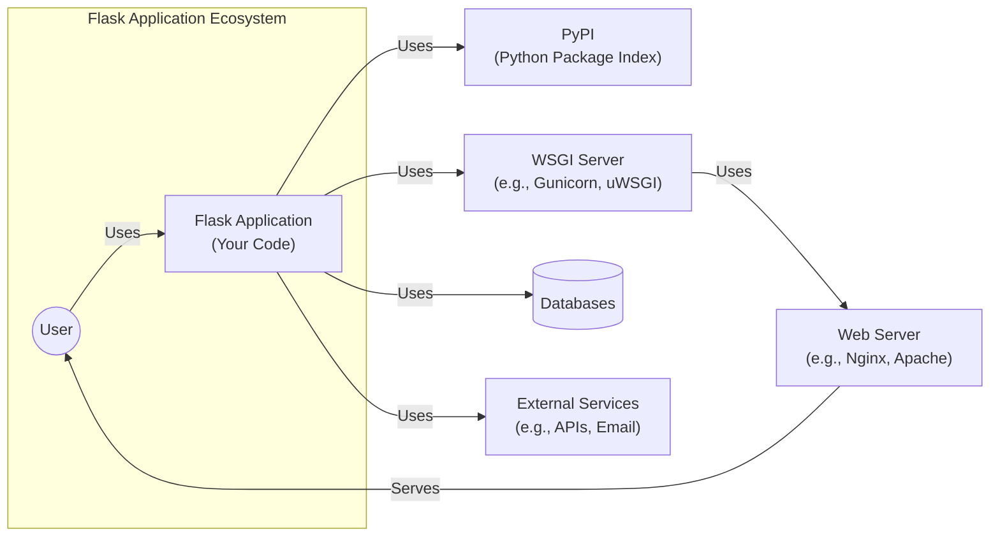
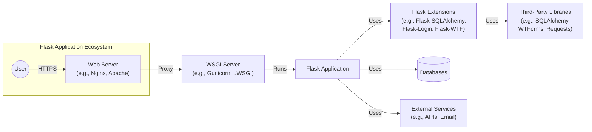
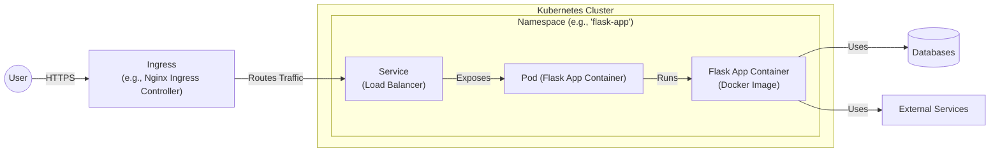
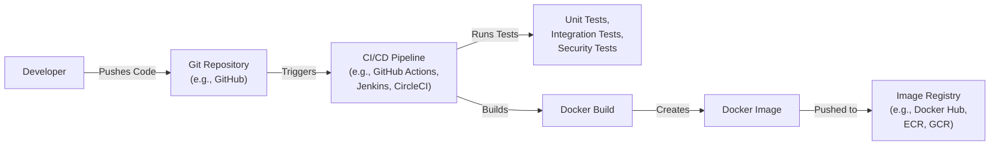

# BUSINESS POSTURE

Flask is a popular, lightweight, open-source web application framework written in Python. It's designed to make getting started quick and easy, with the ability to scale up to complex applications. It's used by a wide range of developers, from hobbyists building personal projects to large organizations building complex web applications.

Business Priorities and Goals:

*   Provide a flexible and extensible microframework for building web applications in Python.
*   Maintain a low barrier to entry for new users.
*   Offer a simple, yet powerful, API for common web development tasks.
*   Ensure compatibility with a wide range of Python versions and deployment environments.
*   Foster a vibrant and supportive community.
*   Maintain backward compatibility where possible, and provide clear migration paths when breaking changes are necessary.
*   Ensure the framework is performant and scalable.

Business Risks:

*   Security vulnerabilities in the framework could expose user data or allow attackers to compromise applications built with Flask.
*   Lack of maintenance or updates could lead to compatibility issues or security vulnerabilities over time.
*   Competition from other web frameworks could reduce Flask's market share and community engagement.
*   Poor documentation or a steep learning curve could deter new users.
*   Inability to scale to meet the demands of large, complex applications could limit its adoption in enterprise environments.

# SECURITY POSTURE

Existing Security Controls:

*   security control: Flask itself provides some built-in security features, such as protection against Cross-Site Scripting (XSS) and Cross-Site Request Forgery (CSRF) when used with extensions like Flask-WTF. (Described in Flask documentation and Flask-WTF documentation).
*   security control: Flask encourages the use of secure coding practices, such as input validation and parameterized queries, to prevent common web vulnerabilities. (Described in Flask documentation).
*   security control: Flask's ecosystem includes extensions like Flask-Security and Flask-Login that provide additional security features, such as user authentication, authorization, and password management. (Described in extensions documentation).
*   security control: Flask applications are typically deployed behind a web server like Gunicorn or uWSGI, which can provide additional security features like request filtering and SSL/TLS termination. (Described in Gunicorn/uWSGI documentation).
*   security control: Flask's development team addresses reported security vulnerabilities and releases updates to patch them. (Described in Flask's GitHub repository and changelog).

Accepted Risks:

*   accepted risk: Flask, being a microframework, relies heavily on extensions for many features, including security. The security of a Flask application depends on the security of the extensions used.
*   accepted risk: Developers are responsible for implementing secure coding practices and configuring their applications securely. Flask provides the tools, but it's up to the developer to use them correctly.
*   accepted risk: Flask applications can be deployed in various environments, and the security of the deployment environment is outside of Flask's control.

Recommended Security Controls:

*   security control: Implement a robust Content Security Policy (CSP) to mitigate the risk of XSS attacks.
*   security control: Use a dependency management tool like pip-audit or Dependabot to automatically check for and update vulnerable dependencies.
*   security control: Implement regular security audits and penetration testing to identify and address potential vulnerabilities.
*   security control: Use a Web Application Firewall (WAF) to protect against common web attacks.
*   security control: Implement logging and monitoring to detect and respond to security incidents.

Security Requirements:

*   Authentication:
    *   Flask applications should use a secure authentication mechanism, such as Flask-Login or Flask-Security, to verify the identity of users.
    *   Passwords should be securely hashed and salted using a strong algorithm like bcrypt or Argon2.
    *   Multi-factor authentication (MFA) should be considered for sensitive applications.
*   Authorization:
    *   Flask applications should implement role-based access control (RBAC) or another appropriate authorization mechanism to restrict access to resources based on user roles or permissions.
    *   Authorization checks should be performed on every request to ensure that users are only accessing resources they are authorized to access.
*   Input Validation:
    *   All user input should be validated to ensure that it conforms to the expected format and type.
    *   Input validation should be performed on both the client-side and server-side.
    *   Use a library like WTForms or Marshmallow for input validation.
*   Cryptography:
    *   Sensitive data, such as passwords and API keys, should be encrypted at rest and in transit.
    *   Use strong cryptographic algorithms and key lengths.
    *   Use HTTPS for all communication between the client and server.
    *   Use a library like cryptography or PyCryptodome for cryptographic operations.

# DESIGN

## C4 CONTEXT

C4 Context Element List:

*   1.  Name: User
    *   Type: Person
    *   Description: A person interacting with the Flask application through a web browser or other client.
    *   Responsibilities: Initiates requests, views responses, provides input.
    *   Security controls: Browser security settings, HTTPS.

*   2.  Name: Flask Application
    *   Type: Software System
    *   Description: The web application built using the Flask framework. This is the code written by the developer using Flask.
    *   Responsibilities: Handles HTTP requests, processes data, interacts with databases and external services, generates responses.
    *   Security controls: Input validation, output encoding, authentication, authorization, session management, error handling, secure coding practices.

*   3.  Name: PyPI
    *   Type: External System
    *   Description: The Python Package Index, a repository of Python packages, including Flask and its extensions.
    *   Responsibilities: Provides packages for installation.
    *   Security controls: Package signing, vulnerability scanning.

*   4.  Name: WSGI Server
    *   Type: Software System
    *   Description: A WSGI-compliant server (e.g., Gunicorn, uWSGI) that runs the Flask application.
    *   Responsibilities: Handles concurrent requests, manages processes, interfaces with the web server.
    *   Security controls: Request filtering, process isolation, resource limits.

*   5.  Name: Web Server
    *   Type: Software System
    *   Description: A web server (e.g., Nginx, Apache) that serves the Flask application to the user.
    *   Responsibilities: Handles HTTP requests, serves static files, terminates SSL/TLS, forwards requests to the WSGI server.
    *   Security controls: Request filtering, SSL/TLS configuration, access control, logging.

*   6.  Name: Databases
    *   Type: External System
    *   Description: Databases used by the Flask application to store data.
    *   Responsibilities: Stores and retrieves data.
    *   Security controls: Access control, encryption at rest, encryption in transit, auditing.

*   7.  Name: External Services
    *   Type: External System
    *   Description: External services used by the Flask application, such as APIs or email services.
    *   Responsibilities: Provides specific functionalities.
    *   Security controls: API keys, authentication, authorization, encryption in transit.

## C4 CONTAINER

C4 Container Element List:

*   1.  Name: User
    *   Type: Person
    *   Description: A person interacting with the Flask application.
    *   Responsibilities: Initiates requests, views responses, provides input.
    *   Security controls: Browser security settings, HTTPS.

*   2.  Name: Web Server
    *   Type: Container (Software)
    *   Description: A web server (e.g., Nginx, Apache) that serves the Flask application to the user.
    *   Responsibilities: Handles HTTP requests, serves static files, terminates SSL/TLS, forwards requests to the WSGI server.
    *   Security controls: Request filtering, SSL/TLS configuration, access control, logging.

*   3.  Name: WSGI Server
    *   Type: Container (Software)
    *   Description: A WSGI-compliant server (e.g., Gunicorn, uWSGI) that runs the Flask application.
    *   Responsibilities: Handles concurrent requests, manages processes, interfaces with the web server.
    *   Security controls: Request filtering, process isolation, resource limits.

*   4.  Name: Flask Application
    *   Type: Container (Software)
    *   Description: The web application built using the Flask framework.
    *   Responsibilities: Handles HTTP requests, processes data, interacts with databases and external services, generates responses.
    *   Security controls: Input validation, output encoding, authentication, authorization, session management, error handling, secure coding practices.

*   5.  Name: Flask Extensions
    *   Type: Container (Software)
    *   Description: Flask extensions that provide additional functionality (e.g., Flask-SQLAlchemy, Flask-Login, Flask-WTF).
    *   Responsibilities: Provides specific functionalities, such as database integration, user authentication, and form validation.
    *   Security controls: Depends on the specific extension; generally, follow secure coding practices and rely on the security of the underlying third-party libraries.

*   6.  Name: Third-Party Libraries
    *   Type: Container (Software)
    *   Description: Third-party libraries used by Flask and its extensions (e.g., SQLAlchemy, WTForms, Requests).
    *   Responsibilities: Provides specific functionalities.
    *   Security controls: Depends on the specific library; rely on the library's security updates and follow secure coding practices.

*   7.  Name: Databases
    *   Type: Container (Database)
    *   Description: Databases used by the Flask application to store data.
    *   Responsibilities: Stores and retrieves data.
    *   Security controls: Access control, encryption at rest, encryption in transit, auditing.

*   8.  Name: External Services
    *   Type: Container (Software)
    *   Description: External services used by the Flask application, such as APIs or email services.
    *   Responsibilities: Provides specific functionalities.
    *   Security controls: API keys, authentication, authorization, encryption in transit.

## DEPLOYMENT

Possible deployment solutions:

1.  Traditional Server Deployment: Deploying the Flask application on a virtual machine or physical server using a WSGI server (Gunicorn, uWSGI) and a web server (Nginx, Apache).
2.  Containerized Deployment: Deploying the Flask application as a Docker container, potentially orchestrated using Kubernetes or Docker Compose.
3.  Platform as a Service (PaaS): Deploying the Flask application to a PaaS provider like Heroku, AWS Elastic Beanstalk, or Google App Engine.
4.  Serverless Deployment: Deploying individual Flask routes as serverless functions using AWS Lambda, Google Cloud Functions, or Azure Functions.

Chosen solution (Containerized Deployment with Kubernetes):

Deployment Element List:

*   1.  Name: User
    *   Type: Person
    *   Description: A person interacting with the Flask application.
    *   Responsibilities: Initiates requests, views responses, provides input.
    *   Security controls: Browser security settings, HTTPS.

*   2.  Name: Ingress
    *   Type: Infrastructure Node
    *   Description: An Ingress controller (e.g., Nginx Ingress Controller) that manages external access to the services in the Kubernetes cluster.
    *   Responsibilities: Routes external traffic to the appropriate service based on rules.
    *   Security controls: TLS termination, request filtering, access control.

*   3.  Name: Service
    *   Type: Infrastructure Node
    *   Description: A Kubernetes Service that provides a stable IP address and DNS name for accessing the Flask application pods.
    *   Responsibilities: Load balances traffic across multiple pods.
    *   Security controls: Network policies.

*   4.  Name: Pod
    *   Type: Infrastructure Node
    *   Description: A Kubernetes Pod that runs one or more containers, in this case, the Flask application container.
    *   Responsibilities: Runs the Flask application container.
    *   Security controls: Resource limits, security context.

*   5.  Name: Container
    *   Type: Infrastructure Node
    *   Description: The Docker container that contains the Flask application and its dependencies.
    *   Responsibilities: Runs the Flask application code.
    *   Security controls: Minimal base image, vulnerability scanning, non-root user.

*   6.  Name: Databases
    *   Type: External System
    *   Description: Databases used by the Flask application.
    *   Responsibilities: Stores and retrieves data.
    *   Security controls: Access control, encryption at rest, encryption in transit, auditing.

*   7.  Name: External Services
    *   Type: External System
    *   Description: External services used by the Flask application.
    *   Responsibilities: Provides specific functionalities.
    *   Security controls: API keys, authentication, authorization, encryption in transit.

## BUILD

Build Process Description:

1.  Developer: The developer writes code and pushes it to a Git repository (e.g., GitHub, GitLab, Bitbucket).
2.  Git Repository: The Git repository stores the code and triggers the CI/CD pipeline upon changes.
3.  CI/CD Pipeline: A CI/CD pipeline (e.g., GitHub Actions, Jenkins, CircleCI) is triggered by changes in the Git repository.
4.  Tests: The CI/CD pipeline runs various tests, including unit tests, integration tests, and security tests (SAST, dependency scanning).
5.  Docker Build: If the tests pass, the CI/CD pipeline builds a Docker image containing the Flask application and its dependencies.
6.  Docker Image: The Docker image is created.
7.  Image Registry: The Docker image is pushed to an image registry (e.g., Docker Hub, Amazon ECR, Google Container Registry).

Security Controls in Build Process:

*   security control: Code Review: All code changes should be reviewed by at least one other developer before being merged into the main branch.
*   security control: Static Application Security Testing (SAST): Use SAST tools (e.g., Bandit, SonarQube) to scan the code for potential security vulnerabilities.
*   security control: Dependency Scanning: Use dependency scanning tools (e.g., pip-audit, Dependabot) to identify and update vulnerable dependencies.
*   security control: Software Composition Analysis (SCA): Use SCA tools to identify and manage open-source components and their licenses.
*   security control: Container Scanning: Use container scanning tools (e.g., Trivy, Clair) to scan the Docker image for vulnerabilities.
*   security control: Secrets Management: Do not store secrets (e.g., API keys, passwords) in the code repository. Use a secrets management solution (e.g., HashiCorp Vault, AWS Secrets Manager, environment variables).
*   security control: Least Privilege: The CI/CD pipeline should run with the least privileges necessary to perform its tasks.

# RISK ASSESSMENT

Critical Business Processes:

*   Serving web requests: Flask's primary function is to handle web requests and serve responses. Any disruption to this process would directly impact users.
*   Data processing: Flask applications often process data, either from user input or from databases/external services. Ensuring the integrity and confidentiality of this data is crucial.
*   User authentication and authorization: If the Flask application handles user accounts, protecting user credentials and ensuring proper access control is critical.

Data Sensitivity:

*   User data (if applicable): Personal information, login credentials, and any other data provided by users should be considered sensitive. The sensitivity level depends on the specific data collected.
*   Application data: Data used by the application itself, such as configuration settings, internal data structures, and business logic, may also be sensitive, depending on the application's purpose.
*   No data: If application doesn't store any data, risk is lower.

# QUESTIONS & ASSUMPTIONS

Questions:

*   What specific Flask extensions are being used, and what are their security implications?
*   What types of data will the Flask application be handling, and what are the data sensitivity classifications?
*   What are the specific deployment environments (e.g., cloud provider, on-premise) and their security configurations?
*   What are the existing security policies and procedures within the organization?
*   What is the expected traffic volume and scalability requirements for the Flask application?
*   Are there any specific regulatory compliance requirements (e.g., GDPR, HIPAA)?

Assumptions:

*   BUSINESS POSTURE: The organization has a moderate risk appetite, balancing the need for rapid development with the importance of security.
*   SECURITY POSTURE: The development team is familiar with basic secure coding practices but may not have extensive security expertise.
*   DESIGN: The Flask application will be deployed in a containerized environment using Kubernetes. The application will use a relational database and may interact with external services. The build process will use a CI/CD pipeline with automated security checks.
