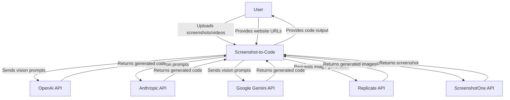
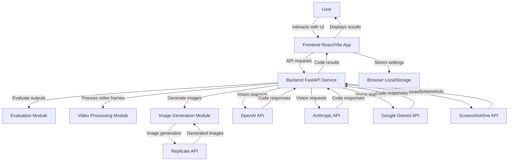
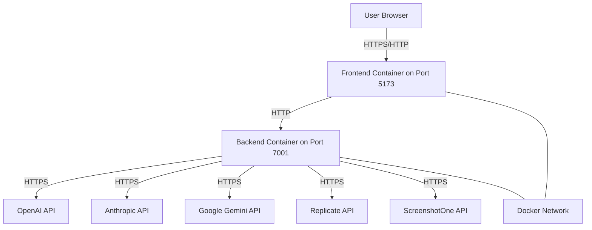
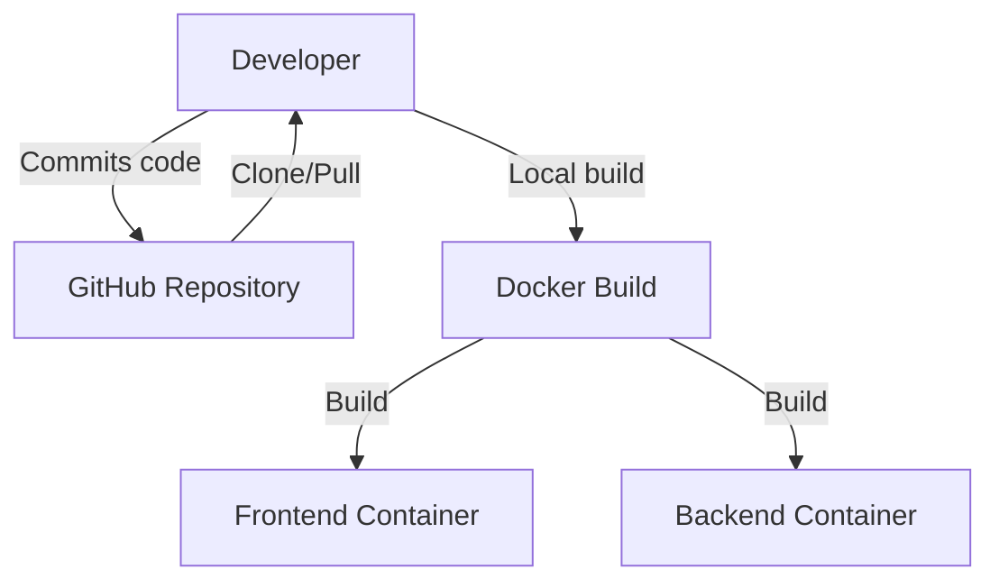

# BUSINESS POSTURE

Screenshot-to-code is a tool that converts screenshots, mockups, and Figma designs into functional code using AI. The primary business goals are:

1. Automate the conversion of visual designs into working code, reducing development time
2. Support multiple output formats including HTML+Tailwind, React, Vue, Bootstrap, Ionic, and SVG
3. Leverage various AI models (Claude Sonnet 3.5/3.6, GPT-4o, Google Gemini) to provide high-quality code generation
4. Provide both open-source self-hosted and commercial hosted (screenshottocode.com) options
5. Support diverse input sources including screenshots, videos, and website URLs

The key business risks that need to be addressed:

1. Dependency on third-party AI services (OpenAI, Anthropic, Replicate, Google) and potential service disruptions
2. Cost management for API usage, especially for resource-intensive vision models
3. Maintaining accurate code generation across diverse design inputs
4. Managing user expectations regarding the fidelity of generated code compared to original designs
5. Competition from similar tools in the rapidly evolving AI code generation space
6. Quality assurance and performance evaluation across different AI models

# SECURITY POSTURE

Existing security controls and accepted risks:

- Security control: User API keys for OpenAI, Anthropic, Replicate, and Google Gemini stored locally in .env files or browser storage, not on server infrastructure (implemented in config.py and generate_code.py)
- Security control: Docker containerization for deployment isolation (implemented in docker-compose.yml)
- Security control: Limited API surface with FastAPI backend exposing only necessary endpoints (implemented in main.py and routes/*.py)
- Security control: Input validation for uploaded images and video files (implemented in routes/generate_code.py with parameter extraction and validation)
- Security control: Cross-Origin Resource Sharing (CORS) configuration to manage API access (implemented in main.py)
- Security control: Proper error handling in WebSocket communications with specific error codes (implemented in routes/generate_code.py and ws/constants.py)
- Security control: Isolation of third-party screenshot service behind authenticated API (implemented in routes/screenshot.py)
- Security control: Validation of input parameters before processing (implemented in routes/generate_code.py via extract_params function)
- Accepted risk: API keys stored in environment variables could be exposed if system is compromised
- Accepted risk: Reliance on third-party CDN resources for libraries like Tailwind, React, Font Awesome
- Accepted risk: No centralized authentication system for self-hosted deployments

Recommended high-priority security controls:

1. Implement rate limiting on API endpoints to prevent abuse
2. Add stronger input validation and sanitization for user-provided content, especially for screenshot URLs
3. Implement proper logging for security events and failed API calls
4. Add secure file handling for temporary video and image files
5. Implement secure development lifecycle practices including code scanning
6. Add monitoring for unusual API usage patterns or failed authentication attempts

Security requirements:

- Authentication: The application should support secure API key management for third-party services without exposing these keys
- Authorization: Access control mechanisms should be implemented for the hosted version to ensure users can only access their own projects
- Input validation: All user inputs including uploaded images, videos, and URLs should be properly validated and sanitized
- Cryptography: Transport layer security (TLS) should be enforced for all API communications

# DESIGN

## C4 CONTEXT

| Name | Type | Description | Responsibilities | Security Controls |
|------|------|-------------|------------------|-------------------|
| User | Person | End user of the application | Uploads screenshots/video, configures settings, views and exports generated code | N/A |
| Screenshot-to-Code | Software System | Web application that converts visual designs to code | Process user inputs, communicate with AI services, generate and return code | Input validation, secure key management, CORS configuration |
| OpenAI API | External System | AI service provider | Process image prompts, generate code responses | API key authentication, TLS encryption |
| Anthropic API | External System | AI service provider (Claude models) | Process image prompts, generate code responses | API key authentication, TLS encryption |
| Google Gemini API | External System | AI service provider | Process image prompts, generate code responses | API key authentication, TLS encryption |
| Replicate API | External System | Image generation service | Generate images from text descriptions | API key authentication, TLS encryption |
| ScreenshotOne API | External System | Website screenshot service | Capture screenshots of websites | API key authentication, TLS encryption |

## C4 CONTAINER

| Name | Type | Description | Responsibilities | Security Controls |
|------|------|-------------|------------------|-------------------|
| Frontend | Container | React/Vite single-page application | User interface, handle file uploads, settings management, display results | Client-side input validation, secure storage of API keys in browser only |
| Backend | Container | FastAPI Python service | Process requests, communicate with AI services, handle evaluation tools | Input validation, API key management, CORS configuration, containerization |
| Browser LocalStorage | Database | Browser-based storage | Store user preferences and settings | Client-side only storage for sensitive information |
| Evaluation Module | Component | Code for comparing model outputs | Run evaluations across different models and settings | Input validation, secure file handling |
| Video Processing Module | Component | Video frame extraction service | Process video uploads into sequential frames for AI processing | Secure temporary file handling, input validation |
| Image Generation Module | Component | Image creation service | Generate images from text descriptions within code | Input validation, API key security |
| OpenAI API | External System | AI service provider | Process image prompts, generate code responses | API key authentication, TLS encryption |
| Anthropic API | External System | AI service provider (Claude models) | Process image prompts, generate code responses | API key authentication, TLS encryption |
| Google Gemini API | External System | AI service provider | Process image prompts, generate code responses | API key authentication, TLS encryption |
| Replicate API | External System | Image generation service | Generate images from text descriptions | API key authentication, TLS encryption |
| ScreenshotOne API | External System | Website screenshot service | Capture screenshots of websites | API key authentication, TLS encryption |

## DEPLOYMENT

The project offers two deployment architectures:

1. Self-hosted deployment (open source)
2. Commercial hosted service (screenshottocode.com)

For this document, I'll focus on the self-hosted deployment model:

| Name | Type | Description | Responsibilities | Security Controls |
|------|------|-------------|------------------|-------------------|
| User Browser | Client | Web browser used to access the application | Render UI, execute JavaScript, communicate with frontend | N/A |
| Frontend Container | Container | Docker container running the React/Vite app | Serve frontend assets, manage user interface | Docker isolation, port binding to 5173 |
| Backend Container | Container | Docker container running the FastAPI service | Process API requests, communicate with external services | Docker isolation, port binding to 7001, API key management |
| Docker Network | Network | Internal Docker network connecting containers | Enable container communication | Network isolation |
| OpenAI API | External Service | Cloud-based AI service | Process AI requests | TLS encryption, API key authentication |
| Anthropic API | External Service | Cloud-based AI service | Process AI requests | TLS encryption, API key authentication |
| Google Gemini API | External Service | Cloud-based AI service | Process AI requests | TLS encryption, API key authentication |
| Replicate API | External Service | Cloud-based image generation service | Generate images | TLS encryption, API key authentication |
| ScreenshotOne API | External Service | Website screenshot service | Capture website screenshots | TLS encryption, API key authentication |

## BUILD

The project uses a straightforward build process without extensive CI/CD automation visible in the provided files. The primary build mechanisms are:

The build process involves:

1. Code development on the local machine
2. Docker containerization using docker-compose
3. Manual deployment by users cloning the repository

Security controls in the build process:
- Using specific version tags for base images in Dockerfiles (e.g., python:3.12.3-slim-bullseye)
- Dependency management through Poetry for Python and Yarn for JavaScript
- Docker containerization for isolation

The project would benefit from:
1. Automated CI/CD pipeline for testing and building
2. Dependency scanning and vulnerability checks
3. Container image scanning
4. Automated testing in the build process

# RISK ASSESSMENT

## Critical Business Processes
1. Screenshot/design conversion to functional code
2. Integration with third-party AI services
3. User access to API configuration
4. Image and video processing
5. Evaluation of model performance
6. Website screenshot acquisition
7. Parallel model execution for quality comparison

## Data to Protect
1. User API keys for OpenAI, Anthropic, Google, Replicate, and ScreenshotOne (High sensitivity)
2. User-uploaded screenshots, videos, and designs (Medium sensitivity)
3. Website URLs submitted for screenshot capture (Medium sensitivity)
4. Generated code (Low sensitivity)
5. User preferences and settings (Low sensitivity)
6. Evaluation results and model comparisons (Low sensitivity)

# QUESTIONS & ASSUMPTIONS

## BUSINESS POSTURE
1. Who is the target audience for this tool? Developers, designers, or both?
2. What is the business model for the commercial hosted version?
3. Is there an enterprise offering with additional security features?
4. How frequently are new features and model integrations added?
5. What is the projected usage volume for the hosted service?

## SECURITY POSTURE
1. Are there plans to add user authentication for the self-hosted version?
2. Is there any monitoring or logging framework for security incidents?
3. How are API keys rotated or refreshed?
4. Is content from user-uploaded screenshots analyzed for sensitive information?
5. What safeguards exist to prevent malicious code being requested or executed?

## DESIGN
1. Are there plans to add a database for persistent storage in future versions?
2. How is traffic encryption managed between frontend and backend in the hosted version?
3. Is there rate limiting implemented to protect against abuse?
4. How is the performance of different AI models monitored and compared?
5. What happens when external services (OpenAI, Anthropic) experience downtime?

Assumptions:
1. API keys are managed by end users and not stored centrally
2. The application is primarily intended for development and design workflows
3. There is no persistent user data stored between sessions beyond browser storage
4. The commercial hosted version likely has additional security measures not visible in the open-source codebase
5. Temporary files for video processing are cleaned up after use
