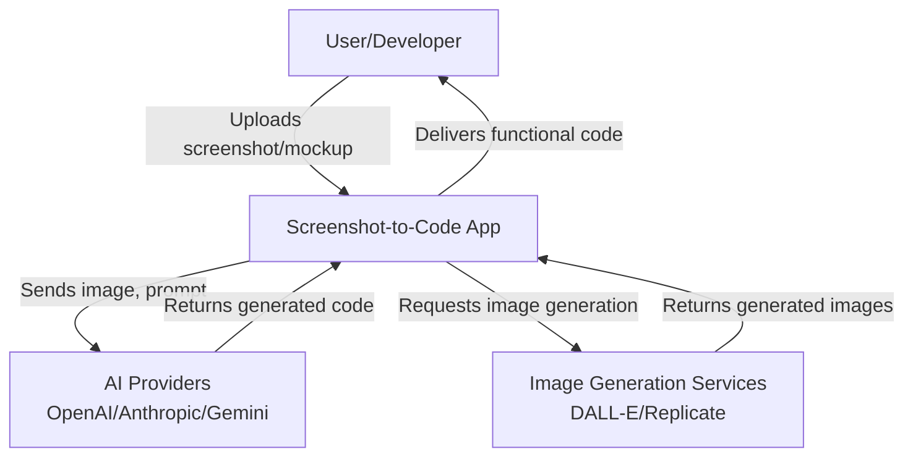
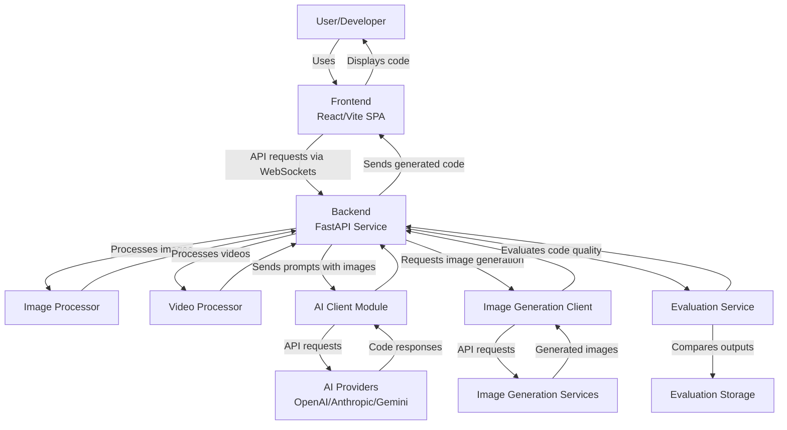
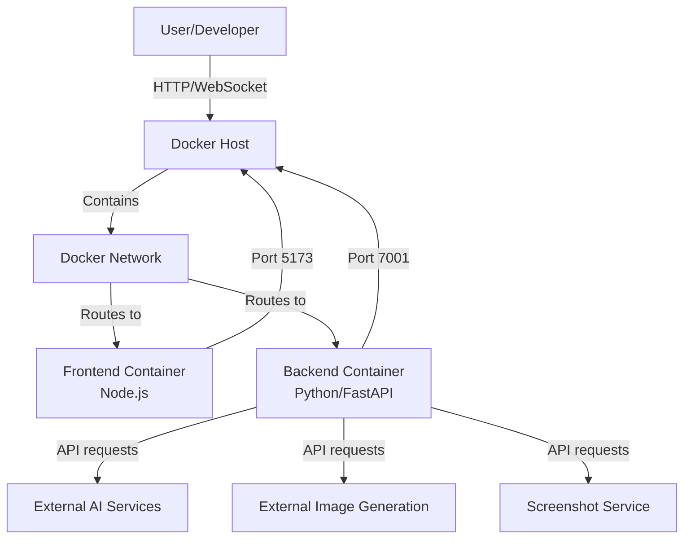
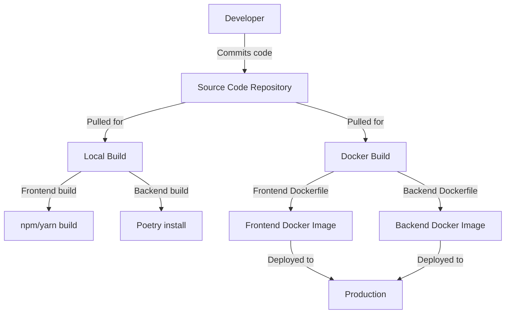

# BUSINESS POSTURE

Screenshot-to-code is a tool designed to convert visual designs (screenshots, mockups, and Figma designs) into functional code using AI. The primary business goal is to streamline and accelerate the frontend development process by leveraging AI to automatically generate code from visual references.

Key business priorities include:
1. Providing high-quality code generation across multiple frameworks (HTML+Tailwind, React, Vue, Bootstrap, Ionic, SVG)
2. Supporting multiple AI models (Claude Sonnet 3.5, GPT-4o, DALL-E 3, etc.) to allow flexibility and comparison
3. Enabling rapid prototyping from static screenshots and even video recordings
4. Offering both open-source and commercial versions of the tool

Business risks that need to be addressed:
1. AI model cost management - using expensive models like GPT-4/Claude could lead to high operational costs
2. API key security - compromised API keys could lead to unauthorized usage and financial losses
3. Intellectual property concerns - code generation based on copyrighted designs could lead to legal issues
4. Vendor lock-in - heavy dependence on specific AI providers creates business continuity risks
5. Quality assurance - ensuring generated code meets acceptable standards for production use

# SECURITY POSTURE

## Existing Security Controls

- Security control: Environment variable management for API keys. Secret keys are loaded from .env files or environment variables in the backend/config.py file.
- Security control: Docker containerization for deployment isolation as seen in the Dockerfile configurations.
- Security control: Local storage of API keys in the user's browser rather than on the server, as mentioned in README.md for the hosted version.
- Security control: Input validation and processing for images before sending to AI providers, implemented in image_processing/utils.py.
- Security control: Rate limiting indirectly applied via the underlying AI service providers.
- Security control: Error handling for authentication and API service failures in generate_code.py with specific error messages that avoid revealing sensitive details.
- Security control: Parameter validation for user inputs in the WebSocket endpoint before processing in generate_code.py.
- Security control: Secure WebSocket communication with defined protocol and error codes.
- Accepted risk: CORS configuration that allows all origins (`allow_origins=["*"]`), which could enable cross-origin attacks but might be necessary for the tool's usage pattern.
- Accepted risk: No authentication mechanism for API access in the open-source version.
- Accepted risk: Limited input validation for user-provided code and prompts.

## Recommended Security Controls

1. Implement API key rotation mechanisms to limit the impact of potential key leakage
2. Add request validation for all API endpoints to prevent malicious inputs
3. Implement proper error handling to avoid information disclosure
4. Introduce usage quotas/rate limiting at the application level
5. Add CSRF protection for the web interface
6. Implement content security policies to prevent XSS vulnerabilities in generated code
7. Set up monitoring and alerting for unusual API usage patterns

## Security Requirements

### Authentication
- The open-source version relies on API keys for service authentication but lacks user authentication
- The hosted commercial version should implement proper user authentication and session management

### Authorization
- The current system has minimal authorization controls
- Role-based access should be implemented for the commercial version to control access to different AI models and features

### Input Validation
- Image inputs are validated for size and dimensions in image_processing/utils.py
- Video inputs are processed and validated in video/utils.py (checking for frame count limits)
- Parameters from WebSocket requests are validated in generate_code.py
- Additional validation should be added for text prompts and imported code to prevent injection attacks

### Cryptography
- API keys should be properly encrypted both in transit and at rest
- HTTPS should be enforced for all communications
- WebSocket connections should use secure protocols (wss://)

# DESIGN

## C4 CONTEXT

### Context Elements

| Name | Type | Description | Responsibilities | Security Controls |
|------|------|-------------|-----------------|-------------------|
| User/Developer | External Person | End-user of the Screenshot-to-Code application | Provides design inputs (screenshots, mockups, videos) and receives generated code | N/A |
| Screenshot-to-Code App | Software System | Web application that converts visual designs to code | Handles user inputs, processes images, communicates with AI services, and presents generated code | Input validation, secure handling of API keys |
| AI Providers | External System | Third-party AI models (OpenAI, Anthropic, Gemini) | Process images and generate corresponding code based on prompts | Rate limiting, authentication via API keys |
| Image Generation Services | External System | Services like DALL-E and Replicate used for generating images | Generate images from textual descriptions | Authentication via API keys |

## C4 CONTAINER

### Container Elements

| Name | Type | Description | Responsibilities | Security Controls |
|------|------|-------------|-----------------|-------------------|
| Frontend | Container: SPA | React/Vite single-page application | Provides UI for uploading designs, displays generated code, handles user interactions | Client-side validation, secure storage of API keys in browser |
| Backend | Container: API | FastAPI service | Coordinates the code generation process, handles API requests | API key management, input validation, error handling |
| Image Processor | Component | Python module for processing images | Resizes and optimizes images for AI model compatibility | Validates image dimensions and size |
| Video Processor | Component | Module for handling video inputs | Extracts frames from videos and processes them for AI consumption | Validates frame count and video format |
| AI Client Module | Component | Interface to various AI models | Communicates with AI providers, handles prompt engineering | Secure transmission of API keys, error handling |
| Image Generation Client | Component | Client for image generation services | Requests image generation from DALL-E or Replicate | Secure handling of API keys |
| Evaluation Service | Component | Service for comparing generated code | Runs evaluations and compares outputs from different models | Input validation for evaluation parameters |
| Evaluation Storage | Component | Storage for evaluation results | Stores references and generated code for comparison | File system access control |
| AI Providers | External System | Third-party AI services | Process images and generate code | Authentication via API keys |
| Image Generation Services | External System | External image generation services | Generate images from descriptions | Authentication via API keys |

## DEPLOYMENT

The project supports several deployment options:

1. Local development setup
2. Docker containerized deployment
3. Hosted commercial version (screenshottocode.com)

For this document, I'll focus on the Docker containerized deployment as it's well-defined in the project files.

### Deployment Elements

| Name | Type | Description | Responsibilities | Security Controls |
|------|------|-------------|-----------------|-------------------|
| Docker Host | Infrastructure | Server hosting Docker containers | Runs containers, manages network, handles external requests | Network isolation, resource limits |
| Docker Network | Infrastructure | Internal Docker network | Facilitates communication between containers | Network isolation |
| Frontend Container | Container | Node.js container running React app | Serves frontend assets, handles client-side logic | Limited to necessary packages, runs as non-root user |
| Backend Container | Container | Python container running FastAPI | Processes requests, communicates with external services | Environment variable management for secrets |
| External AI Services | External System | OpenAI, Anthropic, Gemini | Process images, generate code | API key authentication |
| External Image Generation | External System | DALL-E, Replicate | Generate images from descriptions | API key authentication |
| Screenshot Service | External System | ScreenshotOne API | Captures website screenshots | API key authentication |

## BUILD

The project uses a simple build process that relies on the frontend and backend package managers.

The build process is currently manual with no automated CI/CD pipeline visible in the provided files. For frontend, the build relies on Node.js package manager (yarn), and for backend, it uses Poetry for Python dependency management.

The build security controls are minimal, including:
1. Use of specific version dependencies in poetry.lock and package.json
2. Docker containers provide some isolation from the host system
3. Backend Dockerfile uses a slim base image to reduce attack surface

# RISK ASSESSMENT

## Critical Business Processes
1. Code generation from visual inputs
2. AI model interaction and prompt engineering
3. User interaction with the web interface
4. API key management
5. Image processing and optimization
6. Video processing and frame extraction
7. Code evaluation and comparison

## Data to Protect
1. User API keys (high sensitivity) - unauthorized access could lead to financial losses and service abuse
2. Uploaded screenshots and designs (medium sensitivity) - could contain proprietary information
3. Generated code (low sensitivity) - represents intellectual effort but is intended for use
4. Prompt templates (medium sensitivity) - represent intellectual property and competitive advantage
5. User preferences and settings (low sensitivity) - affects user experience but not critical
6. Video inputs (medium sensitivity) - could contain sensitive or proprietary information
7. Evaluation data (low sensitivity) - comparison results for different models

# QUESTIONS & ASSUMPTIONS

## BUSINESS POSTURE
1. What is the expected user volume for the project?
2. What are the performance requirements in terms of response time and throughput?
3. Is this application intended for internal use within organizations or as a public service?
4. What is the expected ratio of open-source users vs. paid commercial users?

Assumptions:
- The business prioritizes flexibility (supporting multiple frameworks) over optimization for a specific stack
- Cost management is important given the potential expenses associated with AI model usage
- The hosted version has additional security measures not present in the open-source version

## SECURITY POSTURE
1. Are there specific compliance requirements (GDPR, CCPA, etc.) that the application needs to meet?
2. What is the threat model for the application? Who are the potential attackers?
3. How long should user data be retained?
4. Is there a need for audit logging of code generation activities?

Assumptions:
- The open-source version prioritizes ease of use over security
- API keys are the primary security control for accessing external services
- There's limited concern about malicious use of the generated code

## DESIGN
1. What is the expected scale of deployment?
2. Are there plans to extend the application with additional AI models or frameworks?
3. Is there a need for persistent storage of generated code or user preferences?
4. What is the expected response time for code generation?

Assumptions:
- The application is designed for stateless operation
- WebSockets are used due to the long-running nature of AI model queries
- Docker is the preferred deployment method for production environments
- The backend is designed to be horizontally scalable
