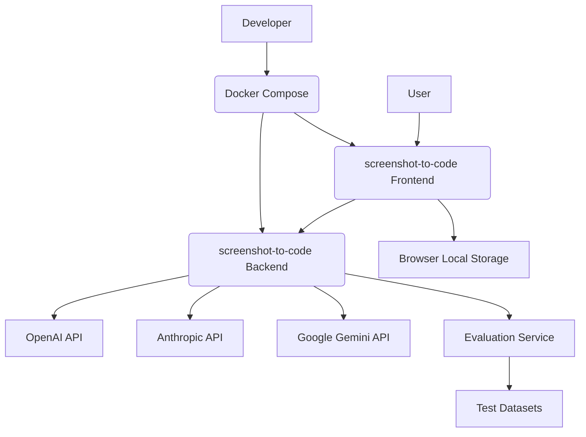
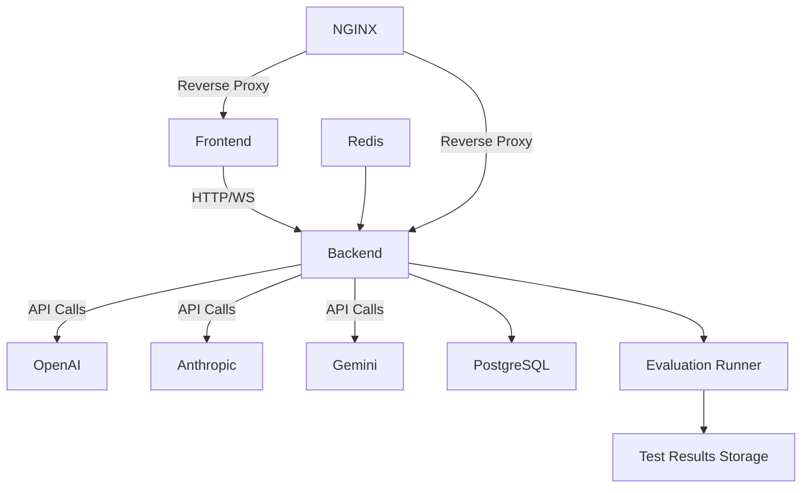
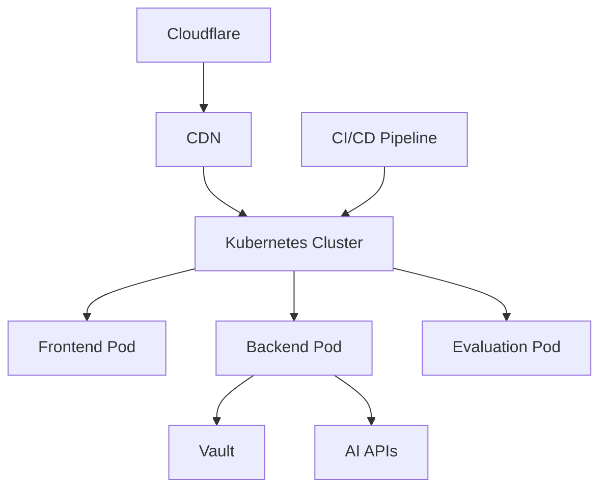
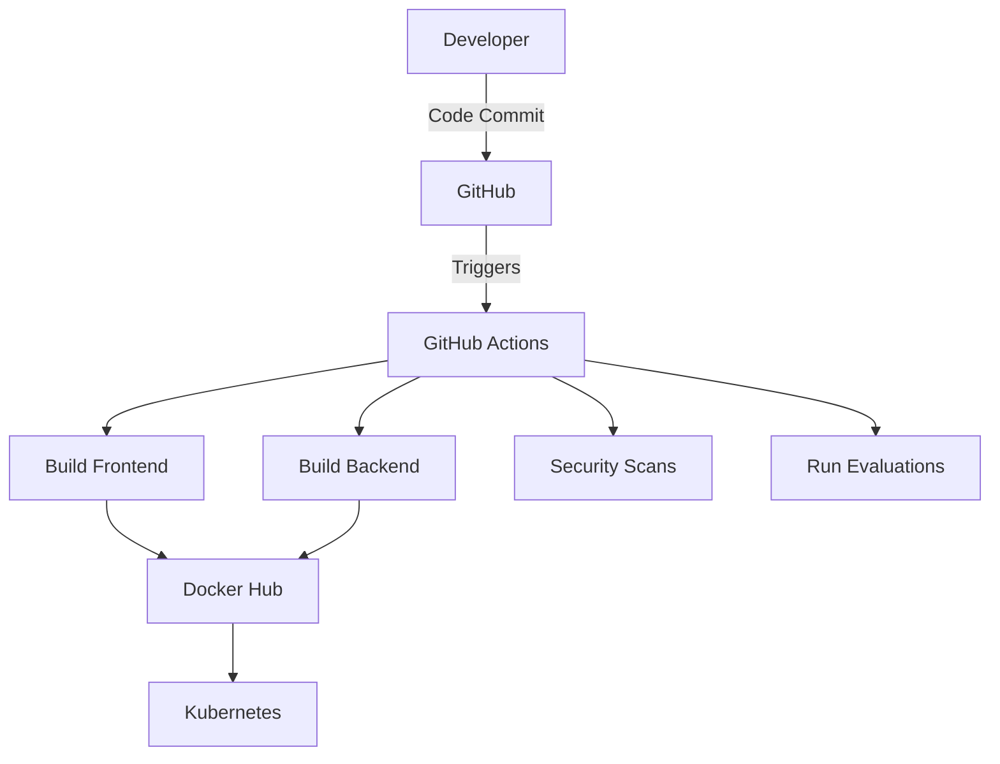

# Design Document

## BUSINESS POSTURE

**Business Priorities & Goals:**
1. Enable rapid conversion of visual designs into functional code using AI
2. Support multiple frontend frameworks (Tailwind, React, Vue, Bootstrap, etc)
3. Provide both self-hosted OSS and enterprise solutions
4. Maintain competitive edge through model evaluations/updates (Claude 3.5, GPT-4o)
5. Expand use cases beyond screenshots to video/screen recordings

**Key Business Risks:**
1. Dependency on third-party AI providers (OpenAI, Anthropic, Google)
2. Accuracy of code generation impacting user trust
3. Security of API keys and user data
4. Competition from similar AI-powered codegen tools
5. Potential IP/copyright issues with generated code

## SECURITY POSTURE

**Existing Security Controls:**
- security control: API key storage in browser only (frontend/.env.local)
- security control: CORS middleware configured (backend/main.py)
- security control: Separate Docker containers for frontend/backend
- security control: Poetry for Python dependency management
- accepted risk: No authentication in OSS version
- accepted risk: Browser-stored API keys vulnerable to XSS

**Recommended Security Controls (High Priority):**
1. Implement API key rotation/encryption
2. Add rate limiting for API endpoints
3. Introduce basic auth for self-hosted instances
4. SAST scanning in CI/CD pipeline
5. Content Security Policy headers

**Security Requirements:**
1. Authentication:
   - Browser-based API key management
   - OAuth support for enterprise version
2. Authorization:
   - Role-based access control for enterprise
3. Input Validation:
   - Image/video file type/size restrictions
   - Prompt injection protections
4. Cryptography:
   - Encrypt API keys at rest
   - TLS for all external communications

## DESIGN

### C4 CONTEXT

| Name | Type | Description | Responsibilities | Security Controls |
|------|------|-------------|------------------|------------------|
| User | Human | End user | Upload images/videos, view generated code | Browser sandboxing |
| Frontend | Web App | React/Vite application | UI rendering, API key management | CORS, Env vars |
| Backend | API Service | FastAPI server | Code generation, LLM integration | Input validation |
| Evaluation Service | Testing System | Automated quality checks | Model performance testing | Data sanitization |
| AI Providers | External APIs | Model providers | Code generation | API key auth |

### C4 CONTAINER

| Name | Type | Description | Responsibilities | Security Controls |
|------|------|-------------|------------------|------------------|
| Frontend | React App | Client UI | User interactions | CSP headers |
| Backend | FastAPI | Core logic | LLM orchestration | Rate limiting |
| Evaluation Runner | Service | Model testing | Quality assurance | Input validation |
| Test Results | Database | Performance metrics | Evaluation storage | Access controls |

### DEPLOYMENT

| Name | Type | Description | Responsibilities | Security Controls |
|------|------|-------------|------------------|------------------|
| Cloudflare | CDN | Edge network | DDoS protection | WAF rules |
| Kubernetes | Orchestrator | Container management | Auto-scaling | RBAC policies |
| Evaluation Pod | Service | Testing environment | Model validation | Network isolation |

### BUILD

**Build Security Controls:**
1. SAST scanning with Semgrep
2. Dependency scanning with Trivy
3. SBOM generation
4. Signed container images
5. Evaluation test isolation

## RISK ASSESSMENT

**Critical Business Processes:**
1. AI model evaluation pipeline
2. Video processing workflows
3. Cross-framework code generation
4. Enterprise evaluation result storage

**Data Sensitivity:**
1. User API keys (High)
2. Evaluation datasets (Medium)
3. Video frame data (Medium)
4. Model performance metrics (Low)

## QUESTIONS & ASSUMPTIONS

**Key Questions:**
1. How are video inputs sanitized before processing?
2. What retention policy exists for evaluation datasets?
3. Are generated code outputs scanned for vulnerabilities?
4. How are third-party CDN scripts validated?

**Default Assumptions:**
1. Video processing uses temp file isolation
2. Evaluation datasets are synthetic/non-sensitive
3. All third-party scripts use integrity hashes
4. Model outputs are sandboxed during evaluation
