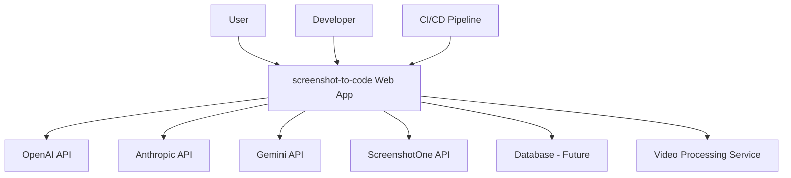
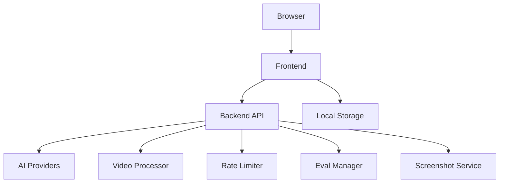
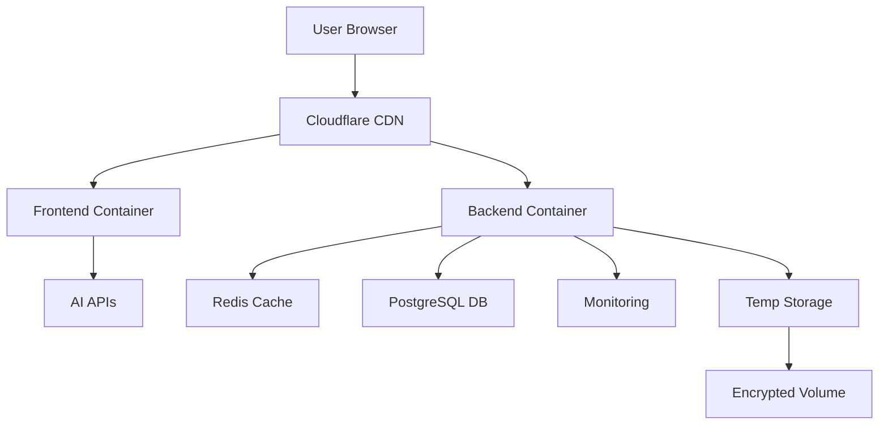

# Design Document for Screenshot-to-Code Project

## BUSINESS POSTURE

**Business Priorities:**
1. Enable rapid conversion of visual designs into functional code
2. Support multiple frontend frameworks (React, Vue, Bootstrap, etc.)
3. Provide accurate AI-powered code generation
4. Offer both self-hosted and SaaS solutions
5. Support video-to-code conversion capabilities

**Key Business Risks:**
1. Inaccurate code generation impacting user trust
2. Dependency on third-party AI providers (OpenAI, Anthropic, Gemini)
3. Potential misuse for intellectual property infringement
4. Financial risks from API cost overruns
5. Security risks from video processing and frame extraction

## SECURITY POSTURE

**Existing Security Controls:**
1. API key management through environment variables (backend/config.py)
2. Separate Docker containers for frontend/backend
3. Input validation for image/video uploads (backend/video/utils.py)
4. Base64 encoding for media payloads
5. Temporary file cleanup for video processing

**Accepted Risks:**
1. Storing API keys in client-side browser storage
2. Using third-party CDNs for framework scripts in generated code
3. Video frame extraction storing temporary files
4. Reliance on screenshotone.com API for screenshot capture

**Recommended Security Controls:**
1. Implement MIME type validation for video uploads
2. Add timeout controls for external API calls
3. Introduce file path sanitization for eval operations
4. Implement checksum verification for third-party scripts
5. Add video processing quota limits

**Security Requirements:**
1. Authentication:
   - API key validation for AI services
   - Browser-stored keys only for session duration

2. Authorization:
   - Role-based access control for eval operations
   - API key usage quotas per user

3. Input Validation:
   - Video file type verification (MP4, MOV)
   - Size limitations for video uploads
   - Frame rate limits for video processing

4. Cryptography:
   - Encrypt temporary video files at rest
   - TLS for all external communications
   - Secure deletion of temporary files

## DESIGN

### C4 CONTEXT

| Name               | Type          | Description                                                                 | Security Controls                     |
|---------------------|---------------|-----------------------------------------------------------------------------|----------------------------------------|
| User                | Human         | End user uploading designs/videos                                         | Client-side validation                |
| Web App             | System        | Core application handling UI and business logic                           | Input sanitization, API key rotation |
| ScreenshotOne API   | External System| Third-party screenshot capture service                                    | Rate limiting, TLS                   |
| Video Processing    | Service       | Handles video frame extraction and processing                              | Temp file encryption                  |

### C4 CONTAINER

| Name             | Type          | Description                                                                 | Security Controls                     |
|-------------------|---------------|-----------------------------------------------------------------------------|----------------------------------------|
| Video Processor  | Python Module | Extracts frames from videos for AI processing                              | Frame rate limiting                   |
| Eval Manager     | Service       | Handles code evaluation and comparison                                      | Path sanitization                     |
| Screenshot Service| Integration  | Manages external screenshot capture API                                     | API key rotation                      |

### DEPLOYMENT

| Name             | Type          | Description                                                                 | Security Controls                     |
|-------------------|---------------|-----------------------------------------------------------------------------|----------------------------------------|
| Temp Storage      | Ephemeral     | Stores temporary video/image processing files                              | AES-256 encryption                    |
| Encrypted Volume  | Storage       | Encrypted disk space for sensitive data                                    | KMS integration                       |

### BUILD PROCESS

**Updated Security Controls:**
1. Vulnerability scanning for video processing dependencies
2. SAST scanning for temp file handling code
3. Image signing for video processing containers
4. Checksum verification for third-party AI libraries

## RISK ASSESSMENT

**Critical Business Processes:**
1. Video frame extraction accuracy
2. Multi-model AI response coordination
3. Temporary file lifecycle management
4. Eval result integrity

**Protected Data:**
1. User API keys (High sensitivity)
2. Generated code (Medium sensitivity)
3. Video uploads (High sensitivity)
4. Eval comparison results (Medium sensitivity)

## QUESTIONS & ASSUMPTIONS

**New Questions:**
1. How are temporary video files purged after processing?
2. What validation exists for third-party CDN scripts in generated code?
3. Is there monitoring for screenshot API usage patterns?
4. How are eval file paths sanitized against directory traversal?

**Updated Assumptions:**
1. Video processing uses in-memory buffers where possible
2. Eval comparisons only access whitelisted directories
3. All external script URLs are allowlisted
4. Video frame extraction limits to 20 frames max
