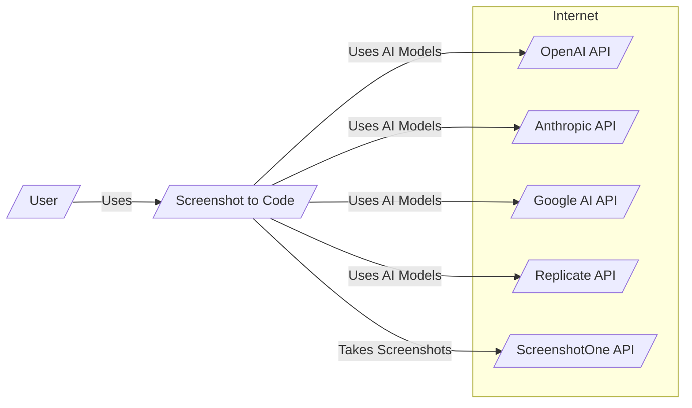
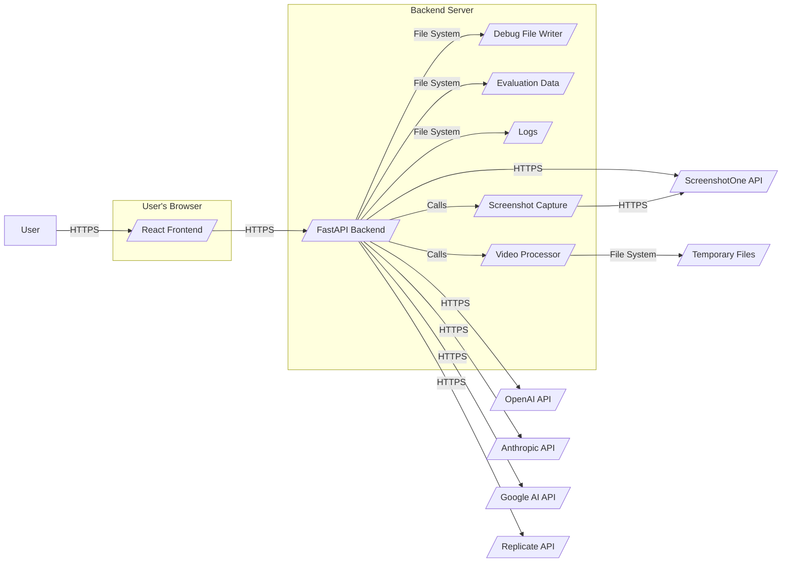
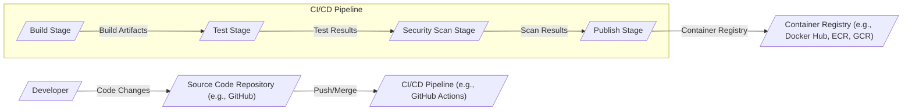

# DESIGN DOCUMENT

## BUSINESS POSTURE

The "screenshot-to-code" project aims to simplify and accelerate the process of converting visual designs into functional code. By leveraging AI, it targets users who need to quickly prototype web interfaces from screenshots, mockups, or design files, potentially bridging the gap between design and development.

Business Priorities and Goals:
- Primary goal: Provide a user-friendly and efficient tool for converting visual designs to code.
- Secondary goal: Support a wide range of frontend stacks and AI models to cater to diverse user needs.
- Tertiary goal: Offer both hosted (paid) and open-source versions to expand reach and monetization opportunities.
- Key business priority: Accuracy and quality of the generated code to ensure user satisfaction and adoption. The addition of evaluation endpoints in `evals.py` highlights the importance of this priority and the project's focus on measuring and improving code generation quality.
- Another business priority: Speed and efficiency of the conversion process to provide a rapid prototyping solution.

Business Risks:
- Risk of inaccurate or low-quality code generation, leading to user dissatisfaction and lack of adoption.
- Reliance on third-party AI models (OpenAI, Anthropic, Google, Replicate) and their API availability, pricing, and performance.
- Competition from similar or more advanced AI-powered code generation tools.
- Security risks associated with handling user-uploaded screenshots, video inputs, and API keys. The introduction of screenshot API (`screenshot.py`) and video processing (`video/utils.py`) expands the attack surface and data handling requirements.
- Maintaining and supporting both open-source and hosted versions of the tool.
- Dependency on external screenshot service (ScreenshotOne API), including its availability, reliability, and security.

## SECURITY POSTURE

Existing Security Controls:
- security control: API keys (OpenAI, Anthropic, Gemini, Replicate) are stored client-side in the browser's local storage or read from backend environment variables. Described in `Troubleshooting.md`, `README.md` and implemented in `generate_code.py` (`get_from_settings_dialog_or_env` function).
- security control: Dockerfiles for backend and frontend are provided, enabling containerization and potentially more controlled deployment environments. Described in `Dockerfile` and `docker-compose.yml`.
- security control: Use of Poetry for backend dependency management, potentially improving supply chain security by managing dependencies and their versions. Described in `backend\pyproject.toml` and `backend\README.md`.
- security control: Pre-commit hooks are used in the backend, suggesting a focus on code quality and consistency. Described in `backend\pyproject.toml`.
- security control: Usage of `httpx` library in `screenshot.py` with timeout to handle network requests to ScreenshotOne API, which can improve resilience.
- security control: Input validation and error handling within backend routes (e.g., in `evals.py` and `generate_code.py`) to manage invalid requests and exceptions.

Accepted Risks:
- accepted risk: Reliance on user-provided API keys, with the risk of key compromise if users' systems are insecure.
- accepted risk: Open-source nature of the project implies code is publicly accessible, potentially exposing vulnerabilities if not actively maintained and secured.
- accepted risk:  Handling user-uploaded screenshots and video inputs involves potential data privacy risks if not processed and stored securely.
- accepted risk: Dependency on external AI APIs and ScreenshotOne API for core functionalities.

Recommended Security Controls:
- security control: Implement robust input validation on the backend for all API endpoints, including screenshot URLs, video data URLs, and evaluation folder paths, to sanitize user inputs and prevent injection attacks. This is crucial for new features like screenshot capture and video processing.
- security control: Consider server-side API key management for AI models and ScreenshotOne API for the hosted version to improve security and potentially offer different service tiers. Explore secure storage solutions for these server-side API keys (e.g., secrets management services).
- security control: Implement rate limiting and API usage monitoring for all external APIs (AI models and ScreenshotOne) to protect against abuse, unexpected costs, and potential denial-of-service.
- security control: Integrate SAST/DAST tools into the CI/CD pipeline to automatically detect and remediate potential vulnerabilities in both backend and frontend code.
- security control: Regularly update dependencies for both frontend and backend to patch known vulnerabilities. Implement automated dependency scanning.
- security control: For the hosted version, implement comprehensive logging and monitoring for security events, errors, and suspicious activities to enable incident detection and response.
- security control: Implement secure coding practices and conduct security code reviews, especially for new features like video processing and screenshot capture, to minimize vulnerabilities.
- security control: Implement proper error handling and prevent exposing sensitive information in error messages, as seen in `generate_code.py` where specific error handling is in place for OpenAI API errors.
- security control: Review and secure temporary file handling, especially in video processing (`video/utils.py`), to prevent potential vulnerabilities related to temporary files.

Security Requirements:
- Authentication: Not explicitly mentioned, but for a hosted version, user authentication will be needed to manage subscriptions and usage. For the open-source version, authentication might not be a requirement.
- Authorization: Authorization might be needed in the hosted version to control access to features based on subscription level. Open-source version might not require authorization.
- Input Validation: Crucial for processing user-uploaded screenshots, video inputs, and URLs to prevent malicious uploads, injection attacks, and SSRF vulnerabilities. Needs to be implemented on the backend for all relevant API endpoints.
- Cryptography: API keys for AI models and ScreenshotOne should be handled securely. While currently stored client-side, consider encryption in local storage or server-side management for hosted version. Data in transit to AI APIs and ScreenshotOne API should use HTTPS. Secure storage and access control for server-side API keys are essential.

## DESIGN

### C4 CONTEXT



Context Diagram Elements:

- Element:
    - Name: User
    - Type: Person
    - Description: End-user who wants to convert screenshots or designs to code.
    - Responsibilities: Uploads screenshots or video inputs, provides design URLs, configures settings (API keys, stacks, models), views and uses generated code.
    - Security controls: Manages their own API keys (for open-source), authenticates (for hosted version - assumption).

- Element:
    - Name: Screenshot to Code
    - Type: Software System
    - Description: Application that converts screenshots, video inputs, and design URLs to code using AI models. It has a React/Vite frontend and a FastAPI backend.
    - Responsibilities: Receives user input (screenshots, video URLs, design URLs, settings), interacts with AI model APIs and ScreenshotOne API, generates code, provides code output to the user. Handles evaluation requests and debug logging.
    - Security controls: Input validation, API key handling (client-side for open-source, potentially server-side for hosted), rate limiting, logging, monitoring (for hosted version - assumption), secure handling of temporary files.

- Element:
    - Name: OpenAI API
    - Type: External System
    - Description: OpenAI's API, specifically GPT-4 Vision and GPT-4o models, used for code generation from images and text prompts.
    - Responsibilities: Provides AI-powered code generation based on image and text inputs from Screenshot to Code.
    - Security controls: API key authentication, rate limiting, data encryption in transit (HTTPS).

- Element:
    - Name: Anthropic API
    - Type: External System
    - Description: Anthropic's API, specifically Claude 3 models, used as an alternative AI model for code generation and video processing.
    - Responsibilities: Provides AI-powered code generation based on image and text inputs from Screenshot to Code.
    - Security controls: API key authentication, rate limiting, data encryption in transit (HTTPS).

- Element:
    - Name: Google AI API
    - Type: External System
    - Description: Google AI's Gemini API, used as an alternative AI model for code generation.
    - Responsibilities: Provides AI-powered code generation based on image and text inputs from Screenshot to Code.
    - Security controls: API key authentication, rate limiting, data encryption in transit (HTTPS).

- Element:
    - Name: Replicate API
    - Type: External System
    - Description: Replicate's API, used to access DALL-E 3 or Flux Schnell models for image generation (optional feature).
    - Responsibilities: Provides AI-powered image generation based on text prompts from Screenshot to Code.
    - Security controls: API key authentication, rate limiting, data encryption in transit (HTTPS).

- Element:
    - Name: ScreenshotOne API
    - Type: External System
    - Description: ScreenshotOne API, used to capture website screenshots from provided URLs.
    - Responsibilities: Provides website screenshot capture service for Screenshot to Code.
    - Security controls: API key authentication, rate limiting, data encryption in transit (HTTPS).

### C4 CONTAINER



Container Diagram Elements:

- Element:
    - Name: React Frontend
    - Type: Container - Client-side Application
    - Description: React/Vite frontend application, served to the user's browser. Handles user interface, input processing, and communication with the backend.
    - Responsibilities: User interface rendering, handling user interactions, sending requests to the backend (including screenshot URLs and video data URLs), receiving and displaying generated code and evaluation results.
    - Security controls:  Client-side input validation, secure handling of API keys in browser local storage, protection against XSS (handled by React framework).

- Element:
    - Name: FastAPI Backend
    - Type: Container - Server-side Application
    - Description: FastAPI backend application. Handles API requests from the frontend, interacts with AI models and ScreenshotOne API, processes code generation and evaluation logic, manages video processing and screenshot capture.
    - Responsibilities: API endpoint management (including endpoints for code generation, screenshot capture, video processing, and evaluations), request handling, prompt assembly, interaction with AI model APIs (OpenAI, Anthropic, Google, Replicate) and ScreenshotOne API, code processing and response generation, managing evaluation runs, handling debug logging.
    - Security controls: Server-side input validation for all API endpoints, API key management (for hosted version - assumption, for AI models and ScreenshotOne), rate limiting, logging, monitoring, protection against common web application vulnerabilities (handled by FastAPI framework and secure coding practices), secure handling of temporary files, secure communication with internal components (VideoProcessor, ScreenshotCapture).

- Element:
    - Name: Video Processor
    - Type: Container - Component
    - Description: Backend component responsible for processing video inputs. It splits videos into frames and prepares them for AI processing. Implemented in `video/utils.py`.
    - Responsibilities: Receiving video data URLs from FastAPI Backend, decoding base64 video data, splitting video into screenshots, saving temporary files (for debugging), preparing image data for AI prompt assembly.
    - Security controls: Secure handling of video data, secure temporary file management, input validation of video data URLs, error handling during video processing.

- Element:
    - Name: Screenshot Capture
    - Type: Container - Component
    - Description: Backend component responsible for capturing website screenshots using ScreenshotOne API. Implemented in `screenshot.py`.
    - Responsibilities: Receiving target URLs and ScreenshotOne API keys from FastAPI Backend, interacting with ScreenshotOne API to capture screenshots, returning screenshot data URLs.
    - Security controls: Secure API key handling for ScreenshotOne API, input validation of target URLs, error handling during screenshot capture, secure communication with ScreenshotOne API over HTTPS.

- Element:
    - Name: Debug File Writer
    - Type: Container - Utility
    - Description:  Component in the backend responsible for writing debug information to the file system when debugging is enabled.
    - Responsibilities: Writing prompt messages, generated code, video processing debug artifacts, and other debug information to files for debugging and evaluation purposes.
    - Security controls: Access control to debug logs, ensuring sensitive information is not inadvertently logged in production. Debugging should be disabled in production environment.

- Element:
    - Name: Evaluation Data
    - Type: Container - Data Store
    - Description: Directory on the backend server storing evaluation datasets (input screenshots and output code) used for model and prompt evaluation.
    - Responsibilities: Storage and retrieval of evaluation data for running evaluation scripts and rating outputs, managing evaluation folders and files.
    - Security controls: Access control to evaluation data, ensuring it is not publicly accessible and protected from unauthorized modification.

- Element:
    - Name: Logs
    - Type: Container - Data Store
    - Description: Directory on the backend server to store application logs, including request logs and potentially security-related events (for hosted version - assumption).
    - Responsibilities: Logging application activity, errors, and security events for monitoring, debugging, and auditing purposes.
    - Security controls: Secure log storage, log rotation and management, access control to logs, ensuring logs are not publicly accessible and protected from tampering.

- Element:
    - Name: Temporary Files
    - Type: Container - Data Store
    - Description: Temporary directory on the backend server used by Video Processor to store intermediate screenshots during video processing (for debugging purposes).
    - Responsibilities: Temporary storage for video screenshots during processing.
    - Security controls: Access control to temporary files, secure temporary file creation and deletion, ensuring temporary files are not accessible after processing. Debugging features using temporary files should be disabled in production.

- Element:
    - Name: OpenAI API, Anthropic API, Google AI API, Replicate API, ScreenshotOne API
    - Type: Container - External API
    - Description: External APIs used by the backend for code generation, image generation, and screenshot capture.
    - Responsibilities: Provide AI services for code and image generation and website screenshot service based on requests from the backend.
    - Security controls: API key authentication, rate limiting, data encryption in transit (HTTPS), managed by respective API providers.

### DEPLOYMENT

Deployment Solution: Docker Container on Cloud Platform (e.g., AWS ECS, Google Cloud Run, Azure Container Instances)

```mermaid
flowchart LR
    subgraph Cloud Platform
        LoadBalancer[/"Load Balancer"/]
        subgraph Compute Service
            ContainerInstance1[/"Container Instance"/]
            ContainerInstance2[/"Container Instance"/]
            ContainerInstanceN[/"Container Instance"/]
        end
        subgraph Data Storage (Optional)
            LogStorage[/"Log Storage"/]
            EvalDataStorage[/"Eval Data Storage"/]
            TempFileStorage[/"Temp File Storage"/]
        end
    end
    Internet -- HTTPS --> LoadBalancer
    LoadBalancer -- HTTPS --> ComputeService
    ComputeService -- FastAPIBackendContainer[/"FastAPI Backend Container"/]
    ComputeService -- ReactFrontendContainer[/"React Frontend Container"/]
    FastAPIBackendContainer -- OpenAIAPI[/"OpenAI API"/]
    FastAPIBackendContainer -- AnthropicAPI[/"Anthropic API"/]
    FastAPIBackendContainer -- GoogleAIAPI[/"Google AI API"/]
    FastAPIBackendContainer -- ReplicateAPI[/"Replicate API"/]
    FastAPIBackendContainer -- ScreenshotOneAPI[/"ScreenshotOne API"/]
    FastAPIBackendContainer -- LogStorage
    FastAPIBackendContainer -- EvalDataStorage
    FastAPIBackendContainer -- TempFileStorage
    ReactFrontendContainer -- FastAPIBackendContainer
```

Deployment Diagram Elements:

- Element:
    - Name: Load Balancer
    - Type: Infrastructure - Network Component
    - Description: Distributes incoming HTTPS traffic from the internet to multiple Container Instances. Provides high availability and scalability.
    - Responsibilities: Traffic distribution, SSL termination, health checks, routing requests to healthy instances, DDoS protection.
    - Security controls: SSL/TLS encryption, DDoS protection, access control lists (ACLs), web application firewall (WAF).

- Element:
    - Name: Container Instance (Compute Service)
    - Type: Infrastructure - Compute Resource
    - Description: Virtual machines or container orchestration service (e.g., ECS, Cloud Run, ACI) that runs Docker containers for the backend and frontend applications.
    - Responsibilities: Running and managing Docker containers, providing compute resources, scaling instances based on load, resource isolation.
    - Security controls: Instance isolation, operating system hardening, security patching, network security groups (NSGs), IAM roles for access control, resource limits for containers.

- Element:
    - Name: FastAPI Backend Container
    - Type: Container - Docker Image
    - Description: Docker container running the FastAPI backend application, including Video Processor and Screenshot Capture components.
    - Responsibilities:  Handles backend logic, API requests, AI model and ScreenshotOne API interactions, video processing, screenshot capture, as described in the Container Diagram.
    - Security controls: Security controls inherited from the FastAPI Backend application, container image vulnerability scanning, least privilege container user, resource limits.

- Element:
    - Name: React Frontend Container
    - Type: Container - Docker Image
    - Description: Docker container running the React frontend application. Served by a static file server (e.g., Nginx, within the same container or separate).
    - Responsibilities: Serves the frontend application, handles client-side logic, as described in the Container Diagram.
    - Security controls: Security controls inherited from the React Frontend application, container image vulnerability scanning, static file server security configurations.

- Element:
    - Name: Log Storage (Optional)
    - Type: Infrastructure - Data Storage
    - Description: Cloud-based storage service (e.g., AWS S3, Google Cloud Storage, Azure Blob Storage) for storing application logs persistently.
    - Responsibilities: Secure and scalable storage for application logs, enabling long-term log retention and analysis.
    - Security controls: Access control policies, encryption at rest and in transit, data retention policies, audit logging of storage access.

- Element:
    - Name: Eval Data Storage (Optional)
    - Type: Infrastructure - Data Storage
    - Description: Cloud-based storage for evaluation datasets. Might be the same as Log Storage or separate, depending on requirements and sensitivity of evaluation data.
    - Responsibilities: Secure storage for evaluation datasets, potentially versioning and access control for different evaluation runs.
    - Security controls: Access control policies, encryption at rest and in transit, data integrity checks.

- Element:
    - Name: Temp File Storage (Optional)
    - Type: Infrastructure - Data Storage
    - Description: Cloud-based temporary storage for video processing temporary files. Might be local disk on container instance or dedicated temporary storage service.
    - Responsibilities: Temporary storage for video screenshots during processing, ensuring cleanup after processing.
    - Security controls: Access control policies, secure temporary file handling, automated cleanup processes, considering security implications of using local disk vs. network storage.

- Element:
    - Name: OpenAI API, Anthropic API, Google AI API, Replicate API, ScreenshotOne API
    - Type: External API
    - Description: External APIs, as described in the Context and Container Diagrams, accessed from the FastAPI Backend Container.
    - Responsibilities: Provide AI services for code and image generation and website screenshot service.
    - Security controls: API key authentication, rate limiting, data encryption in transit (HTTPS), managed by respective API providers.

### BUILD



Build Process Description:

1. Developer commits and pushes code changes to the Source Code Repository (e.g., GitHub).
2. CI/CD Pipeline (e.g., GitHub Actions) is triggered upon code changes (push, merge to main branch).
3. Build Stage:
    - Backend: Uses Dockerfile in `backend/Dockerfile` to build a Docker image for the FastAPI backend. Includes steps to install dependencies using Poetry, run type checker (Pyright), and package the application.
    - Frontend: Uses Dockerfile in `frontend/Dockerfile` to build a Docker image for the React frontend. Includes steps to install dependencies using Yarn and build the frontend application.
4. Test Stage:
    - Runs unit tests and integration tests for the backend (using pytest as indicated in `backend/README.md`).
    - Optionally, runs frontend tests (if implemented).
5. Security Scan Stage:
    - Performs static application security testing (SAST) on the backend and frontend code to identify potential vulnerabilities.
    - Scans Docker images for known vulnerabilities in base images and dependencies.
    - Can include linters, dependency vulnerability checks, secret scanning, and potentially license compliance checks.
6. Publish Stage:
    - If tests and security scans pass, Docker images for backend and frontend are pushed to a Container Registry (e.g., Docker Hub, ECR, GCR).
    - Optionally, deployment to staging/production environments can be automated in this stage.

Build Process Security Controls:

- security control: Automated Build Process: CI/CD pipeline ensures consistent and repeatable builds, reducing manual errors and potential for tampering.
- security control: Source Code Repository Security: Secure access control to the source code repository, branch protection policies, and code review processes to maintain code integrity and prevent unauthorized code changes.
- security control: Dependency Management: Poetry and Yarn are used to manage dependencies, enabling control over dependency versions and reducing supply chain risks. Dependency scanning can be integrated to identify vulnerable dependencies.
- security control: Automated Testing: Unit and integration tests help ensure code quality and catch bugs early in the development cycle, increasing code reliability and security.
- security control: Security Scanning: SAST and container image scanning are integrated into the pipeline to identify and remediate vulnerabilities before deployment, minimizing security risks in deployed artifacts.
- security control: Container Registry Security: Secure access control to the container registry, image signing to ensure image integrity, and vulnerability scanning of stored images to detect and remediate vulnerabilities in published images.
- security control: Infrastructure as Code (IaC): Using Dockerfiles for build process enables Infrastructure as Code principles, making build environments reproducible and auditable, enhancing build process security and consistency.

## RISK ASSESSMENT

Critical Business Processes to Protect:
- Code generation service availability and reliability: Users rely on the tool to generate code quickly and accurately. Service disruptions or errors can impact user productivity and satisfaction.
- Integrity of generated code: Ensuring the generated code is functional, secure, and accurately reflects the input design is crucial for user trust and adoption.
- Confidentiality of user inputs (screenshots, video inputs, design URLs, API keys): User-uploaded screenshots, video inputs and design URLs might contain sensitive information, and API keys must be protected to prevent unauthorized access to AI models and ScreenshotOne API.
- Availability of AI model APIs and ScreenshotOne API: Dependence on external APIs means the application's functionality is tied to the uptime and performance of these services.
- Security and integrity of evaluation process and data: Evaluation features are important for improving code generation quality, and the integrity and confidentiality of evaluation data should be protected.

Data to Protect and Sensitivity:
- User-uploaded screenshots and video inputs: Potentially sensitive as they might contain design details, branding information, or even personal data depending on the content. Sensitivity level: Medium to High depending on context.
- User provided design URLs: May contain sensitive information about design projects or internal systems. Sensitivity level: Low to Medium depending on context.
- User API keys (for AI models and ScreenshotOne): Highly sensitive credentials that grant access to paid AI services and screenshot service. Sensitivity level: High.
- Application logs: Might contain operational data, debugging information, and potentially user activity details (for hosted version). Sensitivity level: Low to Medium depending on content and retention policies.
- Evaluation datasets: Used for internal evaluation, might contain input screenshots, video frames and generated code. Sensitivity level: Low to Medium.
- Temporary files from video processing: May contain extracted video frames. Sensitivity level: Low to Medium, should be securely handled and cleaned up.

## QUESTIONS & ASSUMPTIONS

BUSINESS POSTURE:
- Question: What is the primary target audience for this tool (developers, designers, non-technical users)?
- Question: What is the intended monetization strategy for the hosted version (subscription, usage-based pricing)?
- Assumption: The primary business goal is to provide a useful tool that gains user adoption, potentially leading to monetization through the hosted version.
- Assumption: The project operates in a competitive market of AI-powered code generation tools.
- Assumption: Evaluation features are crucial for demonstrating and improving the quality of the code generation service.

SECURITY POSTURE:
- Question: Is there a plan to offer a hosted version with server-side API key management for AI models and ScreenshotOne API? What are the chosen secure storage mechanisms for server-side API keys?
- Question: Are there any compliance requirements (e.g., GDPR, HIPAA) to consider, especially for the hosted version? How will user data (screenshots, video inputs, design URLs, logs) be handled to meet these requirements?
- Question: What is the strategy for managing and rotating API keys for external services (AI models, ScreenshotOne) in both open-source and hosted versions?
- Assumption: Security is important but balanced with the need for ease of use and rapid development, especially for the open-source version.
- Assumption: For the open-source version, client-side API key storage is an acceptable trade-off for simplicity. For the hosted version, more robust security measures will be necessary, including server-side API key management and stricter input validation.
- Assumption: Secure coding practices and automated security checks will be implemented to minimize vulnerabilities.

DESIGN:
- Question: Will there be a database for storing user data, generated code history, evaluation results, or API keys in the hosted version? What type of database will be used and what are the security considerations for the database?
- Question: What are the scalability requirements for the hosted version in terms of concurrent users, code generation requests, video processing load, and screenshot capture volume? How will the architecture scale to handle increased load?
- Question: How will temporary files from video processing be managed in terms of storage, security, and cleanup, especially in a scaled-out hosted environment?
- Assumption: The application is primarily stateless, with code generation, video processing, and screenshot capture being the main compute-intensive operations.
- Assumption: Deployment will be containerized for both open-source (optional) and hosted versions for easier management and scalability.
- Assumption: The build process will be automated using CI/CD for consistent and secure releases, including automated security checks.
- Assumption: Input validation and sanitization will be implemented on the backend to protect against various injection attacks.
- Assumption: HTTPS will be used for all external communication and sensitive internal communication.
