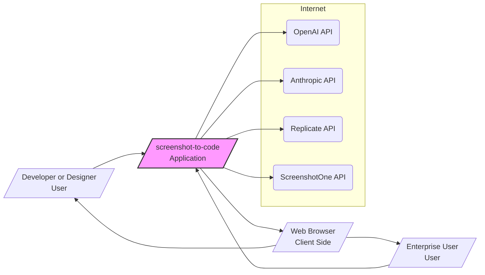

# BUSINESS POSTURE

- Business Priorities and Goals:
  - The primary goal of the screenshot-to-code project is to provide a tool that simplifies and accelerates the process of converting visual designs (screenshots, mockups, Figma designs) into functional code.
  - Key business priorities include:
    - Accuracy and quality of the generated code.
    - Support for a wide range of frontend stacks (HTML, React, Vue, etc.).
    - Integration with leading AI models (Claude, GPT).
    - Offering both open-source and hosted (paid) versions to cater to different user needs and generate revenue.
    - Providing enterprise solutions for larger organizations.
- Business Risks:
  - Reliance on the accuracy and availability of third-party AI models. Inaccuracies in code generation can lead to user dissatisfaction and rework.
  - Security risks associated with handling user-provided API keys and potentially sensitive screenshot data.
  - Competition from other AI-powered code generation tools.
  - Maintaining the open-source project and supporting the community while also developing and monetizing the hosted version.
  - Scalability and reliability of the hosted version to handle enterprise demands.

# SECURITY POSTURE

- Existing Security Controls:
  - security control: API Key Management: The application requires users to provide their own OpenAI or Anthropic API keys to access the AI models. This is documented in `README.md` and `Troubleshooting.md`. API keys are stored locally in the browser's local storage, as mentioned in `Troubleshooting.md`.
  - security control: Dockerization: Both frontend and backend are dockerized, as evidenced by `Dockerfile` and `docker-compose.yml`. This provides a consistent and isolated deployment environment.
  - security control: Input Validation (Implicit): The application processes images and text prompts, implying some level of input handling, although explicit validation mechanisms are not detailed in the provided files.
  - security control: CORS Configuration: CORS is configured in `backend/main.py` to allow requests from any origin (`allow_origins=["*"]`), which is suitable for an open application but might need to be restricted for production enterprise environments.
- Accepted Risks:
  - accepted risk: Reliance on User-Provided API Keys: The application relies on users to manage and secure their own API keys. This shifts the responsibility of API key security to the end-user.
  - accepted risk: Open CORS Policy: The permissive CORS policy (`allow_origins=["*"]`) might expose the backend API to potential cross-site scripting attacks if not carefully managed.
  - accepted risk: Limited Input Validation Transparency: The extent and rigor of input validation are not explicitly defined, which could lead to vulnerabilities if not implemented comprehensively.
- Recommended Security Controls:
  - security control: Implement robust input validation on both frontend and backend to sanitize screenshots and user inputs to prevent injection attacks and ensure data integrity. This is especially important for new routes like `/api/screenshot` which takes URL as input and `/generate-code` which handles video data.
  - security control: For the hosted version, consider implementing secure API key management, potentially using a secrets management system to avoid storing keys directly in the browser or backend code.
  - security control: Implement rate limiting and API usage monitoring to protect against abuse and potential denial-of-service attacks, especially for the hosted version and for routes like `/api/screenshot` that use external services.
  - security control: Conduct regular security vulnerability scanning and penetration testing for both frontend and backend components to identify and remediate potential weaknesses.
  - security control: Implement logging and monitoring of application activity, especially API requests and error events, to detect and respond to security incidents. Monitor usage of external services like screenshotone.com.
  - security control: For enterprise deployments, consider restricting the CORS policy to only allow requests from authorized domains.
  - security control: Implement a Content Security Policy (CSP) in the frontend to mitigate the risk of cross-site scripting (XSS) attacks.
- Security Requirements:
  - Authentication:
    - For the open-source version, authentication is not explicitly required as it's designed for local use with user-provided API keys.
    - For the hosted and enterprise versions, implement user authentication to manage access and potentially offer user-specific features and usage tracking.
  - Authorization:
    - For the hosted and enterprise versions, implement authorization controls to manage access to different features and data based on user roles or subscriptions. Consider authorization for evaluation routes (`/evals`, `/pairwise-evals`, `/best-of-n-evals`) to restrict access to sensitive evaluation data.
  - Input Validation:
    - Implement strict input validation for all user inputs, including:
      - Screenshot uploads: Validate file types, sizes, and potentially scan for malicious content.
      - API keys: Basic format validation.
      - User settings and configurations.
      - URLs for screenshot capture: Validate URL format and potentially sanitize to prevent Server-Side Request Forgery (SSRF) vulnerabilities in `/api/screenshot` route.
      - Video uploads: Validate file types, sizes, and consider security implications of processing video data in `/generate-code` route.
    - Backend API should validate all incoming requests to prevent injection attacks and ensure data integrity.
  - Cryptography:
    - API keys are currently stored in browser's local storage. While browsers offer some level of encryption for local storage, consider more robust client-side encryption for sensitive data if necessary, or move key management to a more secure backend service for hosted versions.
    - Ensure secure communication (HTTPS) is enforced for all network traffic, especially for the hosted version, to protect data in transit.

# DESIGN

## C4 CONTEXT



### C4 Context Elements Description

- Context Element List:
  - Element:
    - Name: User
    - Type: Person
    - Description: Individual developers or designers who use the screenshot-to-code tool to generate code from UI designs, evaluate different code generation outputs, and capture website screenshots.
    - Responsibilities: Provides screenshots, video inputs, or design URLs, configures settings, uses the generated code, evaluates code quality.
    - Security controls: Manages their own API keys, responsible for the security of the generated code and its integration into their projects.
  - Element:
    - Name: Enterprise User
    - Type: Person
    - Description: Users from medium to large enterprises who might use the hosted or enterprise version of screenshot-to-code, potentially with custom plans and support, requiring features like code evaluation and screenshot capture for internal websites.
    - Responsibilities: Provides screenshots, video inputs, or design URLs, may have specific security and compliance requirements, uses the generated code within enterprise projects, evaluates code quality, captures screenshots of internal applications.
    - Security controls: Subject to enterprise security policies, may require integration with enterprise authentication and authorization systems.
  - Element:
    - Name: screenshot-to-code
    - Type: Software System
    - Description: The application itself, which takes screenshots, video, or design URLs as input, uses AI models to generate code, allows for evaluation of different code outputs, captures website screenshots using external service, and provides the generated code to the user. It has frontend and backend components.
    - Responsibilities: Processing user inputs (screenshots, video, URLs), interacting with AI APIs, generating code, managing application state, serving the user interface, capturing screenshots, evaluating code outputs.
    - Security controls: Input validation, API key management (for hosted version and ScreenshotOne API), secure coding practices, protection of backend API endpoints, logging and monitoring, rate limiting, secure handling of video and screenshot data.
  - Element:
    - Name: OpenAI API
    - Type: External System
    - Description: OpenAI's API, including models like GPT-4 Vision and GPT-4o, used for code generation from images and potentially video frames.
    - Responsibilities: Provides AI-powered code generation capabilities based on image and video inputs.
    - Security controls: OpenAI's security controls, user API key management, rate limiting.
  - Element:
    - Name: Anthropic API
    - Type: External System
    - Description: Anthropic's API, including Claude models, used as an alternative AI model for code generation, especially for video inputs.
    - Responsibilities: Provides AI-powered code generation capabilities as an alternative to OpenAI, particularly for video processing.
    - Security controls: Anthropic's security controls, user API key management, rate limiting.
  - Element:
    - Name: Replicate API
    - Type: External System
    - Description: Replicate API, used to access image generation models like DALL-E 3 or Flux Schnell for generating placeholder images.
    - Responsibilities: Provides image generation capabilities for placeholder images in the generated code.
    - Security controls: Replicate's security controls, user API key management, rate limiting.
  - Element:
    - Name: ScreenshotOne API
    - Type: External System
    - Description: ScreenshotOne API, used to capture website screenshots based on provided URLs.
    - Responsibilities: Provides website screenshot capture functionality.
    - Security controls: ScreenshotOne's security controls, API key management for ScreenshotOne, rate limiting.
  - Element:
    - Name: Browser
    - Type: Software System
    - Description: User's web browser running the frontend application. Stores user settings and potentially API keys in local storage.
    - Responsibilities: Rendering the user interface, executing frontend logic, storing user data locally.
    - Security controls: Browser's built-in security features, local storage encryption (browser-dependent), Content Security Policy (CSP) implemented by the application.

## C4 CONTAINER

```mermaid
flowchart LR
    subgraph Browser[/"Web Browser"\nClient/]
        Frontend[/"Frontend"\nReact/Vite/]
    end
    subgraph Server[/"Cloud or On-Premise Server"\nServer/]
        Backend[/"Backend"\nFastAPI/]
    end
    Database[/"Settings Database"\nOptional/]

    User[/"Developer or Designer"\nUser/] --> Browser
    Enterprise_User[/"Enterprise User"\nUser/] --> Browser
    Browser --> Backend: API Calls (HTTPS)
    Backend --> OpenAI_API: API Calls (HTTPS)
    Backend --> Anthropic_API: API Calls (HTTPS)
    Backend --> Replicate_API: API Calls (HTTPS)
    Backend --> ScreenshotOne_API: API Calls (HTTPS)
    Backend --> Database: (Optional) Settings Storage

    style Frontend fill:#fcc,stroke:#333,stroke-width:2px
    style Backend fill:#bec,stroke:#333,stroke-width:2px
    style Database fill:#cbf,stroke:#333,stroke-width:2px
```

### C4 Container Elements Description

- Container Element List:
  - Element:
    - Name: Frontend
    - Type: Container - Web Application
    - Description: React/Vite based frontend application, served to the user's browser. Handles user interaction, UI rendering, and communication with the backend API for code generation, screenshot capture, and evaluation functionalities.
    - Responsibilities:
      - Presenting the user interface for code generation, screenshot capture, and evaluation.
      - Handling user input (screenshots, video, URLs, settings).
      - Making API requests to the backend for code generation, screenshot capture, and evaluation.
      - Displaying generated code and evaluation results to the user.
      - Storing user settings (and API keys in local storage).
    - Security controls:
      - Input sanitization on the client-side.
      - Implementation of Content Security Policy (CSP).
      - Secure storage of API keys in browser's local storage (consider encryption).
      - Regular updates of frontend libraries to patch vulnerabilities.
  - Element:
    - Name: Backend
    - Type: Container - API Application
    - Description: FastAPI backend application, responsible for handling API requests from the frontend, interacting with AI models for code generation, processing images and video, capturing screenshots using ScreenshotOne API, and managing code evaluations. Exposes routes for `/generate-code` (websocket), `/api/screenshot`, `/evals`, `/pairwise-evals`, `/best-of-n-evals`, and `/models`.
    - Responsibilities:
      - Exposing API endpoints for frontend communication (code generation, screenshot, evaluation).
      - Authenticating and authorizing requests (if authentication is implemented).
      - Receiving and processing screenshots, video, and user prompts.
      - Interacting with OpenAI, Anthropic, Replicate, and ScreenshotOne APIs.
      - Generating code using AI models.
      - Capturing website screenshots using ScreenshotOne API.
      - Managing code evaluations and comparisons.
      - Managing application configuration and settings (potentially storing in a database).
      - Logging and monitoring application activity.
    - Security controls:
      - Input validation and sanitization for all routes, including URL validation for screenshot capture and video processing security.
      - Secure API key management for accessing AI APIs and ScreenshotOne API.
      - Rate limiting and API usage monitoring for all routes, especially for external API calls.
      - Secure coding practices to prevent vulnerabilities.
      - Regular security vulnerability scanning and patching.
      - Secure configuration management.
  - Element:
    - Name: Database (Optional)
    - Type: Container - Data Store
    - Description: An optional database to store user settings, configurations, or potentially user data in a hosted or enterprise version. Could be a relational database or a NoSQL database. May be used to store evaluation results or user preferences for code generation.
    - Responsibilities:
      - Persistently storing user settings and application configurations.
      - Potentially storing user data in hosted/enterprise versions, including evaluation data.
    - Security controls:
      - Database access controls and authentication.
      - Data encryption at rest and in transit.
      - Regular database backups.
      - Security hardening of the database system.

## DEPLOYMENT

- Deployment Options:
  - Local Development: Developers can run the frontend and backend locally using `yarn dev` and `poetry run uvicorn`, as described in `README.md`.
  - Docker Compose: For local testing and potentially simple deployments, Docker Compose can be used to run both frontend and backend containers, as shown in `docker-compose.yml`.
  - Cloud Deployment (Recommended for Hosted Version): For a production-ready hosted version, cloud platforms like AWS, Google Cloud, or Azure are suitable. Kubernetes or similar container orchestration platforms can be used for scalability and resilience.

- Detailed Deployment Architecture (Cloud Deployment using Kubernetes on AWS - Example):

```mermaid
flowchart LR
    subgraph AWS Cloud
        subgraph Kubernetes Cluster
            Ingress_Controller[/"Ingress Controller"/]
            subgraph Pods
                Frontend_Pod[/"Frontend Pod"\n(React/Vite Container)/]
                Backend_Pod[/"Backend Pod"\n(FastAPI Container)/]
            end
            Service_Frontend[/"Frontend Service"/]
            Service_Backend[/"Backend Service"/]
        end
        Load_Balancer[/"Elastic Load Balancer"/]
        Route53[/"Route 53"/]
        Secrets_Manager[/"AWS Secrets Manager"/]
        CloudWatch[/"CloudWatch"/]
    end
    Internet --> Route53
    Route53 --> Load_Balancer
    Load_Balancer --> Ingress_Controller
    Ingress_Controller --> Service_Frontend
    Ingress_Controller --> Service_Backend
    Service_Frontend --> Frontend_Pod
    Service_Backend --> Backend_Pod
    Backend_Pod --> Secrets_Manager: API Keys Retrieval
    Backend_Pod --> CloudWatch: Logging and Monitoring

    style Ingress_Controller fill:#eee,stroke:#333
    style Frontend_Pod fill:#fcc,stroke:#333
    style Backend_Pod fill:#bec,stroke:#333
    style Service_Frontend fill:#eee,stroke:#333
    style Service_Backend fill:#eee,stroke:#333
    style Load_Balancer fill:#eee,stroke:#333
    style Route53 fill:#eee,stroke:#333
    style Secrets_Manager fill:#cbf,stroke:#333
    style CloudWatch fill:#cbf,stroke:#333
```

### Deployment Elements Description

- Deployment Element List (Cloud Deployment on AWS):
  - Element:
    - Name: Internet
    - Type: Environment
    - Description: Public internet, from where users access the application.
    - Responsibilities: Provides access to users globally.
    - Security controls: Standard internet security protocols, DDoS protection at the cloud provider level.
  - Element:
    - Name: Route 53
    - Type: AWS Service - DNS
    - Description: AWS Route 53 for DNS management, mapping domain names to the Load Balancer.
    - Responsibilities: DNS resolution, routing traffic to the Load Balancer.
    - Security controls: AWS IAM for access control, DNSSEC.
  - Element:
    - Name: Elastic Load Balancer (ELB)
    - Type: AWS Service - Load Balancer
    - Description: AWS ELB to distribute incoming traffic across Kubernetes Ingress Controllers.
    - Responsibilities: Load balancing, SSL termination, traffic distribution.
    - Security controls: AWS security groups, SSL/TLS encryption, DDoS protection.
  - Element:
    - Name: Kubernetes Cluster
    - Type: Environment - Container Orchestration
    - Description: Kubernetes cluster to orchestrate and manage frontend and backend containers.
    - Responsibilities: Container orchestration, scaling, health management, deployment management.
    - Security controls: Kubernetes RBAC, network policies, pod security policies, regular security audits.
  - Element:
    - Name: Ingress Controller
    - Type: Kubernetes Component
    - Description: Ingress controller to manage external access to the Kubernetes services.
    - Responsibilities: Routing external requests to the appropriate services within the cluster, SSL termination.
    - Security controls: Ingress controller security configurations, rate limiting, WAF integration.
  - Element:
    - Name: Frontend Pod
    - Type: Kubernetes Pod
    - Description: Pod running the Frontend (React/Vite) container.
    - Responsibilities: Serving the frontend application.
    - Security controls: Container image security scanning, resource limits, network policies.
  - Element:
    - Name: Backend Pod
    - Type: Kubernetes Pod
    - Description: Pod running the Backend (FastAPI) container.
    - Responsibilities: Handling API requests for code generation, screenshot capture, and evaluation, interacting with AI APIs and ScreenshotOne API.
    - Security controls: Container image security scanning, resource limits, network policies, secure API key management (using Secrets Manager) for AI APIs and ScreenshotOne API.
  - Element:
    - Name: Frontend Service
    - Type: Kubernetes Service
    - Description: Kubernetes service to expose the Frontend Pods within the cluster.
    - Responsibilities: Internal load balancing for frontend pods.
    - Security controls: Network policies to restrict access.
  - Element:
    - Name: Backend Service
    - Type: Kubernetes Service
    - Description: Kubernetes service to expose the Backend Pods within the cluster.
    - Responsibilities: Internal load balancing for backend pods.
    - Security controls: Network policies to restrict access.
  - Element:
    - Name: AWS Secrets Manager
    - Type: AWS Service - Secrets Management
    - Description: AWS Secrets Manager to securely store and manage API keys for OpenAI, Anthropic, Replicate, and ScreenshotOne.
    - Responsibilities: Secure storage and retrieval of sensitive API keys.
    - Security controls: Encryption at rest and in transit, access control via IAM, audit logging.
  - Element:
    - Name: CloudWatch
    - Type: AWS Service - Monitoring and Logging
    - Description: AWS CloudWatch for logging and monitoring application and infrastructure metrics, including API usage and potential security events.
    - Responsibilities: Centralized logging, performance monitoring, security monitoring, alerting.
    - Security controls: Access control via IAM, data encryption, audit logging.

## BUILD

- Build Process:
  - The project uses a standard CI/CD pipeline for building and publishing the application. Based on the files, it's likely using GitHub Actions, although it's not explicitly configured in the provided files.
  - The build process involves building both the frontend and backend components and then creating Docker images for deployment.

- Build Diagram (Example using GitHub Actions):

```mermaid
flowchart LR
    Developer[/"Developer"\n(Code Changes)/] --> GitHub[/"GitHub Repository"\n(Source Code)/]
    subgraph GitHub_Actions[/"GitHub Actions"\nCI/CD Pipeline/]
        Build_Frontend[/"Build Frontend"\n(yarn build)/]
        Build_Backend[/"Build Backend"\n(poetry build)/]
        Test_Code[/"Test Code"\n(pytest, pyright)/]
        Security_Scan[/"Security Scan"\n(SAST, Dependency Check)/]
        Build_Docker_Images[/"Build Docker Images"\n(docker build)/]
        Publish_Images[/"Publish Docker Images"\n(Docker Hub/ECR)/]
    end
    GitHub --> GitHub_Actions: Push Code
    GitHub_Actions --> Build_Frontend
    Build_Frontend --> Build_Backend
    Build_Backend --> Test_Code
    Test_Code --> Security_Scan
    Security_Scan --> Build_Docker_Images
    Build_Docker_Images --> Publish_Images
    Publish_Images --> Deployment_Environment[/"Deployment Environment"\n(Kubernetes, etc.)/]

    style Build_Frontend fill:#fcc,stroke:#333
    style Build_Backend fill:#bec,stroke:#333
    style Test_Code fill:#cce,stroke:#333
    style Security_Scan fill:#cce,stroke:#333
    style Build_Docker_Images fill:#eee,stroke:#333
    style Publish_Images fill:#eee,stroke:#333
```

### Build Elements Description

- Build Element List (GitHub Actions CI/CD):
  - Element:
    - Name: Developer
    - Type: Person
    - Description: Software developers who write and commit code changes.
    - Responsibilities: Writing code, committing changes, initiating the build process through code pushes.
    - Security controls: Secure development practices, code review, access control to the repository.
  - Element:
    - Name: GitHub Repository
    - Type: Code Repository
    - Description: GitHub repository hosting the source code for the screenshot-to-code project.
    - Responsibilities: Version control, source code management, triggering CI/CD pipelines.
    - Security controls: Access control (branch protection, permissions), audit logging, vulnerability scanning (GitHub Advanced Security).
  - Element:
    - Name: GitHub Actions
    - Type: CI/CD Pipeline
    - Description: GitHub Actions workflow to automate the build, test, security scan, and deployment process.
    - Responsibilities: Automated build process, testing, security checks, Docker image creation and publishing.
    - Security controls: Secure workflow definitions, secret management (GitHub Actions secrets), isolation of build environments.
  - Element:
    - Name: Build Frontend
    - Type: Build Step
    - Description: Step in the CI/CD pipeline to build the React/Vite frontend application using `yarn build`.
    - Responsibilities: Compiling frontend code, optimizing assets.
    - Security controls: Dependency scanning, build process isolation.
  - Element:
    - Name: Build Backend
    - Type: Build Step
    - Description: Step in the CI/CD pipeline to build the FastAPI backend application using `poetry build`.
    - Responsibilities: Packaging backend code and dependencies.
    - Security controls: Dependency scanning, build process isolation.
  - Element:
    - Name: Test Code
    - Type: Build Step - Security Check
    - Description: Step to run automated tests (pytest) and static code analysis (pyright) to ensure code quality and catch potential bugs.
    - Responsibilities: Code quality assurance, bug detection.
    - Security controls: Unit tests, integration tests, static analysis tools.
  - Element:
    - Name: Security Scan
    - Type: Build Step - Security Check
    - Description: Step to perform security scans, including SAST (Static Application Security Testing) and dependency vulnerability checks, to identify potential security flaws.
    - Responsibilities: Identifying security vulnerabilities in code and dependencies.
    - Security controls: SAST tools, dependency scanning tools (e.g., Snyk, OWASP Dependency-Check).
  - Element:
    - Name: Build Docker Images
    - Type: Build Step
    - Description: Step to build Docker images for both frontend and backend applications using `docker build` based on `Dockerfile`s.
    - Responsibilities: Creating container images for deployment.
    - Security controls: Base image security scanning, Dockerfile best practices, image signing.
  - Element:
    - Name: Publish Docker Images
    - Type: Build Step
    - Description: Step to publish the built Docker images to a container registry (e.g., Docker Hub, AWS ECR).
    - Responsibilities: Storing and distributing Docker images.
    - Security controls: Access control to the registry, image scanning in the registry, image signing and verification.
  - Element:
    - Name: Deployment Environment
    - Type: Environment
    - Description: Target deployment environment (e.g., Kubernetes cluster, cloud platform) where the Docker images are deployed and run.
    - Responsibilities: Running the application in production.
    - Security controls: Environment-specific security controls (as described in Deployment section).

# RISK ASSESSMENT

- Critical Business Processes:
  - The core critical business process is the AI-powered code generation service itself. Any disruption or compromise to this process directly impacts the value proposition of the application.
  - User data processing, including handling screenshots, video, and API keys, is also a critical process that needs to be protected to maintain user trust and comply with potential privacy regulations.
  - Website screenshot capture service is also a critical business process, especially for enterprise users who might need to capture screenshots of internal applications.
  - Code evaluation functionality is important for improving the quality of code generation and for users to compare different outputs.
- Data to Protect and Sensitivity:
  - API Keys: These are highly sensitive as they grant access to powerful AI models and the ScreenshotOne API. Compromise of API keys could lead to unauthorized usage, billing fraud, or data breaches if the AI models or screenshot service are misused.
  - Screenshots and Video Data: User-uploaded screenshots and videos can contain sensitive information depending on the context of the UI being converted. The sensitivity level is medium to high, depending on the user and the content.
  - Generated Code: While the generated code itself is less sensitive, it is the output of the service and its integrity is important for the functionality of the tool. Low sensitivity.
  - User Settings: User preferences and configurations are less sensitive but contribute to user experience and customization. Low sensitivity.
  - Evaluation Data: Data generated during code evaluations, including input images and generated code outputs, might contain sensitive information depending on the context. Medium sensitivity.

# QUESTIONS & ASSUMPTIONS

- BUSINESS POSTURE:
  - Assumption: The primary business model for screenshot-to-code is a combination of open-source availability and a paid hosted version with potentially enterprise-level offerings.
  - Question: What are the specific features and pricing tiers for the hosted version and enterprise plans?
  - Question: What are the key performance indicators (KPIs) for business success (e.g., user adoption, code generation accuracy, customer satisfaction, revenue)?
- SECURITY POSTURE:
  - Assumption: Security is a significant concern, especially for the hosted and enterprise versions, but the project is currently in the early stages of implementing comprehensive security controls.
  - Question: What is the roadmap for implementing the recommended security controls, especially regarding API key management and input validation for new features like video processing and screenshot capture?
  - Question: Are there any specific compliance requirements (e.g., SOC 2, GDPR, HIPAA) that the hosted or enterprise versions need to adhere to?
  - Question: How is the API key for ScreenshotOne service managed and secured? Is it user-provided or managed by the application?
  - Question: Are the evaluation routes (`/evals`, `/pairwise-evals`, `/best-of-n-evals`) intended to be exposed in the hosted version, and if so, what security measures are in place to protect evaluation data?
- DESIGN:
  - Assumption: The application follows a standard two-tier web architecture with a React frontend and a FastAPI backend.
  - Question: How will user sessions and states be managed in the hosted version, especially for features requiring user accounts or persistent settings?
  - Question: Is there a plan to integrate with other services or platforms in the future (e.g., Figma API, design collaboration tools, code repositories)?
  - Assumption: The deployment environment for the hosted version will be a scalable and resilient cloud infrastructure like Kubernetes on AWS.
  - Question: What is the disaster recovery and business continuity plan for the hosted version to ensure service availability and data protection in case of failures?
  - Question: How is video data processed and stored temporarily during code generation? Are there any security considerations for temporary video file handling?
