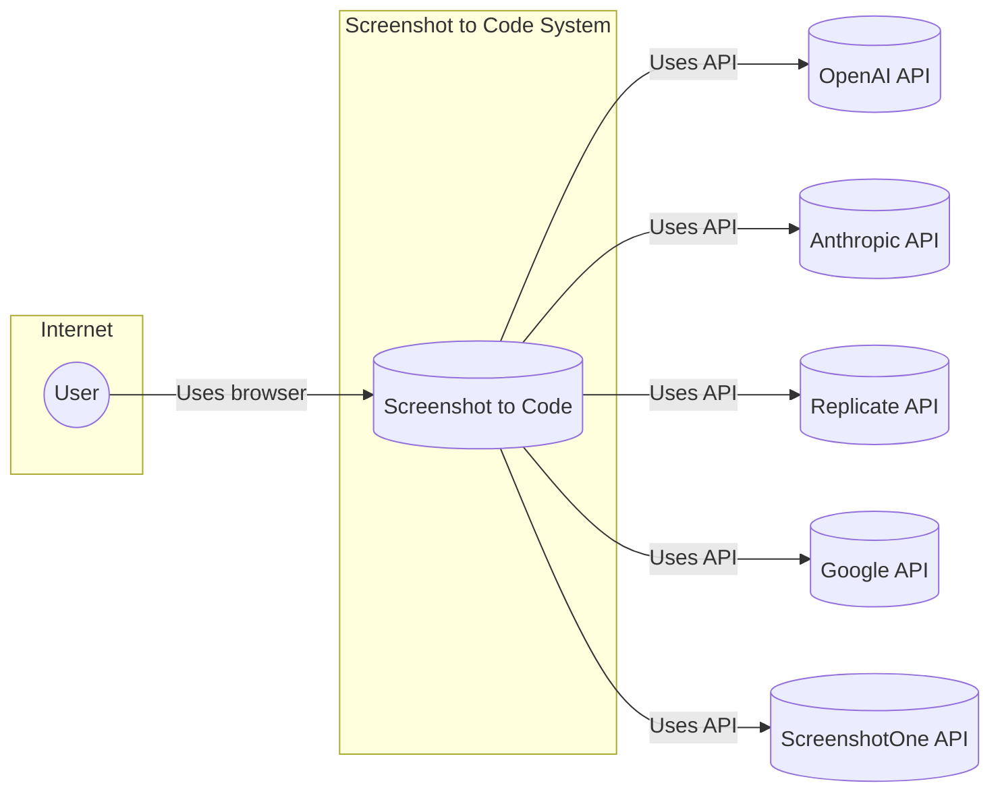
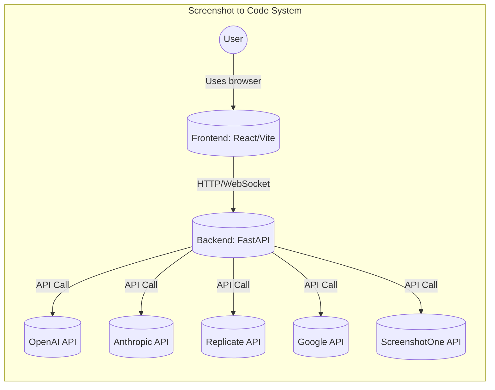
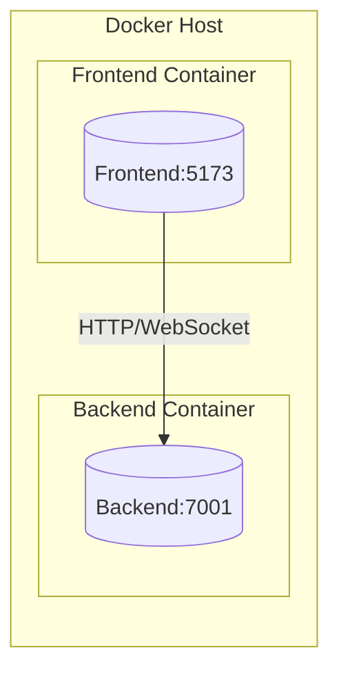
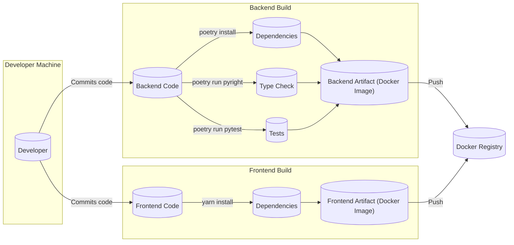

# DESIGN DOCUMENT

## BUSINESS POSTURE

**Business Priorities and Goals:**

The project, "screenshot-to-code," aims to create a tool that converts screenshots, mockups, and Figma designs into clean, functional code. The primary goals are:

*   Provide a quick and easy way for users to prototype and build user interfaces.
*   Support multiple frontend frameworks and styling libraries (HTML + Tailwind, React + Tailwind, Vue + Tailwind, Bootstrap, Ionic + Tailwind, SVG).
*   Leverage state-of-the-art AI models (GPT-4o, Claude 3 Sonnet) for code generation.
*   Offer both a hosted (paid) version and an open-source version.
*   Potentially cater to enterprise clients with custom plans.

**Business Risks:**

*   **Accuracy and Reliability of AI Models:** The core functionality relies on the accuracy of AI models. Inconsistent or incorrect code generation could lead to user frustration and limit adoption.
*   **Performance and Scalability:** The tool needs to handle a potentially large number of requests, especially for the hosted version. Performance bottlenecks could impact user experience.
*   **Dependency on Third-Party APIs:** The project relies on external APIs (OpenAI, Anthropic, Replicate, ScreenshotOne). Changes to these APIs, pricing, or availability could disrupt the service.
*   **Competition:** Other similar tools exist, so differentiation and continuous improvement are crucial.
*   **Security of API Keys:** Users need to provide their API keys. Secure handling and storage of these keys are essential.
*   **Supply Chain Security:** Project is using multiple third party libraries, that might introduce security risks.

## SECURITY POSTURE

**Existing Security Controls:**

*   **security control: API Key Management (Frontend):** The frontend provides a settings dialog where users can input their OpenAI and Anthropic API keys. These keys are stored in the browser's local storage. (Described in `README.md`)
*   **security control: API Key Management (Backend):** The backend uses environment variables (`.env` file) to store API keys. (Described in `README.md`)
*   **security control: Docker Support:** The project provides Docker support for containerization, which can improve security by isolating the application and its dependencies. (Described in `README.md`, `Dockerfile`, `docker-compose.yml`)
*   **security control: CORS Middleware:** The backend uses FastAPI's CORS middleware to allow requests from any origin. (Defined in `backend/main.py`)
*   **security control: Dependency Management:** The backend uses Poetry for dependency management, which helps ensure that the project uses specific, known versions of libraries. (Defined in `backend/pyproject.toml`)
*   **security control: Type Checking:** The backend includes type checking using `pyright`. (Described in `backend/README.md`)
*   **security control: Input Validation (Partial):** Some input validation exists for the `generatedCodeConfig` and `inputMode` parameters in the `/generate-code` route. (`backend/routes/generate_code.py`)
*   **security control: Exception Handling:** The `/generate-code` route includes error handling for various OpenAI API exceptions (AuthenticationError, NotFoundError, RateLimitError) and provides user-friendly error messages. (`backend/routes/generate_code.py`)
*   **security control: Screenshot API:** The backend uses the ScreenshotOne API for capturing screenshots from URLs, which includes options for blocking ads, cookie banners, and trackers. (`backend/routes/screenshot.py`)

**Accepted Risks:**

*   **accepted risk: Client-Side Storage of API Keys:** Storing API keys in the browser's local storage is convenient but has inherent security risks. A compromised client machine could expose these keys.
*   **accepted risk: Broad CORS Configuration:** Allowing requests from any origin (`allow_origins=["*"]`) simplifies development but can be a security risk in production if not properly managed.
*   **accepted risk: Limited Input Validation:** While some input validation exists, it's not comprehensive. There's a need for more robust validation of image data, URLs, and other user inputs.
*   **accepted risk: No Authentication/Authorization:** No authentication or authorization was mentioned.

**Recommended Security Controls:**

*   **security control: API Key Management (Backend):** Consider using a more secure method for storing API keys in the backend, such as a dedicated secrets management service (e.g., AWS Secrets Manager, HashiCorp Vault).
*   **security control: Input Validation:** Implement robust input validation on both the frontend and backend to prevent common vulnerabilities like cross-site scripting (XSS) and code injection. Validate image sizes, formats, content, URLs, and all other user-provided data.
*   **security control: Rate Limiting:** Implement rate limiting on the backend to prevent abuse and denial-of-service attacks. This should apply to all API endpoints, including `/generate-code`, `/screenshot`, and `/evals`.
*   **security control: CORS Configuration:** Tighten the CORS configuration to only allow requests from trusted origins in production.
*   **security control: Content Security Policy (CSP):** Implement a CSP to mitigate the risk of XSS attacks.
*   **security control: Dependency Scanning:** Regularly scan dependencies for known vulnerabilities using tools like Dependabot, Snyk, or OWASP Dependency-Check.
*   **security control: SAST Scanning:** Integrate static application security testing (SAST) tools into the build process to identify potential security issues in the code.
*   **security control: Authentication and Authorization:** Implement authentication and authorization mechanisms, especially for the hosted version, to control access to the service and protect user data.
*   **security control: DAST Scanning:** Integrate dynamic application security testing (DAST) tools into the deployment pipeline to identify potential runtime vulnerabilities.

**Security Requirements:**

*   **Authentication:**
    *   The hosted version should require user authentication.
    *   Consider offering multiple authentication options (e.g., email/password, social login).
*   **Authorization:**
    *   Implement role-based access control (RBAC) if different user roles have different permissions.
    *   Ensure that users can only access their own data and resources.
*   **Input Validation:**
    *   Validate all user inputs, including image URLs, uploaded images, text inputs, and API keys.
    *   Sanitize user inputs to prevent XSS and other injection attacks.
    *   Enforce maximum file sizes for uploads.
    *   Validate URL parameters in API endpoints (e.g., folder paths in `/evals`).
*   **Cryptography:**
    *   Use secure, industry-standard cryptographic algorithms for storing sensitive data (e.g., API keys, user passwords).
    *   Use HTTPS for all communication between the frontend and backend.
*   **API Key Protection:**
    *   Never expose API keys in client-side code.
    *   Store API keys securely in the backend, using environment variables or a dedicated secrets management service.
    *   Consider implementing API key rotation.
    *   If storing API keys in the database, encrypt them at rest.
*   **Video Processing Security:**
    *   Validate the number of frames extracted from videos to prevent excessive resource consumption. (`backend/video/utils.py`)

## DESIGN

### C4 CONTEXT

**Elements Description:**

*   **User:**
    *   Name: User
    *   Type: Person
    *   Description: A person who uses the Screenshot to Code application.
    *   Responsibilities: Provides screenshots/mockups/Figma designs/URLs, interacts with the application, and receives generated code.
    *   Security controls: None (External entity).

*   **Screenshot to Code:**
    *   Name: Screenshot to Code
    *   Type: Software System
    *   Description: The main application that converts screenshots to code.
    *   Responsibilities: Handles user input, interacts with AI models, generates code, manages the user interface, and provides evaluation functionalities.
    *   Security controls: API Key Management, CORS Middleware, Docker Support, Dependency Management, Type Checking, Partial Input Validation, Exception Handling, Screenshot API.

*   **OpenAI API:**
    *   Name: OpenAI API
    *   Type: External System
    *   Description: Provides access to OpenAI's models, including GPT-4 Vision and GPT-4o.
    *   Responsibilities: Processes image and text inputs, generates code.
    *   Security controls: Relies on OpenAI's security measures.

*   **Anthropic API:**
    *   Name: Anthropic API
    *   Type: External System
    *   Description: Provides access to Anthropic's Claude models.
    *   Responsibilities: Processes image and text inputs, generates code, processes video inputs.
    *   Security controls: Relies on Anthropic's security measures.

*   **Replicate API:**
    *   Name: Replicate API
    *   Type: External System
    *   Description: Provides access to image generation models (optional).
    *   Responsibilities: Generates images based on text descriptions.
    *   Security controls: Relies on Replicate's security measures.

*   **Google API:**
    *   Name: Google API
    *   Type: External System
    *   Description: Provides access to Google's Gemini models.
    *   Responsibilities: Processes image and text inputs, generates code.
    *   Security controls: Relies on Google security measures.

*   **ScreenshotOne API:**
    *   Name: ScreenshotOne API
    *   Type: External System
    *   Description: Provides screenshot capturing functionality.
    *   Responsibilities: Captures screenshots of web pages based on provided URLs.
    *   Security controls: Relies on ScreenshotOne's security measures.

### C4 CONTAINER

**Elements Description:**

*   **Frontend:**
    *   Name: Frontend
    *   Type: Web Application (React/Vite)
    *   Description: The user interface of the application, built with React and Vite.
    *   Responsibilities: Handles user interactions, displays images and code, manages application state, communicates with the backend.
    *   Security controls: API Key Management (stores API keys in browser local storage).

*   **Backend:**
    *   Name: Backend
    *   Type: Web Application (FastAPI)
    *   Description: The server-side logic of the application, built with FastAPI.
    *   Responsibilities: Receives requests from the frontend, interacts with AI models, generates code, manages API keys, handles screenshot requests, and provides evaluation functionalities.
    *   Security controls: API Key Management (uses environment variables), CORS Middleware, Dependency Management, Type Checking, Partial Input Validation, Exception Handling, Screenshot API.

*   **OpenAI API:**
    *   Name: OpenAI API
    *   Type: External System
    *   Description: Provides access to OpenAI's models, including GPT-4 Vision and GPT-4o.
    *   Responsibilities: Processes image and text inputs, generates code.
    *   Security controls: Relies on OpenAI's security measures.

*   **Anthropic API:**
    *   Name: Anthropic API
    *   Type: External System
    *   Description: Provides access to Anthropic's Claude models.
    *   Responsibilities: Processes image and text inputs, generates code, processes video inputs.
    *   Security controls: Relies on Anthropic's security measures.

*   **Replicate API:**
    *   Name: Replicate API
    *   Type: External System
    *   Description: Provides access to image generation models (optional).
    *   Responsibilities: Generates images based on text descriptions.
    *   Security controls: Relies on Replicate's security measures.

*   **Google API:**
    *   Name: Google API
    *   Type: External System
    *   Description: Provides access to Google's Gemini models.
    *   Responsibilities: Processes image and text inputs, generates code.
    *   Security controls: Relies on Google security measures.

*   **ScreenshotOne API:**
    *   Name: ScreenshotOne API
    *   Type: External System
    *   Description: Provides screenshot capturing functionality.
    *   Responsibilities: Captures screenshots of web pages based on provided URLs.
    *   Security controls: Relies on ScreenshotOne's security measures.

### DEPLOYMENT

Possible deployment solutions:

1.  **Docker Compose:** Use the provided `docker-compose.yml` file to deploy the frontend and backend containers. This is suitable for development and small-scale deployments.
2.  **Cloud Platforms (AWS, Google Cloud, Azure):** Deploy the containers to a cloud platform using services like AWS ECS, Google Kubernetes Engine (GKE), or Azure Kubernetes Service (AKS). This provides scalability and high availability.
3.  **Serverless Functions:** Deploy the backend as serverless functions (e.g., AWS Lambda, Google Cloud Functions) to reduce operational overhead.

**Chosen Deployment Solution (Docker Compose - for simplicity):**

**Elements Description:**

*   **Docker Host:**
    *   Name: Docker Host
    *   Type: Server
    *   Description: The machine where Docker is installed and running.
    *   Responsibilities: Hosts the Docker containers.
    *   Security controls: Operating system security, network security.

*   **Frontend Container:**
    *   Name: Frontend Container
    *   Type: Docker Container
    *   Description: Contains the frontend application.
    *   Responsibilities: Serves the frontend application on port 5173.
    *   Security controls: Limited by the container's isolation.

*   **Backend Container:**
    *   Name: Backend Container
    *   Type: Docker Container
    *   Description: Contains the backend application.
    *   Responsibilities: Serves the backend API on port 7001.
    *   Security controls: Limited by the container's isolation.

### BUILD

The project uses a combination of Poetry (backend) and Yarn (frontend) for dependency management and build processes.

**Build Process Description:**

1.  **Backend:**
    *   Developer commits code changes.
    *   `poetry install` installs backend dependencies.
    *   `poetry run pyright` performs type checking.
    *   `poetry run pytest` runs unit tests.
    *   A Docker image is built using the `backend/Dockerfile`.
2.  **Frontend:**
    *   Developer commits code changes.
    *   `yarn install` installs frontend dependencies.
    *   A Docker image is built using the `frontend/Dockerfile`.
3.  **Docker Registry:**
    *   The built Docker images are pushed to a Docker registry (e.g., Docker Hub, AWS ECR).

**Security Controls:**

*   **security control: Dependency Management:** Poetry and Yarn ensure consistent and reproducible builds.
*   **security control: Type Checking:** `pyright` helps catch type errors early in the development process.
*   **security control: Unit Tests:** `pytest` helps ensure code quality and prevent regressions.
*   **security control: Docker Images:** Building Docker images provides a consistent and isolated environment for the application.

## RISK ASSESSMENT

**Critical Business Process:**

The critical business process is the conversion of screenshots/designs/URLs into functional code. This process must be accurate, reliable, and performant to meet user expectations and achieve the project's goals.

**Data Sensitivity:**

*   **User-provided screenshots/designs/URLs:** These may contain sensitive information, depending on the user's context. Sensitivity: Potentially High.
*   **Generated code:** This code is based on user inputs and may reflect the sensitivity of the input data. Sensitivity: Potentially High.
*   **API keys (OpenAI, Anthropic, Replicate, ScreenshotOne):** These keys provide access to paid services and should be treated as highly sensitive. Sensitivity: High.
*   **User data (for hosted version):** If the hosted version collects user data (e.g., email addresses, usage data), this data needs to be protected. Sensitivity: Medium to High.

## QUESTIONS & ASSUMPTIONS

**Questions:**

*   What is the expected volume of requests for the hosted version? This will impact scalability requirements.
*   What are the specific security requirements for enterprise clients? This may require additional security controls.
*   What level of accuracy is acceptable for the AI-generated code? This will help define quality metrics.
*   How will user feedback be collected and incorporated into the development process?
*   What is the long-term maintenance plan for the project?
*   What is the plan for handling potential API outages or rate limits from third-party providers?
*   What is the process for handling user-reported security vulnerabilities?
*   Are there any plans to support additional input formats (e.g., URLs of live websites)? This is now supported via the ScreenshotOne API.
*   Are there any plans to support additional output formats (e.g., other programming languages or frameworks)?
*   What is the strategy for managing and rotating API keys?

**Assumptions:**

*   Users are responsible for the security of their own API keys (although the system should encourage best practices).
*   The open-source version will be primarily used for development and testing.
*   The hosted version will be the primary revenue source.
*   The AI models used will continue to improve in accuracy and performance.
*   The project will be actively maintained and updated.
*   The Docker setup is sufficient for initial deployment and testing.
*   Users have a basic understanding of how to use command-line tools (for the open-source version).
*   The project will adhere to best practices for secure coding and data handling.
*   The initial target audience is developers and designers familiar with web technologies.
