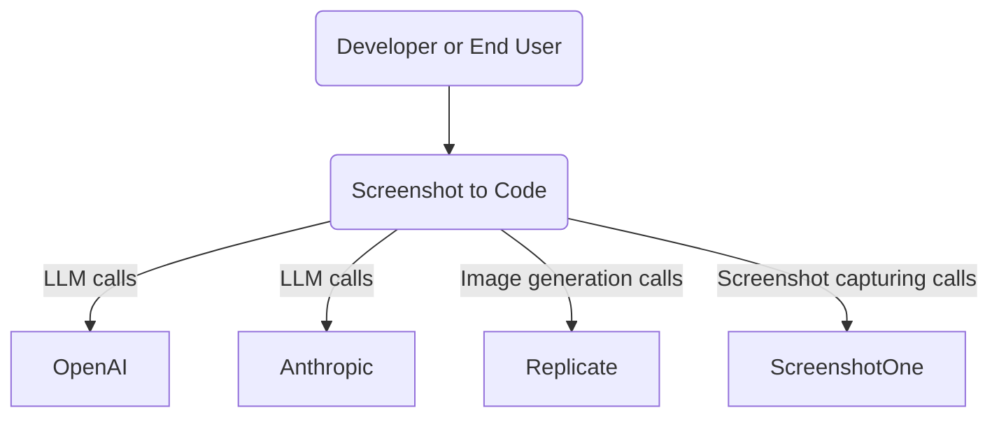
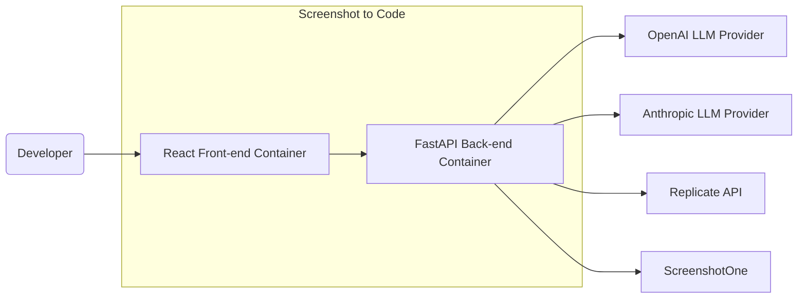
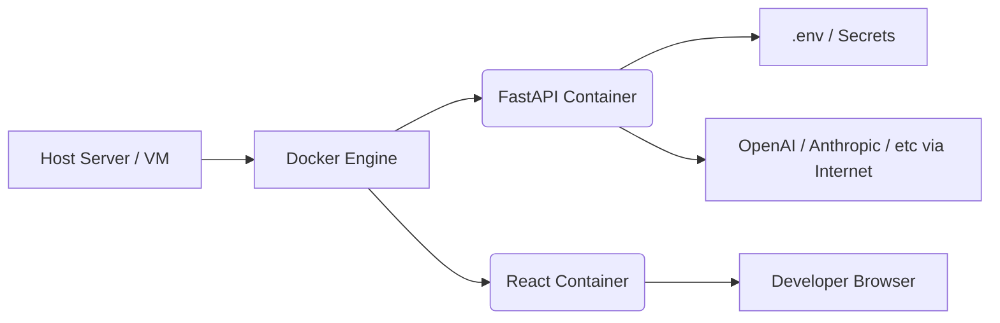
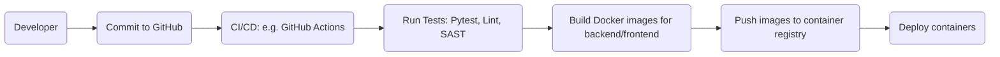

# BUSINESS POSTURE

The "screenshot-to-code" project is an open source tool designed to convert screenshots, mockups, or recorded screen interactions into code through the use of Large Language Model (LLM) APIs. The major business priorities and goals include:

1. Enable fast prototyping of UI elements by automatically generating clean front-end code.
2. Integrate with multiple AI models or image generation services to provide flexibility.
3. Offer both a self-hosted (open source) and a paid/hosted enterprise solution to cater to a wide range of users, from small teams to large enterprises.

From a business perspective, the main benefits are:
- Reduced time to transform design assets into working code.
- Lower overhead for front-end coding of basic or repeated UI patterns.
- Potential to scale and monetize the tool in an enterprise context.

Most important business risks to address:
- Potential unauthorized access or misuse of API keys for LLMs, resulting in unexpected costs or data exposure.
- Reputational risks if the AI-generated code fails to meet certain quality or security expectations.
- Handling of proprietary screenshots or designs that might contain sensitive or IP-protected content.

# SECURITY POSTURE

## Existing Security Controls

security control: Environment variable usage for secrets. The project stores secrets (OPENAI_API_KEY, ANTHROPIC_API_KEY, etc.) in environment variables rather than in code, reducing direct code exposure of secrets.

security control: Dockerized deployment. Docker configuration isolates the application environment, making it simpler to deploy consistently and reducing some classes of misconfiguration.

security control: Minimal data persistence. The project does not persist user-generated screenshots or data at rest by default. Images and code are typically processed in memory or ephemeral containers.

security control: Log-based debugging. The code includes optional debugging functionalities, which can be enabled via environment variables. This centralizes logs and can help in auditing.

## Accepted Risks

accepted risk: Developer-supplied environment variables might be inadvertently exposed if the container or environment is not well-protected. The project currently instructs users to manage these secrets through .env files or environment variables without a robust key management system.

accepted risk: Code snippets or screenshots used for generation are handled in memory and can be stored in logs for debug or auditing. If logs are not suitably protected, sensitive design data could be exposed.

## Recommended Security Controls

- Centralized secret management. Use a secure vault or cloud-managed secret store to handle LLM API keys, rather than relying on .env files.
- Role-based authentication for enterprise usage. Introduce optional user login with role separation, so only authorized individuals can trigger code generation.
- Transport security. Enforce TLS/HTTPS by default on both front-end and back-end to prevent data tampering and eavesdropping.
- Limit inbound connections to the back-end server behind a reverse proxy or WAF, with firewall rules to minimize the attack surface.
- Implement scanning of logs for sensitive data or consider implementing log sanitization to avoid storing confidential or personal data from screenshots.

## Security Requirements

The following high-priority requirements for robust security should be considered:

1. Authentication
   - Provide a mechanism for user authentication and, optionally, Single Sign-On or LDAP integration for enterprise deployments.
2. Authorization
   - If multi-user usage is desired, define user roles (e.g., Admin, Developer) that control who can initiate code generation or see logs.
3. Input Validation
   - Validate incoming requests and ensure user-provided URLs or screenshot data cannot be used for SSRF or injection attacks.
4. Cryptography
   - Encrypt traffic between front-end and back-end (TLS).
   - Ensure safe storage of secrets in an encrypted form or inside a secrets manager.

Where each existing control is implemented or described:
- Environment variable usage is documented in the README and in the Dockerfiles.
- Docker-based deployments are described in docker-compose.yml and the Dockerfiles.
- The code’s ephemeral data handling is not extensively documented but is implied in the code for image processing (in-memory transformations).

# DESIGN

## C4 CONTEXT

### Context Diagram Elements

| Name             | Type              | Description                                                                                   | Responsibilities                                                                                                 | Security controls                                                                                                                                 |
|------------------|-------------------|-----------------------------------------------------------------------------------------------|------------------------------------------------------------------------------------------------------------------|----------------------------------------------------------------------------------------------------------------------------------------------------|
| Developer (User) | External Person   | Person uploading screenshots or requesting conversions                                       | Provides input images/screenshots, configures LLM references (API keys), reviews generated code                   | Typically relies on environment security. No direct authentication in open source version.                                                         |
| Screenshot to Code | Internal System | Main system that processes user inputs and delegates tasks to LLM or image generation services | Receives images or video from front-end, calls external LLMs, and returns code to the user                        | security control: usage of environment variables for secrets, ephemeral memory usage, optional logs.                                              |
| OpenAI           | External System   | GPT-4 or GPT-4-Vision LLM provider                                                            | Provides AI services to transform screenshots or textual input into code                                         | Requires openai_api_key. Unexpected usage or misuse can lead to cost or data exfiltration.                                                         |
| Anthropic        | External System   | Claude-based LLM provider                                                                     | Alternative or additional LLM for code generation                                                                 | Requires anthropic_api_key. Similar cost and usage concerns.                                                                                       |
| Replicate        | External System   | Image generation service (e.g. Flux Schnell)                                                 | Used to generate or manipulate images if needed                                                                   | Requires replicate_api_key. Same cost or usage concerns.                                                                                           |
| ScreenshotOne    | External System   | API for capturing screenshots of web pages                                                   | Lets users fetch site captures for code generation                                                                | Also uses an API key. Risk of SSRF or spamming if not controlled.                                                                                  |

## C4 CONTAINER

Below is a high-level view of the main containers and how responsibilities are distributed:

### Container Diagram Elements

| Name                         | Type         | Description                                                                     | Responsibilities                                                                                                                     | Security controls                                                                             |
|------------------------------|-------------|---------------------------------------------------------------------------------|--------------------------------------------------------------------------------------------------------------------------------------|------------------------------------------------------------------------------------------------|
| React Front-end Container    | UI Container | A Vite-based or React-based user interface container                            | Renders the UI for screenshot uploads, config input, and displays generated code. Communicates with the back-end over HTTP/WebSocket. | security control: potential for client-side sanitization, environment-based routing, warnings about storing keys in the browser.     |
| FastAPI Back-end Container   | API Container | Python with FastAPI, orchestrates LLM calls and image processing                | Receives user inputs, handles code generation logic, communicates with LLM/builder services, and returns stream responses.           | security control: environment variables for secrets, ephemeral memory usage, potential HTTPS termination, optional logging.          |
| OpenAI LLM Provider          | External API | GPT-4 or GPT-4-Vision endpoint used to parse images or textual instructions     | Receives calls from the back-end about generating code from the screenshot context.                                                 | security control: secret key in .env, possibility to limit usage or set budget constraints.                                         |
| Anthropic LLM Provider       | External API | Claude endpoints used for alternate code generation or better context handling  | Similar role to OpenAI but using Claude.                                                                                             | security control: secret key in .env, possibility to limit usage or set budget constraints.                                         |
| Replicate API                | External API | Optional image generation or manipulation                                                                             | Provides advanced image transformations or mockups.                                                                                  | security control: secret key in .env, usage restrictions.                                                                            |
| ScreenshotOne                | External API | Allows capturing screenshots from a URL                                                                               | Accepts user-provided URLs to produce screenshots.                                                                                   | security control: secret key, risk of SSRF if malicious URLs are provided.                                                          |

## DEPLOYMENT

The project can be deployed in multiple ways, such as:
- Deploying via Docker Compose on a single host.
- Deploying each container (front-end and back-end) in a Kubernetes cluster.
- Separately deploying front-end as a static site (on Netlify, for example) and back-end on a cloud service.

One common solution is Docker Compose on a single host:

### Deployment Diagram Elements

| Name                 | Type           | Description                                                                          | Responsibilities                                                                                                                        | Security controls                                                                                              |
|----------------------|---------------|--------------------------------------------------------------------------------------|-----------------------------------------------------------------------------------------------------------------------------------------|-----------------------------------------------------------------------------------------------------------------|
| Host Server / VM     | Infrastructure | Physical or virtual machine hosting Docker                                           | Provides OS-level environment for Docker containers                                                                                    | Should implement OS hardening, patch management, firewall configurations                                        |
| Docker Engine        | Container Runtime | Manages and runs containers for front-end and back-end                              | Handles container orchestration, networking, and resource isolation                                                                     | security control: Docker isolation, Docker network segmentation                                                 |
| FastAPI Container    | Container      | Python-based back-end environment, runs uvicorn                                     | Serves API routes, coordinates code generation with external LLMs, ephemeral memory usage                                              | security control: environment variables for secrets, possible IAM integration, TLS termination if configured    |
| React Container      | Container      | Front-end environment using Node / Yarn for building and serving the React app       | Renders the user interface, can also be deployed as a static build on an external CDN if needed                                        | security control: minimal user data, no secrets stored in front-end container by default, possible CSP headers  |
| .env / Secrets       | Secret Storage  | Environment variables stored in container or in a manager like Docker secrets         | Contains keys for LLM/service provider, other configuration secrets                                                                     | accepted risk: potential exfiltration if logs or container environment is compromised                           |
| External LLM         | External Services | Any of the integrated LLM or image generation endpoints (OpenAI, Anthropic, Replicate) | Provide code transformation, completions, or image generation analysis                                                                 | security control: rate limiting, usage monitoring, API bounding                                                |
| Developer Browser    | Client         | End-user's client runtime environment                                                | Initiates screenshot uploads, sees generated code in the front-end                                                                     | recommended measure: use HTTPS to connect to the front-end                                                      |

## BUILD

The project is typically built and published through Docker, though local workflows are common as well. An example build pipeline:

Build and Security Checks:
- Poetry is used to manage Python dependencies. Developers run poetry install, then run type checks (pyright) and tests (pytest).
- Node environment uses yarn for front-end builds.
- Additional recommended checks:
  - SAST scanners or linters integrated into the pipeline (e.g. GitHub code scanning).
  - Container image scanning to detect vulnerabilities in the base images (e.g. Grype).
  - Automated scans for secret exposures in code or logs.

# RISK ASSESSMENT

What are the critical business processes we are trying to protect?
- The generation of code from proprietary or sensitive design assets, ensuring confidentiality and availability.
- Preservation of API keys to third-party LLM services to avoid misuse or financial losses.

What data are we trying to protect and what is their sensitivity?
- Screenshots, which may include sensitive or proprietary UI designs or personal data. These are usually ephemeral, but if logged or cached, may pose data exposure risks.
- LLM API keys are highly sensitive, as unauthorized use could incur high costs or reveal usage patterns.

# QUESTIONS & ASSUMPTIONS

1. Business Posture
- Do we anticipate enterprise customers requiring multi-tenant capabilities or advanced user management?
- Are there budgets or rate limiting set at the LLM provider level to minimize cost overrun risk?

2. Security Posture
- Are logs purged regularly or is encryption at-rest required for any ephemeral data storage?
- Will this system run in an environment that requires compliance frameworks such as SOC 2 or ISO 27001?

3. Design
- Is HTTPS termination handled externally or is the container expected to manage TLS certificates?
- Does the solution need to scale across multiple nodes, or is single-host adequate?

Default assumptions:
- Environment variables are managed securely by the deployment environment or the responsible DevOps team.
- The system is not storing images or user code at rest, so data is ephemeral.
- External LLM calls and screenshot captures are done over secure, reputable APIs with valid keys and adequate rate-limiting in place.
