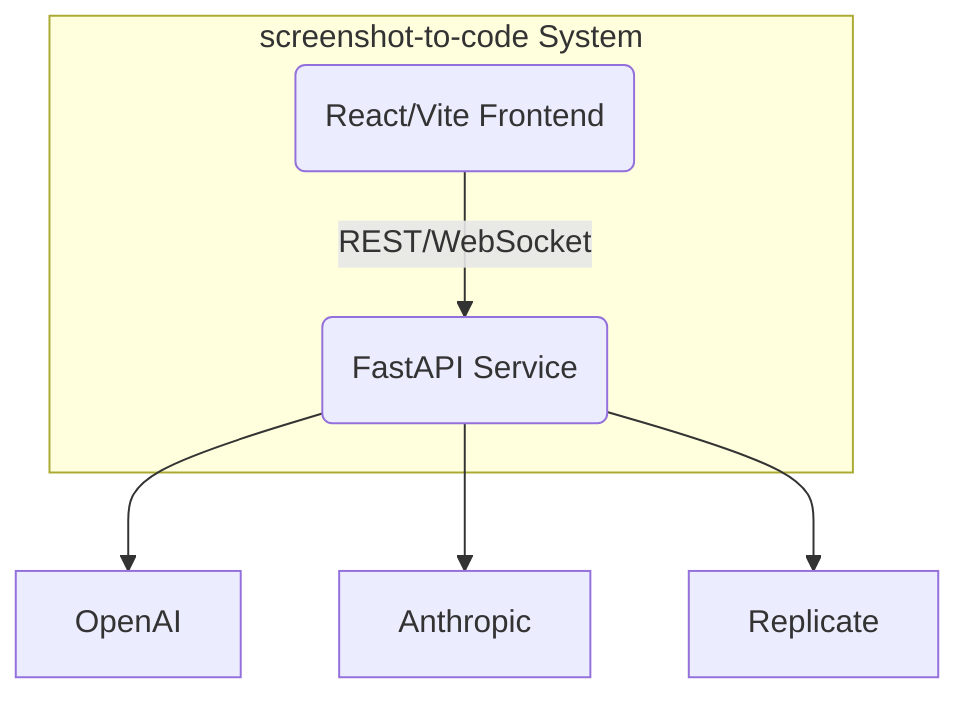
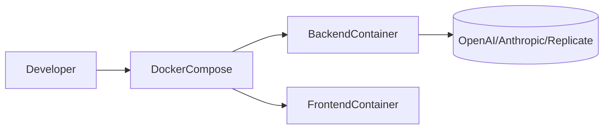
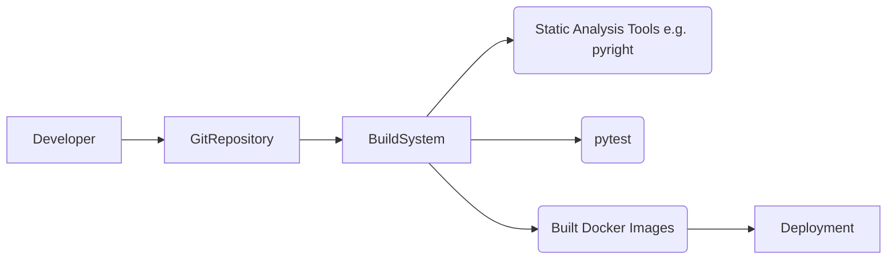

## BUSINESS POSTURE
The screenshot-to-code project aims to reduce development time by automatically generating front-end code (HTML, CSS, and JavaScript frameworks) from screenshots, mockups, or video recordings. Its commercial footprint includes an open source offering and a paid hosted version to drive revenue. This positions the project to serve both individual developers (hobbyists, small teams) as well as enterprises requiring automated code generation solutions for prototype and production.

Key business priorities and goals:
1. Simplify and accelerate the UI development process by converting visuals to code in multiple frameworks.
2. Maintain an open source community that contributes to testing and improvements.
3. Generate revenue through a paid hosted service for medium and large enterprises.
4. Expand usage by integrating advanced AI models (OpenAI GPT-4, Anthropic Claude, Replicate image generation).

Most important business risks to address based on these priorities:
1. Unauthorized access or usage of sensitive designs shared by enterprise clients could diminish confidence and lead to reputational loss.
2. Inadvertent exposure of proprietary code or internal designs when code generation logs are mismanaged or publicly shared.
3. Key dependencies on third-party AI services whose changes in policy or pricing may affect cost or availability.

## SECURITY POSTURE

Below are the existing security controls and some accepted risks identified for the project.

Existing security controls:
- security control: Environment-based secret injection. Credentials for service providers (OpenAI, Anthropic, Replicate) are loaded from environment variables or .env files.
- security control: Docker-based containerization. Provides isolated environments for the backend (FastAPI) and frontend (React/Vite).
- security control: Testing and type-checking in development. The project includes pytest for automated testing and pyright for type checking.
- security control: Optional mock mode for local debugging to avoid unnecessary usage of external keys.

Accepted risks:
- accepted risk: Storing API keys in plain text .env files. This simplifies development but may allow unauthorized access if .env is accidentally committed or leaked.
- accepted risk: Project does not strongly enforce data retention policies for user-submitted screenshots or code generation outputs.
- accepted risk: No built-in user account system for open source usage or local setups, leading to limited authentication/authorization.

Recommended high-priority security controls (not explicitly mentioned in project files):
- security control: Secret management using vault or environment injection with automated scanning to prevent accidental commits of secrets.
- security control: Rate-limiting and usage auditing for external API calls to protect from misuse or excessive cost.
- security control: Role-based access or minimal authentication layer (especially for the hosted service) to limit unauthorized invocation.
- security control: Logging/tracing that obfuscates or excludes sensitive content so user designs are not stored unencrypted.

Key security requirements:
1. Authentication: For the hosted version, ensure at least basic authentication or token-based access to the code generation service.
2. Authorization: Enforce usage quotas, especially for API-based usage, to block accounts from making excessive requests.
3. Input validation: Carefully sanitize inputs such as user-provided image URLs to prevent injection or malicious file handling.
4. Cryptography: Use HTTPS/TLS for all service communications. Ensure environment variables remain encrypted at rest in a secret manager if used in production.

## DESIGN

### C4 CONTEXT

```mermaid
flowchart LR
    User((User)) --> Project[ screenshot-to-code Project ]
    Project --> AIProviders[External AI Services\n(OpenAI, Anthropic, Replicate)]
```

#### Context Diagram Elements

| Name                | Type      | Description                                                            | Responsibilities                                                              | Security controls                                                         |
|---------------------|----------|------------------------------------------------------------------------|-------------------------------------------------------------------------------|---------------------------------------------------------------------------|
| User                | External  | Developer or end-user accessing the service                           | Initiates requests, provides screenshots or videos for code generation       | Not applicable (end-user outside system scope)                            |
| screenshot-to-code Project | System    | Main service converting screenshots or videos to code                | Receives input from user, coordinates with external APIs, returns generated code | security control: Docker containerization, environment-based secrets       |
| External AI Services (OpenAI, Anthropic, Replicate) | External  | Third-party APIs utilized for language and image generation            | Process advanced ML tasks ( vision-based code generation or text completions ) | Accepted risk: reliant on third party changes; recommended encryption in transit |

### C4 CONTAINER



#### Container Diagram Elements

| Name                       | Type       | Description                                                     | Responsibilities                                               | Security controls                                                               |
|----------------------------|-----------|-----------------------------------------------------------------|----------------------------------------------------------------|---------------------------------------------------------------------------------|
| React/Vite Frontend        | Container | Serves the UI, receives user input (images, videos, keys etc.)  | Displays UI, configures settings, streams generation results   | security control: Minimal usage of user credentials stored client-side         |
| FastAPI Service (Backend)  | Container | Python-based server providing code generation logic             | Receives requests from frontend, communicates with external AI | security control: Docker-based isolation, environment-based secrets, mocking   |
| OpenAI/Anthropic/Replicate| External  | Third-party AI services                                         | Provide advanced model inferences or image generation          | accepted risk: reliance on external service integrity and SLA                   |

### DEPLOYMENT

The project can be deployed:

1. Locally without Docker:
   - Install dependencies (Poetry for Python, Yarn for Node)
   - Run the FastAPI backend on port 7001
   - Run the React frontend on port 5173
2. Using Docker Compose (default recommended for production or standardized dev setups):
   - The docker-compose file builds separate images for the backend and frontend.
   - Both containers run in a shared network.
   - The host exposes front-end on port 5173 and back-end on port 7001.

Below is a sample deployment diagram (using Docker Compose):



#### Deployment Diagram Elements

| Name               | Type          | Description                                                                 | Responsibilities                                               | Security controls                                                                       |
|--------------------|--------------|-----------------------------------------------------------------------------|----------------------------------------------------------------|-----------------------------------------------------------------------------------------|
| DockerCompose      | Deployment    | Orchestrates containers for backend and frontend                            | Builds images, sets env variables, runs containers in the same network | security control: environment-based secrets, isolated Docker networks, volume constraints |
| BackendContainer   | Container     | Python-based container with FastAPI                                         | Coordinates with AI providers, processes user input, runs code gen logic | security control: restricted to port 7001, external secrets injection, minimal OS footprint  |
| FrontendContainer  | Container     | Node-based (React/Vite) container that serves the web UI                    | Presents user interface, static assets, config for connecting to backend | security control: limited inbound ports exposed                                          |
| ExternalAI         | External Node | The external providers used to perform LLM or image generation tasks        | Provide ML features to the backend                                                               | accepted risk: no direct control of external service                                     |

### BUILD

The local build relies on standard Node + Python tooling, with possible automation:



1. Developer commits code to the repository.
2. Build system (could be GitHub Actions, local script, or Jenkins) runs:
   - SAST checks with pyright (type checks)
   - Automated tests with pytest
   - Lint checks on the frontend (eslint or similar)
3. Docker images are built and tested.
4. Artifacts are deployed to desired environment (local or production).

Security controls of build process:
- Potential for additional scanning (SAST for vulnerabilities, container scanning).
- Pre-commit hooks can be used to prevent committing secrets.
- Docker image vulnerabilities can be scanned with container security tools (e.g. Trivy).

## RISK ASSESSMENT

What are the critical business processes to protect?
- Image-to-code and video-to-code flow, ensuring that private designs and intellectual property are neither leaked nor stored insecurely.
- Protection of personal API keys used by the developers and enterprise customers.

What data are we trying to protect, and what is its sensitivity?
- User-submitted screenshots or video content, which may contain confidential UI designs, remains sensitive intellectual property.
- API keys and other credentials are also sensitive, requiring protection from unauthorized access.

## QUESTIONS & ASSUMPTIONS
1. Are enterprise teams relying on the hosted version or mostly self-hosting? This affects the complexity of authentication and data retention policies.
2. Does the project plan to maintain logs or store screenshots for future training or analysis? Currently, no explicit data retention policy is stated.
3. Assumption: The hosting environment enforces HTTPS for the front-end and back-end communications, ensuring in-transit encryption.
4. Assumption: Further advanced usage (like bridging to a dedicated secrets manager or implementing multi-factor authentication) can be introduced for enterprises but is outside the minimal open source scope.
