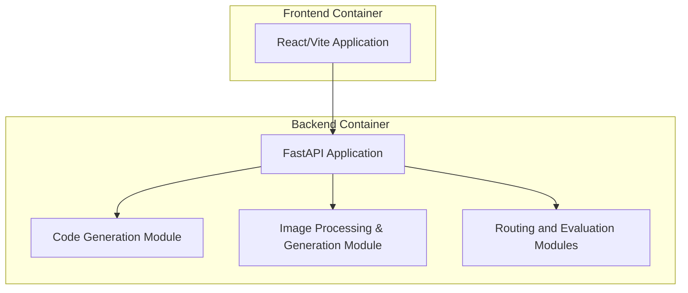

# Screenshot-to-Code Design Document

This document describes the system architecture, business and security considerations, and design details for the Screenshot-to-Code project. The tool leverages AI to convert screenshots, mockups, and even video screen recordings into functional code targets across multiple stacks and frameworks.

---

## BUSINESS POSTURE

The Screenshot-to-Code tool is designed to accelerate the design-to-development process. Its primary business goals are to:
- Enable designers and developers to rapidly generate production‐ready code from visual designs or screen recordings.
- Support multiple technology stacks (HTML/CSS, HTML/Tailwind, React, Vue, Bootstrap, Ionic, and SVG) to appeal to a wide range of users.
- Integrate with multiple cutting-edge AI models (GPT‑4, Claude, Gemini, Replicate) to provide competitive and comparative code generation capabilities.
- Provide both a free open source version and a hosted paid version—with enhanced features for enterprises.

**Critical business priorities include:**
- Quality and fidelity of the generated code compared to input designs.
- Rapid turnaround and the ability to support iterative evaluations.
- Scalability and integration with third‑party AI services.
- Monetization and enterprise-grade support for larger organizations.

**Key business risks:**
- Variability in AI model outputs may affect the quality and consistency of the generated code.
- Operational costs associated with external API usage may increase over time.
- Intellectual property risks in handling proprietary designs.
- Market competitiveness if the generated code does not closely match complex designs.

---

## SECURITY POSTURE

### Existing Security Controls

- **Security Control:** API keys (e.g., OpenAI, Anthropic, Gemini, Replicate) are handled via environment variables and/or client‑side configuration; keys entered in the settings dialog are not stored on server-side.
- **Security Control:** The backend FastAPI application applies a permissive CORS policy (allowing all origins) to enable cross‑origin communication with the frontend.
- **Security Control:** Dependency management is done with Poetry (backend) and Yarn (frontend) to lock package versions.
- **Accepted Risk:** An open CORS policy increases exposure to cross‑site scripting and other web-based attacks.
- **Security Control:** The architecture leverages Docker containers to isolate the frontend and backend processes.

### Recommended Security Controls

- **Security Control:** Tighten CORS policies in production to restrict access to trusted origins.
- **Security Control:** Implement robust input validation and sanitization for all user-supplied data (e.g., URLs, API keys) on both client and server sides.
- **Security Control:** Integrate static application security testing (SAST) into the CI/CD pipeline and perform regular dependency vulnerability scans.
- **Security Control:** Apply rate limiting and request throttling on backend endpoints to mitigate abuse.
- **Security Control:** Enable audit logging and monitoring across all API endpoints.
- **Security Requirement:** Ensure end-to-end encryption (HTTPS) for all communications.
- **Security Requirement:** Clearly document secure key management best practices for users submitting API keys.

*Implementation Points:*
- API key usage is configured via environment files (e.g., `.env`) and settings dialogs.
- CORS is configured in the FastAPI middleware.
- Docker containers provide process isolation.
- Automated testing (e.g., `pytest` and `pyright`) and evaluation scripts (e.g., in `Evaluation.md`) support a secure SDLC.

---

## DESIGN

The system is composed of a browser-based frontend that interacts with a FastAPI backend. The backend coordinates requests to external AI services for code and image generation, processes user inputs, and supports evaluation workflows.

### C4 CONTEXT

Below is the context diagram illustrating the primary external actors and systems interacting with Screenshot-to-Code:

```mermaid
graph LR
    A[User / Designer] -->|Uploads Screenshots/Video| B[Frontend (React/Vite)]
    B -->|REST API & WebSocket Communication| C[Backend (FastAPI)]
    C -->|Code Generation Request| D[OpenAI API]
    C -->|Alternative Code Generation| E[Anthropic API]
    C -->|Image Generation Request| F[Gemini API]
    C -->|Image Generation Request| G[Replicate API]
    C -->|Screenshot Request| H[ScreenshotOne API]
```

Below is a table describing each element:

| Name              | Type                      | Description                                                                  | Responsibilities                                               | Security Controls                                   |
|-------------------|---------------------------|------------------------------------------------------------------------------|----------------------------------------------------------------|-----------------------------------------------------|
| User / Designer   | External Actor            | End-user providing screenshots or videos via the UI.                        | Provide input assets; evaluate output code.                    | Educate on safe API key usage; secure local storage.|
| Frontend          | Web Application           | React/Vite app hosted on screenshottocode.com.                               | Collect user inputs (images, API keys); display generated code.  | Client-side input validation and secure user settings. |
| Backend (API)     | Microservice (FastAPI)    | Core service handling prompt assembly and code generation.                  | Process requests; call external AI APIs; coordinate image generation. | CORS configuration; environment variable management; logging. |
| OpenAI API        | External Service          | Provides GPT‑4/Vision based code generation services.                       | Generate code from prompts.                                     | API key authentication.                             |
| Anthropic API     | External Service          | Provides Claude-based code generation services.                            | Alternative code generation leveraging Claude models.          | API key authentication.                             |
| Gemini API        | External Service          | Provides Gemini based code generation services.                            | Alternative AI model for code generation.                      | API key authentication.                             |
| Replicate API     | External Service          | Generates images (e.g., placeholder images) via Flux Schnell or DALL‑E.       | Replace placeholder images in generated code.                  | API key authentication.                             |
| ScreenshotOne API | External Service          | Captures screenshots of public web pages.                                   | Generate screenshots if needed as input.                       | API key authentication.                             |

### C4 CONTAINER

The following container diagram shows the high‑level distribution of responsibilities among the frontend, backend, and supporting modules.



Below is a table describing the container elements:

| Name                       | Type              | Description                                              | Responsibilities                                                          | Security Controls                                |
|----------------------------|-------------------|----------------------------------------------------------|---------------------------------------------------------------------------|--------------------------------------------------|
| React/Vite Application     | Frontend Container| Node-based container serving the web UI.               | Present UI; handle user input; initiate WebSocket/REST calls.             | Client-side input sanitization; secure UI practices. |
| FastAPI Application        | Backend Container | Python-based container built with FastAPI.             | Process API requests; orchestrate code generation and image processing.   | Enforced CORS; environment variable isolation; logging. |
| Code Generation Module     | Module (Backend)  | Handles prompt assembly and interaction with AI APIs.  | Assemble prompts, invoke AI services (OpenAI, Anthropic, Gemini).           | Input validation; API key management.            |
| Image Processing Module    | Module (Backend)  | Manages image generation and processing tasks.         | Generate and replace placeholder images; process videos into screenshots.| Data validation; secure temporary file handling. |
| Routing & Evaluation       | Module (Backend)  | Exposes REST and WebSocket endpoints and evaluation scripts. | Handle routes (generate-code, screenshot, evals, video, home).              | HTTP security headers; error logging.            |

### DEPLOYMENT

The project is deployed as Docker containers orchestrated via Docker Compose. The typical deployment configuration includes two primary services (frontend and backend) that run on separate ports and communicate over an internal network.

```mermaid
graph LR
    A[User Browser] -->|HTTP/HTTPS| B[Frontend Container<br/>(http://localhost:5173)]
    B -->|REST/WebSocket| C[Backend Container<br/>(http://localhost:7001)]
    C -->|API Calls| D[External AI & Screenshot Services]
```

Below is a table describing the deployment elements:

| Name                | Type               | Description                                                     | Responsibilities                                           | Security Controls                                    |
|---------------------|--------------------|-----------------------------------------------------------------|------------------------------------------------------------|------------------------------------------------------|
| Frontend Container  | Docker Container   | Container running the React/Vite frontend built from Node.      | Serve the web application; handle user interactions.     | Container isolation; HTTPS termination.            |
| Backend Container   | Docker Container   | Container hosting the FastAPI backend application.              | Process code generation requests; interact with external APIs. | Environment variable isolation; secure network communications. |
| External Services   | Third-Party APIs   | APIs provided by OpenAI, Anthropic, Gemini, Replicate, ScreenshotOne. | Generate AI code responses; create images; capture screenshots. | API key authentication; TLS/HTTPS.                   |

### BUILD

The build process is automated via a CI/CD pipeline integrated with GitHub and Docker. The typical workflow is as follows:

1. **Developer Commit:** Code changes are committed to the repository.
2. **CI Pipeline:** Automated testing (unit tests with pytest, type checking with pyright) and linting are triggered.
3. **Docker Build:** Dockerfiles in the `frontend` and `backend` directories are used to build container images.
4. **Artifact Generation:** Build artifacts (container images) are tagged and stored in a container registry.
5. **Deployment:** Docker Compose deploys the containers on the cloud server or local environment.

```mermaid
flowchart TD
    A[Developer Commit] --> B[CI Pipeline<br/>(Tests, Lint, SAST)]
    B --> C[Docker Build<br/>(Frontend & Backend Images)]
    C --> D[Container Registry]
    D --> E[Deployment via Docker Compose]
    E --> F[Live Production Environment]
```

Below is a table describing the build process elements:

| Name              | Type            | Description                                                  | Responsibilities                                         | Security Controls                           |
|-------------------|-----------------|--------------------------------------------------------------|----------------------------------------------------------|---------------------------------------------|
| CI Pipeline       | Automation Tool | Automated testing and build system (e.g., GitHub Actions).     | Run tests, perform static code analysis, trigger Docker builds. | Use secret management for sensitive keys; SAST scanning. |
| Docker Build      | Build Process   | Uses Dockerfiles (frontend and backend) as defined in the repo. | Build reproducible images; cache dependencies.           | Signed images; vulnerability scanning.      |
| Deployment        | CD Process      | Docker Compose orchestrates container deployment.            | Deploy services to production environment.               | Secure configuration; network segmentation. |

---

## RISK ASSESSMENT

**Critical Business Processes:**
- The conversion of design assets (screenshots, videos) to production‑ready code.
- The evaluation workflows that benchmark and compare multiple AI models.

**Data to Protect & Their Sensitivity:**
- **User Uploaded Assets:** Screenshots and video recordings that may contain proprietary designs.
- **User API Keys:** Sensitive credentials for external AI services.
- **Generated Code:** Intellectual property that may require confidentiality.
- **Evaluation Data:** Benchmark results that inform product quality and enhancements.

**Key Risks:**
- Exposure or leakage of API keys due to misconfiguration or insecure handling.
- Injection of malicious code if input validation is insufficient.
- Compromise of sensitive design information supplied by users.
- Dependency vulnerabilities in open source packages and container images.

---

## QUESTIONS & ASSUMPTIONS

**Questions:**
- What are the plans for production hardening of the open CORS policy once user data increases?
- Will additional authentication or user account management be incorporated in future iterations?
- How will sensitive API keys be safeguarded beyond client‑side storage if the solution scales enterprise‑wide?
- What monitoring and incident response measures will be established for backend API abuse?

**Assumptions:**
- The current risk appetite is moderate—with an emphasis on rapid innovation balanced by continuous monitoring.
- API keys are assumed to be short‑lived or user‑entered per session and not persisted on the backend.
- Deployment will occur in a controlled environment using Docker containers secured by external network policies.
- Evaluation and testing artifacts are used primarily for internal quality control and are not exposed externally.
- The product is designed to be modular and extensible, with future upgrades addressing authentication, logging, and more granular security controls.

---

This design document provides a detailed overview of the architectural components, security considerations, and deployment strategies for Screenshot-to-Code, forming the basis for subsequent threat modeling and risk mitigation planning.
