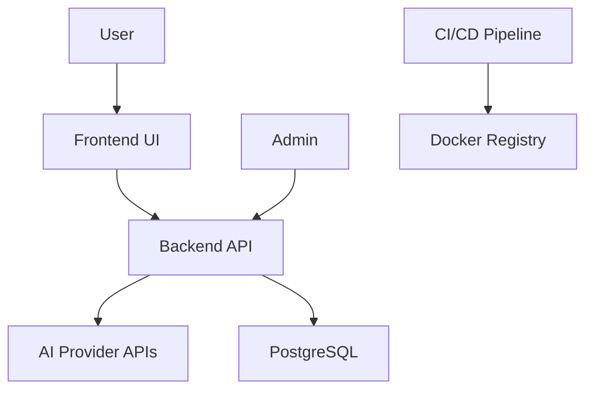
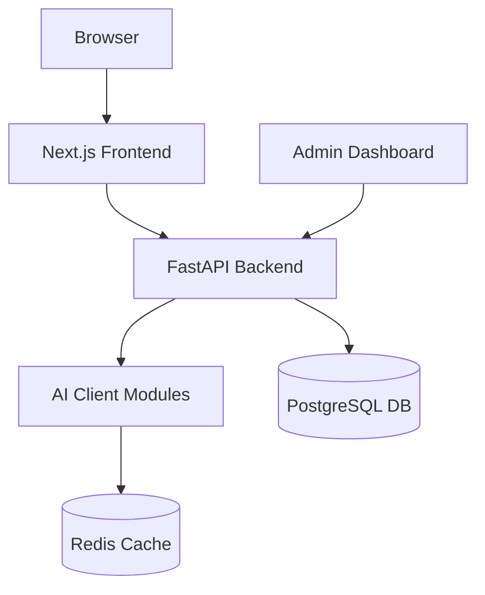
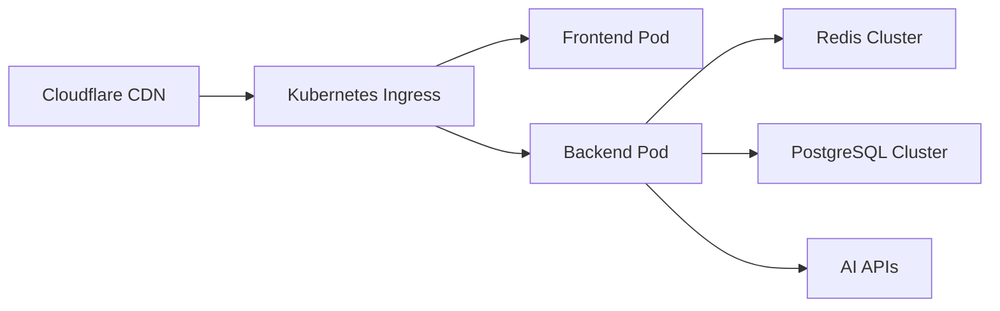
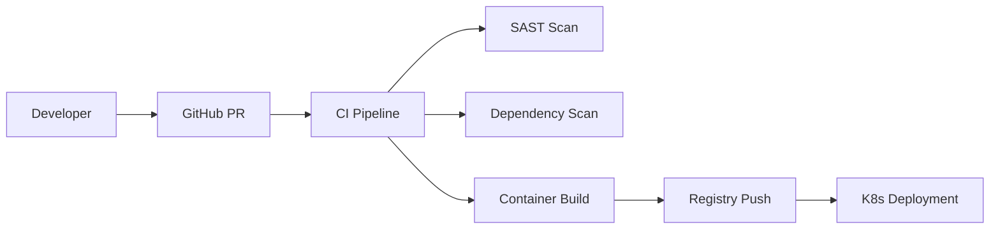

# Screenshot-to-Code Project Design Document

## Business Posture
The screenshot-to-code project aims to revolutionize UI development by automating the conversion of visual designs into production-ready code. The primary business goals focus on accelerating frontend development cycles while maintaining high code quality across multiple frameworks[1][3]. Key priorities include supporting diverse technology stacks (HTML/Tailwind, React, Vue, Bootstrap), maintaining compatibility with leading AI providers (Anthropic, OpenAI), and enabling both self-hosted and managed service deployments[1][4].

Critical business risks requiring mitigation:
1. Model dependency risk: Over-reliance on third-party AI providers' API stability and pricing models[4][10]
2. Output quality risk: Potential inaccuracies in generated code impacting user trust[6][13]
3. Market saturation risk: Emerging competition in AI-assisted development tools[1][4]
4. Technology obsolescence risk: Rapid evolution of AI models requiring continuous integration[4][10]

## Security Posture

### Existing Security Controls
1. **Authentication Control**: API key management through environment variables and UI settings dialog[4][10]
2. **Input Validation Control**: Image processing sanitation in `image_processing/utils.py`[13]
3. **Secret Management**: Dotenv implementation for credential isolation[4][10]
4. **Container Hardening**: Non-root user context in Dockerfiles[10][14]
5. **CORS Restrictions**: Origin whitelisting in FastAPI middleware[10]

### Accepted Risks
1. Temporary credential storage in browser memory during frontend sessions[4]
2. Dependency chain risks from 63 Python dependencies in `pyproject.toml`[10]
3. Experimental video processing capabilities without sandboxing[13]

### Recommended Controls
1. Implement SAST scanning in CI pipeline using Bandit/Semgrep
2. Add dependency vulnerability scanning with Dependabot
3. Introduce rate limiting for API endpoints
4. Deploy Web Application Firewall for input sanitization
5. Establish key rotation policy for AI provider credentials

### Security Requirements
| Category           | Requirement                                                                 | Implementation File            |
|---------------------|-----------------------------------------------------------------------------|---------------------------------|
| Authentication     | Validate OpenAI/Anthropic keys through provider APIs                        | `backend/routes/generate_code.py`[10] |
| Authorization      | Role-based access control for premium features                              | Not implemented                 |
| Input Validation   | Verify image MIME types and size constraints                                | `backend/image_processing/utils.py`[13] |
| Cryptography       | Encrypt API keys at rest using AWS KMS or Vault                             | Not implemented                 |
| Audit Logging      | Track code generation requests and model usage                              | `backend/fs_logging/core.py`[10] |

## Design Architecture

### C4 Context Diagram

| Element         | Type        | Description                                  | Responsibilities                          | Security Controls               |
|-----------------|-------------|----------------------------------------------|-------------------------------------------|---------------------------------|
| Frontend UI     | Web App     | React-based interface for design submission  | User interaction, result visualization    | CSP headers, XSS protection     |
| Backend API     | Microservice| FastAPI service handling code generation     | AI integration, job processing            | API key validation, rate limiting|
| AI Provider APIs| External    | Claude/GPT-4 model endpoints                 | Code generation via vision models         | TLS 1.3, credential rotation     |
| PostgreSQL      | Database    | Stores user history and project versions     | Data persistence                          | Encryption at rest, RBAC         |

### C4 Container Diagram

| Component           | Type        | Description                                  | Responsibilities                          | Security Controls               |
|---------------------|-------------|----------------------------------------------|-------------------------------------------|---------------------------------|
| Next.js Frontend    | SPA         | User interface for design upload            | Session management, API communication     | CSRF tokens, SRI hashes          |
| FastAPI Backend     | REST API    | Orchestrates code generation pipeline        | Job queue management, error handling      | OAuth2 scopes, request validation|
| AI Client Modules   | Integration | Handles communication with AI providers      | Model-specific prompt engineering         | API key encryption, request signing|

### Deployment Architecture

| Element             | Type        | Description                                  | Responsibilities                          | Security Controls               |
|---------------------|-------------|----------------------------------------------|-------------------------------------------|---------------------------------|
| Kubernetes Ingress  | Load Balancer| TLS termination and routing                 | Traffic distribution, SSL offloading      | WAF integration, DDoS protection|
| Frontend Pod        | Container   | Serves static assets and UI components       | Client-side rendering                     | Non-root user, read-only FS      |
| Backend Pod         | Container   | Runs FastAPI application                     | Business logic execution                  | Pod security policies, network policies|

### Build Pipeline

| Stage              | Toolchain               | Security Measures                          |
|--------------------|-------------------------|--------------------------------------------|
| Code Commit        | GitHub                  | Branch protection, signed commits         |
| SAST Scan          | Semgrep/Bandit          | Custom rules for AI prompt injection       |
| Dependency Scan    | Dependabot/Snyk         | CVE monitoring for Python/JS dependencies  |
| Container Build    | Docker BuildKit         | Distroless base images, SBOM generation    |
| Registry           | AWS ECR                 Image signing with Cosign           |

## Risk Assessment

Critical assets requiring protection:
1. **User Authentication Data**: API keys stored in browser session storage
2. **Proprietary Prompt Engineering**: System prompts in `backend/prompts` directory[10][13]
3. **Usage Metrics**: Code generation statistics for business intelligence

Data sensitivity classification:
| Data Type               | Sensitivity | Protection Measures                        |
|-------------------------|-------------|--------------------------------------------|
| AI Provider Credentials | Critical    | AES-256 encryption, 4-hour TTL             |
| Generated Code          | Low         | Ephemeral storage, no persistence          |
| User Session Data       | Moderate    | HttpOnly cookies, SameSite restrictions    |

## Questions & Assumptions

**Open Questions:**
1. Disaster recovery plan for AI provider outages?
2. Data residency requirements for international users?
3. PCI DSS compliance for paid subscription handling?

**Technical Assumptions:**
1. Kubernetes cluster provides adequate compute for peak loads
2. AI providers maintain API backward compatibility
3. Docker Hub base images remain vulnerability-free

**Business Assumptions:**
1. Open-source users will convert to paid hosted plans
2. Enterprise clients require on-premise deployment options
3. UI design trends will maintain current technical feasibility
