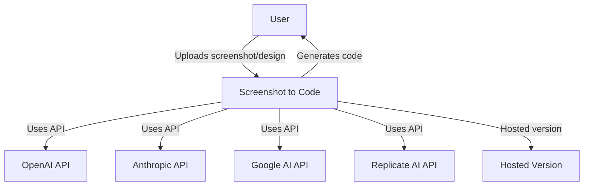
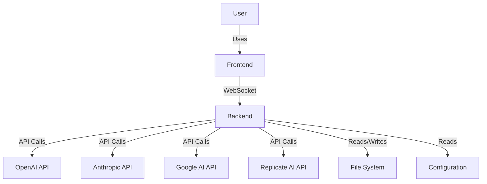
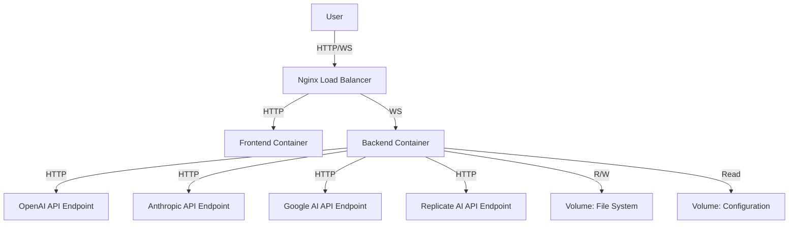
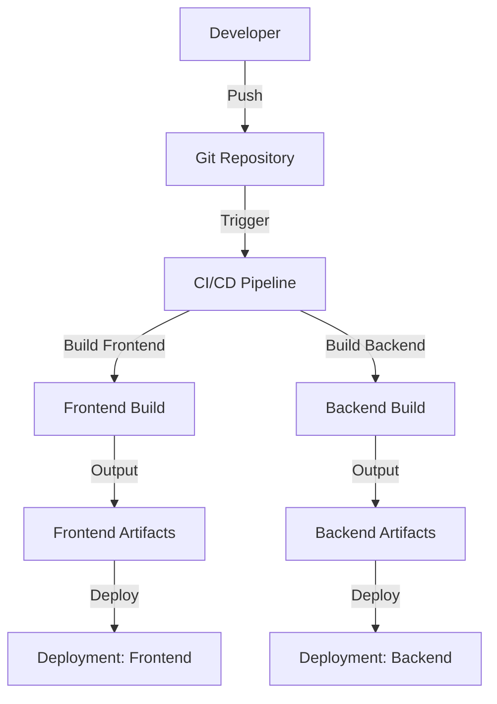

Based on the provided PROJECT FILES, I will create a comprehensive design document for the screenshot-to-code project.

# BUSINESS POSTURE

The screenshot-to-code project aims to convert screenshots, mockups, and Figma designs into clean, functional code using AI. The primary business goals and priorities are:

1. Provide a simple and efficient tool for developers and designers to quickly generate code from visual designs.
2. Support multiple frontend stacks and frameworks to cater to a wide range of developers.
3. Leverage advanced AI models to improve code generation accuracy and quality.
4. Offer both open-source and hosted versions to accommodate different user needs and monetization strategies.

Key business risks to address:
1. Ensuring the accuracy and quality of generated code across different design complexities.
2. Managing API costs and usage limits for various AI models.
3. Maintaining compatibility with evolving AI technologies and frontend frameworks.
4. Balancing between open-source offerings and premium features in the hosted version.

# SECURITY POSTURE

Existing security controls:
- security control: API key management for OpenAI, Anthropic, and other services
- security control: Environment variable usage for sensitive configuration
- security control: Input validation for user-provided parameters
- security control: CORS configuration to control access to the backend API
- security control: WebSocket error handling with custom close codes
- accepted risk: Using CDN-hosted libraries for frontend dependencies

Recommended high-priority security controls to implement:
1. Implement rate limiting for API endpoints to prevent abuse
2. Add input sanitization for user-provided content before processing
3. Implement secure logging practices, especially for debugging sensitive information
4. Set up proper authentication and authorization for the hosted version
5. Implement secure practices for handling and storing user-generated content

Security requirements:
1. Authentication: Implement secure API key storage and transmission for third-party services.
2. Authorization: Ensure that users can only access their own data and generated code in the hosted version.
3. Input validation: Validate and sanitize all user inputs, including uploaded images and code snippets.
4. Cryptography: Use secure protocols (HTTPS) for all communications in the hosted version.

# DESIGN

## C4 CONTEXT

| Name | Type | Description | Responsibilities | Security Controls |
|------|------|-------------|-------------------|-------------------|
| User | External | End-user of the system | Provides screenshots/designs, receives generated code | N/A |
| Screenshot to Code | Software System | Core application for converting designs to code | Processes user input, interacts with AI APIs, generates code | Input validation, API key management |
| OpenAI API | External System | Provides AI models for code generation | Processes requests, returns generated code | API authentication |
| Anthropic API | External System | Provides AI models for code generation | Processes requests, returns generated code | API authentication |
| Google AI API | External System | Provides AI models for code generation | Processes requests, returns generated code | API authentication |
| Replicate AI API | External System | Provides image generation capabilities | Generates images based on descriptions | API authentication |
| Hosted Version | Software System | Cloud-hosted version of the application | Provides web interface, manages user accounts and billing | User authentication, data isolation |

## C4 CONTAINER

| Name | Type | Description | Responsibilities | Security Controls |
|------|------|-------------|-------------------|-------------------|
| Frontend | Container | React/Vite application | User interface, WebSocket communication | Input validation, Secure communication |
| Backend | Container | FastAPI application | Process requests, coordinate AI interactions, generate code | API key management, Input validation, Error handling |
| File System | Container | Local storage | Store logs, debug information, and temporary files | Access control, Data encryption at rest |
| Configuration | Container | Environment variables and settings | Store sensitive configuration data | Secure storage, Access control |

## DEPLOYMENT

The project can be deployed in two main architectures: self-hosted and cloud-hosted. We'll focus on the self-hosted deployment for this description.

| Name | Type | Description | Responsibilities | Security Controls |
|------|------|-------------|-------------------|-------------------|
| Nginx Load Balancer | Infrastructure | Web server and reverse proxy | Load balancing, SSL termination | SSL/TLS, Access logs |
| Frontend Container | Container | Hosts the React/Vite application | Serve static files, Handle user interactions | Content Security Policy |
| Backend Container | Container | Runs the FastAPI application | Process API requests, Interact with AI services | API key management, Rate limiting |
| Volume: File System | Infrastructure | Persistent storage for logs and temp files | Store application data | Access control, Encryption at rest |
| Volume: Configuration | Infrastructure | Stores environment variables | Provide configuration to containers | Access control, Encryption at rest |

## BUILD

The build process for screenshot-to-code involves both frontend and backend components. Here's an overview of the build process:

1. Developer pushes code to the Git repository
2. CI/CD pipeline is triggered
3. Frontend build:
   - Install dependencies using Yarn
   - Run linters and type checks
   - Build the React/Vite application
   - Run frontend tests
4. Backend build:
   - Install dependencies using Poetry
   - Run type checks with pyright
   - Run backend tests with pytest
5. If all checks pass, create deployment artifacts
6. Deploy frontend and backend to the target environment

Security controls in the build process:
- Use of lockfiles (yarn.lock, poetry.lock) to ensure dependency consistency
- Running linters and type checks to catch potential issues early
- Automated testing to verify functionality and prevent regressions
- Secure handling of API keys and sensitive configuration during the build and deployment process

# RISK ASSESSMENT

Critical business processes to protect:
1. Code generation process
2. User data handling (in the hosted version)
3. API key management for third-party services

Data to protect and their sensitivity:
1. User-uploaded screenshots and designs (Medium sensitivity)
2. Generated code (Medium sensitivity)
3. API keys for OpenAI, Anthropic, Google AI, and Replicate (High sensitivity)
4. User account information (for the hosted version) (High sensitivity)
5. Logs and debugging information (Medium sensitivity)

# QUESTIONS & ASSUMPTIONS

1. What is the expected scale of the hosted version? This will impact the choice of infrastructure and scalability requirements.
2. Are there plans to implement user authentication for the open-source version?
3. How will user data be handled and stored in the hosted version? This will impact compliance requirements (e.g., GDPR).
4. What is the plan for handling API rate limits and costs from third-party services?
5. Are there any specific compliance requirements (e.g., HIPAA, SOC 2) that need to be addressed?

Assumptions:
1. The project will continue to support multiple AI providers to reduce dependency on a single vendor.
2. The open-source version will primarily be used for self-hosting and development purposes.
3. The hosted version will require additional security measures and user management features.
4. Regular updates will be needed to keep up with changes in AI models and frontend frameworks.
5. The project will maintain a balance between ease of use and customization options for developers.
